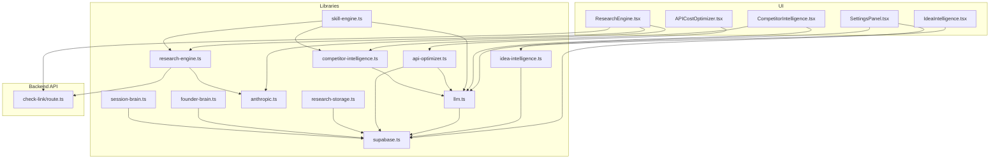
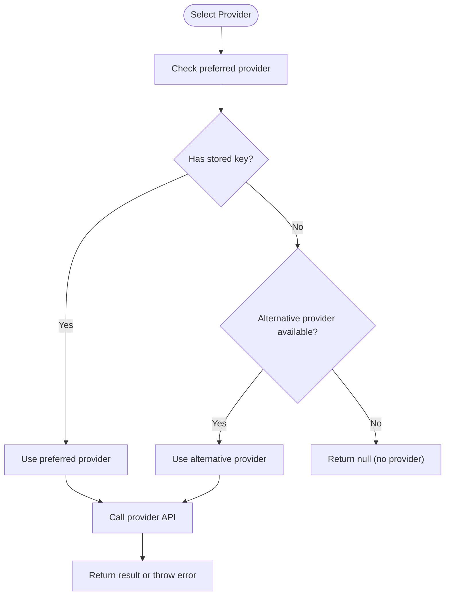
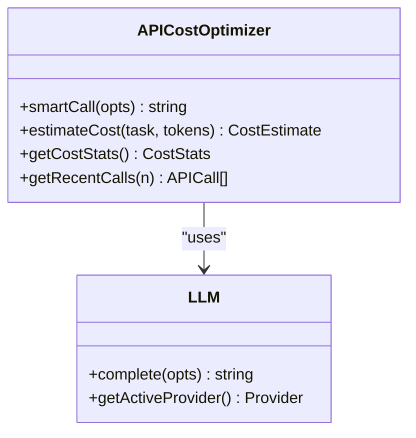
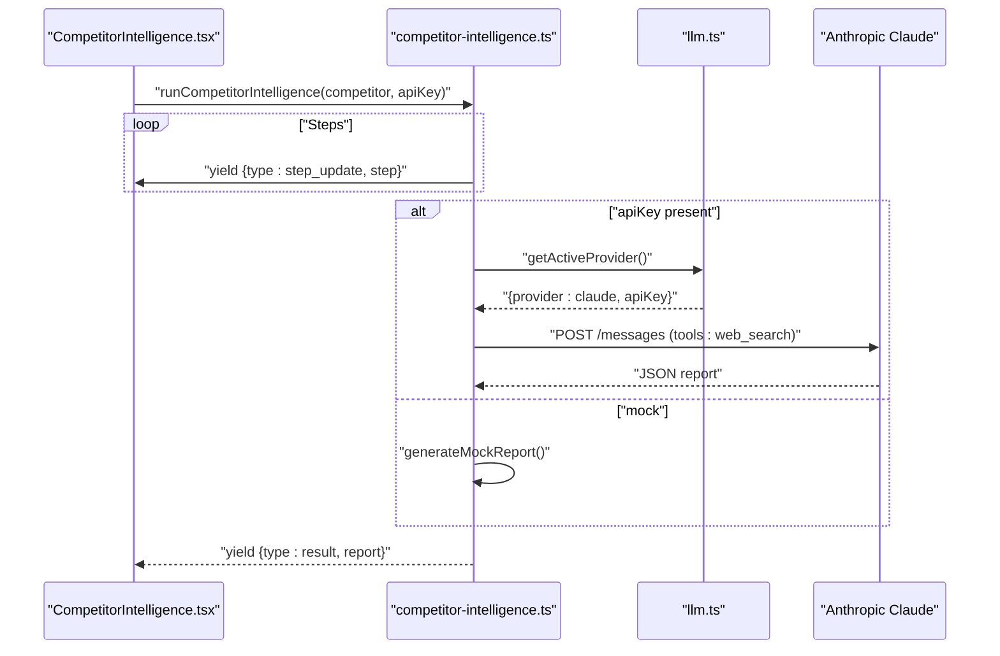
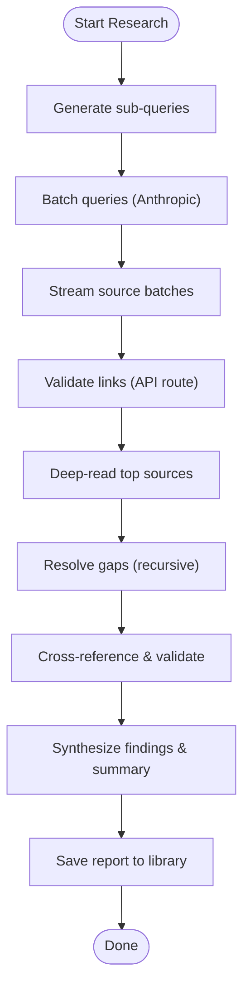
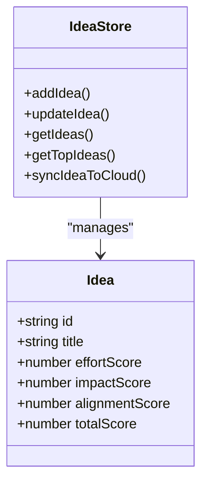
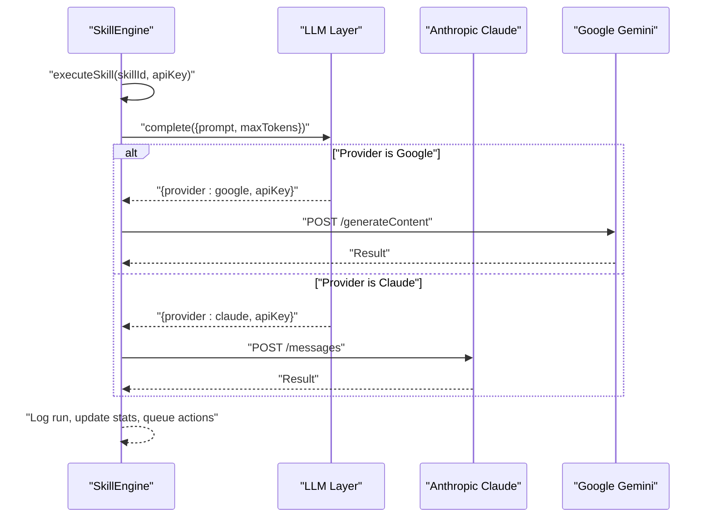
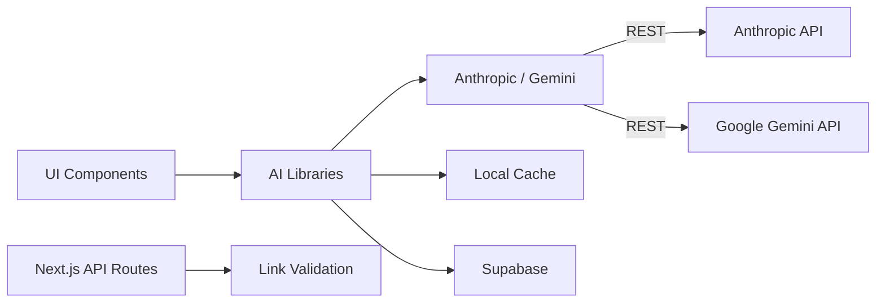

# AI Integration

<cite>
**Referenced Files in This Document**
- [src/lib/llm.ts](file://src/lib/llm.ts)
- [src/lib/anthropic.ts](file://src/lib/anthropic.ts)
- [src/lib/api-optimizer.ts](file://src/lib/api-optimizer.ts)
- [src/lib/competitor-intelligence.ts](file://src/lib/competitor-intelligence.ts)
- [src/lib/research-engine.ts](file://src/lib/research-engine.ts)
- [src/lib/idea-intelligence.ts](file://src/lib/idea-intelligence.ts)
- [src/lib/skill-engine.ts](file://src/lib/skill-engine.ts)
- [src/lib/session-brain.ts](file://src/lib/session-brain.ts)
- [src/lib/founder-brain.ts](file://src/lib/founder-brain.ts)
- [src/lib/research-storage.ts](file://src/lib/research-storage.ts)
- [src/lib/supabase.ts](file://src/lib/supabase.ts)
- [src/app/api/check-link/route.ts](file://src/app/api/check-link/route.ts)
- [src/components/intelligence/CompetitorIntelligence.tsx](file://src/components/intelligence/CompetitorIntelligence.tsx)
- [src/components/research/ResearchEngine.tsx](file://src/components/research/ResearchEngine.tsx)
- [src/components/ideas/IdeaIntelligence.tsx](file://src/components/ideas/IdeaIntelligence.tsx)
- [src/components/optimizer/APICostOptimizer.tsx](file://src/components/optimizer/APICostOptimizer.tsx)
- [src/components/settings/SettingsPanel.tsx](file://src/components/settings/SettingsPanel.tsx)
</cite>

## Table of Contents
1. [Introduction](#introduction)
2. [Project Structure](#project-structure)
3. [Core Components](#core-components)
4. [Architecture Overview](#architecture-overview)
5. [Detailed Component Analysis](#detailed-component-analysis)
6. [Dependency Analysis](#dependency-analysis)
7. [Performance Considerations](#performance-considerations)
8. [Troubleshooting Guide](#troubleshooting-guide)
9. [Conclusion](#conclusion)
10. [Appendices](#appendices)

## Introduction
This document explains the AI integration in Core Brim Tech OS, focusing on the unified Large Language Model (LLM) provider abstraction that supports multiple AI services (Anthropic Claude and Google Gemini). It covers seamless provider switching, API cost optimization strategies, request batching, caching, and AI-powered features such as competitor intelligence analysis, a deep research engine, and idea generation systems. It also documents configuration management, rate-limiting strategies, fallback mechanisms, implementation patterns for AI-assisted workflows, prompt engineering best practices, and performance optimization techniques for AI requests.

## Project Structure
The AI integration spans several libraries and UI components:
- Unified LLM layer and provider selection
- API cost optimizer with model routing, caching, and cost tracking
- Competitor intelligence engine with streaming execution
- Deep research engine with request batching and link validation
- Idea intelligence for capture, scoring, and ranking
- Skill engine orchestrating autonomous AI workflows
- Session and Founder brain persistence and context
- Supabase integration for synchronization and persistence
- Next.js API routes for link checking



**Diagram sources**
- [src/components/intelligence/CompetitorIntelligence.tsx](file://src/components/intelligence/CompetitorIntelligence.tsx#L1-L406)
- [src/components/research/ResearchEngine.tsx](file://src/components/research/ResearchEngine.tsx#L1-L536)
- [src/components/ideas/IdeaIntelligence.tsx](file://src/components/ideas/IdeaIntelligence.tsx#L1-L355)
- [src/components/optimizer/APICostOptimizer.tsx](file://src/components/optimizer/APICostOptimizer.tsx#L1-L235)
- [src/components/settings/SettingsPanel.tsx](file://src/components/settings/SettingsPanel.tsx#L1-L389)
- [src/lib/llm.ts](file://src/lib/llm.ts#L1-L135)
- [src/lib/api-optimizer.ts](file://src/lib/api-optimizer.ts#L1-L290)
- [src/lib/competitor-intelligence.ts](file://src/lib/competitor-intelligence.ts#L1-L298)
- [src/lib/research-engine.ts](file://src/lib/research-engine.ts#L1-L519)
- [src/lib/idea-intelligence.ts](file://src/lib/idea-intelligence.ts#L1-L156)
- [src/lib/skill-engine.ts](file://src/lib/skill-engine.ts#L1-L764)
- [src/lib/supabase.ts](file://src/lib/supabase.ts#L1-L292)
- [src/lib/research-storage.ts](file://src/lib/research-storage.ts#L1-L47)
- [src/lib/anthropic.ts](file://src/lib/anthropic.ts#L1-L32)
- [src/lib/founder-brain.ts](file://src/lib/founder-brain.ts#L1-L213)
- [src/lib/session-brain.ts](file://src/lib/session-brain.ts#L1-L278)
- [src/app/api/check-link/route.ts](file://src/app/api/check-link/route.ts#L1-L43)

**Section sources**
- [src/lib/llm.ts](file://src/lib/llm.ts#L1-L135)
- [src/lib/api-optimizer.ts](file://src/lib/api-optimizer.ts#L1-L290)
- [src/lib/competitor-intelligence.ts](file://src/lib/competitor-intelligence.ts#L1-L298)
- [src/lib/research-engine.ts](file://src/lib/research-engine.ts#L1-L519)
- [src/lib/idea-intelligence.ts](file://src/lib/idea-intelligence.ts#L1-L156)
- [src/lib/skill-engine.ts](file://src/lib/skill-engine.ts#L1-L764)
- [src/lib/supabase.ts](file://src/lib/supabase.ts#L1-L292)
- [src/lib/research-storage.ts](file://src/lib/research-storage.ts#L1-L47)
- [src/lib/anthropic.ts](file://src/lib/anthropic.ts#L1-L32)
- [src/lib/founder-brain.ts](file://src/lib/founder-brain.ts#L1-L213)
- [src/lib/session-brain.ts](file://src/lib/session-brain.ts#L1-L278)
- [src/app/api/check-link/route.ts](file://src/app/api/check-link/route.ts#L1-L43)

## Core Components
- Unified LLM provider abstraction:
  - Provider selection and key management
  - Timeout-wrapped Claude calls
  - Unified completion function with provider switching
- API cost optimizer:
  - Model tier routing rules
  - Aggressive caching with TTL and eviction
  - Cost tracking and statistics
  - Smart model selection per task
- Competitor intelligence:
  - Streaming intelligence engine with steps
  - JSON-based report generation
  - Mock mode for development
- Deep research engine:
  - Multi-level research with sub-query generation
  - Batched web search and link validation
  - Source categorization and credibility
- Idea intelligence:
  - Idea capture, scoring, and ranking
  - Persistence and sync
- Skill engine:
  - Autonomous AI workflows orchestrated by skills
  - Action queues with approvals
- Supabase integration:
  - Write-through cache for persistence
  - Sync from/to cloud
- Link validation API:
  - Safe link reachability checks with timeouts

**Section sources**
- [src/lib/llm.ts](file://src/lib/llm.ts#L1-L135)
- [src/lib/anthropic.ts](file://src/lib/anthropic.ts#L1-L32)
- [src/lib/api-optimizer.ts](file://src/lib/api-optimizer.ts#L1-L290)
- [src/lib/competitor-intelligence.ts](file://src/lib/competitor-intelligence.ts#L1-L298)
- [src/lib/research-engine.ts](file://src/lib/research-engine.ts#L1-L519)
- [src/lib/idea-intelligence.ts](file://src/lib/idea-intelligence.ts#L1-L156)
- [src/lib/skill-engine.ts](file://src/lib/skill-engine.ts#L1-L764)
- [src/lib/supabase.ts](file://src/lib/supabase.ts#L1-L292)
- [src/app/api/check-link/route.ts](file://src/app/api/check-link/route.ts#L1-L43)

## Architecture Overview
The AI integration centers on a unified LLM layer that selects between Anthropic Claude and Google Gemini. The API cost optimizer routes tasks to the cheapest capable model, caches results, and tracks costs. AI-powered features (competitor intelligence, research engine, idea generation) consume these abstractions. Skills orchestrate autonomous workflows. Supabase provides persistence and synchronization.

```mermaid
sequenceDiagram
participant UI as "UI Component"
participant OPT as "API Cost Optimizer"
participant LLM as "Unified LLM"
participant CLAUDE as "Anthropic Claude"
participant GOOGLE as "Google Gemini"
UI->>OPT : "smartCall({task, prompt, ...})"
OPT->>OPT : "Resolve model via routing rules"
OPT->>OPT : "Check cache"
alt "Cache hit"
OPT-->>UI : "Return cached result"
else "Cache miss"
OPT->>LLM : "getActiveProvider()"
alt "Provider is Google"
LLM-->>OPT : "{provider : google, apiKey}"
OPT->>GOOGLE : "POST /generateContent"
GOOGLE-->>OPT : "Result"
OPT->>OPT : "Log call, update stats"
OPT->>OPT : "Cache result"
OPT-->>UI : "Return result"
else "Provider is Claude"
LLM-->>OPT : "{provider : claude, apiKey}"
OPT->>CLAUDE : "POST /messages"
CLAUDE-->>OPT : "Result"
OPT->>OPT : "Log call, update stats"
OPT->>OPT : "Cache result"
OPT-->>UI : "Return result"
end
end
```

**Diagram sources**
- [src/lib/api-optimizer.ts](file://src/lib/api-optimizer.ts#L178-L266)
- [src/lib/llm.ts](file://src/lib/llm.ts#L36-L46)
- [src/lib/llm.ts](file://src/lib/llm.ts#L57-L88)
- [src/lib/llm.ts](file://src/lib/llm.ts#L90-L122)

## Detailed Component Analysis

### Unified LLM Provider Abstraction
- Provider selection:
  - Preferred provider stored in localStorage
  - Keys stored separately for Claude and Google
  - Resolution prefers preferred provider if key exists; otherwise falls back to available provider
- Completion function:
  - Single entry-point for LLM calls
  - Supports system prompts, max tokens, and provider override
  - Timeout handling for long-running requests
- Claude-specific helpers:
  - Timeout wrapper and error parsing for robust API calls



**Diagram sources**
- [src/lib/llm.ts](file://src/lib/llm.ts#L24-L46)
- [src/lib/llm.ts](file://src/lib/llm.ts#L57-L122)

**Section sources**
- [src/lib/llm.ts](file://src/lib/llm.ts#L1-L135)
- [src/lib/anthropic.ts](file://src/lib/anthropic.ts#L1-L32)

### API Cost Optimization Strategies
- Model routing:
  - Task-specific routing rules map to model tiers (Haiku, Sonnet, Opus, Gemini Flash)
  - Savings up to 94% vs. always using Opus for lighter tasks
- Caching:
  - 24-hour TTL with automatic eviction
  - Cache key derived from task type and prompt prefix
  - Max 100 entries to prevent bloat
- Cost tracking:
  - Logs every call with model, input/output tokens, cost, task, cached flag
  - Provides cost statistics and recent calls
- Pricing reference:
  - Per-token pricing for each model tier
  - Estimated cost calculator for UI guidance



**Diagram sources**
- [src/lib/api-optimizer.ts](file://src/lib/api-optimizer.ts#L178-L266)
- [src/lib/llm.ts](file://src/lib/llm.ts#L128-L135)

**Section sources**
- [src/lib/api-optimizer.ts](file://src/lib/api-optimizer.ts#L1-L290)

### Competitor Intelligence Analysis
- Streaming execution:
  - Runs through distinct steps with progress updates
  - Emits step updates, source batches, and final result
- Report generation:
  - Structured JSON report with recent activity, SWOT, threats, opportunities, warnings, and counter-strategies
  - Saved to localStorage and optionally synced to cloud
- Mock mode:
  - Generates realistic mock reports for development and testing
- Integration:
  - Uses Claude with web search tool for live runs
  - Integrates with Founder Brain for context



**Diagram sources**
- [src/components/intelligence/CompetitorIntelligence.tsx](file://src/components/intelligence/CompetitorIntelligence.tsx#L226-L252)
- [src/lib/competitor-intelligence.ts](file://src/lib/competitor-intelligence.ts#L177-L216)
- [src/lib/competitor-intelligence.ts](file://src/lib/competitor-intelligence.ts#L218-L290)
- [src/lib/llm.ts](file://src/lib/llm.ts#L36-L46)

**Section sources**
- [src/lib/competitor-intelligence.ts](file://src/lib/competitor-intelligence.ts#L1-L298)
- [src/components/intelligence/CompetitorIntelligence.tsx](file://src/components/intelligence/CompetitorIntelligence.tsx#L1-L406)
- [src/lib/founder-brain.ts](file://src/lib/founder-brain.ts#L1-L213)

### Research Engine Capabilities
- Multi-level research:
  - Generates sub-queries, crawls sources, deep-reads top results, resolves gaps, cross-validates, and synthesizes findings
- Request batching:
  - Batches multiple queries per request to Anthropic
  - Streams source batches to UI for responsive feedback
- Link validation:
  - Validates URLs via a Next.js API route with timeouts and HEAD/GET fallback
- Report structure:
  - Includes summary, key findings, categorized sources, and metadata
- Mock mode:
  - Generates massive mock datasets for development and testing



**Diagram sources**
- [src/lib/research-engine.ts](file://src/lib/research-engine.ts#L206-L394)
- [src/app/api/check-link/route.ts](file://src/app/api/check-link/route.ts#L1-L43)

**Section sources**
- [src/lib/research-engine.ts](file://src/lib/research-engine.ts#L1-L519)
- [src/lib/research-storage.ts](file://src/lib/research-storage.ts#L1-L47)
- [src/app/api/check-link/route.ts](file://src/app/api/check-link/route.ts#L1-L43)

### Idea Generation Systems
- Idea capture and scoring:
  - Captures ideas with category, status, effort/impact/alignment scores
  - Calculates weighted total score
- Ranking and filtering:
  - Retrieves top ideas and filters by status
- Persistence and sync:
  - Stores ideas in localStorage and syncs to Supabase



**Diagram sources**
- [src/lib/idea-intelligence.ts](file://src/lib/idea-intelligence.ts#L7-L25)
- [src/lib/idea-intelligence.ts](file://src/lib/idea-intelligence.ts#L29-L156)

**Section sources**
- [src/lib/idea-intelligence.ts](file://src/lib/idea-intelligence.ts#L1-L156)
- [src/components/ideas/IdeaIntelligence.tsx](file://src/components/ideas/IdeaIntelligence.tsx#L1-L355)

### AI-Assisted Workflows (Skills)
- Built-in skills:
  - Proposal writer, grant drafter, hackathon auto-builder, competitor monitor, opportunity scanner, weekly report generator, lead outreach writer, away mode
- Execution engine:
  - Orchestrates skills, logs runs, maintains action queues, and handles approvals
- Provider integration:
  - Uses the unified LLM layer for completions
  - Falls back to mock content when no provider is configured



**Diagram sources**
- [src/lib/skill-engine.ts](file://src/lib/skill-engine.ts#L351-L431)
- [src/lib/llm.ts](file://src/lib/llm.ts#L128-L135)

**Section sources**
- [src/lib/skill-engine.ts](file://src/lib/skill-engine.ts#L1-L764)
- [src/lib/llm.ts](file://src/lib/llm.ts#L1-L135)

### Prompt Engineering Best Practices
- Structured prompts:
  - Use explicit roles and instructions
  - Include context and constraints (e.g., token limits)
- JSON output expectations:
  - Explicitly instruct the model to return JSON for predictable parsing
- Tool usage:
  - Enable web search tools when needed for current information
- System prompts:
  - Use optional system prompts for consistent behavior across providers

**Section sources**
- [src/lib/competitor-intelligence.ts](file://src/lib/competitor-intelligence.ts#L229-L256)
- [src/lib/research-engine.ts](file://src/lib/research-engine.ts#L427-L445)
- [src/lib/research-engine.ts](file://src/lib/research-engine.ts#L447-L474)
- [src/lib/research-engine.ts](file://src/lib/research-engine.ts#L476-L494)
- [src/lib/research-engine.ts](file://src/lib/research-engine.ts#L496-L518)
- [src/lib/skill-engine.ts](file://src/lib/skill-engine.ts#L459-L470)
- [src/lib/skill-engine.ts](file://src/lib/skill-engine.ts#L524-L542)
- [src/lib/skill-engine.ts](file://src/lib/skill-engine.ts#L705-L710)

### Configuration Management and Provider Switching
- Settings panel:
  - Configure preferred provider (Claude or Google)
  - Store API keys in localStorage or use environment variables
- Provider resolution:
  - Preference stored in localStorage
  - Keys stored separately for each provider
  - Automatic fallback when preferred provider key is missing

**Section sources**
- [src/components/settings/SettingsPanel.tsx](file://src/components/settings/SettingsPanel.tsx#L1-L389)
- [src/lib/llm.ts](file://src/lib/llm.ts#L24-L46)

### Rate Limiting and Fallback Mechanisms
- Timeouts:
  - Claude requests use AbortController with 2-minute timeout
  - Link validation uses 8-second timeout with HEAD/GET fallback
- Fallbacks:
  - Mock reports and content when API keys are missing
  - Provider fallback to alternative when preferred provider key is absent
- Retry and resilience:
  - UI surfaces errors and allows retry
  - Streaming engines update progress continuously

**Section sources**
- [src/lib/anthropic.ts](file://src/lib/anthropic.ts#L6-L26)
- [src/app/api/check-link/route.ts](file://src/app/api/check-link/route.ts#L5-L42)
- [src/lib/competitor-intelligence.ts](file://src/lib/competitor-intelligence.ts#L186-L216)
- [src/lib/research-engine.ts](file://src/lib/research-engine.ts#L206-L394)

### Implementation Patterns for AI Workflows
- Streaming workflows:
  - Emit incremental updates for long-running tasks
  - Persist intermediate state and allow resumption
- Action queues:
  - Queue actions requiring approval
  - Approve and execute actions asynchronously
- Context continuity:
  - Session brain captures decisions, ideas, tasks, and notes
  - Integrates with AI outputs for context preservation

**Section sources**
- [src/components/intelligence/CompetitorIntelligence.tsx](file://src/components/intelligence/CompetitorIntelligence.tsx#L226-L252)
- [src/components/research/ResearchEngine.tsx](file://src/components/research/ResearchEngine.tsx#L284-L317)
- [src/lib/skill-engine.ts](file://src/lib/skill-engine.ts#L292-L320)
- [src/lib/session-brain.ts](file://src/lib/session-brain.ts#L145-L166)

## Dependency Analysis
The AI integration exhibits clear separation of concerns:
- UI components depend on libraries for AI features
- Libraries encapsulate provider logic and caching
- Supabase provides persistence and synchronization
- API routes support link validation



**Diagram sources**
- [src/lib/llm.ts](file://src/lib/llm.ts#L1-L135)
- [src/lib/api-optimizer.ts](file://src/lib/api-optimizer.ts#L1-L290)
- [src/lib/competitor-intelligence.ts](file://src/lib/competitor-intelligence.ts#L1-L298)
- [src/lib/research-engine.ts](file://src/lib/research-engine.ts#L1-L519)
- [src/lib/skill-engine.ts](file://src/lib/skill-engine.ts#L1-L764)
- [src/lib/supabase.ts](file://src/lib/supabase.ts#L1-L292)
- [src/app/api/check-link/route.ts](file://src/app/api/check-link/route.ts#L1-L43)

**Section sources**
- [src/lib/llm.ts](file://src/lib/llm.ts#L1-L135)
- [src/lib/api-optimizer.ts](file://src/lib/api-optimizer.ts#L1-L290)
- [src/lib/supabase.ts](file://src/lib/supabase.ts#L1-L292)

## Performance Considerations
- Model routing reduces cost by selecting cheaper models for less demanding tasks
- Aggressive caching minimizes repeated calls and speeds up UI
- Request batching reduces overhead for multi-query scenarios
- Streaming UI keeps users informed during long operations
- Timeouts prevent UI hangs and improve reliability
- Supabase write-through ensures fast local access with persistent backups

[No sources needed since this section provides general guidance]

## Troubleshooting Guide
- No API key configured:
  - UI shows configuration prompts; add keys in Settings
  - Skills and engines fall back to mock content when keys are missing
- Provider switching:
  - Change preferred provider in Settings; ensure the corresponding key is set
  - Verify active provider in Cost Optimizer panel
- Link validation failures:
  - Check link validation API route availability and timeouts
  - Review network connectivity and CORS policies
- Cache issues:
  - Clear browser cache or wait for TTL to expire
  - Verify cache key derivation and eviction logic
- Supabase sync:
  - Confirm credentials in environment variables
  - Use Push/Pull buttons to migrate or sync data

**Section sources**
- [src/components/settings/SettingsPanel.tsx](file://src/components/settings/SettingsPanel.tsx#L1-L389)
- [src/components/optimizer/APICostOptimizer.tsx](file://src/components/optimizer/APICostOptimizer.tsx#L1-L235)
- [src/app/api/check-link/route.ts](file://src/app/api/check-link/route.ts#L1-L43)
- [src/lib/api-optimizer.ts](file://src/lib/api-optimizer.ts#L78-L129)
- [src/lib/supabase.ts](file://src/lib/supabase.ts#L209-L246)

## Conclusion
Core Brim Tech OS integrates AI through a unified provider abstraction, enabling seamless switching between Anthropic Claude and Google Gemini. The API cost optimizer reduces expenses via intelligent model routing, caching, and cost tracking. AI-powered features like competitor intelligence, deep research, and idea generation are built on robust, streaming workflows with fallbacks and resilience. Configuration is centralized in the Settings panel, while Supabase ensures persistence and synchronization across devices.

[No sources needed since this section summarizes without analyzing specific files]

## Appendices
- Provider selection and key management
- Model routing rules and savings estimates
- Cache configuration and TTL
- Prompt templates and JSON expectations
- Supabase table mappings and sync status

[No sources needed since this section provides general guidance]