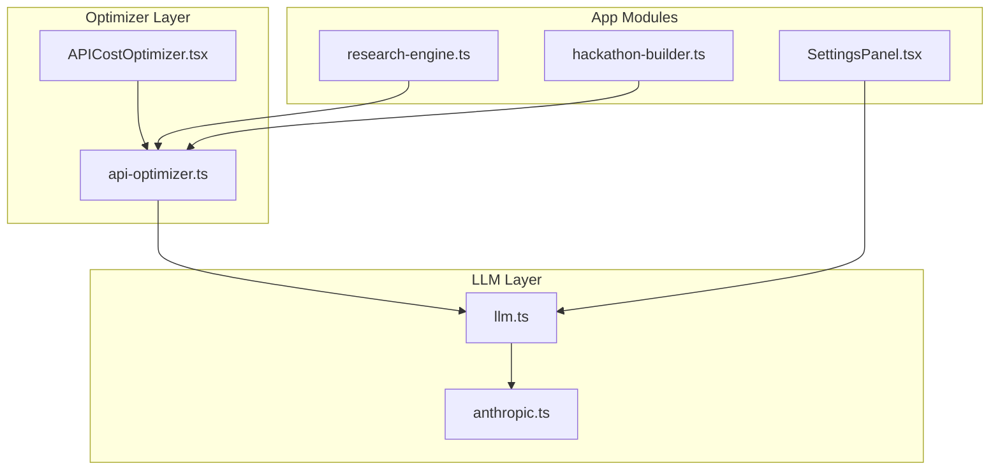
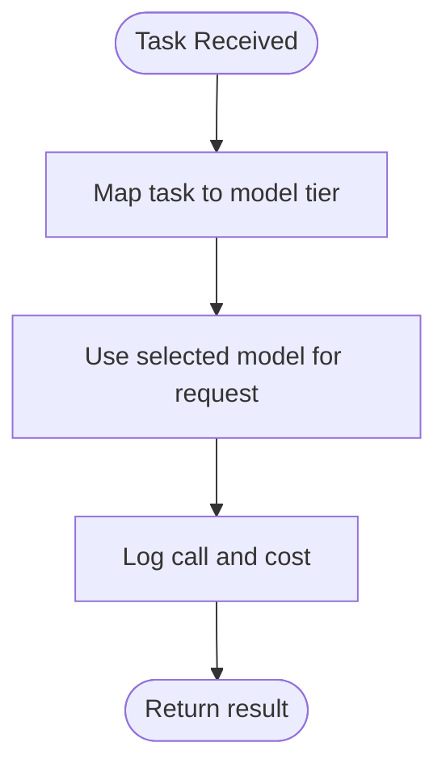
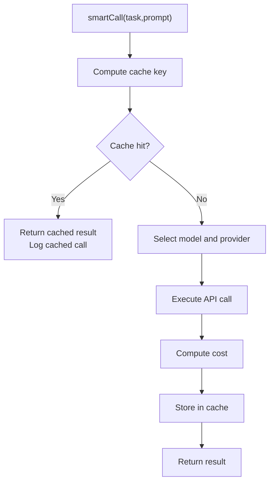
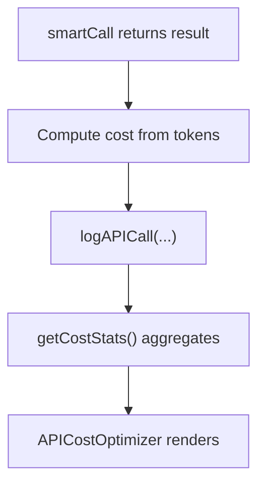
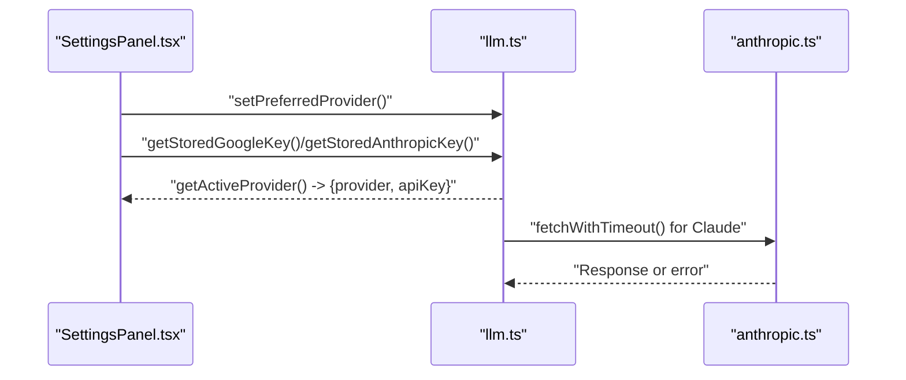
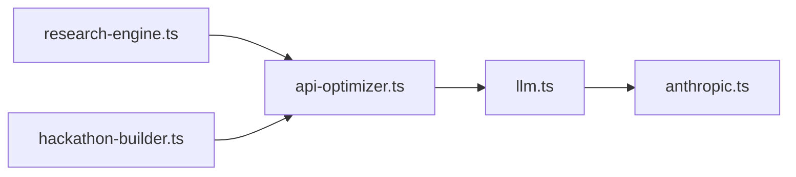
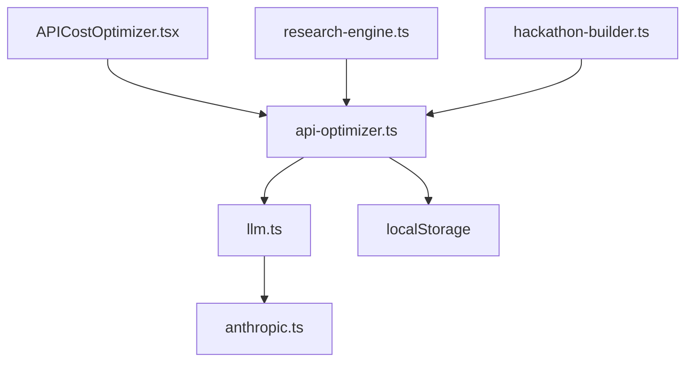

# API Cost Optimization

<cite>
**Referenced Files in This Document**
- [api-optimizer.ts](file://src/lib/api-optimizer.ts)
- [APICostOptimizer.tsx](file://src/components/optimizer/APICostOptimizer.tsx)
- [llm.ts](file://src/lib/llm.ts)
- [anthropic.ts](file://src/lib/anthropic.ts)
- [SettingsPanel.tsx](file://src/components/settings/SettingsPanel.tsx)
- [research-engine.ts](file://src/lib/research-engine.ts)
- [hackathon-builder.ts](file://src/lib/hackathon-builder.ts)
</cite>

## Table of Contents
1. [Introduction](#introduction)
2. [Project Structure](#project-structure)
3. [Core Components](#core-components)
4. [Architecture Overview](#architecture-overview)
5. [Detailed Component Analysis](#detailed-component-analysis)
6. [Dependency Analysis](#dependency-analysis)
7. [Performance Considerations](#performance-considerations)
8. [Troubleshooting Guide](#troubleshooting-guide)
9. [Conclusion](#conclusion)

## Introduction
This document explains the API cost optimization system in Core Brim Tech OS. It focuses on how the system reduces AI API costs using intelligent model routing, robust caching, and transparent cost tracking. It also covers configuration options, performance tuning, and practical optimization scenarios that impact both cost and response times.

## Project Structure
The optimization system spans a small set of focused modules:
- A central optimizer library that encapsulates model routing, caching, cost logging, and a smart call function
- A UI panel that visualizes cost statistics, cache effectiveness, and routing rules
- A unified LLM layer that selects providers and enforces timeouts
- Supporting libraries for research and hackathon builders that demonstrate real-world usage and cost-sensitive workflows



**Diagram sources**
- [api-optimizer.ts](file://src/lib/api-optimizer.ts#L1-L290)
- [APICostOptimizer.tsx](file://src/components/optimizer/APICostOptimizer.tsx#L1-L235)
- [llm.ts](file://src/lib/llm.ts#L1-L135)
- [anthropic.ts](file://src/lib/anthropic.ts#L1-L32)
- [research-engine.ts](file://src/lib/research-engine.ts#L1-L519)
- [hackathon-builder.ts](file://src/lib/hackathon-builder.ts#L1-L663)
- [SettingsPanel.tsx](file://src/components/settings/SettingsPanel.tsx#L1-L389)

**Section sources**
- [api-optimizer.ts](file://src/lib/api-optimizer.ts#L1-L290)
- [APICostOptimizer.tsx](file://src/components/optimizer/APICostOptimizer.tsx#L1-L235)
- [llm.ts](file://src/lib/llm.ts#L1-L135)
- [anthropic.ts](file://src/lib/anthropic.ts#L1-L32)
- [research-engine.ts](file://src/lib/research-engine.ts#L1-L519)
- [hackathon-builder.ts](file://src/lib/hackathon-builder.ts#L1-L663)
- [SettingsPanel.tsx](file://src/components/settings/SettingsPanel.tsx#L1-L389)

## Core Components
- Smart model routing: Automatically selects the cheapest suitable model per task type to reduce cost without sacrificing quality.
- Aggressive caching: Stores results in localStorage with a 24-hour TTL and a 100-entry cap, keyed by task type plus prompt prefix to prevent collisions.
- Cost tracking: Logs every call with input/output token counts and cost, enabling visibility and savings attribution.
- Provider selection: Chooses between Claude and Google (Gemini) based on user preference and key availability, with timeouts and error handling.
- UI dashboard: Presents cost stats, cache hit rate, model usage breakdown, and routing rules for transparency.

**Section sources**
- [api-optimizer.ts](file://src/lib/api-optimizer.ts#L27-L74)
- [api-optimizer.ts](file://src/lib/api-optimizer.ts#L76-L128)
- [api-optimizer.ts](file://src/lib/api-optimizer.ts#L130-L176)
- [llm.ts](file://src/lib/llm.ts#L35-L46)
- [APICostOptimizer.tsx](file://src/components/optimizer/APICostOptimizer.tsx#L40-L235)

## Architecture Overview
The optimizer sits between app modules and the LLM layer. App modules call the smart call function, which checks cache, selects a model, and executes the request via the active provider. Results are cached and cost logged for later analysis.

```mermaid
sequenceDiagram
participant App as "App Module"
participant Opt as "smartCall (api-optimizer.ts)"
participant Cache as "localStorage Cache"
participant Prov as "getActiveProvider (llm.ts)"
participant LLM as "complete (llm.ts)"
participant ANC as "fetchWithTimeout (anthropic.ts)"
App->>Opt : "smartCall({task, prompt, ...})"
Opt->>Cache : "checkCache(key)"
alt "Cache hit"
Cache-->>Opt : "CacheEntry"
Opt->>Opt : "logAPICall(cached=true)"
Opt-->>App : "return cached result"
else "Cache miss"
Opt->>Prov : "getActiveProvider()"
Prov-->>Opt : "{provider, apiKey}"
Opt->>LLM : "complete({prompt, systemPrompt, ...})"
alt "Claude path"
LLM->>ANC : "fetchWithTimeout(...)"
ANC-->>LLM : "Response"
else "Google path"
LLM-->>Opt : "Result"
end
Opt->>Opt : "logAPICall(cached=false)"
Opt->>Cache : "setCache(key, entry)"
Opt-->>App : "return result"
end
```

**Diagram sources**
- [api-optimizer.ts](file://src/lib/api-optimizer.ts#L182-L266)
- [api-optimizer.ts](file://src/lib/api-optimizer.ts#L118-L128)
- [llm.ts](file://src/lib/llm.ts#L128-L134)
- [anthropic.ts](file://src/lib/anthropic.ts#L8-L26)

## Detailed Component Analysis

### Smart Model Routing
- Purpose: Route each task to the lowest-cost model capable of handling it well.
- Rules: Classification, summarization, scoring, extraction, and session summaries use the cheapest model; longer research tasks and synthesis use progressively more capable models.
- Outcome: Substantial savings versus always using the most expensive model.



**Diagram sources**
- [api-optimizer.ts](file://src/lib/api-optimizer.ts#L39-L74)
- [api-optimizer.ts](file://src/lib/api-optimizer.ts#L182-L266)

**Section sources**
- [api-optimizer.ts](file://src/lib/api-optimizer.ts#L39-L74)

### Intelligent Caching
- Cache key: Deterministic key derived from task type and a prefix of the prompt to avoid collisions across tasks.
- Storage: localStorage with a 24-hour TTL and eviction of the oldest entry when exceeding 100 items.
- Effect: Eliminates redundant API calls for repeated prompts, reducing cost to zero for cached results.



**Diagram sources**
- [api-optimizer.ts](file://src/lib/api-optimizer.ts#L87-L96)
- [api-optimizer.ts](file://src/lib/api-optimizer.ts#L118-L128)
- [api-optimizer.ts](file://src/lib/api-optimizer.ts#L134-L144)

**Section sources**
- [api-optimizer.ts](file://src/lib/api-optimizer.ts#L76-L128)

### Cost Tracking and Estimation
- Logging: Every call is recorded with model, input/output tokens, computed cost, task, and whether it was cached.
- Statistics: Aggregated totals, cached call count, and savings by cached calls.
- Estimation: Provides a cost estimate for a given task and token count using the selected model’s pricing.



**Diagram sources**
- [api-optimizer.ts](file://src/lib/api-optimizer.ts#L254-L257)
- [api-optimizer.ts](file://src/lib/api-optimizer.ts#L134-L176)
- [APICostOptimizer.tsx](file://src/components/optimizer/APICostOptimizer.tsx#L40-L100)

**Section sources**
- [api-optimizer.ts](file://src/lib/api-optimizer.ts#L130-L176)
- [APICostOptimizer.tsx](file://src/components/optimizer/APICostOptimizer.tsx#L40-L100)

### Provider Selection and Timeout Management
- Provider resolution: Chooses preferred provider if a key is present; otherwise falls back to the other provider if available.
- Claude path: Uses Anthropic API with a timeout wrapper and explicit error parsing.
- Google path: Uses Gemini with a single completion function and timeout handling.
- UI integration: Settings panel allows choosing the preferred provider and storing keys.



**Diagram sources**
- [SettingsPanel.tsx](file://src/components/settings/SettingsPanel.tsx#L123-L126)
- [llm.ts](file://src/lib/llm.ts#L24-L46)
- [anthropic.ts](file://src/lib/anthropic.ts#L8-L31)

**Section sources**
- [llm.ts](file://src/lib/llm.ts#L24-L46)
- [anthropic.ts](file://src/lib/anthropic.ts#L8-L31)
- [SettingsPanel.tsx](file://src/components/settings/SettingsPanel.tsx#L123-L126)

### Real-World Usage in Research and Hackathon Builders
- Research engine: Demonstrates cost-sensitive workflows with batching and link validation, complementing the optimizer’s caching and routing.
- Hackathon builder: Streams a multi-step build process, illustrating how the optimizer can reduce costs across iterative AI-assisted tasks.



**Diagram sources**
- [research-engine.ts](file://src/lib/research-engine.ts#L206-L394)
- [hackathon-builder.ts](file://src/lib/hackathon-builder.ts#L509-L592)
- [api-optimizer.ts](file://src/lib/api-optimizer.ts#L182-L266)
- [llm.ts](file://src/lib/llm.ts#L128-L134)
- [anthropic.ts](file://src/lib/anthropic.ts#L8-L26)

**Section sources**
- [research-engine.ts](file://src/lib/research-engine.ts#L206-L394)
- [hackathon-builder.ts](file://src/lib/hackathon-builder.ts#L509-L592)

## Dependency Analysis
- Coupling: The optimizer depends on the LLM layer for provider selection and completion, and on localStorage for caching and cost logs.
- Cohesion: The optimizer encapsulates all cost optimization logic in a single module, keeping app modules provider-agnostic.
- External dependencies: Anthropic fetch wrapper and Google completion function; UI components depend on the optimizer for stats and routing display.



**Diagram sources**
- [api-optimizer.ts](file://src/lib/api-optimizer.ts#L180-L181)
- [llm.ts](file://src/lib/llm.ts#L128-L134)
- [anthropic.ts](file://src/lib/anthropic.ts#L8-L26)
- [APICostOptimizer.tsx](file://src/components/optimizer/APICostOptimizer.tsx#L5-L6)
- [research-engine.ts](file://src/lib/research-engine.ts#L1-L5)
- [hackathon-builder.ts](file://src/lib/hackathon-builder.ts#L1-L5)

**Section sources**
- [api-optimizer.ts](file://src/lib/api-optimizer.ts#L180-L181)
- [llm.ts](file://src/lib/llm.ts#L128-L134)
- [anthropic.ts](file://src/lib/anthropic.ts#L8-L26)
- [APICostOptimizer.tsx](file://src/components/optimizer/APICostOptimizer.tsx#L5-L6)
- [research-engine.ts](file://src/lib/research-engine.ts#L1-L5)
- [hackathon-builder.ts](file://src/lib/hackathon-builder.ts#L1-L5)

## Performance Considerations
- Cache hit rate: Improves with repetitive prompts; tune by adjusting prompt prefixes or task categorization to maximize reuse.
- Token estimation: Use the estimator to approximate costs before heavy operations to decide whether to proceed or optimize the prompt.
- Provider choice: Prefer Google (Gemini) when available to leverage lower-cost/free tiers for supported tasks.
- Concurrency and timeouts: The LLM layer enforces timeouts to prevent hanging requests; ensure prompt sizes align with max token limits to avoid retries.

[No sources needed since this section provides general guidance]

## Troubleshooting Guide
- No API key configured: The system throws an error if neither Claude nor Google keys are present. Configure keys in Settings and choose a preferred provider.
- Cache not saving/loading: Verify localStorage availability and that the cache key and TTL constants are unchanged.
- High cost despite caching: Confirm cache keys include task type and prompt prefix to avoid collisions; review routing rules to ensure the cheapest suitable model is selected.
- Timeouts: Claude requests use a timeout wrapper; if exceeded, retry with a shorter prompt or switch providers.

**Section sources**
- [llm.ts](file://src/lib/llm.ts#L128-L134)
- [llm.ts](file://src/lib/llm.ts#L55-L88)
- [anthropic.ts](file://src/lib/anthropic.ts#L8-L26)
- [api-optimizer.ts](file://src/lib/api-optimizer.ts#L194-L202)
- [SettingsPanel.tsx](file://src/components/settings/SettingsPanel.tsx#L262-L267)

## Conclusion
The API cost optimization system in Core Brim Tech OS combines intelligent model routing, deterministic caching, and transparent cost tracking to substantially reduce AI API expenses while preserving responsiveness. By integrating seamlessly with the LLM layer and exposing a dashboard for visibility, it empowers users to monitor and improve cost efficiency across AI-assisted workflows.