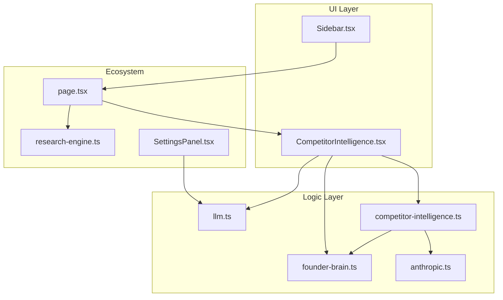
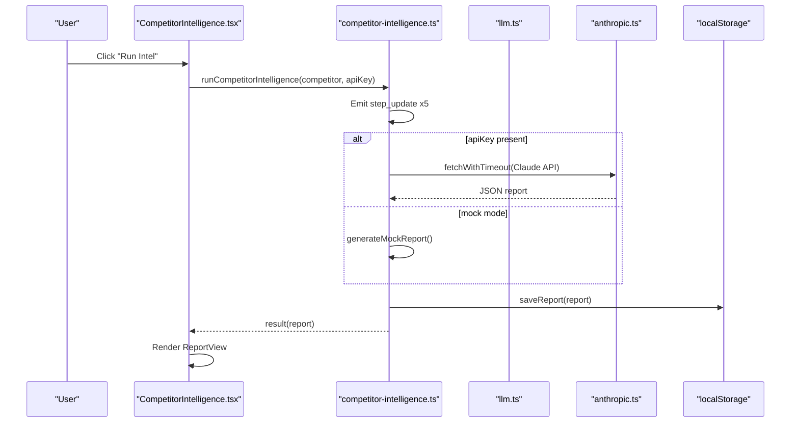
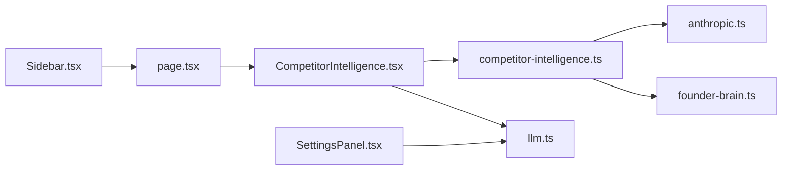

# Competitor Intelligence

<cite>
**Referenced Files in This Document**
- [CompetitorIntelligence.tsx](file://src/components/intelligence/CompetitorIntelligence.tsx)
- [competitor-intelligence.ts](file://src/lib/competitor-intelligence.ts)
- [research-engine.ts](file://src/lib/research-engine.ts)
- [llm.ts](file://src/lib/llm.ts)
- [founder-brain.ts](file://src/lib/founder-brain.ts)
- [anthropic.ts](file://src/lib/anthropic.ts)
- [page.tsx](file://src/app/page.tsx)
- [Sidebar.tsx](file://src/components/Sidebar.tsx)
- [SettingsPanel.tsx](file://src/components/settings/SettingsPanel.tsx)
</cite>

## Table of Contents
1. [Introduction](#introduction)
2. [Project Structure](#project-structure)
3. [Core Components](#core-components)
4. [Architecture Overview](#architecture-overview)
5. [Detailed Component Analysis](#detailed-component-analysis)
6. [Dependency Analysis](#dependency-analysis)
7. [Performance Considerations](#performance-considerations)
8. [Troubleshooting Guide](#troubleshooting-guide)
9. [Conclusion](#conclusion)
10. [Appendices](#appendices)

## Introduction
The Competitor Intelligence module is an AI-powered system designed to automate competitive analysis workflows, enabling deep research on competitors’ activities, product changes, pricing shifts, and strategic positioning. It integrates with the broader intelligence ecosystem to deliver actionable insights, counter-strategies, and ongoing threat assessments. The module supports both mock runs for development and live runs powered by Claude (Anthropic) to perform web searches and synthesize competitive intelligence.

## Project Structure
The module is organized around a React UI component that orchestrates asynchronous intelligence runs, backed by a library that encapsulates the AI workflows, data storage, and integration points.

**Diagram sources**
- [CompetitorIntelligence.tsx](file://src/components/intelligence/CompetitorIntelligence.tsx#L1-L406)
- [competitor-intelligence.ts](file://src/lib/competitor-intelligence.ts#L1-L298)
- [research-engine.ts](file://src/lib/research-engine.ts#L1-L519)
- [llm.ts](file://src/lib/llm.ts#L1-L135)
- [founder-brain.ts](file://src/lib/founder-brain.ts#L1-L213)
- [anthropic.ts](file://src/lib/anthropic.ts#L1-L32)
- [page.tsx](file://src/app/page.tsx#L1-L253)
- [Sidebar.tsx](file://src/components/Sidebar.tsx#L1-L170)
- [SettingsPanel.tsx](file://src/components/settings/SettingsPanel.tsx#L1-L389)

**Section sources**
- [CompetitorIntelligence.tsx](file://src/components/intelligence/CompetitorIntelligence.tsx#L1-L406)
- [competitor-intelligence.ts](file://src/lib/competitor-intelligence.ts#L1-L298)
- [page.tsx](file://src/app/page.tsx#L179-L210)
- [Sidebar.tsx](file://src/components/Sidebar.tsx#L24-L98)

## Core Components
- CompetitorIntelligence UI: Renders competitor cards, displays live intelligence steps, and shows the final report with SWOT, opportunities, warnings, and counter-strategies.
- Competitor Intelligence Library: Provides streaming intelligence engine, report persistence, and mock intelligence generation.
- Research Engine: A separate deep research capability used for broader market research; complements competitor intelligence.
- LLM Utilities: Unified provider selection and completion for Claude and Google (Gemini).
- Founder Brain: Persistent storage of company and competitor data used by the intelligence module.
- Anthropic Helpers: Timeout-aware fetch and error parsing for Claude API calls.
- Settings Panel: Configures API keys and provider preferences used by the intelligence workflows.

**Section sources**
- [CompetitorIntelligence.tsx](file://src/components/intelligence/CompetitorIntelligence.tsx#L177-L405)
- [competitor-intelligence.ts](file://src/lib/competitor-intelligence.ts#L49-L298)
- [research-engine.ts](file://src/lib/research-engine.ts#L206-L394)
- [llm.ts](file://src/lib/llm.ts#L36-L135)
- [founder-brain.ts](file://src/lib/founder-brain.ts#L52-L86)
- [anthropic.ts](file://src/lib/anthropic.ts#L8-L32)
- [SettingsPanel.tsx](file://src/components/settings/SettingsPanel.tsx#L59-L142)

## Architecture Overview
The module follows a streaming, event-driven architecture:
- UI triggers an intelligence run for a selected competitor.
- The engine emits step updates, then yields a final report.
- Reports are persisted locally and can be synced to the cloud via Supabase.
- The UI renders a structured report with sections for recent activity, opportunities, warnings, SWOT, and counter-strategies.

**Diagram sources**
- [CompetitorIntelligence.tsx](file://src/components/intelligence/CompetitorIntelligence.tsx#L226-L252)
- [competitor-intelligence.ts](file://src/lib/competitor-intelligence.ts#L177-L216)
- [llm.ts](file://src/lib/llm.ts#L128-L135)
- [anthropic.ts](file://src/lib/anthropic.ts#L8-L32)

## Detailed Component Analysis

### CompetitorIntelligence UI
Responsibilities:
- Loads competitors from Founder Brain.
- Streams and displays intelligence steps during execution.
- Persists and displays the final report with sections for strategies, recent activity, opportunities, warnings, and SWOT.
- Handles interruption state and error display.

Key behaviors:
- Uses session storage to persist the currently running competitor to recover from interruptions.
- Applies threat-level borders and urgency badges to visually communicate risk and actionability.
- Supports re-running existing reports and toggling detailed views.

**Section sources**
- [CompetitorIntelligence.tsx](file://src/components/intelligence/CompetitorIntelligence.tsx#L177-L405)

### Intelligence Engine (Streaming)
Responsibilities:
- Orchestrates five intelligence steps: scanning website/product, checking news and press, analyzing pricing and positioning, researching team and funding, and generating counter-strategies.
- Emits step updates with status and details.
- Generates a mock report when no API key is present, or calls the real engine when an API key is available.
- Persists reports to localStorage and can sync to cloud.

Data model:
- CompetitorReport: includes recent activity, strengths/weaknesses, threat assessment, counter-strategies, opportunities, warnings, and metadata.
- IntelligenceStep: step index, label, status, and optional detail.

**Section sources**
- [competitor-intelligence.ts](file://src/lib/competitor-intelligence.ts#L7-L68)
- [competitor-intelligence.ts](file://src/lib/competitor-intelligence.ts#L170-L216)
- [competitor-intelligence.ts](file://src/lib/competitor-intelligence.ts#L72-L166)

### Real Intelligence Workflow (Claude)
Responsibilities:
- Calls Claude’s Messages API with a web search tool enabled.
- Sends a structured prompt requesting competitive intelligence across product releases, pricing, team changes, marketing moves, funding news, and strategic gaps.
- Parses the returned JSON and constructs a normalized report.

Integration:
- Uses timeout-aware fetch and error parsing from Anthropic helpers.
- Requires a valid Claude API key.

**Section sources**
- [competitor-intelligence.ts](file://src/lib/competitor-intelligence.ts#L218-L290)
- [anthropic.ts](file://src/lib/anthropic.ts#L8-L32)

### Mock Intelligence Generation
Responsibilities:
- Generates a realistic mock report with recent releases, pricing changes, team changes, marketing moves, funding news, strengths, weaknesses, threats, opportunities, warnings, and counter-strategies.
- Useful for development and demonstration without requiring an API key.

**Section sources**
- [competitor-intelligence.ts](file://src/lib/competitor-intelligence.ts#L72-L166)

### Report Rendering
Responsibilities:
- StrategyCard: renders urgency, effort, and impact for each counter-strategy.
- ReportView: renders summary, threat assessment, and collapsible sections for strategies, recent activity, opportunities, warnings, and SWOT.

**Section sources**
- [CompetitorIntelligence.tsx](file://src/components/intelligence/CompetitorIntelligence.tsx#L31-L173)

### Integration with the Intelligence Ecosystem
- The module integrates with the broader OS through:
  - Sidebar navigation to “Intel Engine”.
  - Settings panel for configuring API keys and providers.
  - Research Engine for complementary deep research.
  - Founder Brain for persistent competitor data.

**Section sources**
- [Sidebar.tsx](file://src/components/Sidebar.tsx#L34-L41)
- [SettingsPanel.tsx](file://src/components/settings/SettingsPanel.tsx#L59-L142)
- [research-engine.ts](file://src/lib/research-engine.ts#L206-L394)
- [founder-brain.ts](file://src/lib/founder-brain.ts#L92-L104)

## Dependency Analysis
Key dependencies and relationships:
- UI depends on the intelligence library for orchestration and on the LLM utilities for provider resolution.
- Intelligence library depends on Anthropic helpers for HTTP requests and on Founder Brain for competitor context.
- Settings panel influences provider selection and key availability, which affects whether the engine runs in mock or real mode.

**Diagram sources**
- [CompetitorIntelligence.tsx](file://src/components/intelligence/CompetitorIntelligence.tsx#L1-L15)
- [competitor-intelligence.ts](file://src/lib/competitor-intelligence.ts#L1-L6)
- [llm.ts](file://src/lib/llm.ts#L1-L135)
- [anthropic.ts](file://src/lib/anthropic.ts#L1-L32)
- [founder-brain.ts](file://src/lib/founder-brain.ts#L1-L86)
- [page.tsx](file://src/app/page.tsx#L179-L210)
- [Sidebar.tsx](file://src/components/Sidebar.tsx#L106-L162)
- [SettingsPanel.tsx](file://src/components/settings/SettingsPanel.tsx#L59-L142)

**Section sources**
- [CompetitorIntelligence.tsx](file://src/components/intelligence/CompetitorIntelligence.tsx#L1-L15)
- [competitor-intelligence.ts](file://src/lib/competitor-intelligence.ts#L1-L6)
- [llm.ts](file://src/lib/llm.ts#L36-L46)
- [anthropic.ts](file://src/lib/anthropic.ts#L8-L32)
- [founder-brain.ts](file://src/lib/founder-brain.ts#L92-L104)
- [page.tsx](file://src/app/page.tsx#L179-L210)
- [Sidebar.tsx](file://src/components/Sidebar.tsx#L106-L162)
- [SettingsPanel.tsx](file://src/components/settings/SettingsPanel.tsx#L59-L142)

## Performance Considerations
- Streaming updates: The engine emits step updates to keep the UI responsive during long runs.
- Mock vs. real mode: Mock mode reduces latency for development and testing.
- Timeout handling: Anthropic helpers enforce timeouts to prevent hanging requests.
- Local storage caching: Reports are cached locally to avoid repeated runs and enable quick re-renders.

[No sources needed since this section provides general guidance]

## Troubleshooting Guide
Common issues and resolutions:
- No API key configured: The engine falls back to mock mode. Configure a Claude or Google key in Settings to enable real runs.
- Intelligence run interrupted: The UI persists the running state in session storage and shows a banner to resume.
- API errors: The Anthropic helpers parse and surface meaningful error messages from Claude.
- Link validation failures: The research engine validates links safely; failures are handled gracefully.

**Section sources**
- [SettingsPanel.tsx](file://src/components/settings/SettingsPanel.tsx#L59-L142)
- [CompetitorIntelligence.tsx](file://src/components/intelligence/CompetitorIntelligence.tsx#L175-L215)
- [anthropic.ts](file://src/lib/anthropic.ts#L28-L32)
- [research-engine.ts](file://src/lib/research-engine.ts#L396-L423)

## Conclusion
The Competitor Intelligence module automates competitive analysis through a robust, streaming pipeline that integrates with Claude’s web search capabilities and local storage. It provides actionable insights, counter-strategies, and ongoing monitoring of competitive threats, while fitting seamlessly into the broader intelligence ecosystem. Configuration via the Settings panel enables flexible provider selection and secure key management.

[No sources needed since this section summarizes without analyzing specific files]

## Appendices

### Example Competitor Analysis Scenarios
- Immediate threat response: Use urgent counter-strategies to address a competitor’s pricing change or new product launch.
- Strategic moat building: Focus on opportunities that align with local context and community trust.
- Early warning detection: Monitor team changes and funding news to anticipate market positioning shifts.

[No sources needed since this section provides general guidance]

### Configuration Options and Parameters
- Provider selection: Choose between Claude and Google (Gemini) in Settings.
- API keys: Store keys in browser storage or use environment variables for server-side runs.
- Intelligence depth: The engine performs five distinct steps; mock mode simulates these steps for rapid iteration.
- Report metadata: Confidence score, sources checked, and generation timestamps are included in reports.

**Section sources**
- [SettingsPanel.tsx](file://src/components/settings/SettingsPanel.tsx#L59-L142)
- [llm.ts](file://src/lib/llm.ts#L24-L46)
- [competitor-intelligence.ts](file://src/lib/competitor-intelligence.ts#L189-L205)
- [competitor-intelligence.ts](file://src/lib/competitor-intelligence.ts#L27-L30)

### Integration with the Broader Intelligence Ecosystem
- Sidebar navigation routes to the Intel Engine module.
- Research Engine complements competitor intelligence with broad market research.
- Founder Brain supplies persistent competitor profiles and context.
- Settings panel centralizes provider and key configuration.

**Section sources**
- [Sidebar.tsx](file://src/components/Sidebar.tsx#L34-L41)
- [research-engine.ts](file://src/lib/research-engine.ts#L206-L394)
- [founder-brain.ts](file://src/lib/founder-brain.ts#L92-L104)
- [page.tsx](file://src/app/page.tsx#L179-L210)