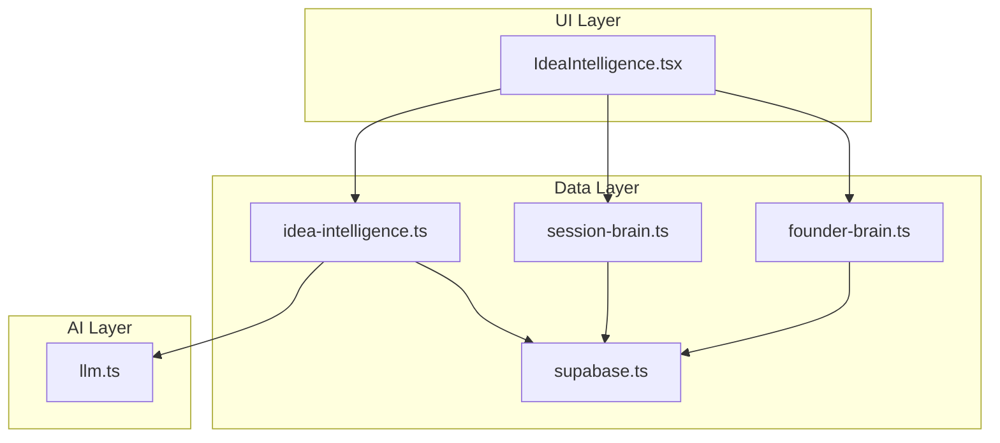
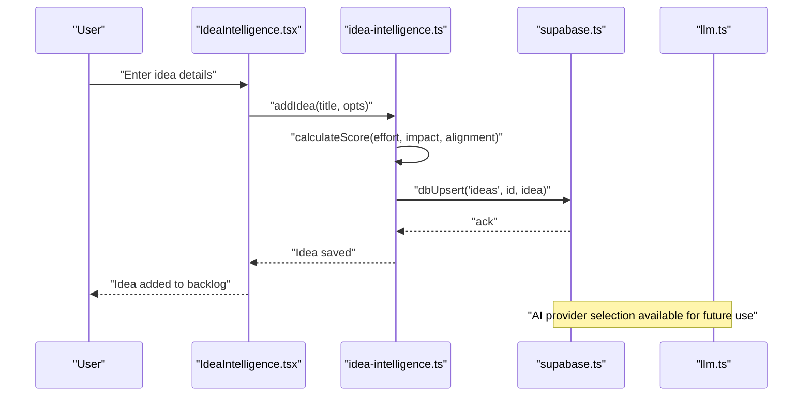
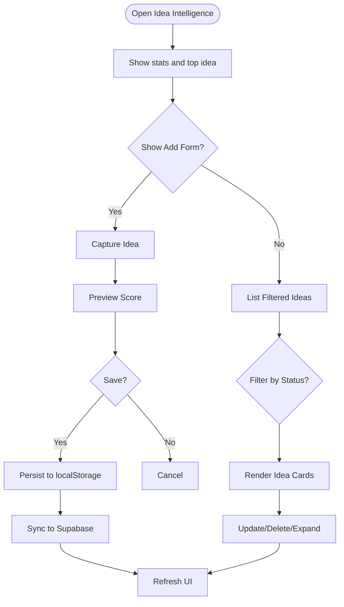
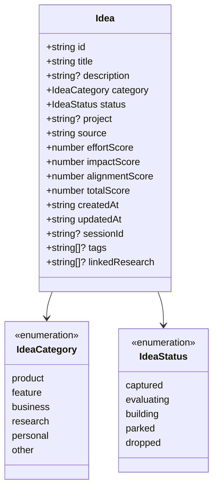
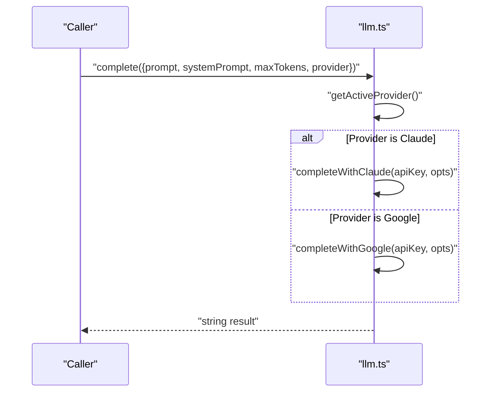
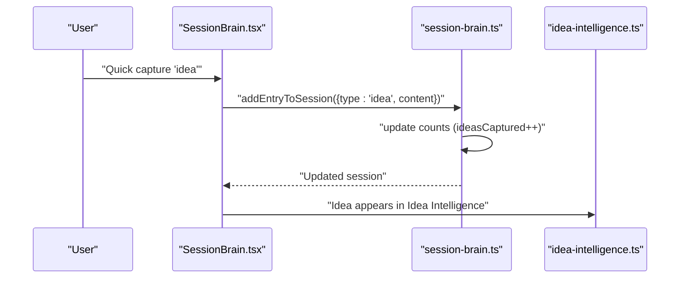
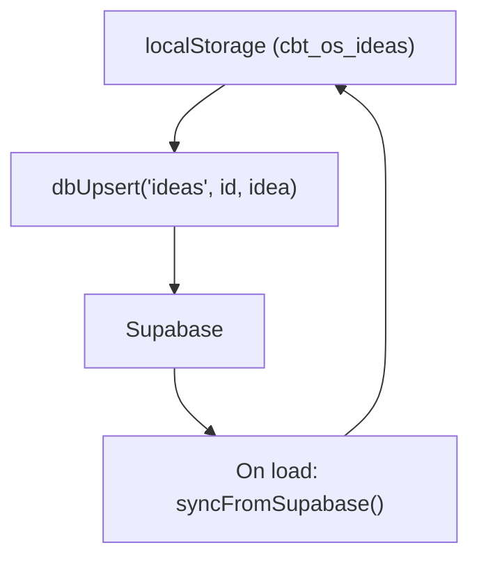
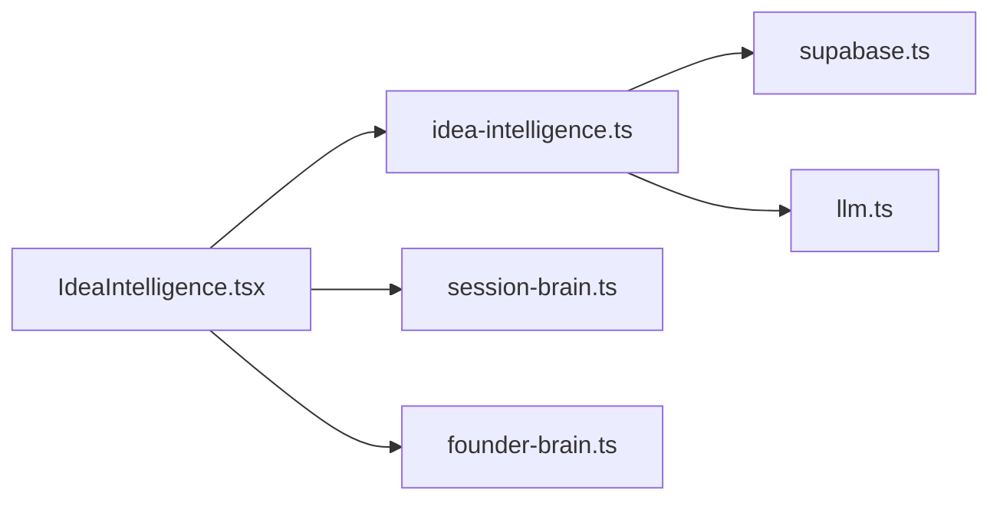

# Idea Generation System

<cite>
**Referenced Files in This Document**
- [IdeaIntelligence.tsx](file://src/components/ideas/IdeaIntelligence.tsx)
- [idea-intelligence.ts](file://src/lib/idea-intelligence.ts)
- [llm.ts](file://src/lib/llm.ts)
- [supabase.ts](file://src/lib/supabase.ts)
- [SessionBrain.tsx](file://src/components/session/SessionBrain.tsx)
- [session-brain.ts](file://src/lib/session-brain.ts)
- [FounderBrain.tsx](file://src/components/brain/FounderBrain.tsx)
- [founder-brain.ts](file://src/lib/founder-brain.ts)
- [page.tsx](file://src/app/page.tsx)
</cite>

## Table of Contents
1. [Introduction](#introduction)
2. [Project Structure](#project-structure)
3. [Core Components](#core-components)
4. [Architecture Overview](#architecture-overview)
5. [Detailed Component Analysis](#detailed-component-analysis)
6. [Dependency Analysis](#dependency-analysis)
7. [Performance Considerations](#performance-considerations)
8. [Troubleshooting Guide](#troubleshooting-guide)
9. [Conclusion](#conclusion)
10. [Appendices](#appendices)

## Introduction
This document describes the AI-powered Idea Generation System in Core Brim Tech OS. It explains how ideas are captured, scored, evaluated, and managed through an integrated workflow that spans manual capture, AI-assisted scoring, session-driven ideation, and cloud synchronization. The system supports categorization, status tracking, and integration with project management and research workflows.

## Project Structure
The Idea Generation System is implemented as a cohesive module within the application’s UI and data layers:
- UI component: Idea capture and management
- Data library: Local persistence, scoring, and cloud sync
- AI layer: Unified provider selection for Claude/Gemini
- Session integration: Context capture during focused work sessions
- Cloud sync: Local-first with optional Supabase persistence

**Diagram sources**
- [IdeaIntelligence.tsx](file://src/components/ideas/IdeaIntelligence.tsx#L1-L355)
- [idea-intelligence.ts](file://src/lib/idea-intelligence.ts#L1-L156)
- [llm.ts](file://src/lib/llm.ts#L1-L135)
- [supabase.ts](file://src/lib/supabase.ts#L1-L292)
- [SessionBrain.tsx](file://src/components/session/SessionBrain.tsx#L1-L742)
- [session-brain.ts](file://src/lib/session-brain.ts#L1-L278)
- [FounderBrain.tsx](file://src/components/brain/FounderBrain.tsx#L1-L774)
- [founder-brain.ts](file://src/lib/founder-brain.ts#L1-L213)

**Section sources**
- [page.tsx](file://src/app/page.tsx#L179-L210)

## Core Components
- Idea capture and scoring UI: Provides a form to capture ideas, category selection, and a scoring preview. It displays idea cards with status controls and detailed breakdowns.
- Idea data model and persistence: Defines the idea schema, scoring algorithm, and local/cloud storage operations.
- AI provider abstraction: Selects Claude or Gemini for completions based on stored preferences and keys.
- Session integration: Captures ideas during active work sessions and aggregates counts.
- Cloud sync: Persists ideas and related data to Supabase with write-through caching.

**Section sources**
- [IdeaIntelligence.tsx](file://src/components/ideas/IdeaIntelligence.tsx#L1-L355)
- [idea-intelligence.ts](file://src/lib/idea-intelligence.ts#L1-L156)
- [llm.ts](file://src/lib/llm.ts#L1-L135)
- [session-brain.ts](file://src/lib/session-brain.ts#L1-L278)
- [supabase.ts](file://src/lib/supabase.ts#L1-L292)

## Architecture Overview
The Idea Generation System follows a local-first architecture with optional cloud persistence:
- UI captures ideas and renders scoring previews.
- Data library persists ideas locally and exposes CRUD operations.
- Cloud sync writes to Supabase for cross-device continuity.
- AI layer provides unified provider selection for future integrations.

**Diagram sources**
- [IdeaIntelligence.tsx](file://src/components/ideas/IdeaIntelligence.tsx#L48-L155)
- [idea-intelligence.ts](file://src/lib/idea-intelligence.ts#L56-L96)
- [supabase.ts](file://src/lib/supabase.ts#L57-L66)
- [llm.ts](file://src/lib/llm.ts#L128-L134)

## Detailed Component Analysis

### Idea Capture and Management UI
The UI enables capturing ideas with optional scoring and advanced preview. It supports filtering by status, displaying top-ranked ideas, and managing idea lifecycle.

Key behaviors:
- Capture form: Title, description, category, and optional scoring sliders.
- Preview scoring: Real-time score calculation before saving.
- Idea cards: Expandable details, status buttons, and deletion.
- Filtering: All, captured, evaluating, building, parked.
- Top idea spotlight: Highlights highest-ranked idea.

**Diagram sources**
- [IdeaIntelligence.tsx](file://src/components/ideas/IdeaIntelligence.tsx#L244-L355)

**Section sources**
- [IdeaIntelligence.tsx](file://src/components/ideas/IdeaIntelligence.tsx#L1-L355)

### Idea Data Model and Scoring
The idea model defines fields for categorization, scoring, status, and metadata. Scoring combines effort (inverted), impact, and alignment with weighted coefficients.

Highlights:
- Schema: Title, description, category, status, scores, timestamps, optional linkage to sessions and projects.
- Scoring: Weighted average with inverted effort to favor lower-effort ideas.
- Persistence: Local storage with write-through to Supabase.
- Cloud sync: Upsert/delete operations for ideas.

**Diagram sources**
- [idea-intelligence.ts](file://src/lib/idea-intelligence.ts#L7-L25)

**Section sources**
- [idea-intelligence.ts](file://src/lib/idea-intelligence.ts#L1-L156)

### AI Provider Abstraction
The AI layer selects a provider (Claude or Gemini) based on stored keys and preferences. It exposes a unified completion function and handles timeouts and errors.

Capabilities:
- Provider selection: Preferred provider with fallback.
- Completion: Single-shot completion with optional system prompt.
- Keys: Stored in localStorage with validation.

**Diagram sources**
- [llm.ts](file://src/lib/llm.ts#L128-L134)

**Section sources**
- [llm.ts](file://src/lib/llm.ts#L1-L135)

### Session Integration for Ideation
Ideas can be captured during active sessions. The session brain tracks counts of ideas captured and integrates with the session log.

Key points:
- Quick capture types include “idea” entries.
- Counts increment when ideas are captured in the active session.
- Session summaries include idea counts.

**Diagram sources**
- [SessionBrain.tsx](file://src/components/session/SessionBrain.tsx#L305-L311)
- [session-brain.ts](file://src/lib/session-brain.ts#L97-L116)
- [idea-intelligence.ts](file://src/lib/idea-intelligence.ts#L48-L50)

**Section sources**
- [SessionBrain.tsx](file://src/components/session/SessionBrain.tsx#L1-L742)
- [session-brain.ts](file://src/lib/session-brain.ts#L1-L278)

### Cloud Sync and Persistence
The system persists ideas locally and synchronizes with Supabase for cross-device continuity. The Supabase client provides upsert, fetch, and delete operations mapped to table names.

Highlights:
- Local-first: Uses localStorage for immediate availability.
- Write-through: Upserts to Supabase after local updates.
- Sync engine: Pulls cloud data on app load and merges with local storage.

**Diagram sources**
- [supabase.ts](file://src/lib/supabase.ts#L57-L66)
- [supabase.ts](file://src/lib/supabase.ts#L209-L246)
- [idea-intelligence.ts](file://src/lib/idea-intelligence.ts#L150-L155)

**Section sources**
- [supabase.ts](file://src/lib/supabase.ts#L1-L292)
- [idea-intelligence.ts](file://src/lib/idea-intelligence.ts#L147-L156)

### Innovation Pipeline Management
The system supports pipeline stages via idea statuses:
- Captured: Newly captured ideas awaiting evaluation.
- Evaluating: Undergoing feasibility and opportunity assessment.
- Building: Actively developed.
- Parked: Deferred for later review.
- Dropped: No longer pursued.

UI provides status toggles per idea, enabling lightweight pipeline management.

**Section sources**
- [IdeaIntelligence.tsx](file://src/components/ideas/IdeaIntelligence.tsx#L224-L237)
- [idea-intelligence.ts](file://src/lib/idea-intelligence.ts#L4-L5)

### Collaboration Features
While the Idea Intelligence module focuses on individual capture and scoring, collaboration can be facilitated through:
- Shared sessions: Ideas captured during sessions appear in the Idea Intelligence list.
- Project tagging: Ideas can be associated with projects for team visibility.
- Cloud sync: Enables access across devices and teams if Supabase is configured.

**Section sources**
- [session-brain.ts](file://src/lib/session-brain.ts#L22-L24)
- [idea-intelligence.ts](file://src/lib/idea-intelligence.ts#L13-L14)

### Prompt Engineering Strategies and Creativity Enhancement
The AI layer supports structured prompting with optional system prompts. While the Idea Intelligence module currently uses local scoring, the AI layer can be extended to:
- Generate idea prompts tailored to categories or goals.
- Provide creativity enhancement suggestions based on context from the Founder Brain.
- Offer feasibility and opportunity assessments via structured completions.

**Section sources**
- [llm.ts](file://src/lib/llm.ts#L48-L53)
- [founder-brain.ts](file://src/lib/founder-brain.ts#L67-L86)

### Integration with Project Management Workflows
Ideas can be linked to projects and tracked within sessions:
- Project association: Ideas can include a project field for grouping.
- Session linkage: Ideas captured during sessions can be tagged with project context.
- Status transitions: Move ideas through pipeline stages aligned with project milestones.

**Section sources**
- [idea-intelligence.ts](file://src/lib/idea-intelligence.ts#L13-L14)
- [session-brain.ts](file://src/lib/session-brain.ts#L22-L24)

## Dependency Analysis
The Idea Intelligence module depends on:
- Local data library for persistence and scoring.
- Supabase client for cloud sync.
- Session brain for contextual capture.
- AI layer for future enhancements.

**Diagram sources**
- [IdeaIntelligence.tsx](file://src/components/ideas/IdeaIntelligence.tsx#L1-L8)
- [idea-intelligence.ts](file://src/lib/idea-intelligence.ts#L1-L40)
- [supabase.ts](file://src/lib/supabase.ts#L1-L50)
- [session-brain.ts](file://src/lib/session-brain.ts#L1-L20)
- [llm.ts](file://src/lib/llm.ts#L1-L10)
- [founder-brain.ts](file://src/lib/founder-brain.ts#L1-L20)

**Section sources**
- [IdeaIntelligence.tsx](file://src/components/ideas/IdeaIntelligence.tsx#L1-L8)
- [idea-intelligence.ts](file://src/lib/idea-intelligence.ts#L1-L40)

## Performance Considerations
- Local-first design minimizes latency for idea capture and updates.
- Cloud sync runs asynchronously; UI remains responsive.
- Scoring is computed client-side for immediate feedback.
- Consider batching cloud upserts for large datasets.

[No sources needed since this section provides general guidance]

## Troubleshooting Guide
Common issues and resolutions:
- No AI API key configured: The AI layer throws an error if neither Claude nor Google keys are present. Configure keys in Settings and select a provider.
- Supabase not configured: If URL or key is missing, cloud operations are skipped. Verify environment variables and enable sync.
- Idea not appearing: Ensure local storage is accessible and sync has completed. Re-run sync if needed.

**Section sources**
- [llm.ts](file://src/lib/llm.ts#L128-L134)
- [supabase.ts](file://src/lib/supabase.ts#L23-L26)
- [supabase.ts](file://src/lib/supabase.ts#L209-L246)

## Conclusion
The Idea Generation System provides a robust, local-first foundation for capturing, scoring, and managing ideas. Its integration with sessions, cloud sync, and the AI layer positions it for future enhancements such as AI-assisted evaluation, creativity prompts, and opportunity assessments. The modular design allows incremental expansion while maintaining simplicity and performance.

[No sources needed since this section summarizes without analyzing specific files]

## Appendices

### Configuration Options
- Idea scoring weights: Effort (inverted), Impact, Alignment.
- Provider selection: Claude or Gemini via Settings.
- Cloud sync: Enabled when Supabase is configured.

**Section sources**
- [idea-intelligence.ts](file://src/lib/idea-intelligence.ts#L42-L46)
- [llm.ts](file://src/lib/llm.ts#L24-L46)
- [supabase.ts](file://src/lib/supabase.ts#L23-L26)

### Example Scenarios
- Capture a product idea during a focused session and evaluate feasibility before building.
- Use the top-ranked idea spotlight to prioritize high-impact opportunities.
- Link ideas to a project and track progress through pipeline stages.

**Section sources**
- [SessionBrain.tsx](file://src/components/session/SessionBrain.tsx#L305-L311)
- [IdeaIntelligence.tsx](file://src/components/ideas/IdeaIntelligence.tsx#L312-L324)