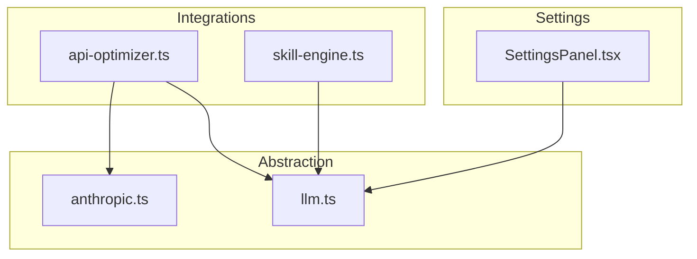
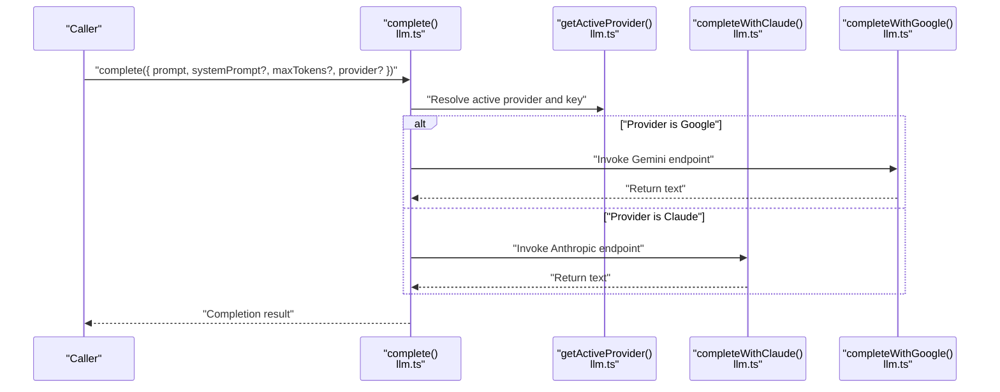
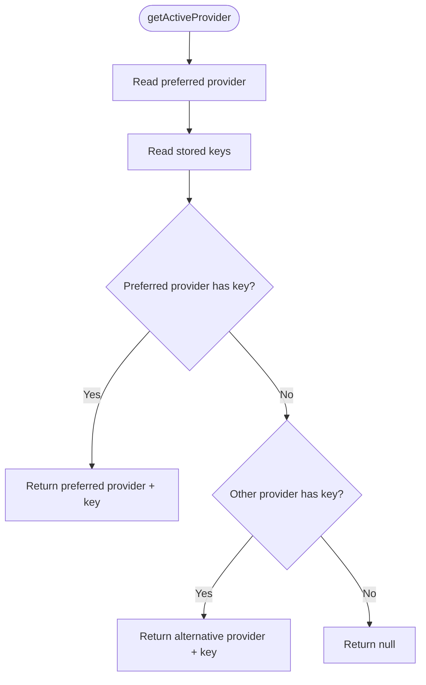
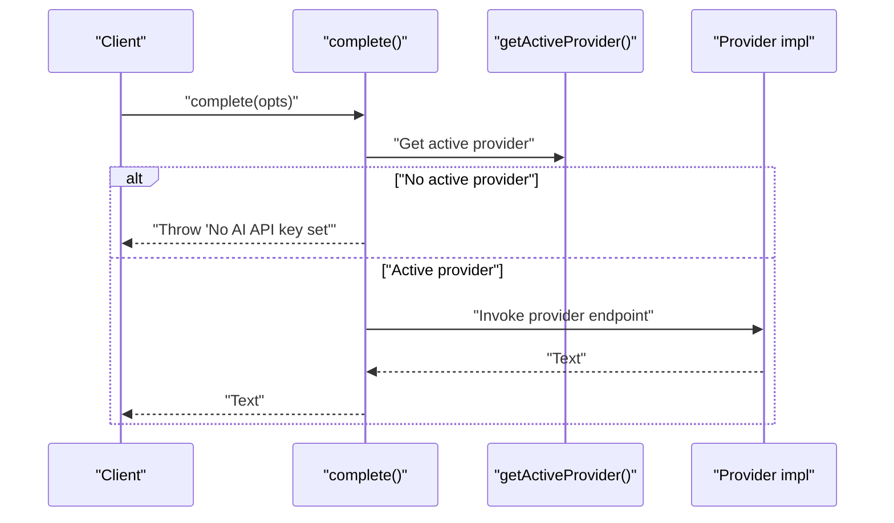
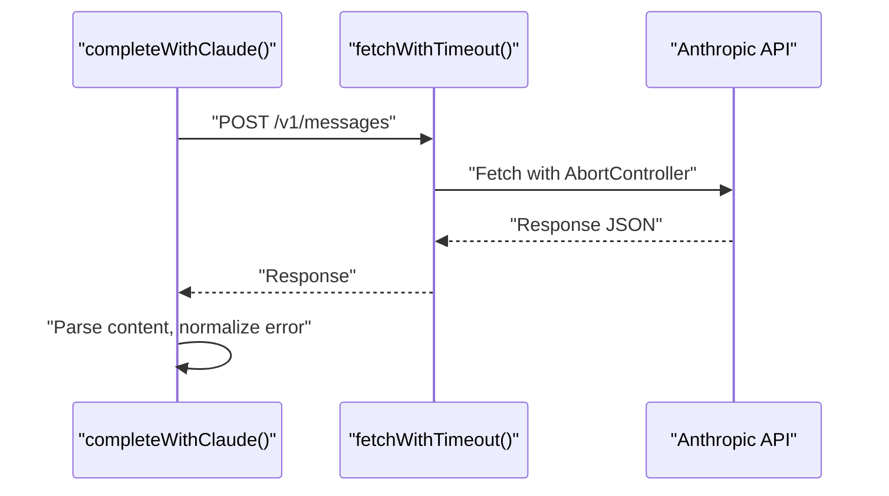
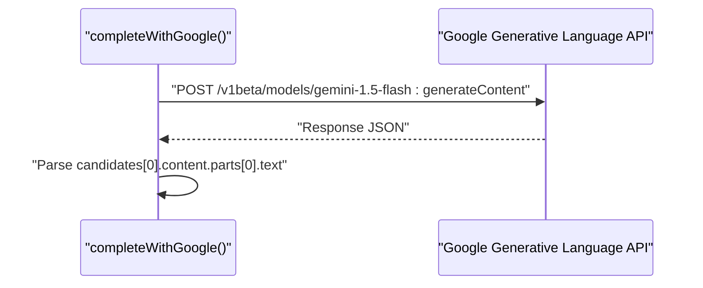
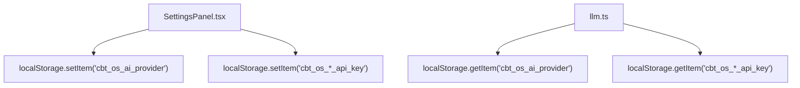
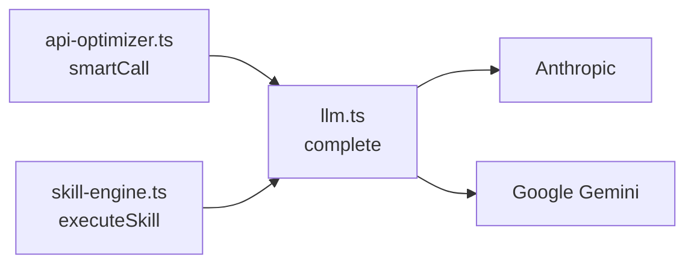
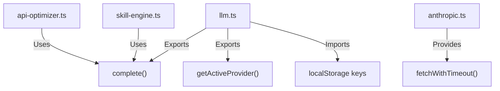

# LLM Provider Abstraction

<cite>
**Referenced Files in This Document**
- [llm.ts](file://src/lib/llm.ts)
- [anthropic.ts](file://src/lib/anthropic.ts)
- [api-optimizer.ts](file://src/lib/api-optimizer.ts)
- [SettingsPanel.tsx](file://src/components/settings/SettingsPanel.tsx)
- [skill-engine.ts](file://src/lib/skill-engine.ts)
</cite>

## Table of Contents
1. [Introduction](#introduction)
2. [Project Structure](#project-structure)
3. [Core Components](#core-components)
4. [Architecture Overview](#architecture-overview)
5. [Detailed Component Analysis](#detailed-component-analysis)
6. [Dependency Analysis](#dependency-analysis)
7. [Performance Considerations](#performance-considerations)
8. [Troubleshooting Guide](#troubleshooting-guide)
9. [Conclusion](#conclusion)

## Introduction
This document describes the LLM provider abstraction layer in Core Brim Tech OS. It unifies access to two AI providers—Anthropic Claude and Google Gemini—through a single, consistent interface. The abstraction supports:
- Seamless switching between providers
- API key management via localStorage
- Provider preference and fallback logic
- Request timeouts and robust error handling
- Integration with AI-powered features such as Skills and the API cost optimizer

## Project Structure
The LLM abstraction is centered in a small set of modules:
- A unified LLM layer that resolves the active provider and executes completions
- A shared timeout helper for Anthropic requests
- A settings panel that stores provider preferences and keys in localStorage
- Integrations that use the abstraction for AI workflows

**Diagram sources**
- [llm.ts](file://src/lib/llm.ts#L1-L135)
- [anthropic.ts](file://src/lib/anthropic.ts#L1-L32)
- [api-optimizer.ts](file://src/lib/api-optimizer.ts#L1-L290)
- [SettingsPanel.tsx](file://src/components/settings/SettingsPanel.tsx#L1-L389)
- [skill-engine.ts](file://src/lib/skill-engine.ts#L350-L549)

**Section sources**
- [llm.ts](file://src/lib/llm.ts#L1-L135)
- [anthropic.ts](file://src/lib/anthropic.ts#L1-L32)
- [api-optimizer.ts](file://src/lib/api-optimizer.ts#L1-L290)
- [SettingsPanel.tsx](file://src/components/settings/SettingsPanel.tsx#L1-L389)
- [skill-engine.ts](file://src/lib/skill-engine.ts#L350-L549)

## Core Components
- Provider selection and key resolution
  - Preferred provider and keys are stored in localStorage
  - Active provider is resolved with a preference-aware fallback strategy
- Unified completion function
  - Single entry point to call either Claude or Gemini
  - Supports optional system prompts, token limits, and provider override
- Timeout and error handling
  - Requests are aborted after a fixed timeout
  - Errors are normalized and surfaced consistently
- Settings integration
  - UI to set provider preference and store keys locally

**Section sources**
- [llm.ts](file://src/lib/llm.ts#L6-L46)
- [llm.ts](file://src/lib/llm.ts#L48-L135)
- [anthropic.ts](file://src/lib/anthropic.ts#L6-L31)
- [SettingsPanel.tsx](file://src/components/settings/SettingsPanel.tsx#L74-L126)

## Architecture Overview
The abstraction exposes a single function to perform completions. Internally, it selects the provider based on user preference and available keys, then dispatches to the appropriate provider implementation. The API cost optimizer and Skills module consume this abstraction for AI workflows.

**Diagram sources**
- [llm.ts](file://src/lib/llm.ts#L36-L135)

## Detailed Component Analysis

### Provider Selection and Fallback Logic
The active provider is determined by:
- Preferred provider setting
- Presence of a valid API key for that provider
- Fallback to the alternative provider if its key is present

**Diagram sources**
- [llm.ts](file://src/lib/llm.ts#L36-L46)

**Section sources**
- [llm.ts](file://src/lib/llm.ts#L24-L46)

### Unified Completion Function
The complete function:
- Validates that a usable provider/key exists
- Dispatches to the provider-specific implementation
- Returns the generated text

**Diagram sources**
- [llm.ts](file://src/lib/llm.ts#L128-L135)

**Section sources**
- [llm.ts](file://src/lib/llm.ts#L128-L135)

### Anthropic Implementation
- Uses a timeout wrapper to abort long-running requests
- Parses errors from API responses
- Sends a messages payload compatible with Claude Sonnet

**Diagram sources**
- [llm.ts](file://src/lib/llm.ts#L57-L88)
- [anthropic.ts](file://src/lib/anthropic.ts#L8-L31)

**Section sources**
- [llm.ts](file://src/lib/llm.ts#L57-L88)
- [anthropic.ts](file://src/lib/anthropic.ts#L6-L31)

### Google (Gemini) Implementation
- Builds a combined prompt from systemPrompt and prompt
- Calls the Gemini endpoint with generation config
- Extracts the first candidate’s text

**Diagram sources**
- [llm.ts](file://src/lib/llm.ts#L90-L122)

**Section sources**
- [llm.ts](file://src/lib/llm.ts#L90-L122)

### Settings and Key Storage Patterns
- Provider preference and API keys are stored in localStorage
- The settings panel allows switching providers and saving keys
- Keys are validated before being considered usable

**Diagram sources**
- [SettingsPanel.tsx](file://src/components/settings/SettingsPanel.tsx#L74-L126)
- [llm.ts](file://src/lib/llm.ts#L6-L33)

**Section sources**
- [SettingsPanel.tsx](file://src/components/settings/SettingsPanel.tsx#L74-L126)
- [llm.ts](file://src/lib/llm.ts#L6-L33)

### Integration with AI Workflows
- API cost optimizer uses the abstraction to route tasks to the most cost-effective model and logs costs
- Skills module uses the abstraction for proposal writing and grant drafting, with graceful fallback to mock content when no provider is configured

**Diagram sources**
- [api-optimizer.ts](file://src/lib/api-optimizer.ts#L180-L266)
- [skill-engine.ts](file://src/lib/skill-engine.ts#L440-L549)
- [llm.ts](file://src/lib/llm.ts#L128-L135)

**Section sources**
- [api-optimizer.ts](file://src/lib/api-optimizer.ts#L180-L266)
- [skill-engine.ts](file://src/lib/skill-engine.ts#L440-L549)

## Dependency Analysis
- Cohesion
  - The LLM module encapsulates provider logic, reducing duplication across integrations
- Coupling
  - Integrations depend on a stable interface (complete) rather than provider internals
- External dependencies
  - Anthropic and Google endpoints are the primary external dependencies
  - localStorage is used for persistence and settings

**Diagram sources**
- [llm.ts](file://src/lib/llm.ts#L1-L135)
- [api-optimizer.ts](file://src/lib/api-optimizer.ts#L180-L266)
- [skill-engine.ts](file://src/lib/skill-engine.ts#L440-L549)
- [anthropic.ts](file://src/lib/anthropic.ts#L1-L32)

**Section sources**
- [llm.ts](file://src/lib/llm.ts#L1-L135)
- [api-optimizer.ts](file://src/lib/api-optimizer.ts#L180-L266)
- [skill-engine.ts](file://src/lib/skill-engine.ts#L440-L549)
- [anthropic.ts](file://src/lib/anthropic.ts#L1-L32)

## Performance Considerations
- Request timeout
  - Both Claude and Gemini calls enforce a 120-second timeout via AbortController
- Token estimation
  - The API cost optimizer estimates token usage for billing and caching
- Caching
  - Responses are cached in localStorage with TTL and eviction policies
- Model routing
  - Tasks are routed to cheaper models when possible to reduce cost

[No sources needed since this section provides general guidance]

## Troubleshooting Guide
- No API key configured
  - The abstraction throws an explicit error when neither provider has a valid key
- Request timeout
  - Timeouts are handled by AbortController; errors are surfaced with a clear message
- Provider mismatch
  - If the preferred provider lacks a key, the system falls back to the alternative provider if available
- Settings not applied
  - Verify localStorage keys for provider preference and API keys

**Section sources**
- [llm.ts](file://src/lib/llm.ts#L128-L135)
- [llm.ts](file://src/lib/llm.ts#L57-L88)
- [llm.ts](file://src/lib/llm.ts#L90-L122)
- [SettingsPanel.tsx](file://src/components/settings/SettingsPanel.tsx#L74-L126)

## Conclusion
The LLM provider abstraction cleanly unifies Anthropic Claude and Google Gemini behind a single interface. It centralizes provider selection, key management, timeouts, and error handling, enabling multi-provider AI workflows with minimal friction. Integrations like the API cost optimizer and Skills module benefit from consistent behavior, predictable performance, and robust fallbacks.