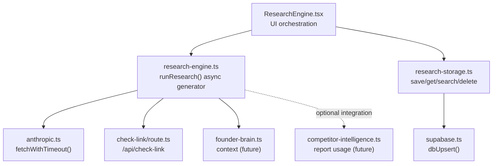
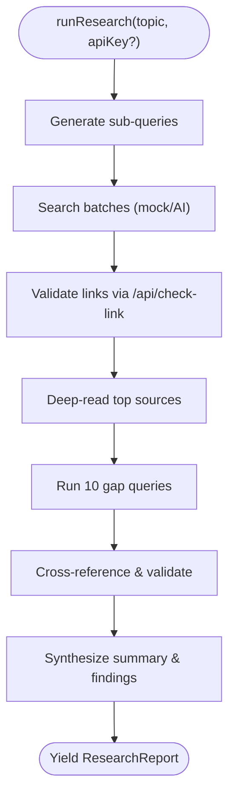
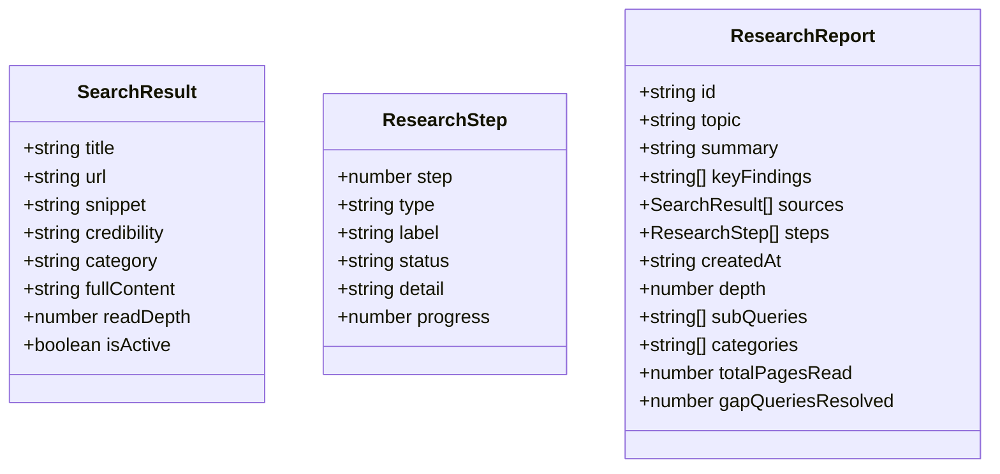
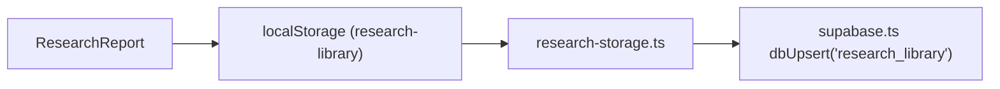
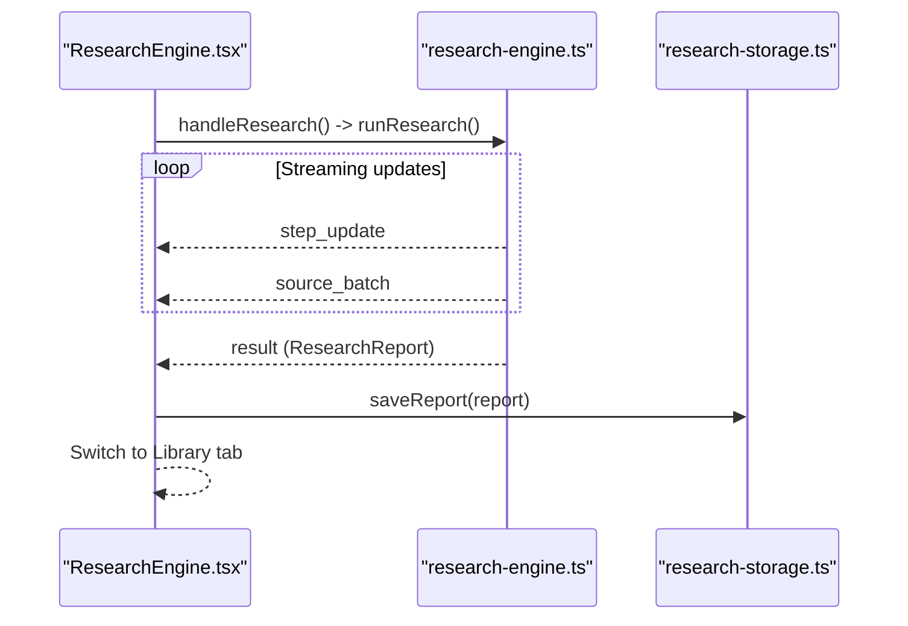
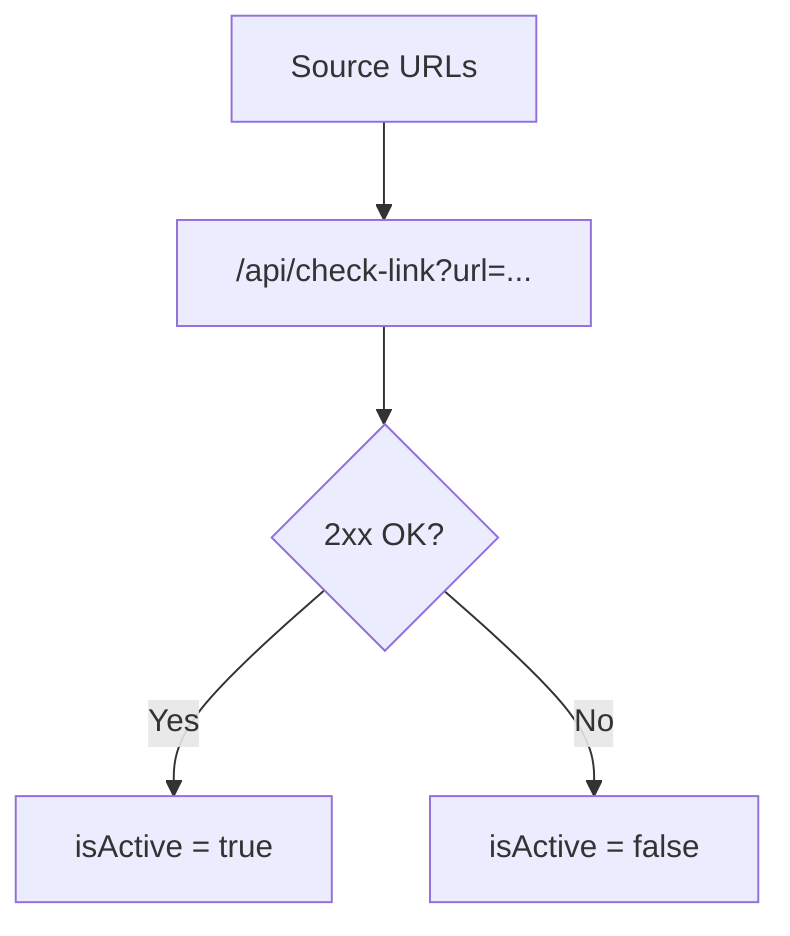
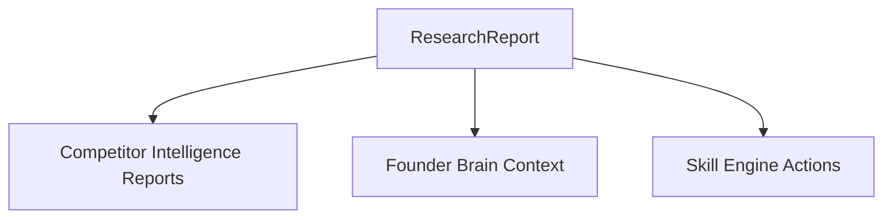
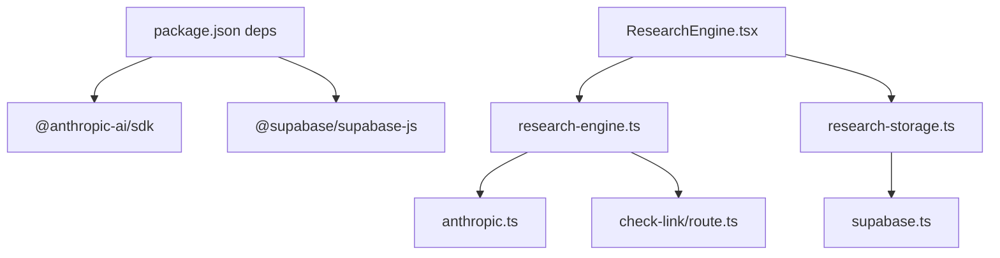

# Research Engine

<cite>
**Referenced Files in This Document**
- [research-engine.ts](file://src/lib/research-engine.ts)
- [research-storage.ts](file://src/lib/research-storage.ts)
- [ResearchEngine.tsx](file://src/components/research/ResearchEngine.tsx)
- [check-link/route.ts](file://src/app/api/check-link/route.ts)
- [check-env/route.ts](file://src/app/api/check-env/route.ts)
- [anthropic.ts](file://src/lib/anthropic.ts)
- [skill-engine.ts](file://src/lib/skill-engine.ts)
- [supabase.ts](file://src/lib/supabase.ts)
- [founder-brain.ts](file://src/lib/founder-brain.ts)
- [competitor-intelligence.ts](file://src/lib/competitor-intelligence.ts)
- [package.json](file://package.json)
</cite>

## Table of Contents
1. [Introduction](#introduction)
2. [Project Structure](#project-structure)
3. [Core Components](#core-components)
4. [Architecture Overview](#architecture-overview)
5. [Detailed Component Analysis](#detailed-component-analysis)
6. [Dependency Analysis](#dependency-analysis)
7. [Performance Considerations](#performance-considerations)
8. [Troubleshooting Guide](#troubleshooting-guide)
9. [Conclusion](#conclusion)
10. [Appendices](#appendices)

## Introduction
The AI-powered Research Engine in Core Brim Tech OS is a deep research automation system that generates comprehensive, data-backed reports on any topic. It integrates with AI providers for query generation, web search, and synthesis, while persisting results locally and optionally synchronizing to a cloud database. The engine supports:
- Automated multi-step research workflows
- Intelligent search across curated domains
- Gap-filling recursion and cross-referencing
- Persistent research library with search and retrieval
- Integration with other intelligence modules (e.g., Competitor Intelligence)
- Configurable operation modes (mock vs. AI-powered)

## Project Structure
The Research Engine spans a small set of cohesive modules:
- UI component orchestrating user input, progress, and report viewing
- Core research engine implementing the streaming workflow
- Storage layer for local persistence and cloud sync
- API routes for link validation and environment checks
- Shared utilities for Anthropic API interactions and Supabase persistence



**Diagram sources**
- [ResearchEngine.tsx](file://src/components/research/ResearchEngine.tsx#L239-L536)
- [research-engine.ts](file://src/lib/research-engine.ts#L206-L394)
- [anthropic.ts](file://src/lib/anthropic.ts#L8-L31)
- [check-link/route.ts](file://src/app/api/check-link/route.ts#L7-L42)
- [research-storage.ts](file://src/lib/research-storage.ts#L6-L39)
- [supabase.ts](file://src/lib/supabase.ts#L57-L66)
- [founder-brain.ts](file://src/lib/founder-brain.ts#L67-L86)
- [competitor-intelligence.ts](file://src/lib/competitor-intelligence.ts#L7-L38)

**Section sources**
- [ResearchEngine.tsx](file://src/components/research/ResearchEngine.tsx#L1-L536)
- [research-engine.ts](file://src/lib/research-engine.ts#L1-L519)
- [research-storage.ts](file://src/lib/research-storage.ts#L1-L47)
- [check-link/route.ts](file://src/app/api/check-link/route.ts#L1-L43)
- [check-env/route.ts](file://src/app/api/check-env/route.ts#L5-L12)
- [anthropic.ts](file://src/lib/anthropic.ts#L1-L32)
- [supabase.ts](file://src/lib/supabase.ts#L1-L292)
- [founder-brain.ts](file://src/lib/founder-brain.ts#L1-L213)
- [competitor-intelligence.ts](file://src/lib/competitor-intelligence.ts#L1-L298)

## Core Components
- Research Engine (streaming workflow)
  - Generates sub-queries, crawls sources, validates links, deep-reads, runs gap queries, cross-validates, and synthesizes findings and summary.
  - Emits step updates and source batches during execution.
  - Returns a structured report with metadata, sources, findings, and steps.
- Research Storage (local/cloud)
  - Persists reports in localStorage; exposes search and deletion; syncs to Supabase via upsert.
- UI Component
  - Manages user input, displays progress, renders library, and shows full reports.
  - Integrates with environment checks and stored API keys.

**Section sources**
- [research-engine.ts](file://src/lib/research-engine.ts#L6-L40)
- [research-engine.ts](file://src/lib/research-engine.ts#L206-L394)
- [research-storage.ts](file://src/lib/research-storage.ts#L6-L39)
- [ResearchEngine.tsx](file://src/components/research/ResearchEngine.tsx#L239-L536)

## Architecture Overview
The engine runs as an async generator, yielding incremental updates to the UI. Under the hood:
- Query generation and search leverage an AI provider with web search tools.
- Links are validated via a Next.js API route to bypass CORS.
- Results are persisted locally and optionally synced to Supabase.

```mermaid
sequenceDiagram
participant User as "User"
participant UI as "ResearchEngine.tsx"
participant Engine as "research-engine.ts"
participant Anth as "Anthropic API"
participant Link as "/api/check-link"
participant Store as "research-storage.ts"
User->>UI : Enter topic and click Research
UI->>Engine : runResearch(topic, apiKey?)
Engine->>Engine : Generate sub-queries (mock/AI)
Engine->>Anth : Search with web tools (batched)
Anth-->>Engine : Sources (JSON)
Engine->>Link : Validate URLs (batched)
Link-->>Engine : Reachability
Engine->>Engine : Deep-read, gap queries, cross-ref, synthesis
Engine-->>UI : step_update x N
Engine-->>UI : result (ResearchReport)
UI->>Store : saveReport(report)
Store-->>UI : Library updated
```

**Diagram sources**
- [ResearchEngine.tsx](file://src/components/research/ResearchEngine.tsx#L284-L317)
- [research-engine.ts](file://src/lib/research-engine.ts#L206-L394)
- [check-link/route.ts](file://src/app/api/check-link/route.ts#L7-L42)
- [research-storage.ts](file://src/lib/research-storage.ts#L6-L10)

## Detailed Component Analysis

### Research Workflow (runResearch)
The engine executes a six-phase pipeline:
1. Query Generation: Creates multiple focused sub-queries (mock or AI).
2. Search: Executes batches of queries to gather sources.
3. Deep Read: Reads top sources; skims others.
4. Gap Analysis: Runs recursive gap queries to fill missing coverage.
5. Cross Reference: Validates claims across multiple sources.
6. Synthesis: Produces summary and key findings.



**Diagram sources**
- [research-engine.ts](file://src/lib/research-engine.ts#L206-L394)
- [check-link/route.ts](file://src/app/api/check-link/route.ts#L7-L42)

**Section sources**
- [research-engine.ts](file://src/lib/research-engine.ts#L206-L394)

### Data Models and Interfaces
- SearchResult: Source metadata with credibility and category.
- ResearchStep: Step definition with progress and status.
- ResearchReport: Final report with summary, findings, sources, steps, and metadata.



**Diagram sources**
- [research-engine.ts](file://src/lib/research-engine.ts#L6-L40)

**Section sources**
- [research-engine.ts](file://src/lib/research-engine.ts#L6-L40)

### Storage and Retrieval
- Local storage: Save, load, search, and delete reports.
- Cloud sync: Upsert to Supabase table for research_library.
- Environment integration: Stored Anthropic API key retrieval for AI mode.



**Diagram sources**
- [research-storage.ts](file://src/lib/research-storage.ts#L6-L39)
- [supabase.ts](file://src/lib/supabase.ts#L57-L66)

**Section sources**
- [research-storage.ts](file://src/lib/research-storage.ts#L1-L47)
- [supabase.ts](file://src/lib/supabase.ts#L1-L292)
- [skill-engine.ts](file://src/lib/skill-engine.ts#L345-L349)

### UI Orchestration and User Experience
- Tabbed interface: Engine tab for running research and Library tab for browsing.
- Progress indicators: Step-by-step updates with percentage bars.
- Report preview: Highlights key findings and source counts.
- Full report view: Displays summary, findings, and source list with credibility badges.



**Diagram sources**
- [ResearchEngine.tsx](file://src/components/research/ResearchEngine.tsx#L284-L317)
- [research-engine.ts](file://src/lib/research-engine.ts#L206-L394)
- [research-storage.ts](file://src/lib/research-storage.ts#L6-L10)

**Section sources**
- [ResearchEngine.tsx](file://src/components/research/ResearchEngine.tsx#L239-L536)

### Link Validation and Reliability
- Client-side validation via a dedicated API route to avoid CORS issues.
- HEAD and GET fallbacks with timeouts.
- Batched validation with concurrency control.



**Diagram sources**
- [check-link/route.ts](file://src/app/api/check-link/route.ts#L7-L42)
- [research-engine.ts](file://src/lib/research-engine.ts#L402-L423)

**Section sources**
- [check-link/route.ts](file://src/app/api/check-link/route.ts#L1-L43)
- [research-engine.ts](file://src/lib/research-engine.ts#L398-L423)

### Integration with Other Intelligence Modules
- Competitor Intelligence: The engine’s findings and sources can feed or complement competitor reports and vice versa.
- Founder Brain: Contextual data can inform research topics and synthesis prompts (planned).
- Skill Engine: The research report can be surfaced as part of broader autonomous workflows.



**Diagram sources**
- [competitor-intelligence.ts](file://src/lib/competitor-intelligence.ts#L7-L38)
- [founder-brain.ts](file://src/lib/founder-brain.ts#L67-L86)
- [skill-engine.ts](file://src/lib/skill-engine.ts#L351-L431)

**Section sources**
- [competitor-intelligence.ts](file://src/lib/competitor-intelligence.ts#L1-L298)
- [founder-brain.ts](file://src/lib/founder-brain.ts#L1-L213)
- [skill-engine.ts](file://src/lib/skill-engine.ts#L1-L764)

## Dependency Analysis
- Runtime dependencies include the Anthropic SDK and Supabase client.
- Internal dependencies:
  - UI depends on the research engine and storage.
  - Research engine depends on Anthropic utilities and the link-check API.
  - Storage depends on Supabase for cloud persistence.



**Diagram sources**
- [package.json](file://package.json#L11-L22)
- [ResearchEngine.tsx](file://src/components/research/ResearchEngine.tsx#L5-L7)
- [research-engine.ts](file://src/lib/research-engine.ts#L4-L4)
- [anthropic.ts](file://src/lib/anthropic.ts#L1-L32)
- [check-link/route.ts](file://src/app/api/check-link/route.ts#L1-L43)
- [research-storage.ts](file://src/lib/research-storage.ts#L1-L47)
- [supabase.ts](file://src/lib/supabase.ts#L1-L292)

**Section sources**
- [package.json](file://package.json#L1-L36)
- [ResearchEngine.tsx](file://src/components/research/ResearchEngine.tsx#L1-L8)
- [research-engine.ts](file://src/lib/research-engine.ts#L1-L6)

## Performance Considerations
- Streaming updates: The async generator yields incremental progress, keeping the UI responsive.
- Batching: Sources are processed in batches to manage throughput and memory.
- Concurrency: Controlled link validation concurrency prevents overload.
- Timeouts: Long-running AI requests are guarded by timeouts to maintain responsiveness.
- Local-first caching: UI loads library from localStorage for instant access.

[No sources needed since this section provides general guidance]

## Troubleshooting Guide
Common issues and remedies:
- Missing or invalid API key
  - Verify Anthropic API key presence and validity via environment check endpoint.
  - The UI falls back to mock mode when no key is present.
- Link validation failures
  - Some sources may be unreachable; the engine continues with all collected sources and marks active ones.
- Timeout errors
  - AI requests may time out; retry with a simpler request or shorter topic.
- Cloud sync not working
  - Ensure Supabase URL and key are configured; otherwise, operations fall back to localStorage.

**Section sources**
- [check-env/route.ts](file://src/app/api/check-env/route.ts#L5-L12)
- [anthropic.ts](file://src/lib/anthropic.ts#L8-L31)
- [research-engine.ts](file://src/lib/research-engine.ts#L398-L423)
- [supabase.ts](file://src/lib/supabase.ts#L23-L26)

## Conclusion
The Research Engine automates deep, multi-source research with AI-assisted synthesis and robust persistence. Its modular design enables easy integration with other intelligence modules and future enhancements such as knowledge base integration and advanced filtering. The UI provides a smooth, transparent experience with real-time progress and a searchable library.

[No sources needed since this section summarizes without analyzing specific files]

## Appendices

### Configuration Options
- API Keys
  - Anthropic API key: Stored and retrieved by the Skill Engine; used to enable AI-powered research.
- Operation Modes
  - Mock mode: Activated when no key is present; generates synthetic queries, sources, findings, and summaries.
  - AI mode: Uses Anthropic’s web search tools to generate and validate sources.
- Link Validation
  - Controlled via a dedicated API route with timeouts and concurrency limits.

**Section sources**
- [skill-engine.ts](file://src/lib/skill-engine.ts#L345-L349)
- [research-engine.ts](file://src/lib/research-engine.ts#L217-L236)
- [check-link/route.ts](file://src/app/api/check-link/route.ts#L5-L42)

### Example Workflows
- Deep market analysis
  - Enter a topic such as “remote tech job market for West African developers 2026”.
  - The engine generates sub-queries, crawls sources, validates links, and synthesizes a report with key findings.
- Trend analysis
  - Use the Library tab to search across summaries and findings for recurring themes.
- Insight extraction
  - Browse full reports to extract actionable insights and source references for follow-up.

**Section sources**
- [ResearchEngine.tsx](file://src/components/research/ResearchEngine.tsx#L480-L494)
- [research-engine.ts](file://src/lib/research-engine.ts#L134-L157)

### Integration Notes
- Knowledge Base
  - Future extension: Integrate curated knowledge base entries into synthesis prompts and cross-references.
- Competitor Intelligence
  - Use research findings to inform competitor reports and vice versa.
- Founder Brain
  - Incorporate company context and product details to tailor research scope and synthesis.

**Section sources**
- [founder-brain.ts](file://src/lib/founder-brain.ts#L67-L86)
- [competitor-intelligence.ts](file://src/lib/competitor-intelligence.ts#L7-L38)