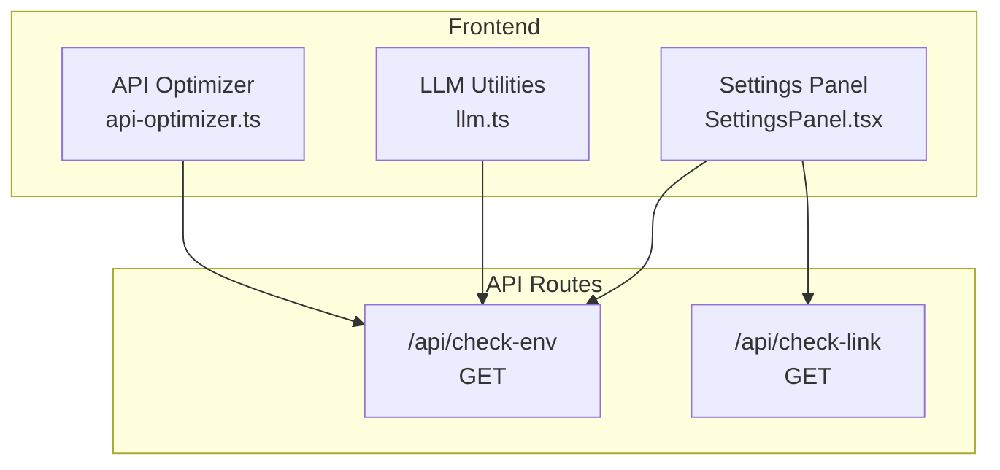
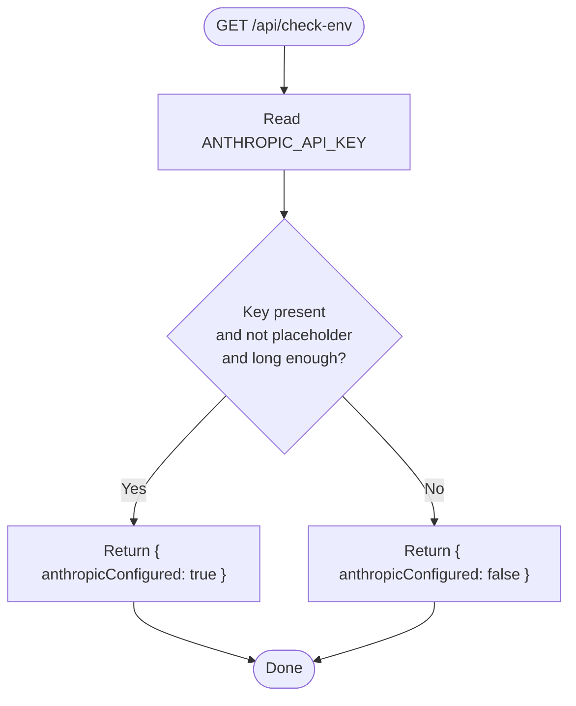
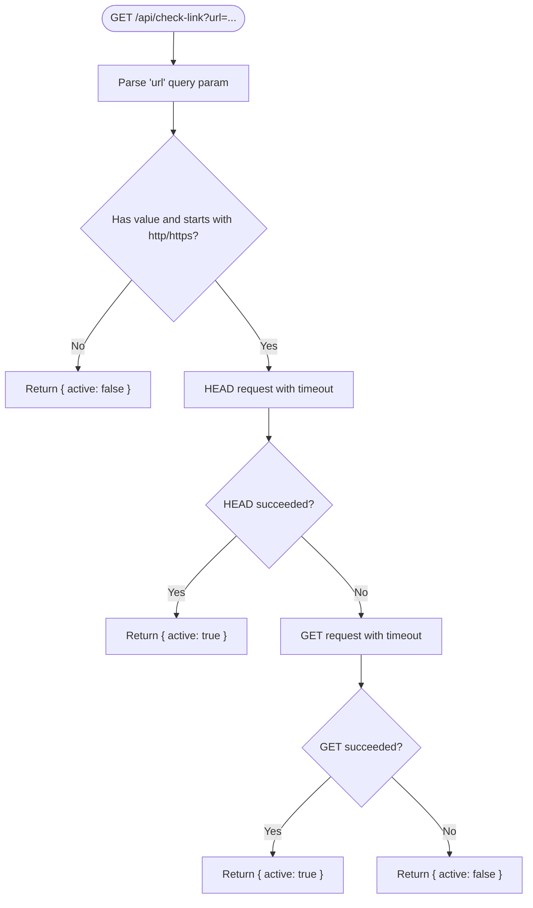
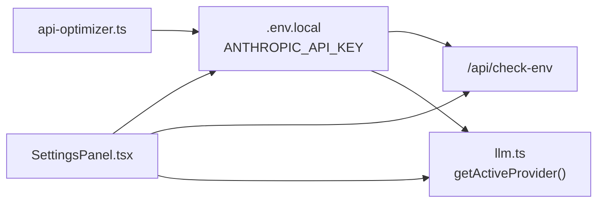

# API Endpoints

<cite>
**Referenced Files in This Document**
- [check-env route](file://src/app/api/check-env/route.ts)
- [check-link route](file://src/app/api/check-link/route.ts)
- [Settings panel](file://src/components/settings/SettingsPanel.tsx)
- [LLM utilities](file://src/lib/llm.ts)
- [API optimizer](file://src/lib/api-optimizer.ts)
- [Test script for link check](file://scripts/test-link-check.sh)
- [package.json](file://package.json)
- [README.md](file://README.md)
</cite>

## Table of Contents
1. [Introduction](#introduction)
2. [Project Structure](#project-structure)
3. [Core Components](#core-components)
4. [Architecture Overview](#architecture-overview)
5. [Detailed Component Analysis](#detailed-component-analysis)
6. [Dependency Analysis](#dependency-analysis)
7. [Performance Considerations](#performance-considerations)
8. [Troubleshooting Guide](#troubleshooting-guide)
9. [Conclusion](#conclusion)
10. [Appendices](#appendices)

## Introduction
This document provides API documentation for two endpoints in Core Brim Tech OS:
- Environment validation endpoint: /api/check-env
- Link checking service: /api/check-link

It specifies HTTP methods, URL patterns, request/response schemas, error handling, authentication, rate limiting, usage examples, common use cases, integration patterns, and troubleshooting guidance for API connectivity.

## Project Structure
The API endpoints are implemented as Next.js App Router API routes located under src/app/api. The environment configuration and AI provider selection are surfaced in the Settings panel and used by internal libraries.



**Diagram sources**
- [check-env route](file://src/app/api/check-env/route.ts#L1-L13)
- [check-link route](file://src/app/api/check-link/route.ts#L1-L43)
- [Settings panel](file://src/components/settings/SettingsPanel.tsx#L160-L359)
- [LLM utilities](file://src/lib/llm.ts#L1-L65)
- [API optimizer](file://src/lib/api-optimizer.ts#L236-L268)

**Section sources**
- [check-env route](file://src/app/api/check-env/route.ts#L1-L13)
- [check-link route](file://src/app/api/check-link/route.ts#L1-L43)
- [Settings panel](file://src/components/settings/SettingsPanel.tsx#L160-L359)
- [LLM utilities](file://src/lib/llm.ts#L1-L65)
- [API optimizer](file://src/lib/api-optimizer.ts#L236-L268)

## Core Components
- Environment validation endpoint (/api/check-env)
  - Method: GET
  - URL pattern: /api/check-env
  - Purpose: Reports whether the Anthropic API key is configured and valid in the current environment
  - Request: No body; reads environment variables
  - Response: JSON object indicating anthropicConfigured
  - Error handling: Returns a JSON object; errors are not explicitly handled beyond environment checks
  - Authentication: Not applicable
  - Rate limiting: Not implemented
  - Notes: Uses environment variable ANTHROPIC_API_KEY and validates it against known placeholders and length

- Link checking service (/api/check-link)
  - Method: GET
  - URL pattern: /api/check-link?url={URL}
  - Purpose: Verifies if a given URL is reachable and returns an active status
  - Request: Query parameter url (required)
  - Response: JSON object indicating active
  - Error handling: Returns active: false on invalid input or network errors
  - Authentication: Not applicable
  - Rate limiting: Not implemented
  - Notes: Performs HEAD request first, falls back to GET; applies timeout; follows redirects; sets a custom User-Agent header

**Section sources**
- [check-env route](file://src/app/api/check-env/route.ts#L1-L13)
- [check-link route](file://src/app/api/check-link/route.ts#L1-L43)

## Architecture Overview
The endpoints are Next.js API routes invoked via HTTP requests. They rely on environment variables and runtime conditions. The Settings panel displays environment status and allows users to configure keys locally or via .env.local.

```mermaid
sequenceDiagram
participant Client as "Client"
participant Next as "Next.js Runtime"
participant Env as "check-env route"
participant Link as "check-link route"
Client->>Next : "GET /api/check-env"
Next->>Env : "Invoke handler"
Env-->>Next : "{ anthropicConfigured : boolean }"
Next-->>Client : "JSON response"
Client->>Next : "GET /api/check-link?url=..."
Next->>Link : "Invoke handler"
Link-->>Next : "{ active : boolean }"
Next-->>Client : "JSON response"
```

**Diagram sources**
- [check-env route](file://src/app/api/check-env/route.ts#L1-L13)
- [check-link route](file://src/app/api/check-link/route.ts#L1-L43)

## Detailed Component Analysis

### Environment Validation Endpoint (/api/check-env)
- HTTP method: GET
- URL pattern: /api/check-env
- Request
  - Headers: None required
  - Query parameters: None
  - Body: None
- Response
  - Content-Type: application/json
  - Schema:
    - anthropicConfigured: boolean
- Behavior
  - Reads ANTHROPIC_API_KEY from the environment
  - Considers configuration valid if the key exists, is not a placeholder value, and exceeds a minimum length threshold
- Error handling
  - No explicit error response is returned; invalid configuration yields anthropicConfigured: false
- Authentication
  - Not applicable
- Rate limiting
  - Not implemented
- Usage examples
  - curl -s http://localhost:3000/api/check-env
  - JavaScript fetch: fetch("/api/check-env").then(r => r.json())
- Integration patterns
  - Call during startup to verify AI service readiness
  - Poll periodically to monitor configuration health
- Client implementation notes
  - Ensure the environment variable is present and not a placeholder
  - Treat anthropicConfigured: false as a configuration issue requiring user action



**Diagram sources**
- [check-env route](file://src/app/api/check-env/route.ts#L5-L12)

**Section sources**
- [check-env route](file://src/app/api/check-env/route.ts#L1-L13)

### Link Checking Service (/api/check-link)
- HTTP method: GET
- URL pattern: /api/check-link?url={URL}
- Request
  - Headers: None required
  - Query parameters:
    - url: string (required; must start with http:// or https://)
  - Body: None
- Response
  - Content-Type: application/json
  - Schema:
    - active: boolean
- Behavior
  - Validates presence and scheme of url
  - Attempts HEAD request with timeout and redirect following
  - Falls back to GET if HEAD fails
  - Sets a custom User-Agent header
- Error handling
  - Returns active: false for invalid input or on any network error
- Authentication
  - Not applicable
- Rate limiting
  - Not implemented
- Usage examples
  - curl -s "http://localhost:3000/api/check-link?url=https%3A%2F%2Fwww.google.com"
  - curl -s "http://localhost:3000/api/check-link?url=not-a-url"
- Integration patterns
  - Monitor external links in dashboards
  - Periodic checks for uptime and availability
- Client implementation notes
  - URL must be properly percent-encoded when passed as a query parameter
  - Respect timeouts and avoid excessive polling to prevent load



**Diagram sources**
- [check-link route](file://src/app/api/check-link/route.ts#L7-L42)

**Section sources**
- [check-link route](file://src/app/api/check-link/route.ts#L1-L43)
- [test-link-check.sh](file://scripts/test-link-check.sh#L1-L12)

## Dependency Analysis
- Environment variables
  - ANTHROPIC_API_KEY is used by the environment validation endpoint and by frontend utilities for AI provider selection
- Frontend integration
  - Settings panel displays environment status and allows saving keys in browser storage
  - LLM utilities resolve active provider and key from localStorage or environment
- External integrations
  - API optimizer makes authenticated calls to Anthropic; environment variables are used for configuration elsewhere in the project



**Diagram sources**
- [check-env route](file://src/app/api/check-env/route.ts#L6-L9)
- [Settings panel](file://src/components/settings/SettingsPanel.tsx#L160-L359)
- [LLM utilities](file://src/lib/llm.ts#L36-L46)
- [API optimizer](file://src/lib/api-optimizer.ts#L236-L244)

**Section sources**
- [check-env route](file://src/app/api/check-env/route.ts#L6-L9)
- [Settings panel](file://src/components/settings/SettingsPanel.tsx#L160-L359)
- [LLM utilities](file://src/lib/llm.ts#L36-L46)
- [API optimizer](file://src/lib/api-optimizer.ts#L236-L244)

## Performance Considerations
- Timeout behavior
  - Link checker applies a fixed timeout for both HEAD and GET attempts
- Network efficiency
  - Prefer HEAD requests when possible; fallback to GET only when necessary
- Scalability
  - No built-in rate limiting; avoid high-frequency polling to prevent unnecessary load

[No sources needed since this section provides general guidance]

## Troubleshooting Guide
- Environment validation returns false
  - Verify ANTHROPIC_API_KEY is set in .env.local and not equal to placeholder values
  - Restart the development server after editing .env.local
  - Confirm the key meets length requirements
- Link check returns active: false
  - Ensure the url query parameter is present and starts with http:// or https://
  - Confirm the URL is reachable from the host running the API
  - Check network connectivity and firewall rules
  - Use the included test script to validate behavior locally
- Testing locally
  - Use the provided shell script to exercise the link checker with a live URL and an invalid input

**Section sources**
- [Settings panel](file://src/components/settings/SettingsPanel.tsx#L160-L176)
- [check-env route](file://src/app/api/check-env/route.ts#L6-L9)
- [check-link route](file://src/app/api/check-link/route.ts#L9-L11)
- [test-link-check.sh](file://scripts/test-link-check.sh#L1-L12)

## Conclusion
The /api/check-env and /api/check-link endpoints provide lightweight mechanisms for validating AI service configuration and monitoring external link availability. They are designed for simplicity and ease of integration, with straightforward request/response patterns and minimal operational overhead.

[No sources needed since this section summarizes without analyzing specific files]

## Appendices

### API Definitions

- Environment Validation Endpoint
  - Method: GET
  - Path: /api/check-env
  - Query parameters: None
  - Request body: None
  - Response: JSON object with anthropicConfigured (boolean)
  - Example request: curl -s http://localhost:3000/api/check-env
  - Example response: {"anthropicConfigured":true}

- Link Checking Endpoint
  - Method: GET
  - Path: /api/check-link
  - Query parameters:
    - url: string (required; must be a valid http/https URL)
  - Request body: None
  - Response: JSON object with active (boolean)
  - Example request: curl -s "http://localhost:3000/api/check-link?url=https%3A%2F%2Fwww.google.com"
  - Example response: {"active":true}

**Section sources**
- [check-env route](file://src/app/api/check-env/route.ts#L1-L13)
- [check-link route](file://src/app/api/check-link/route.ts#L1-L43)

### Authentication and Rate Limiting
- Authentication: Not applicable
- Rate limiting: Not implemented

**Section sources**
- [check-env route](file://src/app/api/check-env/route.ts#L1-L13)
- [check-link route](file://src/app/api/check-link/route.ts#L1-L43)

### Client Implementation Examples
- Using curl
  - Environment validation: curl -s http://localhost:3000/api/check-env
  - Link check: curl -s "http://localhost:3000/api/check-link?url=https%3A%2F%2Fwww.google.com"
- Using JavaScript fetch
  - Environment validation: fetch("/api/check-env").then(r => r.json())
  - Link check: fetch("/api/check-link?url=" + encodeURIComponent(url)).then(r => r.json())

**Section sources**
- [test-link-check.sh](file://scripts/test-link-check.sh#L1-L12)
- [check-env route](file://src/app/api/check-env/route.ts#L1-L13)
- [check-link route](file://src/app/api/check-link/route.ts#L1-L43)

### Best Practices
- Environment configuration
  - Store sensitive keys in .env.local and restart the development server after changes
  - Avoid exposing placeholder values in production
- Link checking
  - Encode URLs properly when passing as query parameters
  - Apply client-side throttling to avoid frequent checks
  - Use HEAD requests when feasible; rely on GET as a fallback

**Section sources**
- [Settings panel](file://src/components/settings/SettingsPanel.tsx#L160-L176)
- [check-link route](file://src/app/api/check-link/route.ts#L5-L5)