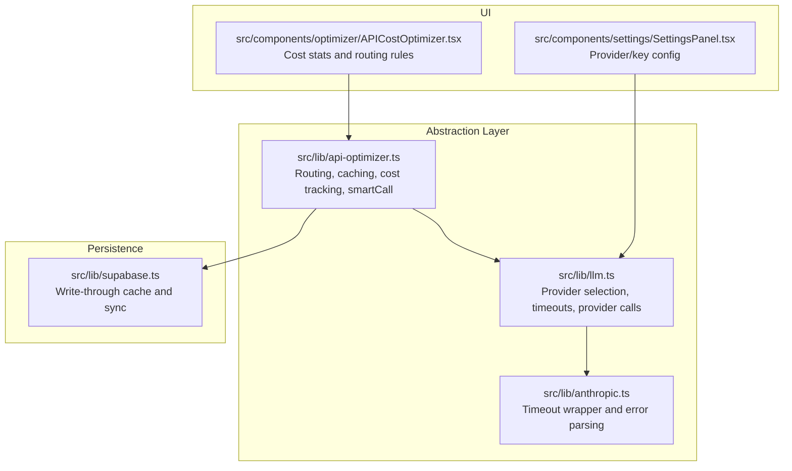
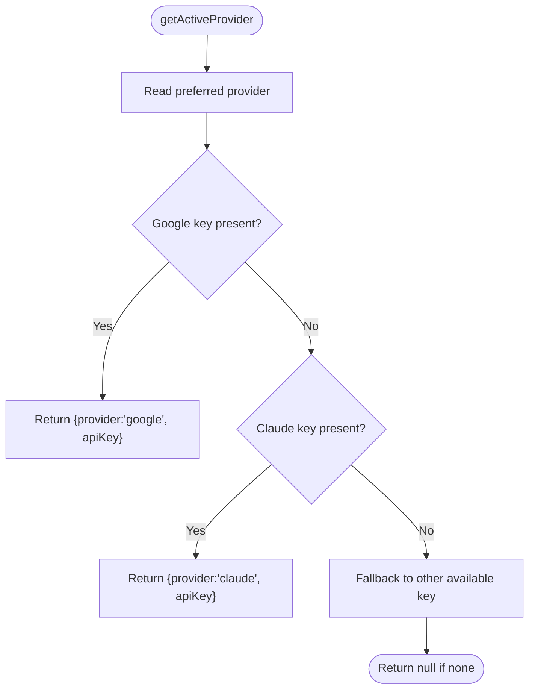
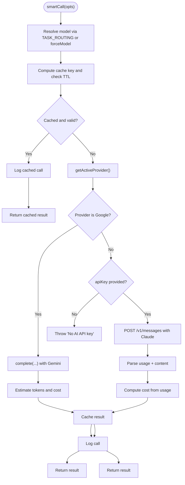
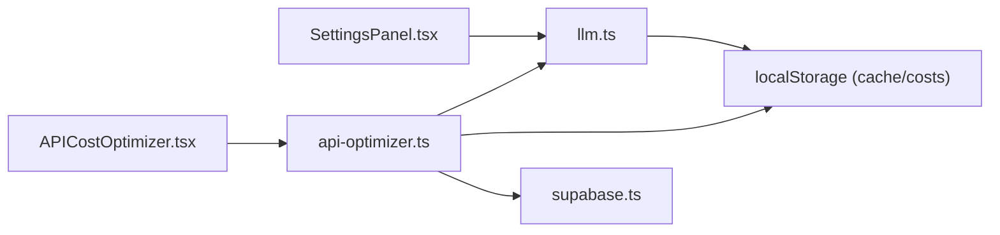

# AI Provider Abstraction

<cite>
**Referenced Files in This Document**
- [src/lib/llm.ts](file://src/lib/llm.ts)
- [src/lib/api-optimizer.ts](file://src/lib/api-optimizer.ts)
- [src/lib/anthropic.ts](file://src/lib/anthropic.ts)
- [src/components/optimizer/APICostOptimizer.tsx](file://src/components/optimizer/APICostOptimizer.tsx)
- [src/components/settings/SettingsPanel.tsx](file://src/components/settings/SettingsPanel.tsx)
- [src/lib/supabase.ts](file://src/lib/supabase.ts)
</cite>

## Table of Contents
1. [Introduction](#introduction)
2. [Project Structure](#project-structure)
3. [Core Components](#core-components)
4. [Architecture Overview](#architecture-overview)
5. [Detailed Component Analysis](#detailed-component-analysis)
6. [Dependency Analysis](#dependency-analysis)
7. [Performance Considerations](#performance-considerations)
8. [Troubleshooting Guide](#troubleshooting-guide)
9. [Conclusion](#conclusion)

## Introduction
This document explains the AI provider abstraction for Core Brim Tech OS, focusing on a unified Large Language Model (LLM) interface that supports multiple providers (Anthropic Claude and Google Gemini). It covers provider switching, API cost optimization, caching, error handling, and performance monitoring. The abstraction enables Skills and other modules to remain provider-agnostic while leveraging the most cost-effective model per task.

## Project Structure
The AI provider abstraction spans three primary areas:
- Unified LLM interface for provider selection and invocation
- API cost optimizer with model routing, caching, and cost tracking
- UI surfaces for configuration and cost monitoring



**Diagram sources**
- [src/lib/llm.ts](file://src/lib/llm.ts#L1-L135)
- [src/lib/api-optimizer.ts](file://src/lib/api-optimizer.ts#L1-L290)
- [src/lib/anthropic.ts](file://src/lib/anthropic.ts#L1-L32)
- [src/components/settings/SettingsPanel.tsx](file://src/components/settings/SettingsPanel.tsx#L1-L389)
- [src/components/optimizer/APICostOptimizer.tsx](file://src/components/optimizer/APICostOptimizer.tsx#L1-L235)
- [src/lib/supabase.ts](file://src/lib/supabase.ts#L1-L292)

**Section sources**
- [src/lib/llm.ts](file://src/lib/llm.ts#L1-L135)
- [src/lib/api-optimizer.ts](file://src/lib/api-optimizer.ts#L1-L290)
- [src/lib/anthropic.ts](file://src/lib/anthropic.ts#L1-L32)
- [src/components/settings/SettingsPanel.tsx](file://src/components/settings/SettingsPanel.tsx#L1-L389)
- [src/components/optimizer/APICostOptimizer.tsx](file://src/components/optimizer/APICostOptimizer.tsx#L1-L235)
- [src/lib/supabase.ts](file://src/lib/supabase.ts#L1-L292)

## Core Components
- Unified LLM interface: resolves preferred provider, validates keys, and executes completions with timeouts.
- API cost optimizer: routes tasks to the cheapest suitable model, caches results, tracks costs, and logs usage.
- Provider helpers: shared timeout and error handling utilities for Anthropic.
- Settings panel: allows selecting preferred provider and storing keys locally.
- Cost monitor UI: displays usage statistics, routing rules, and recent calls.

**Section sources**
- [src/lib/llm.ts](file://src/lib/llm.ts#L1-L135)
- [src/lib/api-optimizer.ts](file://src/lib/api-optimizer.ts#L1-L290)
- [src/lib/anthropic.ts](file://src/lib/anthropic.ts#L1-L32)
- [src/components/settings/SettingsPanel.tsx](file://src/components/settings/SettingsPanel.tsx#L1-L389)
- [src/components/optimizer/APICostOptimizer.tsx](file://src/components/optimizer/APICostOptimizer.tsx#L1-L235)

## Architecture Overview
The abstraction separates concerns:
- Provider selection and invocation live in the LLM module.
- Cost optimization and routing live in the API optimizer module.
- UI components configure providers and display cost insights.
- Persistence and sync are handled by the Supabase module.

```mermaid
sequenceDiagram
participant UI as "Settings Panel"
participant LLM as "llm.ts"
participant OPT as "api-optimizer.ts"
participant CLAUDE as "Anthropic API"
participant GEMINI as "Google Gemini API"
UI->>LLM : setPreferredProvider()/getActiveProvider()
UI->>OPT : smartCall({task,prompt,...})
OPT->>LLM : getActiveProvider()
alt Preferred provider is Google and key present
OPT->>LLM : complete({prompt,systemPrompt,maxTokens})
LLM->>GEMINI : POST /generateContent
GEMINI-->>LLM : response
LLM-->>OPT : text
OPT->>OPT : compute cost, cache, log
else Claude path
OPT->>CLAUDE : POST /v1/messages
CLAUDE-->>OPT : response (usage + content)
OPT->>OPT : compute cost, cache, log
end
OPT-->>UI : result
```

**Diagram sources**
- [src/lib/llm.ts](file://src/lib/llm.ts#L35-L134)
- [src/lib/api-optimizer.ts](file://src/lib/api-optimizer.ts#L180-L266)
- [src/components/settings/SettingsPanel.tsx](file://src/components/settings/SettingsPanel.tsx#L123-L126)

## Detailed Component Analysis

### Unified LLM Interface
The LLM module centralizes provider selection and invocation:
- Stores provider preference and API keys in localStorage.
- Resolves active provider preferring user’s preferred choice if a key is available.
- Executes completions with timeouts and robust error handling.
- Supports both Claude and Gemini invocation paths.



**Diagram sources**
- [src/lib/llm.ts](file://src/lib/llm.ts#L35-L46)

Key behaviors:
- Provider preference is stored under a dedicated key and defaults to Claude when unset.
- Timeout is enforced via AbortController for both Claude and Gemini calls.
- Errors surface meaningful messages parsed from provider responses.

**Section sources**
- [src/lib/llm.ts](file://src/lib/llm.ts#L6-L46)
- [src/lib/llm.ts](file://src/lib/llm.ts#L55-L134)

### API Cost Optimizer
The optimizer provides:
- Model routing rules mapping tasks to cost-effective models.
- Aggressive caching with TTL and eviction.
- Cost tracking and statistics aggregation.
- Smart call orchestration integrating provider selection and logging.



**Diagram sources**
- [src/lib/api-optimizer.ts](file://src/lib/api-optimizer.ts#L180-L266)

Implementation highlights:
- Pricing tiers and model IDs are defined centrally for accurate cost computation.
- Cache keys incorporate task type and prompt prefix to avoid collisions.
- Cost logs include model, input/output token counts, and timestamps for analytics.

**Section sources**
- [src/lib/api-optimizer.ts](file://src/lib/api-optimizer.ts#L5-L33)
- [src/lib/api-optimizer.ts](file://src/lib/api-optimizer.ts#L39-L74)
- [src/lib/api-optimizer.ts](file://src/lib/api-optimizer.ts#L76-L128)
- [src/lib/api-optimizer.ts](file://src/lib/api-optimizer.ts#L130-L176)
- [src/lib/api-optimizer.ts](file://src/lib/api-optimizer.ts#L180-L266)

### Provider-Specific Helpers
Shared utilities for Anthropic:
- Timeout-wrapped fetch with AbortController and standardized error parsing.
- Consistent error messaging for UI consumption.

**Section sources**
- [src/lib/anthropic.ts](file://src/lib/anthropic.ts#L6-L31)

### Settings and Provider Selection
The Settings panel:
- Allows toggling preferred provider between Claude and Google.
- Stores keys in localStorage for immediate use.
- Reflects active provider and preferred provider in the UI.

**Section sources**
- [src/components/settings/SettingsPanel.tsx](file://src/components/settings/SettingsPanel.tsx#L72-L126)
- [src/lib/llm.ts](file://src/lib/llm.ts#L24-L33)

### Cost Monitoring UI
The API Cost Optimizer component:
- Displays total cost, saved-by-cache, cache rate, and total calls.
- Shows usage breakdown by model tier.
- Presents routing rules and pricing reference.
- Lists recent API calls with timestamps and costs.

**Section sources**
- [src/components/optimizer/APICostOptimizer.tsx](file://src/components/optimizer/APICostOptimizer.tsx#L8-L235)

## Dependency Analysis
The modules interact as follows:
- Settings depends on LLM to read/write provider preference and keys.
- API optimizer depends on LLM for provider selection and on localStorage for caching/cost logs.
- UI components depend on optimizer for stats and on LLM for active provider info.
- Supabase provides write-through persistence for data and integrates with the optimizer’s logging.



**Diagram sources**
- [src/components/settings/SettingsPanel.tsx](file://src/components/settings/SettingsPanel.tsx#L14-L16)
- [src/lib/llm.ts](file://src/lib/llm.ts#L35-L46)
- [src/lib/api-optimizer.ts](file://src/lib/api-optimizer.ts#L180-L266)
- [src/components/optimizer/APICostOptimizer.tsx](file://src/components/optimizer/APICostOptimizer.tsx#L5-L6)
- [src/lib/supabase.ts](file://src/lib/supabase.ts#L57-L81)

**Section sources**
- [src/components/settings/SettingsPanel.tsx](file://src/components/settings/SettingsPanel.tsx#L14-L16)
- [src/lib/llm.ts](file://src/lib/llm.ts#L35-L46)
- [src/lib/api-optimizer.ts](file://src/lib/api-optimizer.ts#L180-L266)
- [src/components/optimizer/APICostOptimizer.tsx](file://src/components/optimizer/APICostOptimizer.tsx#L5-L6)
- [src/lib/supabase.ts](file://src/lib/supabase.ts#L57-L81)

## Performance Considerations
- Caching: 24-hour TTL and eviction of oldest entries prevent unbounded growth; cache keys include task type to avoid collisions.
- Token estimation: Uses character-length heuristics for Gemini cost calculation; Claude responses include precise usage for accurate accounting.
- Timeouts: Both Claude and Gemini calls enforce 120-second limits to avoid hanging requests.
- Routing: Task-to-model rules minimize expensive model usage while preserving quality.

[No sources needed since this section provides general guidance]

## Troubleshooting Guide
Common issues and resolutions:
- No API key configured: The LLM interface throws a clear error when neither Claude nor Google keys are present. Configure keys in Settings and select a preferred provider.
- Request timeouts: Timeouts are enforced via AbortController. Retry with shorter prompts or simpler requests.
- Invalid provider response: Errors are parsed from provider responses and surfaced to callers; inspect recent calls in the cost monitor for details.
- Cache misses: Verify cache keys and TTL; ensure the same task and prompt combination are used consistently.

**Section sources**
- [src/lib/llm.ts](file://src/lib/llm.ts#L128-L134)
- [src/lib/llm.ts](file://src/lib/llm.ts#L76-L87)
- [src/lib/llm.ts](file://src/lib/llm.ts#L110-L121)
- [src/lib/api-optimizer.ts](file://src/lib/api-optimizer.ts#L194-L202)
- [src/components/optimizer/APICostOptimizer.tsx](file://src/components/optimizer/APICostOptimizer.tsx#L199-L229)

## Conclusion
The AI provider abstraction cleanly separates provider selection, invocation, and optimization concerns. By combining intelligent routing, aggressive caching, and transparent cost tracking, the system reduces API expenses while maintaining quality. The Settings panel and cost monitor provide practical controls and observability, enabling efficient operation across Claude and Gemini.