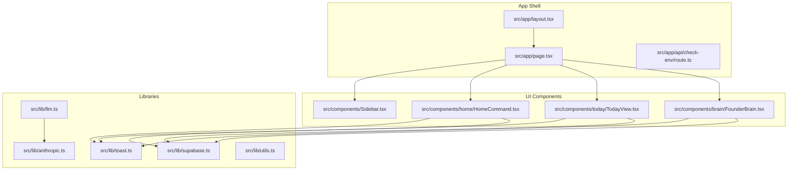
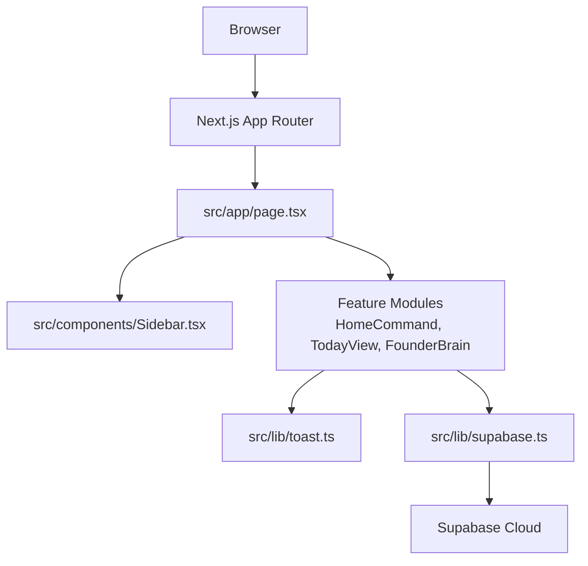
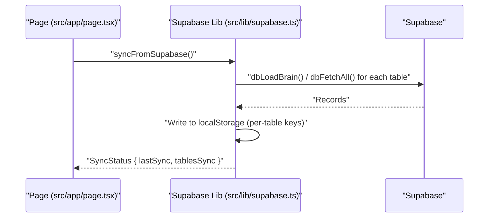
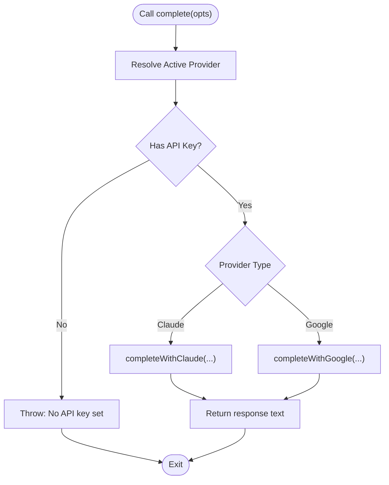
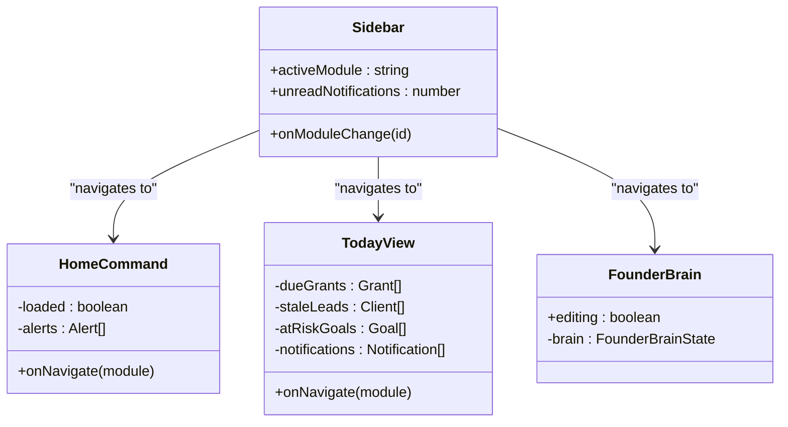
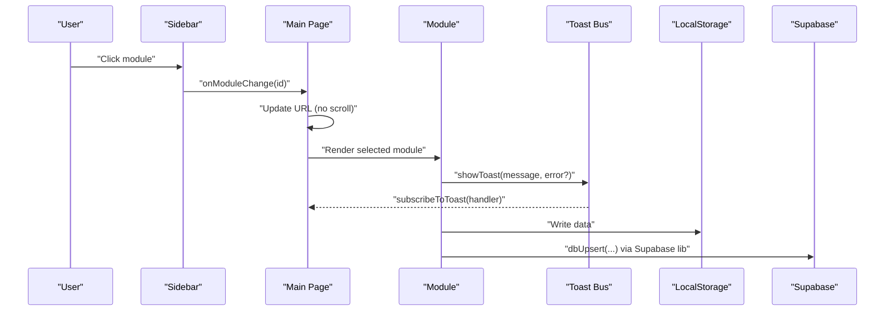
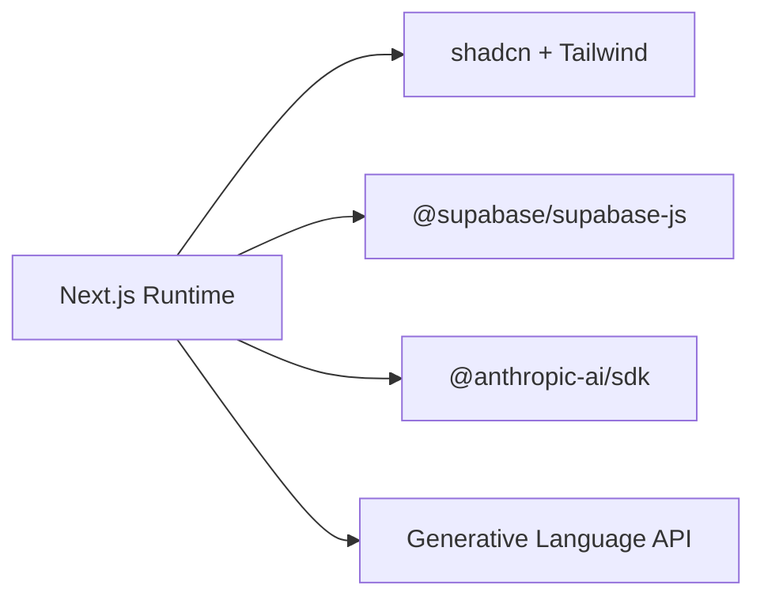

# Architecture Overview

<cite>
**Referenced Files in This Document**
- [README.md](file://README.md)
- [package.json](file://package.json)
- [next.config.ts](file://next.config.ts)
- [src/app/layout.tsx](file://src/app/layout.tsx)
- [src/app/page.tsx](file://src/app/page.tsx)
- [src/app/api/check-env/route.ts](file://src/app/api/check-env/route.ts)
- [src/components/Sidebar.tsx](file://src/components/Sidebar.tsx)
- [src/components/brain/FounderBrain.tsx](file://src/components/brain/FounderBrain.tsx)
- [src/components/home/HomeCommand.tsx](file://src/components/home/HomeCommand.tsx)
- [src/components/today/TodayView.tsx](file://src/components/today/TodayView.tsx)
- [src/lib/supabase.ts](file://src/lib/supabase.ts)
- [src/lib/llm.ts](file://src/lib/llm.ts)
- [src/lib/anthropic.ts](file://src/lib/anthropic.ts)
- [src/lib/toast.ts](file://src/lib/toast.ts)
- [src/lib/utils.ts](file://src/lib/utils.ts)
</cite>

## Table of Contents
1. [Introduction](#introduction)
2. [Project Structure](#project-structure)
3. [Core Components](#core-components)
4. [Architecture Overview](#architecture-overview)
5. [Detailed Component Analysis](#detailed-component-analysis)
6. [Dependency Analysis](#dependency-analysis)
7. [Performance Considerations](#performance-considerations)
8. [Troubleshooting Guide](#troubleshooting-guide)
9. [Conclusion](#conclusion)
10. [Appendices](#appendices)

## Introduction
This document describes the architecture of Core Brim Tech OS, a Next.js App Router–based internal operating system. It combines a component-driven UI with a dual persistence strategy (localStorage and Supabase) to enable offline-first operation and real-time synchronization. The system abstracts AI providers behind a unified LLM layer supporting multiple LLM providers (Claude and Gemini). The modular component architecture isolates features, manages state locally, and coordinates cross-component communication via shared libraries and global events. The document also covers system boundaries, data flows, integration points, scalability, security, and deployment topology.

## Project Structure
Core Brim Tech OS follows a Next.js App Router project layout with a clear separation of concerns:
- Application shell and routing: src/app/*
- Feature components: src/components/*
- Cross-cutting libraries: src/lib/*
- Public assets: public/*
- Configuration: next.config.ts, package.json, tsconfig.json, components.json

**Diagram sources**
- [src/app/layout.tsx](file://src/app/layout.tsx#L1-L22)
- [src/app/page.tsx](file://src/app/page.tsx#L1-L253)
- [src/app/api/check-env/route.ts](file://src/app/api/check-env/route.ts#L1-L13)
- [src/components/Sidebar.tsx](file://src/components/Sidebar.tsx#L1-L170)
- [src/components/home/HomeCommand.tsx](file://src/components/home/HomeCommand.tsx#L1-L281)
- [src/components/today/TodayView.tsx](file://src/components/today/TodayView.tsx#L1-L191)
- [src/components/brain/FounderBrain.tsx](file://src/components/brain/FounderBrain.tsx#L1-L774)
- [src/lib/supabase.ts](file://src/lib/supabase.ts#L1-L292)
- [src/lib/llm.ts](file://src/lib/llm.ts#L1-L135)
- [src/lib/anthropic.ts](file://src/lib/anthropic.ts#L1-L32)
- [src/lib/toast.ts](file://src/lib/toast.ts#L1-L18)
- [src/lib/utils.ts](file://src/lib/utils.ts#L1-L7)

**Section sources**
- [README.md](file://README.md#L1-L37)
- [package.json](file://package.json#L1-L36)
- [next.config.ts](file://next.config.ts#L1-L8)

## Core Components
- App shell and routing: Defines the root layout and the main page that orchestrates module selection and synchronization.
- Sidebar navigation: Provides module navigation and highlights unread notifications.
- Feature modules: Home command dashboard, Today’s focus view, and Founder Brain module.
- Persistence layer: Supabase client and database abstraction with localStorage write-through.
- AI provider abstraction: Unified LLM interface supporting Claude and Gemini.
- Utilities: Toast notification bus and Tailwind class merging helper.

Key responsibilities:
- Routing and module rendering are centralized in the main page.
- Sidebar communicates module changes to the main page.
- Feature components read/write local state and delegate persistence to the Supabase library.
- The LLM library resolves provider and key dynamically from settings and executes completions.
- Toast library enables decoupled messaging across components.

**Section sources**
- [src/app/layout.tsx](file://src/app/layout.tsx#L1-L22)
- [src/app/page.tsx](file://src/app/page.tsx#L1-L253)
- [src/components/Sidebar.tsx](file://src/components/Sidebar.tsx#L1-L170)
- [src/components/home/HomeCommand.tsx](file://src/components/home/HomeCommand.tsx#L1-L281)
- [src/components/today/TodayView.tsx](file://src/components/today/TodayView.tsx#L1-L191)
- [src/components/brain/FounderBrain.tsx](file://src/components/brain/FounderBrain.tsx#L1-L774)
- [src/lib/supabase.ts](file://src/lib/supabase.ts#L1-L292)
- [src/lib/llm.ts](file://src/lib/llm.ts#L1-L135)
- [src/lib/toast.ts](file://src/lib/toast.ts#L1-L18)

## Architecture Overview
The system is built around the Next.js App Router with a client-side rendered page that:
- Initializes and runs a one-time sync from Supabase to localStorage on load.
- Renders a sidebar and a selected module view.
- Uses a toast bus for global notifications.
- Delegates persistence to Supabase while maintaining offline-first behavior via localStorage.

**Diagram sources**
- [src/app/page.tsx](file://src/app/page.tsx#L1-L253)
- [src/components/Sidebar.tsx](file://src/components/Sidebar.tsx#L1-L170)
- [src/components/home/HomeCommand.tsx](file://src/components/home/HomeCommand.tsx#L1-L281)
- [src/components/today/TodayView.tsx](file://src/components/today/TodayView.tsx#L1-L191)
- [src/components/brain/FounderBrain.tsx](file://src/components/brain/FounderBrain.tsx#L1-L774)
- [src/lib/toast.ts](file://src/lib/toast.ts#L1-L18)
- [src/lib/supabase.ts](file://src/lib/supabase.ts#L1-L292)

## Detailed Component Analysis

### Dual Persistence Strategy: localStorage + Supabase
The Supabase library provides a write-through abstraction:
- On app load, data is pulled from Supabase and written to localStorage for offline-first access.
- Local writes are persisted to Supabase via upsert operations.
- A sync status mechanism tracks last sync time, ongoing sync, and errors.

**Diagram sources**
- [src/app/page.tsx](file://src/app/page.tsx#L147-L160)
- [src/lib/supabase.ts](file://src/lib/supabase.ts#L209-L246)

Key behaviors:
- Graceful degradation: if Supabase is not configured, operations are no-ops.
- Write-through pattern: all writes go to localStorage immediately and to Supabase asynchronously.
- Batched upserts for large datasets.

**Section sources**
- [src/lib/supabase.ts](file://src/lib/supabase.ts#L1-L292)
- [src/app/page.tsx](file://src/app/page.tsx#L147-L160)

### AI Provider Abstraction Layer
The LLM layer supports multiple providers:
- Provider preference and keys are stored in localStorage.
- The active provider is resolved dynamically based on availability and preference.
- Claude and Gemini are supported via dedicated completion functions with timeouts.

**Diagram sources**
- [src/lib/llm.ts](file://src/lib/llm.ts#L35-L135)
- [src/lib/anthropic.ts](file://src/lib/anthropic.ts#L1-L32)

Provider-specific helpers:
- Timeout handling and error parsing for Anthropic requests.

**Section sources**
- [src/lib/llm.ts](file://src/lib/llm.ts#L1-L135)
- [src/lib/anthropic.ts](file://src/lib/anthropic.ts#L1-L32)

### Modular Component Architecture
Components are organized by feature and encapsulate their own state and UI:
- Sidebar: Navigation and notification count.
- HomeCommand: Dashboard with metrics, alerts, quick actions.
- TodayView: Daily focus list with actionable items.
- FounderBrain: Onboarding wizard and dashboard for company data.

**Diagram sources**
- [src/components/Sidebar.tsx](file://src/components/Sidebar.tsx#L100-L170)
- [src/components/home/HomeCommand.tsx](file://src/components/home/HomeCommand.tsx#L38-L281)
- [src/components/today/TodayView.tsx](file://src/components/today/TodayView.tsx#L18-L191)
- [src/components/brain/FounderBrain.tsx](file://src/components/brain/FounderBrain.tsx#L754-L774)

Cross-component communication patterns:
- Navigation via props from Sidebar to the main page, which updates URL state and renders the selected module.
- Toast bus for global notifications subscribed to by the main page and emitted by feature components.

**Section sources**
- [src/components/Sidebar.tsx](file://src/components/Sidebar.tsx#L1-L170)
- [src/components/home/HomeCommand.tsx](file://src/components/home/HomeCommand.tsx#L1-L281)
- [src/components/today/TodayView.tsx](file://src/components/today/TodayView.tsx#L1-L191)
- [src/components/brain/FounderBrain.tsx](file://src/components/brain/FounderBrain.tsx#L1-L774)
- [src/lib/toast.ts](file://src/lib/toast.ts#L1-L18)
- [src/app/page.tsx](file://src/app/page.tsx#L166-L177)

### Data Flow Patterns
- Initialization: The main page triggers a one-time sync from Supabase to localStorage on mount.
- Rendering: The main page selects and renders the active module based on URL query parameters.
- Notifications: The main page subscribes to toast events and displays transient messages.
- Persistence: Feature components update localStorage; the Supabase library persists to Supabase.

**Diagram sources**
- [src/app/page.tsx](file://src/app/page.tsx#L126-L143)
- [src/components/Sidebar.tsx](file://src/components/Sidebar.tsx#L134-L156)
- [src/lib/toast.ts](file://src/lib/toast.ts#L8-L17)
- [src/lib/supabase.ts](file://src/lib/supabase.ts#L57-L81)

## Dependency Analysis
External dependencies and integrations:
- Next.js runtime and App Router for routing and SSR/SSG capabilities.
- Supabase client for real-time and relational data storage.
- Anthropic SDK and Google Generative Language API for LLM inference.
- UI primitives via shadcn and Tailwind CSS.

**Diagram sources**
- [package.json](file://package.json#L11-L22)

Internal dependencies:
- Feature components depend on shared libraries for persistence and AI.
- Toast bus is consumed by all components for notifications.
- Utility functions consolidate Tailwind class merging.

**Section sources**
- [package.json](file://package.json#L1-L36)
- [src/lib/supabase.ts](file://src/lib/supabase.ts#L1-L292)
- [src/lib/llm.ts](file://src/lib/llm.ts#L1-L135)
- [src/lib/toast.ts](file://src/lib/toast.ts#L1-L18)
- [src/lib/utils.ts](file://src/lib/utils.ts#L1-L7)

## Performance Considerations
- Offline-first: localStorage provides immediate reads and reduces network latency.
- Batched writes: Supabase upserts are batched to reduce API overhead.
- Lazy initialization: Supabase client is created only when environment variables are present.
- Timeout controls: LLM requests enforce timeouts to prevent hanging calls.
- Minimal re-renders: Components manage local state efficiently and avoid unnecessary subscriptions.

[No sources needed since this section provides general guidance]

## Troubleshooting Guide
Common issues and remedies:
- Supabase not configured: The main page detects missing configuration and displays an offline status. Configure environment variables to enable cloud sync.
- Sync failures: The sync status captures errors; users can retry from the UI.
- LLM key missing: The LLM layer throws when no provider key is set; configure keys in settings and select a provider.
- Network timeouts: LLM calls abort after a fixed timeout; retry with simplified prompts or adjust provider settings.

**Section sources**
- [src/app/page.tsx](file://src/app/page.tsx#L41-L62)
- [src/lib/supabase.ts](file://src/lib/supabase.ts#L23-L26)
- [src/lib/llm.ts](file://src/lib/llm.ts#L128-L131)
- [src/lib/anthropic.ts](file://src/lib/anthropic.ts#L21-L25)

## Conclusion
Core Brim Tech OS leverages Next.js App Router for a clean, modular UI with a robust dual persistence strategy that ensures offline-first usability and seamless real-time synchronization. The AI provider abstraction layer allows flexible provider selection and resilient inference. The component architecture enforces feature isolation and decouples cross-component communication through shared libraries and a toast bus. With careful attention to timeouts, graceful degradation, and structured data flows, the system scales to complex internal workflows while remaining maintainable and secure.

[No sources needed since this section summarizes without analyzing specific files]

## Appendices

### System Boundaries and Integration Points
- Internal boundaries: Feature components, shared libraries, and the main page orchestration.
- External boundaries: Supabase for persistence, Anthropic/Gemini for AI inference.
- Integration points: Supabase client initialization, LLM provider resolution, and toast event bus.

**Section sources**
- [src/lib/supabase.ts](file://src/lib/supabase.ts#L11-L21)
- [src/lib/llm.ts](file://src/lib/llm.ts#L35-L46)
- [src/lib/toast.ts](file://src/lib/toast.ts#L6-L17)

### Security Patterns
- Environment-based configuration: Supabase and LLM keys are loaded from environment variables.
- Graceful fallback: When keys are missing, the system continues operating in offline mode.
- API key storage: Keys are stored in localStorage for convenience; treat as sensitive and rotate regularly.

**Section sources**
- [src/app/api/check-env/route.ts](file://src/app/api/check-env/route.ts#L5-L11)
- [src/lib/llm.ts](file://src/lib/llm.ts#L12-L22)

### Deployment Topology
- Frontend: Next.js static or server-rendered pages served via Vercel or compatible platform.
- Backend: Supabase handles relational data and authentication.
- AI providers: Direct HTTP calls to Anthropic and Google APIs.

**Section sources**
- [README.md](file://README.md#L32-L37)
- [package.json](file://package.json#L1-L36)