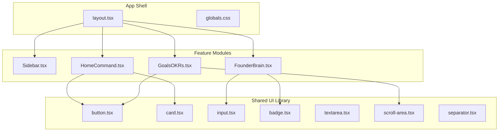
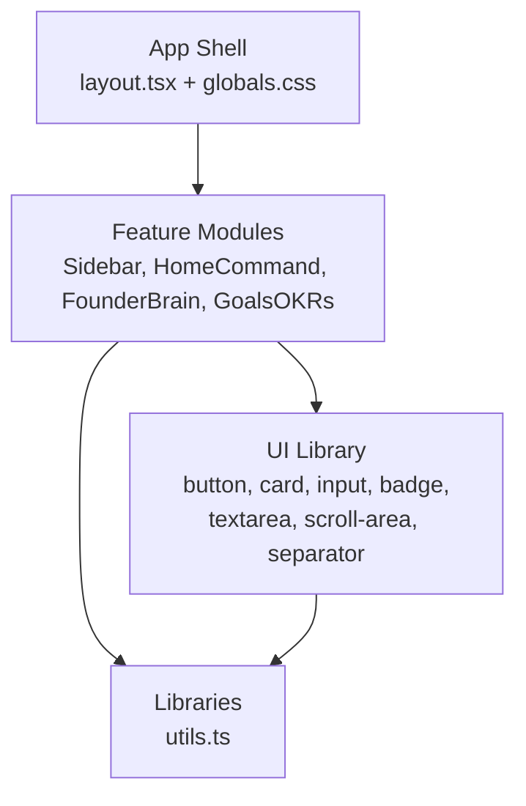
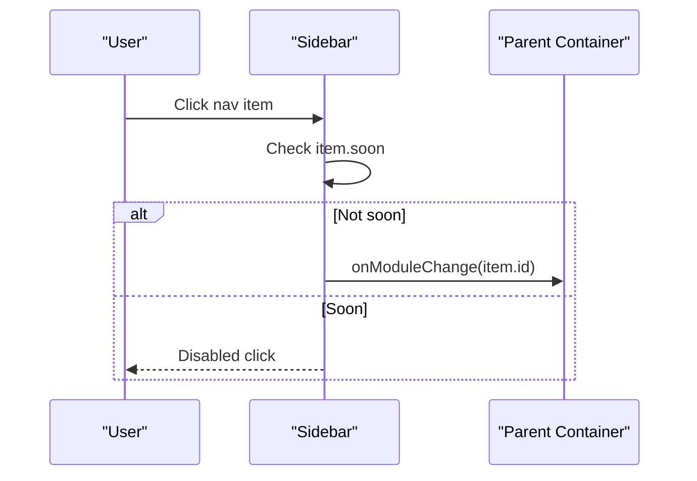
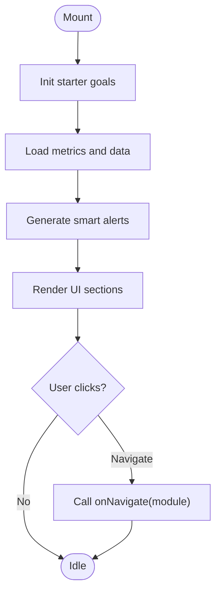
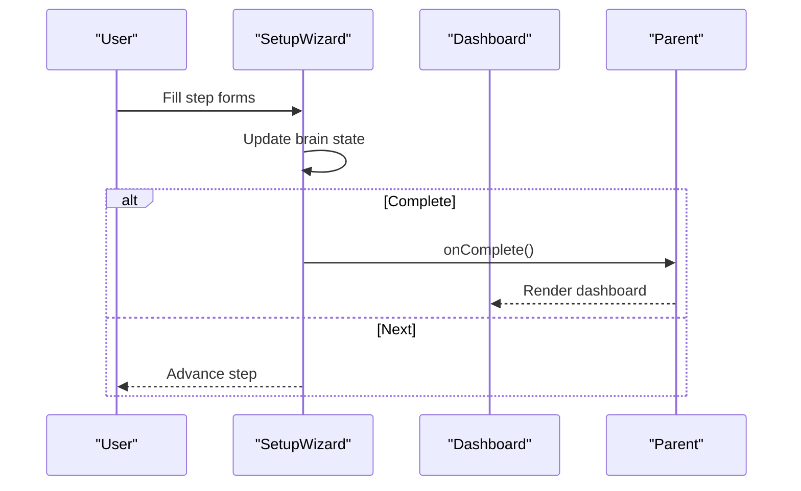
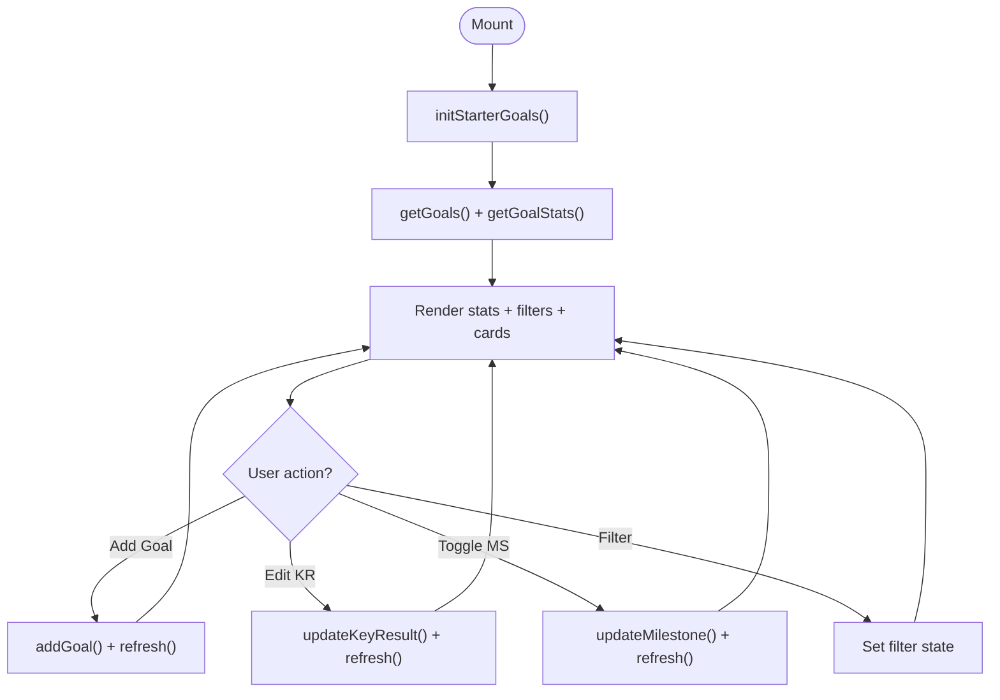
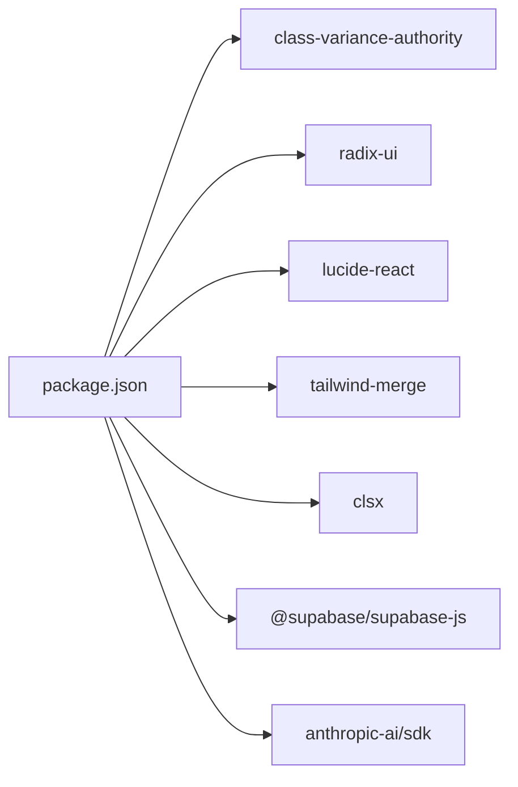

# Component Architecture Patterns

<cite>
**Referenced Files in This Document**
- [README.md](file://README.md)
- [package.json](file://package.json)
- [src/app/layout.tsx](file://src/app/layout.tsx)
- [src/app/globals.css](file://src/app/globals.css)
- [src/components/Sidebar.tsx](file://src/components/Sidebar.tsx)
- [src/components/ui/button.tsx](file://src/components/ui/button.tsx)
- [src/components/ui/card.tsx](file://src/components/ui/card.tsx)
- [src/components/ui/input.tsx](file://src/components/ui/input.tsx)
- [src/components/ui/badge.tsx](file://src/components/ui/badge.tsx)
- [src/components/ui/textarea.tsx](file://src/components/ui/textarea.tsx)
- [src/components/ui/scroll-area.tsx](file://src/components/ui/scroll-area.tsx)
- [src/components/ui/separator.tsx](file://src/components/ui/separator.tsx)
- [src/components/home/HomeCommand.tsx](file://src/components/home/HomeCommand.tsx)
- [src/components/brain/FounderBrain.tsx](file://src/components/brain/FounderBrain.tsx)
- [src/components/goals/GoalsOKRs.tsx](file://src/components/goals/GoalsOKRs.tsx)
- [src/lib/utils.ts](file://src/lib/utils.ts)
</cite>

## Table of Contents
1. [Introduction](#introduction)
2. [Project Structure](#project-structure)
3. [Core Components](#core-components)
4. [Architecture Overview](#architecture-overview)
5. [Detailed Component Analysis](#detailed-component-analysis)
6. [Dependency Analysis](#dependency-analysis)
7. [Performance Considerations](#performance-considerations)
8. [Troubleshooting Guide](#troubleshooting-guide)
9. [Conclusion](#conclusion)

## Introduction
This document describes the component architecture patterns of Core Brim Tech OS. It focuses on how components are composed, how shared UI patterns are implemented, and how modularity and feature isolation are achieved. It also covers prop interfaces, state management patterns, lifecycle management, event handling, cross-component communication, reusability, performance, and accessibility.

## Project Structure
The application follows a Next.js App Router structure with a clear separation between pages, shared UI components, feature modules, and libraries. The UI primitives live under a dedicated ui folder, while feature modules are grouped by domain (e.g., brain, goals, money). Utilities centralize Tailwind class merging and helper functions.

**Diagram sources**
- [src/app/layout.tsx](file://src/app/layout.tsx#L1-L22)
- [src/app/globals.css](file://src/app/globals.css#L1-L59)
- [src/components/ui/button.tsx](file://src/components/ui/button.tsx#L1-L65)
- [src/components/ui/card.tsx](file://src/components/ui/card.tsx#L1-L93)
- [src/components/ui/input.tsx](file://src/components/ui/input.tsx#L1-L22)
- [src/components/ui/badge.tsx](file://src/components/ui/badge.tsx#L1-L49)
- [src/components/ui/textarea.tsx](file://src/components/ui/textarea.tsx#L1-L19)
- [src/components/ui/scroll-area.tsx](file://src/components/ui/scroll-area.tsx#L1-L59)
- [src/components/ui/separator.tsx](file://src/components/ui/separator.tsx#L1-L29)
- [src/components/Sidebar.tsx](file://src/components/Sidebar.tsx#L1-L170)
- [src/components/home/HomeCommand.tsx](file://src/components/home/HomeCommand.tsx#L1-L281)
- [src/components/brain/FounderBrain.tsx](file://src/components/brain/FounderBrain.tsx#L1-L774)
- [src/components/goals/GoalsOKRs.tsx](file://src/components/goals/GoalsOKRs.tsx#L1-L416)

**Section sources**
- [README.md](file://README.md#L1-L37)
- [src/app/layout.tsx](file://src/app/layout.tsx#L1-L22)
- [src/app/globals.css](file://src/app/globals.css#L1-L59)

## Core Components
This section documents the shared UI components and their customization options, prop interfaces, and usage patterns.

- Button
  - Purpose: Unified action primitive with variant and size variants, optional child rendering via Slot, and accessibility attributes.
  - Props: className, variant, size, asChild, plus native button props.
  - Variants: default, destructive, outline, secondary, ghost, link.
  - Sizes: default, xs, sm, lg, icon, icon-xs, icon-sm, icon-lg.
  - Accessibility: Focus-visible ring, aria-invalid integration, pointer-events disabled state.
  - Usage pattern: Prefer asChild for semantic wrappers; apply data-slot and data-variant for testing/styling hooks.

- Card
  - Purpose: Composite container with header, title, description, action, content, and footer slots.
  - Props: className for each slot; supports arbitrary props passed to underlying divs.
  - Composition: Use CardHeader/CardTitle/CardDescription/CardAction/CardContent/CardFooter to assemble layouts.
  - Accessibility: No explicit ARIA roles; relies on semantic HTML structure.

- Input
  - Purpose: Styled text input with focus-visible ring, aria-invalid integration, and placeholder styling.
  - Props: className, type, plus native input props.
  - Accessibility: Focus-visible ring and selection styles; aria-invalid for invalid states.

- Badge
  - Purpose: Lightweight indicator or tag with variant customization and optional child rendering.
  - Props: className, variant, asChild, plus native span props.
  - Variants: default, secondary, destructive, outline, ghost, link.
  - Accessibility: Focus-visible ring and pointer-events disabled for icons.

- Textarea
  - Purpose: Styled textarea with focus-visible ring, aria-invalid integration, and placeholder styling.
  - Props: className, plus native textarea props.
  - Accessibility: Focus-visible ring and disabled state handling.

- ScrollArea
  - Purpose: Enhanced scrolling area with customizable scrollbar and corner.
  - Props: className, children, plus ScrollAreaPrimitive.Root props; ScrollBar accepts orientation.
  - Accessibility: Focus-visible ring on viewport; integrates with radix-ui semantics.

- Separator
  - Purpose: Decorative or structural divider with horizontal/vertical orientation.
  - Props: className, orientation, decorative, plus primitive props.
  - Accessibility: Uses primitive semantics; decorative flag controls screen-reader behavior.

**Section sources**
- [src/components/ui/button.tsx](file://src/components/ui/button.tsx#L1-L65)
- [src/components/ui/card.tsx](file://src/components/ui/card.tsx#L1-L93)
- [src/components/ui/input.tsx](file://src/components/ui/input.tsx#L1-L22)
- [src/components/ui/badge.tsx](file://src/components/ui/badge.tsx#L1-L49)
- [src/components/ui/textarea.tsx](file://src/components/ui/textarea.tsx#L1-L19)
- [src/components/ui/scroll-area.tsx](file://src/components/ui/scroll-area.tsx#L1-L59)
- [src/components/ui/separator.tsx](file://src/components/ui/separator.tsx#L1-L29)

## Architecture Overview
The system uses a layered architecture:
- App shell sets global theme and fonts.
- Shared UI library provides composable primitives with consistent variants and accessibility.
- Feature modules encapsulate domain logic and orchestrate shared UI components.
- Utilities provide cross-cutting concerns like class merging.

**Diagram sources**
- [src/app/layout.tsx](file://src/app/layout.tsx#L1-L22)
- [src/app/globals.css](file://src/app/globals.css#L1-L59)
- [src/components/ui/button.tsx](file://src/components/ui/button.tsx#L1-L65)
- [src/components/ui/card.tsx](file://src/components/ui/card.tsx#L1-L93)
- [src/components/ui/input.tsx](file://src/components/ui/input.tsx#L1-L22)
- [src/components/ui/badge.tsx](file://src/components/ui/badge.tsx#L1-L49)
- [src/components/ui/textarea.tsx](file://src/components/ui/textarea.tsx#L1-L19)
- [src/components/ui/scroll-area.tsx](file://src/components/ui/scroll-area.tsx#L1-L59)
- [src/components/ui/separator.tsx](file://src/components/ui/separator.tsx#L1-L29)
- [src/components/Sidebar.tsx](file://src/components/Sidebar.tsx#L1-L170)
- [src/components/home/HomeCommand.tsx](file://src/components/home/HomeCommand.tsx#L1-L281)
- [src/components/brain/FounderBrain.tsx](file://src/components/brain/FounderBrain.tsx#L1-L774)
- [src/components/goals/GoalsOKRs.tsx](file://src/components/goals/GoalsOKRs.tsx#L1-L416)
- [src/lib/utils.ts](file://src/lib/utils.ts#L1-L7)

## Detailed Component Analysis

### Sidebar Component
- Composition: Renders navigation sections with icons, labels, and optional badges/labels.
- Props: activeModule, onModuleChange, unreadNotifications.
- Event handling: onClick triggers onModuleChange; disabled states for “soon” items.
- Cross-component communication: Notifies parent about module changes; displays notification count.
- Accessibility: Uses semantic buttons; disabled state prevents interaction.

**Diagram sources**
- [src/components/Sidebar.tsx](file://src/components/Sidebar.tsx#L106-L170)

**Section sources**
- [src/components/Sidebar.tsx](file://src/components/Sidebar.tsx#L1-L170)

### HomeCommand Component
- Composition: Aggregates metrics, alerts, quick actions, and lists from multiple domains.
- State management: Uses local state for UI state; fetches data from libraries via getters.
- Lifecycle: Initializes starter goals and loads data on mount.
- Event handling: Navigates to modules via callback; renders actionable alerts.
- Cross-component communication: Accepts onNavigate callback; passes module identifiers.

**Diagram sources**
- [src/components/home/HomeCommand.tsx](file://src/components/home/HomeCommand.tsx#L38-L88)

**Section sources**
- [src/components/home/HomeCommand.tsx](file://src/components/home/HomeCommand.tsx#L1-L281)

### FounderBrain Component
- Composition: Wizard + Dashboard; toggles between setup steps and overview.
- State management: Local state for wizard step, form updates, and edit mode.
- Event handling: Step navigation; adding/editing products, competitors, milestones.
- Cross-component communication: Emits completion callback to switch to dashboard.

**Diagram sources**
- [src/components/brain/FounderBrain.tsx](file://src/components/brain/FounderBrain.tsx#L128-L322)
- [src/components/brain/FounderBrain.tsx](file://src/components/brain/FounderBrain.tsx#L754-L774)

**Section sources**
- [src/components/brain/FounderBrain.tsx](file://src/components/brain/FounderBrain.tsx#L1-L774)

### GoalsOKRs Component
- Composition: Goal cards with Key Results and Milestones; add forms; filters.
- State management: Local state for goals, stats, filters, and add forms.
- Event handling: Updates KR values, toggles milestone status, adds new goals/KRs/Milestones.
- Cross-component communication: Uses library functions to persist state; refreshes UI after mutations.

**Diagram sources**
- [src/components/goals/GoalsOKRs.tsx](file://src/components/goals/GoalsOKRs.tsx#L336-L351)

**Section sources**
- [src/components/goals/GoalsOKRs.tsx](file://src/components/goals/GoalsOKRs.tsx#L1-L416)

### Shared UI Library Classes

```mermaid
classDiagram
class Button {
+props : "className, variant, size, asChild, ...button"
+variants : "default, destructive, outline, secondary, ghost, link"
+sizes : "default, xs, sm, lg, icon, icon-xs, icon-sm, icon-lg"
}
class Card {
+props : "className"
+slots : "CardHeader, CardTitle, CardDescription, CardAction, CardContent, CardFooter"
}
class Input {
+props : "className, type"
}
class Badge {
+props : "className, variant, asChild"
+variants : "default, secondary, destructive, outline, ghost, link"
}
class Textarea {
+props : "className"
}
class ScrollArea {
+props : "className, children"
+ScrollBar(props : "orientation")
}
class Separator {
+props : "className, orientation, decorative"
}
```

**Diagram sources**
- [src/components/ui/button.tsx](file://src/components/ui/button.tsx#L1-L65)
- [src/components/ui/card.tsx](file://src/components/ui/card.tsx#L1-L93)
- [src/components/ui/input.tsx](file://src/components/ui/input.tsx#L1-L22)
- [src/components/ui/badge.tsx](file://src/components/ui/badge.tsx#L1-L49)
- [src/components/ui/textarea.tsx](file://src/components/ui/textarea.tsx#L1-L19)
- [src/components/ui/scroll-area.tsx](file://src/components/ui/scroll-area.tsx#L1-L59)
- [src/components/ui/separator.tsx](file://src/components/ui/separator.tsx#L1-L29)

## Dependency Analysis
External dependencies drive the design system and UI behavior:
- class-variance-authority: Provides variant composition for Button and Badge.
- radix-ui: ScrollArea and Separator primitives.
- lucide-react: Icons used across components.
- tailwind-merge + clsx: Utility for merging Tailwind classes.
- @supabase/supabase-js, @anthropic-ai/sdk: Backend/LLM integrations used by feature modules.

**Diagram sources**
- [package.json](file://package.json#L11-L22)

**Section sources**
- [package.json](file://package.json#L1-L36)

## Performance Considerations
- Component composition: Prefer reusable primitives (Button, Badge, Card) to minimize duplication and reduce render overhead.
- State locality: Keep UI state local where appropriate (e.g., HomeCommand, GoalsOKRs) to avoid unnecessary prop drilling.
- Event handlers: Memoize callbacks when possible; avoid recreating handler functions inside render paths.
- Rendering: Use minimal DOM nodes; leverage grid and flex utilities to reduce nesting.
- Accessibility: Ensure focus-visible rings and aria-invalid states are applied consistently to improve UX without extra cost.
- Fonts and assets: Next.js handles font optimization; keep asset sizes small.

## Troubleshooting Guide
- Button/Variant mismatch: Verify variant and size combinations align with expected tokens; use data-slot/data-variant attributes for targeted styling.
- Input/Textarea focus issues: Confirm focus-visible ring classes are present and not overridden by global styles.
- ScrollArea viewport not focusing: Ensure focus-visible ring is applied to the viewport and ScrollBar is included.
- Separator orientation: Check orientation prop and primitive semantics; use decorative flag appropriately.
- Navigation not updating: Verify onModuleChange is wired correctly and activeModule reflects current selection.
- Data not loading: Confirm library initialization (e.g., initStarterGoals) runs before fetching data.

**Section sources**
- [src/components/ui/button.tsx](file://src/components/ui/button.tsx#L1-L65)
- [src/components/ui/input.tsx](file://src/components/ui/input.tsx#L1-L22)
- [src/components/ui/textarea.tsx](file://src/components/ui/textarea.tsx#L1-L19)
- [src/components/ui/scroll-area.tsx](file://src/components/ui/scroll-area.tsx#L1-L59)
- [src/components/ui/separator.tsx](file://src/components/ui/separator.tsx#L1-L29)
- [src/components/Sidebar.tsx](file://src/components/Sidebar.tsx#L106-L170)
- [src/components/home/HomeCommand.tsx](file://src/components/home/HomeCommand.tsx#L54-L55)
- [src/components/goals/GoalsOKRs.tsx](file://src/components/goals/GoalsOKRs.tsx#L342-L345)

## Conclusion
Core Brim Tech OS employs a modular, feature-isolated architecture with a strong shared UI library. Components are designed around composable primitives, consistent variants, and robust accessibility. State management is localized where appropriate, and cross-component communication is handled through simple callbacks. The design system leverages external libraries for predictable behavior, while utilities ensure consistent styling. Following the patterns documented here will help maintain consistency, reusability, performance, and accessibility across the platform.