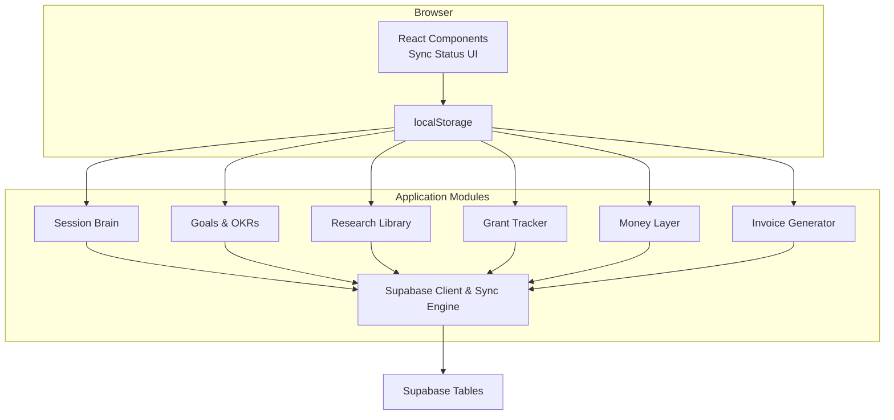
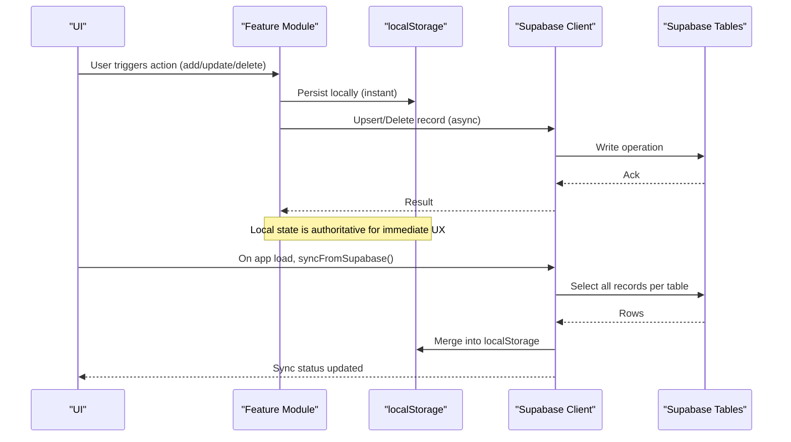
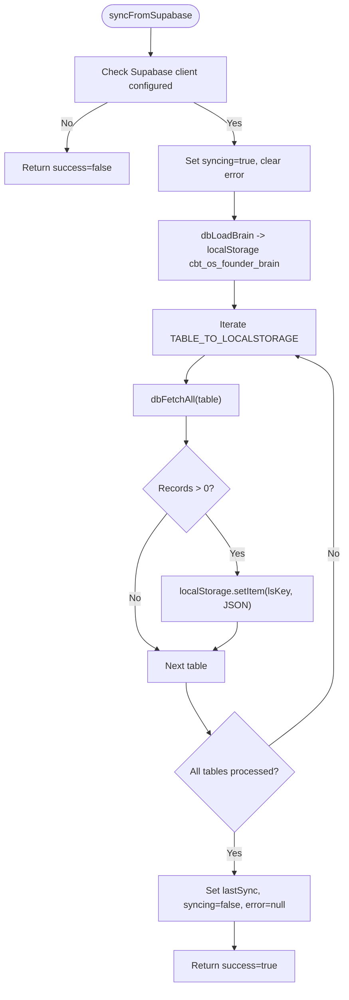
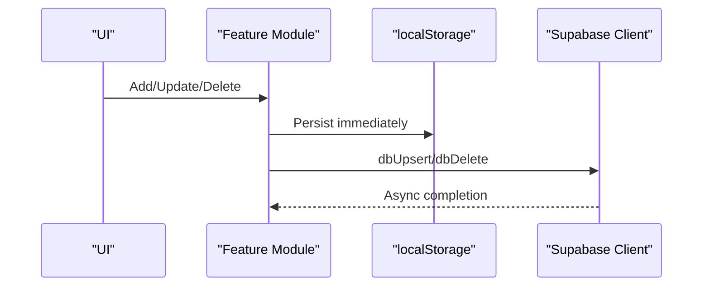
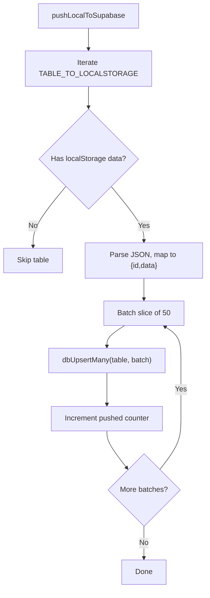
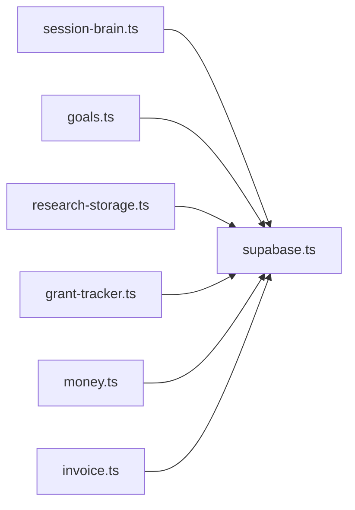

# Data Persistence Architecture

<cite>
**Referenced Files in This Document**
- [supabase.ts](file://src/lib/supabase.ts)
- [20250228_add_support_tables.sql](file://supabase/migrations/20250228_add_support_tables.sql)
- [session-brain.ts](file://src/lib/session-brain.ts)
- [goals.ts](file://src/lib/goals.ts)
- [research-storage.ts](file://src/lib/research-storage.ts)
- [grant-tracker.ts](file://src/lib/grant-tracker.ts)
- [money.ts](file://src/lib/money.ts)
- [invoice.ts](file://src/lib/invoice.ts)
- [support.ts](file://src/lib/support.ts)
- [SettingsPanel.tsx](file://src/components/settings/SettingsPanel.tsx)
- [page.tsx](file://src/app/page.tsx)
</cite>

## Table of Contents
1. [Introduction](#introduction)
2. [Project Structure](#project-structure)
3. [Core Components](#core-components)
4. [Architecture Overview](#architecture-overview)
5. [Detailed Component Analysis](#detailed-component-analysis)
6. [Dependency Analysis](#dependency-analysis)
7. [Performance Considerations](#performance-considerations)
8. [Troubleshooting Guide](#troubleshooting-guide)
9. [Conclusion](#conclusion)

## Introduction
This document describes the data persistence architecture of Core Brim Tech OS, focusing on the dual strategy that combines an offline-first approach using localStorage with a real-time synchronization layer backed by Supabase. The system implements a write-through caching pattern: all changes are persisted locally instantly and asynchronously propagated to the cloud. It also includes a robust sync engine that pulls remote data on app startup, maintains sync status, and provides migration utilities to move existing local data to Supabase. Conflict resolution and consistency patterns are addressed through optimistic local writes with eventual server reconciliation.

## Project Structure
The persistence layer spans several modules:
- Central Supabase client and sync engine
- Feature-specific localStorage modules
- Migration and export utilities
- UI components that surface sync status

**Diagram sources**
- [supabase.ts](file://src/lib/supabase.ts#L1-L292)
- [session-brain.ts](file://src/lib/session-brain.ts#L1-L278)
- [goals.ts](file://src/lib/goals.ts#L1-L252)
- [research-storage.ts](file://src/lib/research-storage.ts#L1-L47)
- [grant-tracker.ts](file://src/lib/grant-tracker.ts#L1-L297)
- [money.ts](file://src/lib/money.ts#L1-L221)
- [invoice.ts](file://src/lib/invoice.ts#L1-L226)

**Section sources**
- [supabase.ts](file://src/lib/supabase.ts#L1-L292)

## Core Components
- Supabase client and table abstraction: Provides typed table names, CRUD helpers, and a sync engine for pulling/pushing data.
- Local storage modules: Feature modules that persist data in localStorage with minimal APIs (load, persist, add/update/delete).
- Sync engine: Orchestrates initial pull from Supabase, merges into localStorage, tracks sync status, and exposes migration utilities.
- UI sync status: Displays offline, syncing, synced, and error states.

Key responsibilities:
- Write-through caching: Every change is saved to localStorage immediately and then asynchronously to Supabase.
- Initial sync: On app load, pull all tables from Supabase into localStorage.
- Migration: Push existing localStorage data to Supabase for new users or environments.
- Conflict handling: Optimistic local writes; remote updates overwrite local on pull.

**Section sources**
- [supabase.ts](file://src/lib/supabase.ts#L30-L49)
- [supabase.ts](file://src/lib/supabase.ts#L57-L124)
- [supabase.ts](file://src/lib/supabase.ts#L209-L246)
- [supabase.ts](file://src/lib/supabase.ts#L252-L291)
- [SettingsPanel.tsx](file://src/components/settings/SettingsPanel.tsx#L343-L362)
- [page.tsx](file://src/app/page.tsx#L32-L62)

## Architecture Overview
The system follows a write-through caching pattern:
- Local writes: All feature modules write to localStorage immediately.
- Remote writes: Each module invokes a corresponding Supabase upsert/delete operation.
- Sync engine: On app startup, the sync engine pulls all tables from Supabase and merges into localStorage, updating sync status.

**Diagram sources**
- [supabase.ts](file://src/lib/supabase.ts#L57-L124)
- [supabase.ts](file://src/lib/supabase.ts#L209-L246)
- [session-brain.ts](file://src/lib/session-brain.ts#L266-L277)
- [goals.ts](file://src/lib/goals.ts#L246-L251)
- [research-storage.ts](file://src/lib/research-storage.ts#L44-L46)
- [grant-tracker.ts](file://src/lib/grant-tracker.ts#L290-L296)
- [money.ts](file://src/lib/money.ts#L209-L220)

## Detailed Component Analysis

### Supabase Client and Sync Engine
- Client initialization: Lazily creates a Supabase client using environment variables and guards against misconfiguration.
- Typed table names: Centralized list of tables used by the app.
- Core operations: Upsert (single and batch), fetch all, fetch one, delete, and special-case brain save/load.
- Sync engine:
  - Sync status: Tracks last sync time, syncing flag, error, and per-table counts.
  - syncFromSupabase: Pulls all configured tables and writes to localStorage; updates sync status.
  - pushLocalToSupabase: Migrates existing localStorage data to Supabase in batches of 50; assigns synthetic ids when missing.

**Diagram sources**
- [supabase.ts](file://src/lib/supabase.ts#L159-L181)
- [supabase.ts](file://src/lib/supabase.ts#L183-L203)
- [supabase.ts](file://src/lib/supabase.ts#L209-L246)

**Section sources**
- [supabase.ts](file://src/lib/supabase.ts#L11-L26)
- [supabase.ts](file://src/lib/supabase.ts#L30-L49)
- [supabase.ts](file://src/lib/supabase.ts#L57-L124)
- [supabase.ts](file://src/lib/supabase.ts#L159-L181)
- [supabase.ts](file://src/lib/supabase.ts#L183-L203)
- [supabase.ts](file://src/lib/supabase.ts#L209-L246)
- [supabase.ts](file://src/lib/supabase.ts#L252-L291)

### Feature Modules and Write-Through Pattern
Each feature module persists to localStorage and then calls Supabase:
- Session Brain: Sessions, Tasks, Decisions, Active Session.
- Goals & OKRs: Goals, Milestones, Key Results.
- Research Library: Research reports.
- Grant Tracker: Grants.
- Money Layer: Clients, Revenue, Goals.
- Invoice Generator: Invoices.

**Diagram sources**
- [session-brain.ts](file://src/lib/session-brain.ts#L266-L277)
- [goals.ts](file://src/lib/goals.ts#L246-L251)
- [research-storage.ts](file://src/lib/research-storage.ts#L44-L46)
- [grant-tracker.ts](file://src/lib/grant-tracker.ts#L290-L296)
- [money.ts](file://src/lib/money.ts#L209-L220)
- [invoice.ts](file://src/lib/invoice.ts#L73-L111)

**Section sources**
- [session-brain.ts](file://src/lib/session-brain.ts#L57-L68)
- [session-brain.ts](file://src/lib/session-brain.ts#L266-L277)
- [goals.ts](file://src/lib/goals.ts#L53-L56)
- [goals.ts](file://src/lib/goals.ts#L246-L251)
- [research-storage.ts](file://src/lib/research-storage.ts#L6-L10)
- [research-storage.ts](file://src/lib/research-storage.ts#L44-L46)
- [grant-tracker.ts](file://src/lib/grant-tracker.ts#L288-L296)
- [money.ts](file://src/lib/money.ts#L67-L70)
- [money.ts](file://src/lib/money.ts#L209-L220)
- [invoice.ts](file://src/lib/invoice.ts#L46-L50)
- [invoice.ts](file://src/lib/invoice.ts#L73-L111)

### Database Schema Design and Relationships
Supabase tables mirror feature domains. The migration script defines support tables for Wins, Knowledge Base, SOPs, Notifications, Templates, and Scheduler. The central Supabase module enumerates all tables used by the app.

```mermaid
erDiagram
FOUNDER_BRAIN {
text id PK
jsonb data
timestamptz created_at
timestamptz updated_at
}
SESSIONS {
text id PK
jsonb data
timestamptz created_at
timestamptz updated_at
}
TASKS {
text id PK
jsonb data
timestamptz created_at
timestamptz updated_at
}
DECISIONS {
text id PK
jsonb data
timestamptz created_at
timestamptz updated_at
}
IDEAS {
text id PK
jsonb data
timestamptz created_at
timestamptz updated_at
}
GOALS {
text id PK
jsonb data
timestamptz created_at
timestamptz updated_at
}
GRANTS {
text id PK
jsonb data
timestamptz created_at
timestamptz updated_at
}
CLIENTS {
text id PK
jsonb data
timestamptz created_at
timestamptz updated_at
}
REVENUE {
text id PK
jsonb data
timestamptz created_at
timestamptz updated_at
}
HACKATHON_PROJECTS {
text id PK
jsonb data
timestamptz created_at
timestamptz updated_at
}
HACKATHON_LISTINGS {
text id PK
jsonb data
timestamptz created_at
timestamptz updated_at
}
COMPETITOR_REPORTS {
text id PK
jsonb data
timestamptz created_at
timestamptz updated_at
}
RESEARCH_LIBRARY {
text id PK
jsonb data
timestamptz created_at
timestamptz updated_at
}
WINS {
text id PK
jsonb data
timestamptz created_at
timestamptz updated_at
}
KNOWLEDGE_BASE {
text id PK
jsonb data
timestamptz created_at
timestamptz updated_at
}
SOPs {
text id PK
jsonb data
timestamptz created_at
timestamptz updated_at
}
NOTIFICATIONS {
text id PK
jsonb data
timestamptz created_at
timestamptz updated_at
}
TEMPLATES {
text id PK
jsonb data
timestamptz created_at
timestamptz updated_at
}
SCHEDULER {
text id PK
jsonb data
timestamptz created_at
timestamptz updated_at
}
```

**Diagram sources**
- [20250228_add_support_tables.sql](file://supabase/migrations/20250228_add_support_tables.sql#L5-L45)
- [supabase.ts](file://src/lib/supabase.ts#L30-L49)

**Section sources**
- [20250228_add_support_tables.sql](file://supabase/migrations/20250228_add_support_tables.sql#L1-L46)
- [supabase.ts](file://src/lib/supabase.ts#L30-L49)

### Sync Engine Implementation Details
- Sync status persistence: Stored in localStorage under a dedicated key for UI rendering and retry logic.
- Table-to-local mapping: Central map from table names to localStorage keys enables uniform sync/push logic.
- Batched upserts: pushLocalToSupabase writes in chunks of 50 to avoid payload limits and improve throughput.
- Error handling: Try/catch around fetch and upsert operations logs warnings and sets sync status with error messages.

**Diagram sources**
- [supabase.ts](file://src/lib/supabase.ts#L183-L203)
- [supabase.ts](file://src/lib/supabase.ts#L252-L291)

**Section sources**
- [supabase.ts](file://src/lib/supabase.ts#L168-L181)
- [supabase.ts](file://src/lib/supabase.ts#L183-L203)
- [supabase.ts](file://src/lib/supabase.ts#L252-L291)

### Conflict Resolution and Consistency Patterns
- Local-first writes: All user actions are persisted locally instantly, ensuring responsive UX.
- Eventual consistency: syncFromSupabase pulls remote data and overwrites local entries for tables that exist remotely, ensuring freshness across devices.
- Optimistic concurrency: There is no explicit last-writer-wins or versioning; remote fetch replaces local state for each table.
- Idempotency: Supabase upserts are keyed by id, preventing duplicates and enabling safe retries.

**Section sources**
- [supabase.ts](file://src/lib/supabase.ts#L209-L246)
- [supabase.ts](file://src/lib/supabase.ts#L57-L66)

### Data Lifecycle Management
- Initialization: Some modules initialize default datasets into localStorage on first use.
- Export/Import: Utilities to export all localStorage keys and import a bundle for backup or migration.
- Scheduler initialization: Ensures default scheduling entries are present.

**Section sources**
- [goals.ts](file://src/lib/goals.ts#L162-L241)
- [support.ts](file://src/lib/support.ts#L707-L740)
- [support.ts](file://src/lib/support.ts#L648-L656)

## Dependency Analysis
The following diagram shows how feature modules depend on the Supabase client and localStorage, and how the sync engine coordinates remote and local state.

**Diagram sources**
- [supabase.ts](file://src/lib/supabase.ts#L1-L292)
- [session-brain.ts](file://src/lib/session-brain.ts#L266-L277)
- [goals.ts](file://src/lib/goals.ts#L246-L251)
- [research-storage.ts](file://src/lib/research-storage.ts#L44-L46)
- [grant-tracker.ts](file://src/lib/grant-tracker.ts#L290-L296)
- [money.ts](file://src/lib/money.ts#L209-L220)
- [invoice.ts](file://src/lib/invoice.ts#L73-L111)

**Section sources**
- [supabase.ts](file://src/lib/supabase.ts#L1-L292)
- [session-brain.ts](file://src/lib/session-brain.ts#L266-L277)
- [goals.ts](file://src/lib/goals.ts#L246-L251)
- [research-storage.ts](file://src/lib/research-storage.ts#L44-L46)
- [grant-tracker.ts](file://src/lib/grant-tracker.ts#L290-L296)
- [money.ts](file://src/lib/money.ts#L209-L220)
- [invoice.ts](file://src/lib/invoice.ts#L73-L111)

## Performance Considerations
- Write-through caching: Local writes are synchronous and fast; remote writes are asynchronous, minimizing UI latency.
- Batched upserts: pushLocalToSupabase writes in chunks of 50 to reduce payload overhead and improve throughput.
- Local-first reads: Feature modules read from localStorage, avoiding network latency for UI rendering.
- Sync status: UI can display “syncing” and “last sync” to inform users and avoid repeated manual sync attempts.
- Cache-like localStorage usage: Some modules (e.g., API optimizer) maintain lightweight caches in localStorage to reduce redundant computations.

[No sources needed since this section provides general guidance]

## Troubleshooting Guide
Common scenarios and remedies:
- Supabase not configured: The client returns null; all Supabase operations become no-ops. UI indicates offline mode.
- Sync fails: syncFromSupabase captures error messages in sync status; users can retry.
- Network failures: Local writes still succeed; remote writes are retried on subsequent sync.
- Data loss prevention: Even if localStorage is cleared, data remains in Supabase; users can pull again.

Operational hooks:
- Sync status UI: Displays offline, syncing, synced, or error with retry option.
- Settings panel: Explains how sync works (write-through cache, pull on new device, team readiness).

**Section sources**
- [supabase.ts](file://src/lib/supabase.ts#L11-L26)
- [supabase.ts](file://src/lib/supabase.ts#L241-L245)
- [page.tsx](file://src/app/page.tsx#L41-L62)
- [SettingsPanel.tsx](file://src/components/settings/SettingsPanel.tsx#L343-L362)

## Conclusion
Core Brim Tech OS employs a robust dual persistence strategy: localStorage for instant, offline-capable UX and Supabase for reliable, real-time synchronization. The write-through caching pattern ensures responsiveness while maintaining durability and cross-device consistency. The sync engine automates initial pulls, tracks status, and supports migration of existing data. While there is no explicit versioning or conflict resolution, the eventual-consistency model combined with idempotent upserts provides a pragmatic balance between simplicity and reliability.