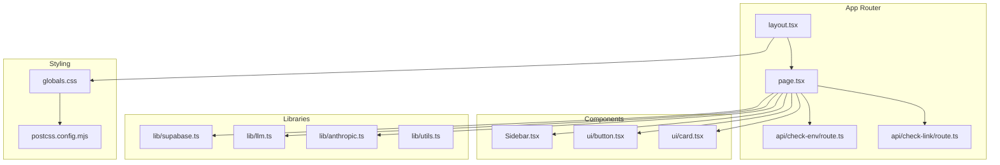
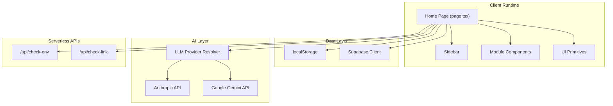
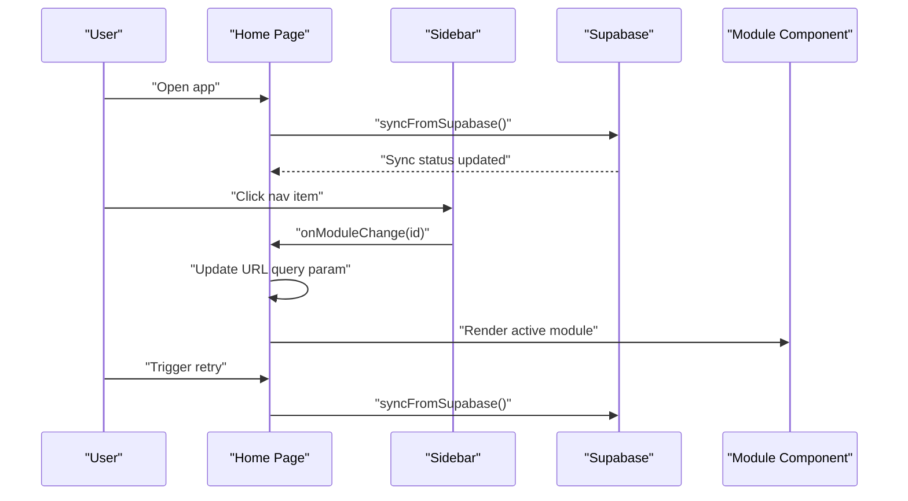
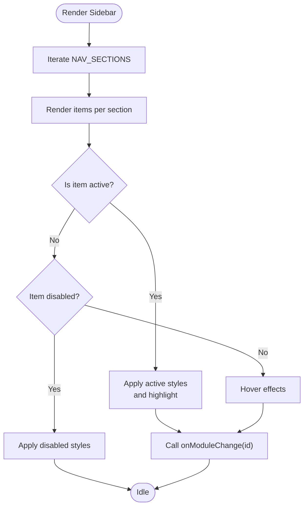
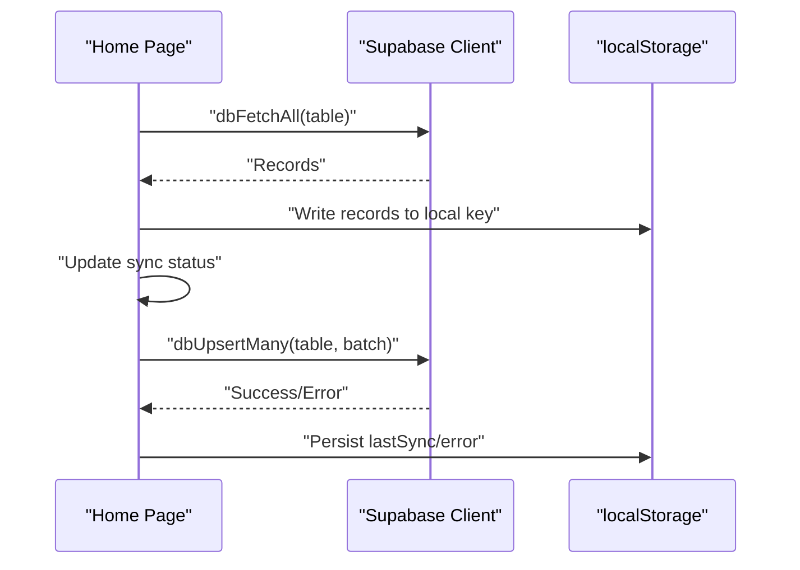
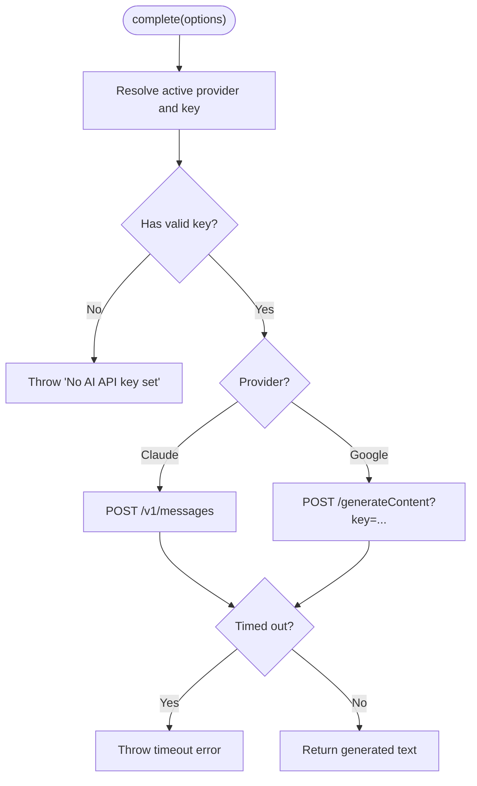
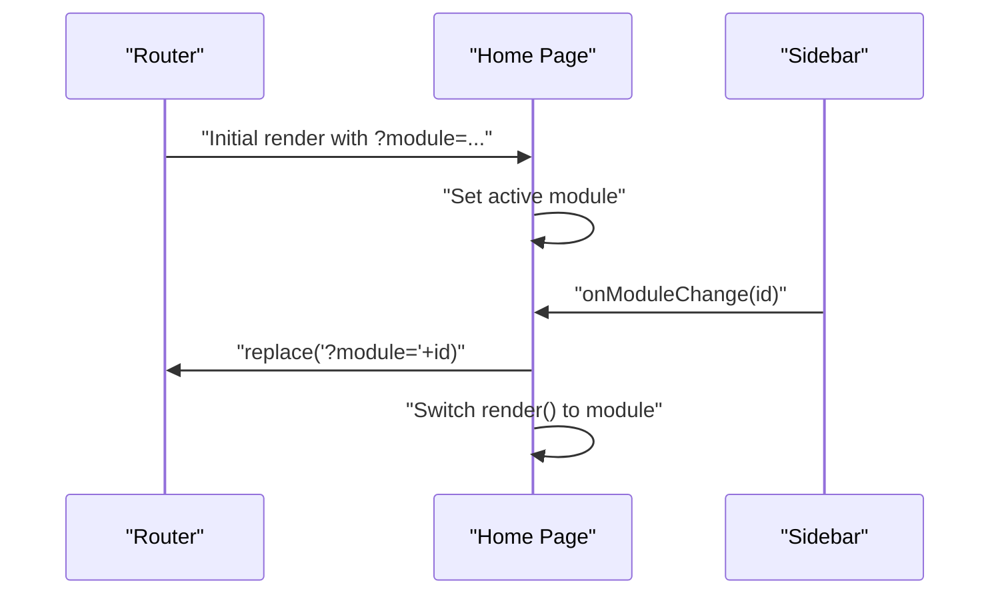
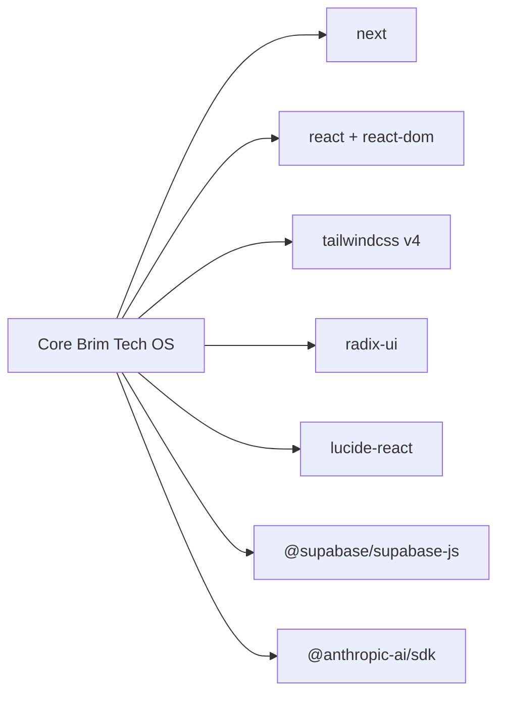

# System Design

<cite>
**Referenced Files in This Document**
- [README.md](file://README.md)
- [package.json](file://package.json)
- [next.config.ts](file://next.config.ts)
- [postcss.config.mjs](file://postcss.config.mjs)
- [src/app/layout.tsx](file://src/app/layout.tsx)
- [src/app/page.tsx](file://src/app/page.tsx)
- [src/app/globals.css](file://src/app/globals.css)
- [src/app/api/check-env/route.ts](file://src/app/api/check-env/route.ts)
- [src/app/api/check-link/route.ts](file://src/app/api/check-link/route.ts)
- [src/components/Sidebar.tsx](file://src/components/Sidebar.tsx)
- [src/components/ui/button.tsx](file://src/components/ui/button.tsx)
- [src/components/ui/card.tsx](file://src/components/ui/card.tsx)
- [src/lib/supabase.ts](file://src/lib/supabase.ts)
- [src/lib/llm.ts](file://src/lib/llm.ts)
- [src/lib/anthropic.ts](file://src/lib/anthropic.ts)
- [src/lib/utils.ts](file://src/lib/utils.ts)
</cite>

## Table of Contents
1. [Introduction](#introduction)
2. [Project Structure](#project-structure)
3. [Core Components](#core-components)
4. [Architecture Overview](#architecture-overview)
5. [Detailed Component Analysis](#detailed-component-analysis)
6. [Dependency Analysis](#dependency-analysis)
7. [Performance Considerations](#performance-considerations)
8. [Troubleshooting Guide](#troubleshooting-guide)
9. [Conclusion](#conclusion)
10. [Appendices](#appendices)

## Introduction
This document describes the system design of Core Brim Tech OS, a Next.js application implementing an internal operating system for Core Brim Tech. It covers the App Router structure, component hierarchy, module organization, theming and styling, responsive patterns, sidebar navigation, routing, and component composition. It also documents system boundaries, external dependencies (Supabase and AI providers), scalability patterns, performance considerations, and deployment architecture.

## Project Structure
Core Brim Tech OS follows a Next.js App Router project layout with a clear separation between pages, components, libraries, and static assets. The application is structured around a root layout that establishes the global theme and metadata, a central page orchestrating module selection and synchronization, and a modular component library organized by functional domains.



**Diagram sources**
- [src/app/layout.tsx](file://src/app/layout.tsx#L1-L22)
- [src/app/page.tsx](file://src/app/page.tsx#L1-L253)
- [src/app/api/check-env/route.ts](file://src/app/api/check-env/route.ts#L1-L13)
- [src/app/api/check-link/route.ts](file://src/app/api/check-link/route.ts#L1-L43)
- [src/components/Sidebar.tsx](file://src/components/Sidebar.tsx#L1-L170)
- [src/components/ui/button.tsx](file://src/components/ui/button.tsx#L1-L65)
- [src/components/ui/card.tsx](file://src/components/ui/card.tsx#L1-L93)
- [src/lib/supabase.ts](file://src/lib/supabase.ts#L1-L292)
- [src/lib/llm.ts](file://src/lib/llm.ts#L1-L135)
- [src/lib/anthropic.ts](file://src/lib/anthropic.ts#L1-L32)
- [src/lib/utils.ts](file://src/lib/utils.ts#L1-L7)
- [src/app/globals.css](file://src/app/globals.css#L1-L59)
- [postcss.config.mjs](file://postcss.config.mjs#L1-L8)

**Section sources**
- [README.md](file://README.md#L1-L37)
- [package.json](file://package.json#L1-L36)
- [next.config.ts](file://next.config.ts#L1-L8)
- [postcss.config.mjs](file://postcss.config.mjs#L1-L8)

## Core Components
- Root Layout: Establishes global metadata, dark mode, and base typography.
- Home Page: Central orchestrator managing module selection via URL query parameters, local state, and synchronization with Supabase.
- Sidebar: Navigation hub grouping modules by functional categories with icons, highlights, and notification badges.
- UI Primitives: Reusable components (Button, Card) built with Tailwind and class variance authority for consistent styling.
- Libraries:
  - Supabase: Client initialization, table abstraction, write-through persistence, and sync engine.
  - LLM: Unified provider layer for Claude and Google AI APIs with key storage and timeouts.
  - Anthropic Helpers: Timeout and error handling utilities for Anthropic requests.
  - Utilities: Utility functions for class merging and component composition.

**Section sources**
- [src/app/layout.tsx](file://src/app/layout.tsx#L1-L22)
- [src/app/page.tsx](file://src/app/page.tsx#L1-L253)
- [src/components/Sidebar.tsx](file://src/components/Sidebar.tsx#L1-L170)
- [src/components/ui/button.tsx](file://src/components/ui/button.tsx#L1-L65)
- [src/components/ui/card.tsx](file://src/components/ui/card.tsx#L1-L93)
- [src/lib/supabase.ts](file://src/lib/supabase.ts#L1-L292)
- [src/lib/llm.ts](file://src/lib/llm.ts#L1-L135)
- [src/lib/anthropic.ts](file://src/lib/anthropic.ts#L1-L32)
- [src/lib/utils.ts](file://src/lib/utils.ts#L1-L7)

## Architecture Overview
The system is a client-driven Next.js application with a hybrid persistence model: local-first with optimistic UI and background synchronization to Supabase. AI interactions are routed through a unified LLM layer that selects providers based on stored preferences and keys. The UI is styled with Tailwind CSS v4 and PostCSS, using a dark theme as the default.



**Diagram sources**
- [src/app/page.tsx](file://src/app/page.tsx#L1-L253)
- [src/components/Sidebar.tsx](file://src/components/Sidebar.tsx#L1-L170)
- [src/lib/supabase.ts](file://src/lib/supabase.ts#L1-L292)
- [src/lib/llm.ts](file://src/lib/llm.ts#L1-L135)
- [src/lib/anthropic.ts](file://src/lib/anthropic.ts#L1-L32)
- [src/app/api/check-env/route.ts](file://src/app/api/check-env/route.ts#L1-L13)
- [src/app/api/check-link/route.ts](file://src/app/api/check-link/route.ts#L1-L43)

## Detailed Component Analysis

### Home Page Orchestration
The Home Page coordinates module rendering, URL-based navigation, synchronization status, and toast notifications. It initializes from URL parameters, manages active module state, and delegates rendering to domain-specific components.



**Diagram sources**
- [src/app/page.tsx](file://src/app/page.tsx#L126-L210)
- [src/lib/supabase.ts](file://src/lib/supabase.ts#L209-L246)

**Section sources**
- [src/app/page.tsx](file://src/app/page.tsx#L1-L253)

### Sidebar Navigation System
The Sidebar defines navigation sections and items, handles active state, and displays notification counts. It integrates with the Home Page to update the active module and supports disabled items marked as “soon”.



**Diagram sources**
- [src/components/Sidebar.tsx](file://src/components/Sidebar.tsx#L24-L98)
- [src/components/Sidebar.tsx](file://src/components/Sidebar.tsx#L106-L170)

**Section sources**
- [src/components/Sidebar.tsx](file://src/components/Sidebar.tsx#L1-L170)

### Supabase Integration and Sync Engine
The Supabase library provides a write-through persistence layer: data is written to localStorage immediately for responsiveness and synchronized to Supabase in the background. The sync engine tracks status and errors, and supports migration from localStorage to Supabase.



**Diagram sources**
- [src/lib/supabase.ts](file://src/lib/supabase.ts#L86-L124)
- [src/lib/supabase.ts](file://src/lib/supabase.ts#L209-L246)
- [src/lib/supabase.ts](file://src/lib/supabase.ts#L252-L291)

**Section sources**
- [src/lib/supabase.ts](file://src/lib/supabase.ts#L1-L292)

### LLM Provider Layer
The LLM layer resolves the active provider and API key from local storage, with a timeout mechanism and unified completion interface. It supports Claude and Google AI APIs and throws descriptive errors when keys are missing.



**Diagram sources**
- [src/lib/llm.ts](file://src/lib/llm.ts#L35-L46)
- [src/lib/llm.ts](file://src/lib/llm.ts#L57-L88)
- [src/lib/llm.ts](file://src/lib/llm.ts#L90-L122)
- [src/lib/llm.ts](file://src/lib/llm.ts#L128-L134)

**Section sources**
- [src/lib/llm.ts](file://src/lib/llm.ts#L1-L135)

### UI Primitive Composition
Reusable UI primitives (Button, Card) use class variance authority and Tailwind utilities for consistent variants and sizes. They integrate with radix-ui and support semantic slots for accessibility.

```mermaid
classDiagram
class Button {
+variant : "default|destructive|outline|secondary|ghost|link"
+size : "default|xs|sm|lg|icon|icon-xs|icon-sm|icon-lg"
+asChild : boolean
+render()
}
class Card {
+CardHeader()
+CardTitle()
+CardDescription()
+CardAction()
+CardContent()
+CardFooter()
}
Button --> Utils["cn()"]
Card --> Utils["cn()"]
```

**Diagram sources**
- [src/components/ui/button.tsx](file://src/components/ui/button.tsx#L7-L39)
- [src/components/ui/card.tsx](file://src/components/ui/card.tsx#L5-L82)
- [src/lib/utils.ts](file://src/lib/utils.ts#L4-L6)

**Section sources**
- [src/components/ui/button.tsx](file://src/components/ui/button.tsx#L1-L65)
- [src/components/ui/card.tsx](file://src/components/ui/card.tsx#L1-L93)
- [src/lib/utils.ts](file://src/lib/utils.ts#L1-L7)

### Routing Patterns and Module Composition
Routing is URL-parameter driven: the active module is derived from the query parameter and reflected in the URL without full-page reloads. The Home Page switches rendered components based on the active module ID, enabling a single-page application feel with deep-linkable views.



**Diagram sources**
- [src/app/page.tsx](file://src/app/page.tsx#L126-L143)
- [src/app/page.tsx](file://src/app/page.tsx#L179-L210)

**Section sources**
- [src/app/page.tsx](file://src/app/page.tsx#L1-L253)

## Dependency Analysis
External dependencies include Next.js, React, Tailwind CSS v4, Radix UI, Lucide React, and third-party SDKs for Supabase and Anthropic. Development tooling includes ESLint and Tailwind PostCSS plugin.



**Diagram sources**
- [package.json](file://package.json#L11-L22)

**Section sources**
- [package.json](file://package.json#L1-L36)

## Performance Considerations
- Local-first UX: Immediate writes to localStorage reduce latency and improve responsiveness during offline or slow network conditions.
- Background sync: Synchronization runs after initial load and can be retried independently, minimizing UI blocking.
- Lazy loading: The Home Page uses a suspense boundary to defer heavy module rendering until hydration completes.
- Responsive layout: Flexbox-based layout with overflow handling ensures efficient rendering on varied screen sizes.
- Styling: Tailwind utilities minimize CSS bloat while enabling rapid iteration; scrollbar customization reduces visual clutter.
- AI requests: Timeouts prevent long-running requests from blocking the UI; provider resolution avoids unnecessary network calls when keys are missing.

[No sources needed since this section provides general guidance]

## Troubleshooting Guide
- Supabase not configured: The layout sets a dark theme and base styles; if Supabase credentials are missing, synchronization is disabled. Verify environment variables and re-run sync.
- Sync failures: The Home Page displays a retry button and updates sync status with error messages. Inspect network connectivity and credential validity.
- Toast notifications: Persistent toasts indicate success or failure of sync operations; they auto-dismiss after a timeout.
- Link checks: The link-check API performs HEAD and fallback GET requests with timeouts; invalid URLs or unreachable endpoints will be reported as inactive.
- Environment checks: The environment API validates Anthropic key configuration server-side.

**Section sources**
- [src/app/layout.tsx](file://src/app/layout.tsx#L14-L21)
- [src/app/page.tsx](file://src/app/page.tsx#L41-L62)
- [src/app/page.tsx](file://src/app/page.tsx#L147-L156)
- [src/app/api/check-link/route.ts](file://src/app/api/check-link/route.ts#L7-L42)
- [src/app/api/check-env/route.ts](file://src/app/api/check-env/route.ts#L5-L12)

## Conclusion
Core Brim Tech OS is designed as a responsive, dark-themed Next.js application with a modular component architecture and a robust hybrid persistence model. The sidebar-driven navigation, URL-parameter routing, and reusable UI primitives enable scalable composition across diverse functional modules. Integration with Supabase provides reliable persistence and cross-device synchronization, while the unified LLM layer supports flexible AI workflows. The system emphasizes performance, resilience, and maintainability through local-first design, timeouts, and clear separation of concerns.

[No sources needed since this section summarizes without analyzing specific files]

## Appendices

### Styling and Theming
- Dark theme is enforced globally via the root HTML element and Tailwind-based color tokens.
- Scrollbar customization improves readability and reduces visual noise.
- Utility classes support truncation and multi-line clamping for text content.

**Section sources**
- [src/app/layout.tsx](file://src/app/layout.tsx#L14-L21)
- [src/app/globals.css](file://src/app/globals.css#L1-L59)

### Deployment Architecture
- The project is optimized for deployment on platforms compatible with Next.js, leveraging serverless routes for environment and link checking.
- Environment variables for Supabase and AI providers are expected to be configured externally.

**Section sources**
- [README.md](file://README.md#L32-L37)
- [src/app/api/check-env/route.ts](file://src/app/api/check-env/route.ts#L1-L13)
- [src/app/api/check-link/route.ts](file://src/app/api/check-link/route.ts#L1-L43)