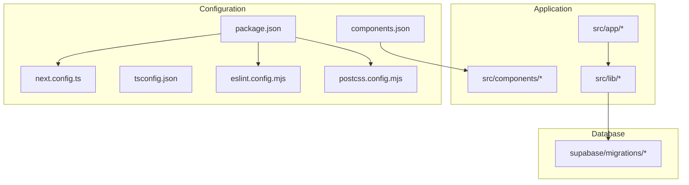
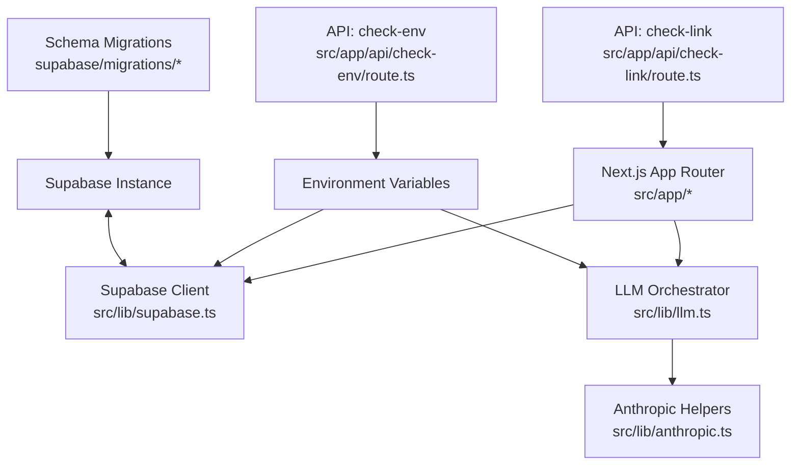
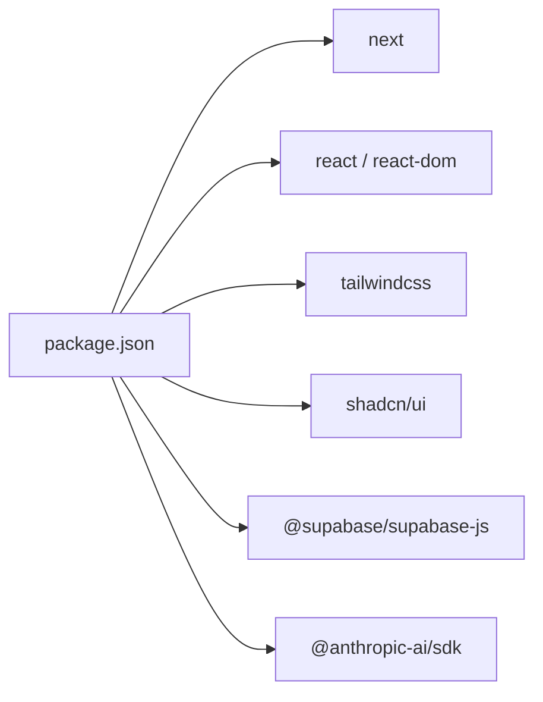
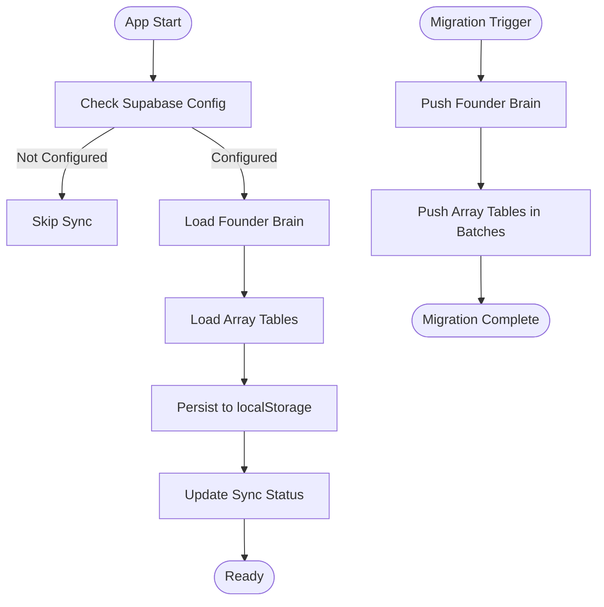

# Configuration & Deployment

<cite>
**Referenced Files in This Document**
- [package.json](file://package.json)
- [next.config.ts](file://next.config.ts)
- [tsconfig.json](file://tsconfig.json)
- [postcss.config.mjs](file://postcss.config.mjs)
- [eslint.config.mjs](file://eslint.config.mjs)
- [components.json](file://components.json)
- [README.md](file://README.md)
- [supabase/migrations/20250228_add_support_tables.sql](file://supabase/migrations/20250228_add_support_tables.sql)
- [src/lib/supabase.ts](file://src/lib/supabase.ts)
- [src/lib/llm.ts](file://src/lib/llm.ts)
- [src/lib/anthropic.ts](file://src/lib/anthropic.ts)
- [src/app/api/check-env/route.ts](file://src/app/api/check-env/route.ts)
- [src/app/api/check-link/route.ts](file://src/app/api/check-link/route.ts)
</cite>

## Table of Contents
1. [Introduction](#introduction)
2. [Project Structure](#project-structure)
3. [Core Components](#core-components)
4. [Architecture Overview](#architecture-overview)
5. [Detailed Component Analysis](#detailed-component-analysis)
6. [Dependency Analysis](#dependency-analysis)
7. [Performance Considerations](#performance-considerations)
8. [Troubleshooting Guide](#troubleshooting-guide)
9. [Conclusion](#conclusion)
10. [Appendices](#appendices)

## Introduction
This document provides comprehensive configuration and deployment guidance for Core Brim Tech OS, a Next.js application. It covers build configuration, TypeScript compiler options, component library setup, environment variable management, production deployment strategies, CI/CD pipeline configuration, database migrations with Supabase, AI provider setup, security configurations, performance optimization, monitoring, troubleshooting, rollback procedures, and production maintenance best practices.

## Project Structure
Core Brim Tech OS follows a standard Next.js App Router project layout with a clear separation of client-side UI, shared libraries, and Supabase-backed persistence. Key areas:
- Application entry points under src/app
- Shared UI components under src/components
- Reusable libraries under src/lib
- Supabase schema under supabase/migrations
- Build and linting configuration at the repository root

**Diagram sources**
- [package.json](file://package.json#L1-L36)
- [next.config.ts](file://next.config.ts#L1-L8)
- [tsconfig.json](file://tsconfig.json#L1-L35)
- [eslint.config.mjs](file://eslint.config.mjs#L1-L19)
- [postcss.config.mjs](file://postcss.config.mjs#L1-L8)
- [components.json](file://components.json#L1-L24)
- [supabase/migrations/20250228_add_support_tables.sql](file://supabase/migrations/20250228_add_support_tables.sql#L1-L46)

**Section sources**
- [package.json](file://package.json#L1-L36)
- [next.config.ts](file://next.config.ts#L1-L8)
- [tsconfig.json](file://tsconfig.json#L1-L35)
- [eslint.config.mjs](file://eslint.config.mjs#L1-L19)
- [postcss.config.mjs](file://postcss.config.mjs#L1-L8)
- [components.json](file://components.json#L1-L24)
- [README.md](file://README.md#L1-L37)

## Core Components
- Next.js build and runtime scripts are defined in package.json, enabling local development, production builds, and server startup.
- TypeScript configuration enforces strictness, incremental compilation, bundler module resolution, and path aliases for clean imports.
- Tailwind CSS is integrated via PostCSS and configured through components.json for shadcn/ui compatibility.
- ESLint configuration extends Next.js recommended rules for TypeScript and web vitals.

**Section sources**
- [package.json](file://package.json#L5-L10)
- [tsconfig.json](file://tsconfig.json#L2-L24)
- [postcss.config.mjs](file://postcss.config.mjs#L1-L8)
- [eslint.config.mjs](file://eslint.config.mjs#L1-L19)
- [components.json](file://components.json#L1-L24)

## Architecture Overview
The application architecture centers around:
- Frontend rendering via Next.js App Router
- Shared logic in src/lib for Supabase persistence, LLM orchestration, and Anthropic helpers
- Environment-driven configuration for AI providers and Supabase connectivity
- API routes for environment checks and link validation

**Diagram sources**
- [src/lib/supabase.ts](file://src/lib/supabase.ts#L1-L292)
- [src/lib/llm.ts](file://src/lib/llm.ts#L1-L135)
- [src/lib/anthropic.ts](file://src/lib/anthropic.ts#L1-L32)
- [src/app/api/check-env/route.ts](file://src/app/api/check-env/route.ts#L1-L13)
- [src/app/api/check-link/route.ts](file://src/app/api/check-link/route.ts#L1-L43)
- [supabase/migrations/20250228_add_support_tables.sql](file://supabase/migrations/20250228_add_support_tables.sql#L1-L46)

## Detailed Component Analysis

### Next.js Build Configuration
- Scripts: development, build, start, and lint are defined for streamlined workflows.
- next.config.ts is present but currently empty; it can be extended for advanced Next.js features (image optimization, headers, redirects, etc.) as needed.

Best practices:
- Keep next.config.ts minimal until explicit needs arise.
- Use environment variables for feature flags and external integrations.

**Section sources**
- [package.json](file://package.json#L5-L10)
- [next.config.ts](file://next.config.ts#L1-L8)

### TypeScript Compiler Options
Key compiler options and their impact:
- Target ES2017 and modern libs enable contemporary JavaScript features.
- Strict mode and noEmit enforce type safety and prevent emitting during dev.
- Bundler module resolution and esModuleInterop align with Next.js and ESM expectations.
- Incremental builds improve developer experience.
- Path aliases (@/*) simplify imports.

Recommendations:
- Avoid overriding moduleResolution unless necessary.
- Keep jsx set to react-jsx for App Router.
- Exclude node_modules and generated types appropriately.

**Section sources**
- [tsconfig.json](file://tsconfig.json#L2-L24)

### Component Library Setup (shadcn/ui + Tailwind)
- components.json defines shadcn/ui style, RSC support, TSX, and Tailwind configuration pointing to src/app/globals.css.
- Tailwind is wired via PostCSS plugin in postcss.config.mjs.
- Aliases map components, utils, ui, lib, and hooks to src paths.

Implementation tips:
- Use the provided aliases to keep imports consistent.
- Ensure Tailwind directives are present in globals.css.

**Section sources**
- [components.json](file://components.json#L1-L24)
- [postcss.config.mjs](file://postcss.config.mjs#L1-L8)

### Environment Variable Management
- Supabase client initialization reads NEXT_PUBLIC_SUPABASE_URL and NEXT_PUBLIC_SUPABASE_ANON_KEY.
- LLM orchestrator reads stored API keys and provider preference from localStorage; runtime keys are validated via an API endpoint.
- The check-env API route validates ANTHROPIC_API_KEY presence and format.

Guidelines:
- Store Supabase credentials as NEXT_PUBLIC_* for client usage and backend keys as server-side env vars.
- Keep sensitive keys out of client bundles; prefer server-side secrets for backend operations.
- Use the check-env endpoint to surface configuration health to the UI.

**Section sources**
- [src/lib/supabase.ts](file://src/lib/supabase.ts#L14-L26)
- [src/lib/llm.ts](file://src/lib/llm.ts#L6-L33)
- [src/app/api/check-env/route.ts](file://src/app/api/check-env/route.ts#L5-L11)

### Production Deployment Strategies
- The project README recommends deploying to Vercel; use standard Next.js deployment practices.
- Build and start commands are defined in package.json for containerized or server deployments.
- For Vercel, configure environment variables in the platform’s dashboard and ensure the build command aligns with the repository scripts.

CI/CD pipeline configuration (recommended):
- Install dependencies using the package manager lock file.
- Run lint and type checks before building.
- Build the Next.js app and serve the production output.
- For Supabase, apply migrations in a pre-deploy step using the provided SQL script.

**Section sources**
- [README.md](file://README.md#L32-L36)
- [package.json](file://package.json#L5-L10)

### Database Migration Procedures (Supabase)
- The migration script creates support tables for wins, knowledge_base, sops, notifications, templates, and scheduler.
- The Supabase client library supports upsert, fetch, and delete operations across these tables.
- A sync engine merges Supabase data with localStorage on app load and supports migrating existing localStorage data to Supabase.

Operational steps:
- Apply the migration script in the Supabase SQL editor or via a migration tool.
- Initialize the Supabase client with URL and anonymous key.
- Optionally migrate existing localStorage data to Supabase using the provided push function.

**Section sources**
- [supabase/migrations/20250228_add_support_tables.sql](file://supabase/migrations/20250228_add_support_tables.sql#L1-L46)
- [src/lib/supabase.ts](file://src/lib/supabase.ts#L57-L124)
- [src/lib/supabase.ts](file://src/lib/supabase.ts#L209-L246)
- [src/lib/supabase.ts](file://src/lib/supabase.ts#L252-L291)

### AI Provider Setup
- The LLM orchestrator supports Claude (Anthropic) and Google Gemini.
- Keys are stored in localStorage; the active provider is resolved based on user preference and availability.
- Timeout handling and error parsing are implemented for robust API calls.

Configuration steps:
- Set preferred provider and API keys in the application settings (stored in localStorage).
- Use the check-env API to validate provider configuration.
- For production, consider storing keys securely and using server-side routing for sensitive operations.

**Section sources**
- [src/lib/llm.ts](file://src/lib/llm.ts#L10-L46)
- [src/lib/llm.ts](file://src/lib/llm.ts#L128-L134)
- [src/lib/anthropic.ts](file://src/lib/anthropic.ts#L6-L31)
- [src/app/api/check-env/route.ts](file://src/app/api/check-env/route.ts#L5-L11)

### Security Configurations
- Supabase client requires valid URL and anonymous key; invalid or placeholder values are rejected.
- API routes enforce input validation and safe HTTP methods.
- Link checker performs HEAD requests with timeouts and falls back to GET if needed.

Recommendations:
- Rotate API keys regularly and restrict permissions where possible.
- Use HTTPS-only endpoints and secure cookies if authentication is introduced.
- Sanitize user inputs and limit link checks to trusted domains.

**Section sources**
- [src/lib/supabase.ts](file://src/lib/supabase.ts#L14-L26)
- [src/app/api/check-link/route.ts](file://src/app/api/check-link/route.ts#L7-L41)

### Monitoring Setup
- The Supabase sync engine tracks sync status in localStorage, including lastSync, syncing state, and per-table counts.
- Consider integrating logging and metrics for production deployments (e.g., structured logs, APM, and health checks).

**Section sources**
- [src/lib/supabase.ts](file://src/lib/supabase.ts#L159-L181)
- [src/lib/supabase.ts](file://src/lib/supabase.ts#L209-L246)

### Performance Optimization Settings
- TypeScript incremental builds reduce rebuild times.
- Next.js App Router with React Server Components can improve initial load performance.
- Tailwind CSS with Purge/Garbage Collection reduces bundle size (ensure Tailwind is configured to scan components).

Recommendations:
- Enable Next.js static generation for pages where feasible.
- Optimize images and fonts; leverage Next.js image optimization.
- Monitor bundle size and split large components.

**Section sources**
- [tsconfig.json](file://tsconfig.json#L13-L15)
- [postcss.config.mjs](file://postcss.config.mjs#L1-L8)

## Dependency Analysis
The project’s primary dependencies include Next.js, React, Tailwind CSS v4, shadcn/ui, and Supabase client. Development dependencies include TypeScript, ESLint, and Tailwind tooling.

**Diagram sources**
- [package.json](file://package.json#L11-L34)

**Section sources**
- [package.json](file://package.json#L11-L34)

## Performance Considerations
- Keep TypeScript strict and incremental enabled for fast feedback.
- Prefer server-side rendering and static generation for content-heavy pages.
- Minimize third-party dependencies and audit bundle size regularly.
- Use caching strategies for API responses and static assets.

## Troubleshooting Guide
Common issues and resolutions:
- Supabase client not configured: Verify NEXT_PUBLIC_SUPABASE_URL and NEXT_PUBLIC_SUPABASE_ANON_KEY are set and not placeholders.
- LLM provider not configured: Ensure a provider key is stored in localStorage and the check-env endpoint confirms readiness.
- Link checker failures: Confirm URLs are valid and reachable; the endpoint applies timeouts and fallback GET requests.
- Build errors: Ensure TypeScript and ESLint pass locally before deployment.

**Section sources**
- [src/lib/supabase.ts](file://src/lib/supabase.ts#L14-L26)
- [src/app/api/check-env/route.ts](file://src/app/api/check-env/route.ts#L5-L11)
- [src/app/api/check-link/route.ts](file://src/app/api/check-link/route.ts#L7-L41)
- [eslint.config.mjs](file://eslint.config.mjs#L1-L19)

## Conclusion
Core Brim Tech OS provides a solid foundation for a Next.js application with Supabase-backed persistence and configurable AI providers. By following the configuration and deployment guidelines in this document—covering build settings, TypeScript options, component library setup, environment management, Supabase migrations, AI provider configuration, security, performance, monitoring, troubleshooting, and CI/CD—you can reliably operate the system in production.

## Appendices

### Environment Variables Reference
- NEXT_PUBLIC_SUPABASE_URL: Supabase project URL for client access.
- NEXT_PUBLIC_SUPABASE_ANON_KEY: Supabase anonymous key for client access.
- ANTHROPIC_API_KEY: Optional; used by the check-env endpoint to validate provider configuration.

**Section sources**
- [src/lib/supabase.ts](file://src/lib/supabase.ts#L14-L26)
- [src/app/api/check-env/route.ts](file://src/app/api/check-env/route.ts#L5-L11)

### Supabase Sync and Migration Flow

**Diagram sources**
- [src/lib/supabase.ts](file://src/lib/supabase.ts#L209-L246)
- [src/lib/supabase.ts](file://src/lib/supabase.ts#L252-L291)