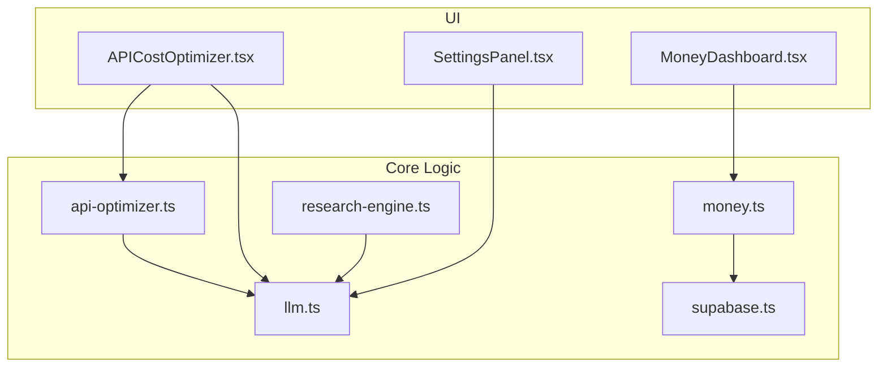
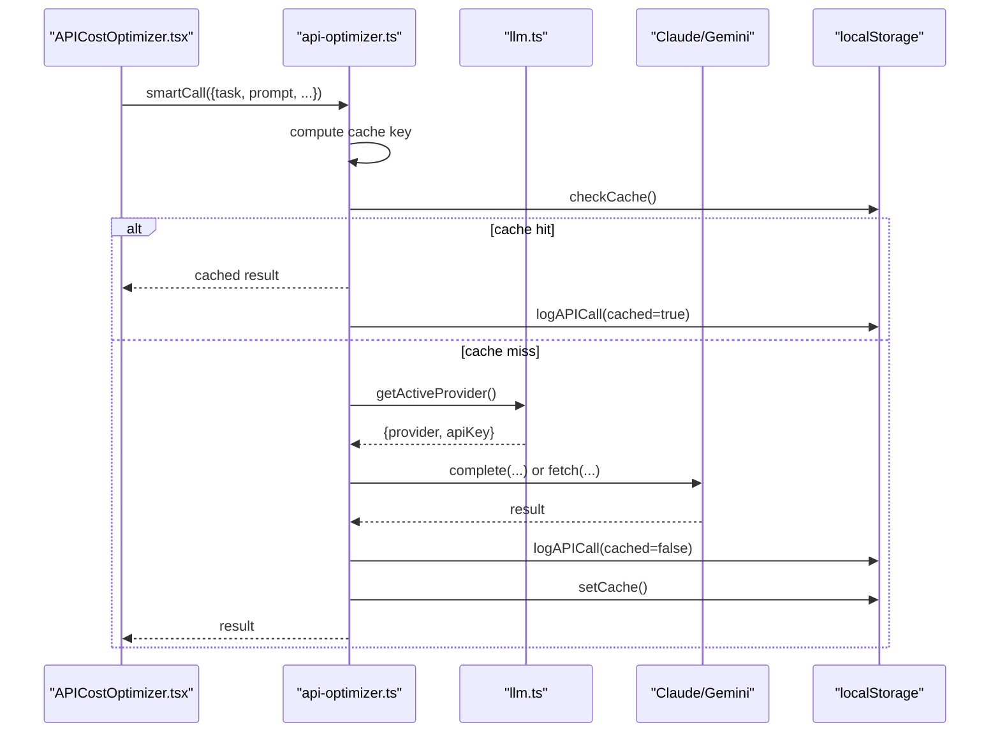
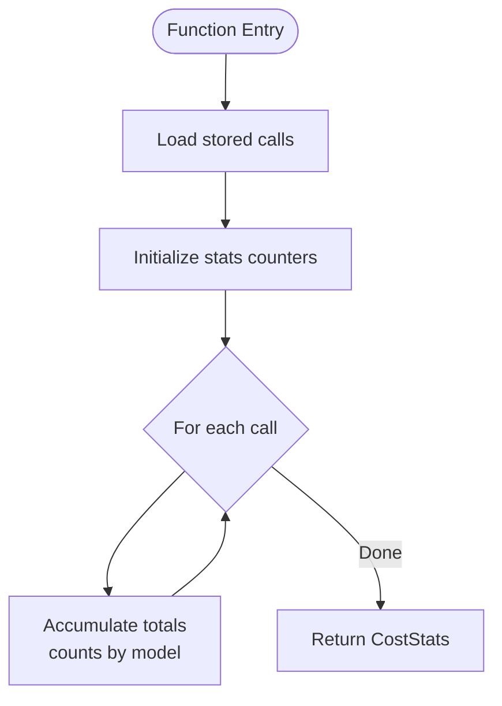
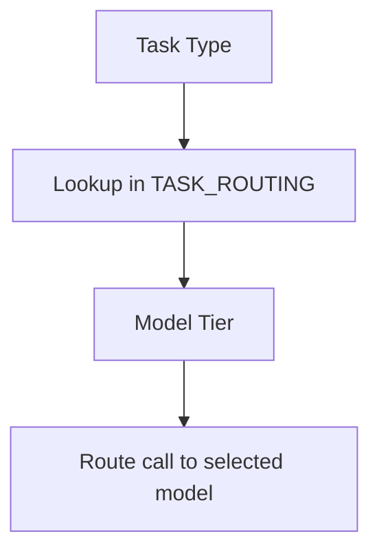
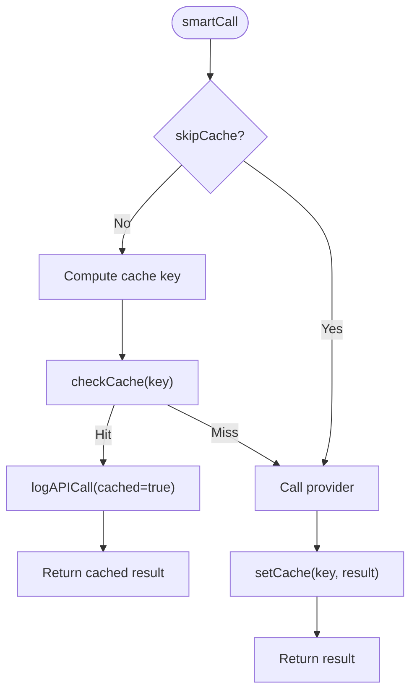
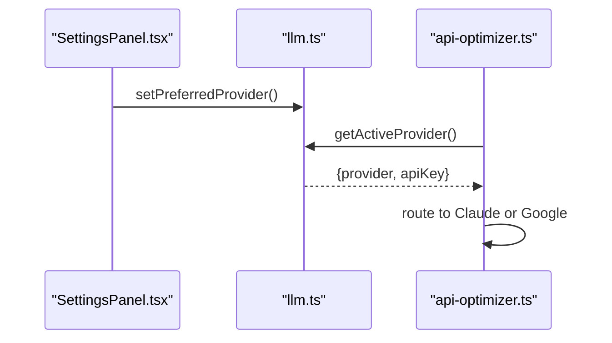
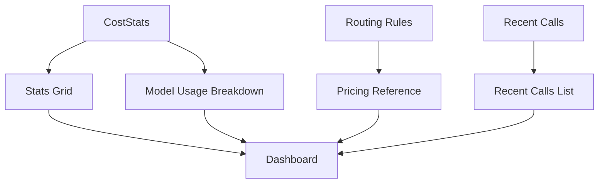
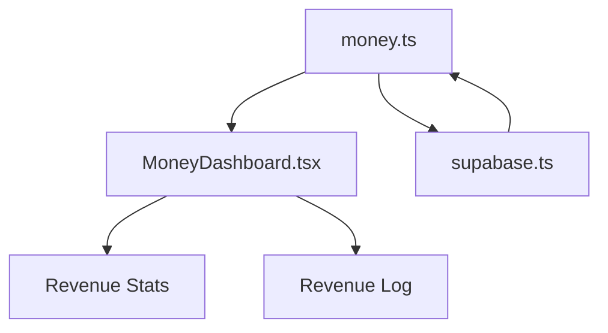
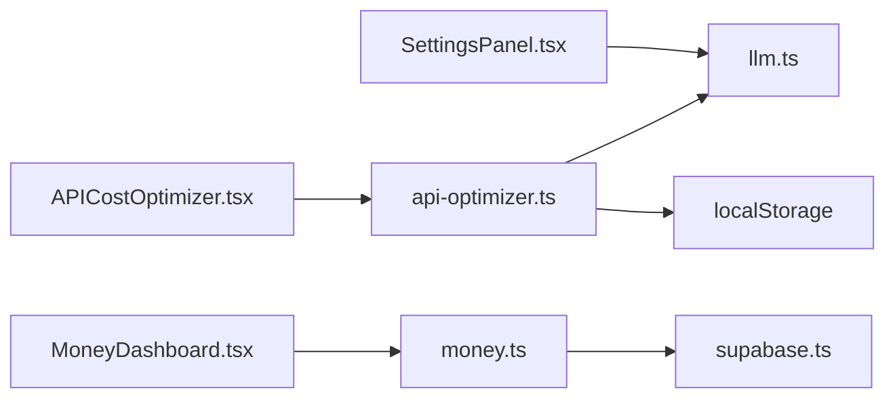

# API Cost Optimizer

<cite>
**Referenced Files in This Document**
- [APICostOptimizer.tsx](file://src/components/optimizer/APICostOptimizer.tsx)
- [api-optimizer.ts](file://src/lib/api-optimizer.ts)
- [llm.ts](file://src/lib/llm.ts)
- [SettingsPanel.tsx](file://src/components/settings/SettingsPanel.tsx)
- [MoneyDashboard.tsx](file://src/components/money/MoneyDashboard.tsx)
- [money.ts](file://src/lib/money.ts)
- [supabase.ts](file://src/lib/supabase.ts)
- [research-engine.ts](file://src/lib/research-engine.ts)
- [page.tsx](file://src/app/page.tsx)
</cite>

## Table of Contents
1. [Introduction](#introduction)
2. [Project Structure](#project-structure)
3. [Core Components](#core-components)
4. [Architecture Overview](#architecture-overview)
5. [Detailed Component Analysis](#detailed-component-analysis)
6. [Dependency Analysis](#dependency-analysis)
7. [Performance Considerations](#performance-considerations)
8. [Troubleshooting Guide](#troubleshooting-guide)
9. [Conclusion](#conclusion)
10. [Appendices](#appendices)

## Introduction
The API Cost Optimizer is an autonomous system designed to monitor, analyze, and reduce AI service operational expenses across multiple providers. It achieves cost savings through intelligent model routing, aggressive caching, and transparent cost tracking. The system integrates with Claude (Anthropic) and Google Gemini, dynamically selecting the cheapest provider that meets quality requirements, while offering a dashboard to visualize usage, savings, and recent API calls.

## Project Structure
The optimizer resides within the broader OS application and interacts with several subsystems:
- UI component for cost optimization and visibility
- Core logic for pricing, routing, caching, and cost tracking
- Provider abstraction layer for Claude and Google
- Settings panel for configuring providers and keys
- Money dashboard for financial context and revenue tracking
- Supabase integration for persistent storage and cross-device sync
- Research engine for tasks that require Claude’s advanced capabilities

**Diagram sources**
- [APICostOptimizer.tsx](file://src/components/optimizer/APICostOptimizer.tsx#L1-L235)
- [api-optimizer.ts](file://src/lib/api-optimizer.ts#L1-L290)
- [llm.ts](file://src/lib/llm.ts#L1-L135)
- [SettingsPanel.tsx](file://src/components/settings/SettingsPanel.tsx#L1-L389)
- [MoneyDashboard.tsx](file://src/components/money/MoneyDashboard.tsx#L1-L366)
- [money.ts](file://src/lib/money.ts#L1-L221)
- [supabase.ts](file://src/lib/supabase.ts#L1-L292)
- [research-engine.ts](file://src/lib/research-engine.ts#L1-L519)

**Section sources**
- [APICostOptimizer.tsx](file://src/components/optimizer/APICostOptimizer.tsx#L1-L235)
- [api-optimizer.ts](file://src/lib/api-optimizer.ts#L1-L290)
- [llm.ts](file://src/lib/llm.ts#L1-L135)
- [SettingsPanel.tsx](file://src/components/settings/SettingsPanel.tsx#L1-L389)
- [MoneyDashboard.tsx](file://src/components/money/MoneyDashboard.tsx#L1-L366)
- [money.ts](file://src/lib/money.ts#L1-L221)
- [supabase.ts](file://src/lib/supabase.ts#L1-L292)
- [research-engine.ts](file://src/lib/research-engine.ts#L1-L519)

## Core Components
- Cost tracking and statistics: collects and aggregates API call logs, computes totals, and breaks down costs by model.
- Intelligent routing: selects the cheapest model tier capable of handling a given task type.
- Aggressive caching: caches results with TTL and eviction to maximize reuse and minimize cost.
- Provider abstraction: resolves active provider and key, enabling seamless switching between Claude and Google.
- UI dashboard: displays cost metrics, usage breakdown, routing rules, cache behavior, pricing reference, and recent calls.

**Section sources**
- [api-optimizer.ts](file://src/lib/api-optimizer.ts#L18-L25)
- [api-optimizer.ts](file://src/lib/api-optimizer.ts#L57-L74)
- [api-optimizer.ts](file://src/lib/api-optimizer.ts#L78-L128)
- [api-optimizer.ts](file://src/lib/api-optimizer.ts#L146-L176)
- [APICostOptimizer.tsx](file://src/components/optimizer/APICostOptimizer.tsx#L40-L235)
- [llm.ts](file://src/lib/llm.ts#L35-L46)

## Architecture Overview
The optimizer orchestrates cost control across three layers:
- Provider layer: selects Claude or Google based on availability and preference.
- Routing and caching layer: routes tasks to the cheapest suitable model and reuses cached results.
- Tracking and UI layer: logs calls, computes stats, and renders dashboards.

**Diagram sources**
- [APICostOptimizer.tsx](file://src/components/optimizer/APICostOptimizer.tsx#L46-L49)
- [api-optimizer.ts](file://src/lib/api-optimizer.ts#L182-L266)
- [llm.ts](file://src/lib/llm.ts#L35-L46)

## Detailed Component Analysis

### Cost Tracking and Statistics
- Tracks total calls, total cost, cached calls, and savings by cache.
- Aggregates counts and costs by model tier.
- Provides recent calls for audit and transparency.

**Diagram sources**
- [api-optimizer.ts](file://src/lib/api-optimizer.ts#L146-L171)

**Section sources**
- [api-optimizer.ts](file://src/lib/api-optimizer.ts#L146-L176)

### Intelligent Model Routing
- Maps task types to model tiers to minimize cost while preserving quality.
- Uses predefined savings percentages versus Opus to guide routing decisions.

**Diagram sources**
- [api-optimizer.ts](file://src/lib/api-optimizer.ts#L57-L74)

**Section sources**
- [api-optimizer.ts](file://src/lib/api-optimizer.ts#L57-L74)
- [APICostOptimizer.tsx](file://src/components/optimizer/APICostOptimizer.tsx#L15-L28)

### Aggressive Caching
- Computes cache keys from task type and prompt prefix.
- Enforces TTL and eviction policy to keep cache lean and fresh.
- Logs cached hits separately for transparency.

**Diagram sources**
- [api-optimizer.ts](file://src/lib/api-optimizer.ts#L194-L202)
- [api-optimizer.ts](file://src/lib/api-optimizer.ts#L118-L128)
- [api-optimizer.ts](file://src/lib/api-optimizer.ts#L204-L223)

**Section sources**
- [api-optimizer.ts](file://src/lib/api-optimizer.ts#L78-L128)
- [api-optimizer.ts](file://src/lib/api-optimizer.ts#L132-L144)

### Provider Abstraction and Dynamic Selection
- Resolves preferred provider and key from settings.
- Falls back to the other provider if the preferred one lacks a key.
- Enables switching between Claude and Google via settings.

**Diagram sources**
- [SettingsPanel.tsx](file://src/components/settings/SettingsPanel.tsx#L123-L126)
- [llm.ts](file://src/lib/llm.ts#L24-L46)
- [api-optimizer.ts](file://src/lib/api-optimizer.ts#L204-L223)

**Section sources**
- [llm.ts](file://src/lib/llm.ts#L24-L46)
- [SettingsPanel.tsx](file://src/components/settings/SettingsPanel.tsx#L203-L220)

### UI Dashboard and Cost Visibility
- Displays total cost, saved by cache, cache rate, and total calls.
- Shows usage breakdown by model with percentage bars.
- Presents smart routing rules and pricing reference.
- Lists recent API calls with timestamps and cached indicators.

**Diagram sources**
- [APICostOptimizer.tsx](file://src/components/optimizer/APICostOptimizer.tsx#L84-L100)
- [APICostOptimizer.tsx](file://src/components/optimizer/APICostOptimizer.tsx#L102-L133)
- [APICostOptimizer.tsx](file://src/components/optimizer/APICostOptimizer.tsx#L135-L153)
- [APICostOptimizer.tsx](file://src/components/optimizer/APICostOptimizer.tsx#L173-L197)
- [APICostOptimizer.tsx](file://src/components/optimizer/APICostOptimizer.tsx#L199-L222)

**Section sources**
- [APICostOptimizer.tsx](file://src/components/optimizer/APICostOptimizer.tsx#L84-L235)

### Integration with Billing and Reporting
- Money dashboard tracks revenue streams and growth, providing financial context for cost optimization decisions.
- Supabase integration persists data and synchronizes across devices, ensuring consistent reporting and cost tracking.

**Diagram sources**
- [money.ts](file://src/lib/money.ts#L152-L188)
- [MoneyDashboard.tsx](file://src/components/money/MoneyDashboard.tsx#L221-L308)
- [supabase.ts](file://src/lib/supabase.ts#L209-L246)

**Section sources**
- [money.ts](file://src/lib/money.ts#L152-L188)
- [MoneyDashboard.tsx](file://src/components/money/MoneyDashboard.tsx#L221-L308)
- [supabase.ts](file://src/lib/supabase.ts#L209-L246)

### Practical Optimization Scenarios

#### Dynamic Provider Selection
- Configure preferred provider in settings; the system automatically routes calls to Claude or Google depending on availability and key presence.
- When Google key is present and preferred, calls use Google (Gemini) with lower cost; otherwise, Claude is used.

**Section sources**
- [SettingsPanel.tsx](file://src/components/settings/SettingsPanel.tsx#L203-L220)
- [llm.ts](file://src/lib/llm.ts#L35-L46)
- [api-optimizer.ts](file://src/lib/api-optimizer.ts#L204-L223)

#### Batch Processing Optimization
- The research engine demonstrates batching strategies for efficient processing of multiple queries, which can inspire similar patterns for optimizing multi-call workflows.
- Batching reduces overhead and improves throughput when applicable.

**Section sources**
- [research-engine.ts](file://src/lib/research-engine.ts#L264-L275)

#### Resource Scaling
- The system scales by leveraging cheaper models for routine tasks and reserving more expensive models for specialized synthesis or strategy tasks.
- Caching reduces repeated computation and minimizes token usage.

**Section sources**
- [api-optimizer.ts](file://src/lib/api-optimizer.ts#L57-L74)
- [api-optimizer.ts](file://src/lib/api-optimizer.ts#L78-L128)

### Monitoring Dashboards, Alerts, and Historical Trends
- Cost dashboard provides real-time visibility into total cost, cache savings, and model usage distribution.
- Money dashboard offers revenue trends and growth metrics to contextualize cost optimization efforts.
- Historical cost logs enable trend analysis and anomaly detection.

**Section sources**
- [APICostOptimizer.tsx](file://src/components/optimizer/APICostOptimizer.tsx#L84-L235)
- [MoneyDashboard.tsx](file://src/components/money/MoneyDashboard.tsx#L221-L308)
- [api-optimizer.ts](file://src/lib/api-optimizer.ts#L132-L176)

### Configuration Options
- Preferred provider selection: choose between Claude and Google in settings.
- API keys: configure Anthropic and/or Google keys; the system uses whichever is available.
- Provider switching criteria: automatic fallback based on key presence and preferences.
- Cost thresholds and optimization rules: currently implicit via routing and caching; explicit thresholds can be introduced by extending the routing logic and adding budget checks.

**Section sources**
- [SettingsPanel.tsx](file://src/components/settings/SettingsPanel.tsx#L203-L220)
- [llm.ts](file://src/lib/llm.ts#L24-L46)
- [api-optimizer.ts](file://src/lib/api-optimizer.ts#L57-L74)

## Dependency Analysis
The optimizer depends on:
- Provider abstraction for Claude and Google
- Local storage for caching and cost logs
- UI components for rendering dashboards
- Money and Supabase for financial context and persistence

**Diagram sources**
- [APICostOptimizer.tsx](file://src/components/optimizer/APICostOptimizer.tsx#L1-L235)
- [api-optimizer.ts](file://src/lib/api-optimizer.ts#L1-L290)
- [llm.ts](file://src/lib/llm.ts#L1-L135)
- [SettingsPanel.tsx](file://src/components/settings/SettingsPanel.tsx#L1-L389)
- [MoneyDashboard.tsx](file://src/components/money/MoneyDashboard.tsx#L1-L366)
- [money.ts](file://src/lib/money.ts#L1-L221)
- [supabase.ts](file://src/lib/supabase.ts#L1-L292)

**Section sources**
- [APICostOptimizer.tsx](file://src/components/optimizer/APICostOptimizer.tsx#L1-L235)
- [api-optimizer.ts](file://src/lib/api-optimizer.ts#L1-L290)
- [llm.ts](file://src/lib/llm.ts#L1-L135)
- [SettingsPanel.tsx](file://src/components/settings/SettingsPanel.tsx#L1-L389)
- [MoneyDashboard.tsx](file://src/components/money/MoneyDashboard.tsx#L1-L366)
- [money.ts](file://src/lib/money.ts#L1-L221)
- [supabase.ts](file://src/lib/supabase.ts#L1-L292)

## Performance Considerations
- Caching reduces redundant API calls and token consumption; ensure cache keys are deterministic and include task semantics to avoid collisions.
- Model routing minimizes cost by selecting the cheapest suitable model for each task.
- Batch processing patterns (as seen in the research engine) can reduce overhead for multi-query workloads.
- Local storage operations are fast but bounded; consider pagination or pruning for large logs.

## Troubleshooting Guide
- No API key configured: the system throws an error when neither Claude nor Google keys are present. Configure keys in settings.
- Provider mismatch: if preferred provider lacks a key, the system falls back to the other provider. Verify settings and keys.
- Cache not reducing cost: ensure cache keys are stable and TTL is appropriate; review recent calls to confirm cached hits.
- Revenue vs. cost alignment: use the money dashboard to correlate spending with income trends and adjust optimization strategies accordingly.

**Section sources**
- [llm.ts](file://src/lib/llm.ts#L128-L134)
- [SettingsPanel.tsx](file://src/components/settings/SettingsPanel.tsx#L262-L267)
- [api-optimizer.ts](file://src/lib/api-optimizer.ts#L194-L202)
- [MoneyDashboard.tsx](file://src/components/money/MoneyDashboard.tsx#L221-L308)

## Conclusion
The API Cost Optimizer provides a robust framework for controlling AI service costs through intelligent routing, aggressive caching, and transparent tracking. Its integration with provider abstraction, settings management, and financial dashboards enables autonomous cost control while maintaining quality and visibility. Extending the system with explicit cost thresholds and alerting would further enhance its ability to proactively manage budgets and respond to anomalies.

## Appendices

### Multi-Provider Cost Comparison and Routing
- Claude pricing tiers and model IDs are defined centrally for consistent cost calculations.
- Routing rules map task types to model tiers to achieve significant savings versus always using the most expensive model.

**Section sources**
- [api-optimizer.ts](file://src/lib/api-optimizer.ts#L27-L33)
- [api-optimizer.ts](file://src/lib/api-optimizer.ts#L57-L74)

### Usage Pattern Analysis
- CostStats aggregates usage patterns by model and task, enabling analysis of where savings can be maximized.
- Recent calls provide granular insights for debugging and optimization.

**Section sources**
- [api-optimizer.ts](file://src/lib/api-optimizer.ts#L146-L176)
- [api-optimizer.ts](file://src/lib/api-optimizer.ts#L173-L176)

### Budget Allocation Mechanisms
- Implicit budgeting occurs through model routing and caching; explicit budget controls can be added by introducing cost thresholds and budget checks in the routing logic.

**Section sources**
- [api-optimizer.ts](file://src/lib/api-optimizer.ts#L57-L74)
- [api-optimizer.ts](file://src/lib/api-optimizer.ts#L182-L266)

### Integration with Billing Systems and Cost Reporting
- Local storage stores cost logs for immediate reporting; Supabase persists and syncs data across devices for long-term analytics.
- Money dashboard complements cost tracking with revenue and growth metrics.

**Section sources**
- [api-optimizer.ts](file://src/lib/api-optimizer.ts#L132-L144)
- [supabase.ts](file://src/lib/supabase.ts#L209-L246)
- [money.ts](file://src/lib/money.ts#L152-L188)