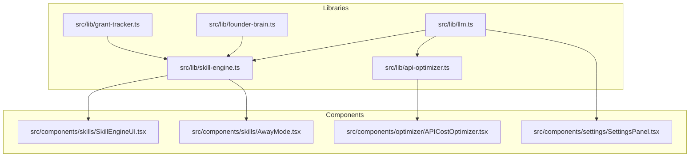
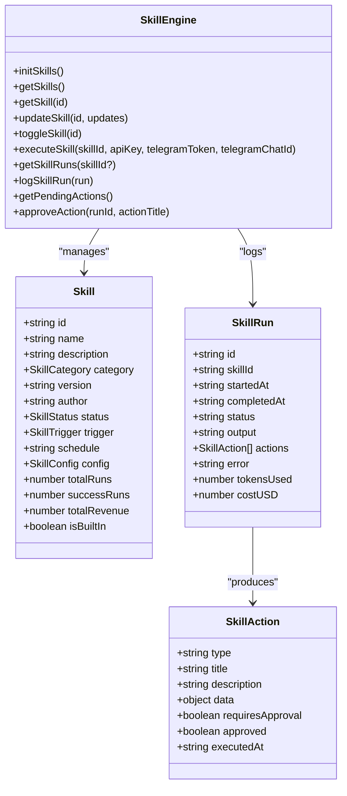
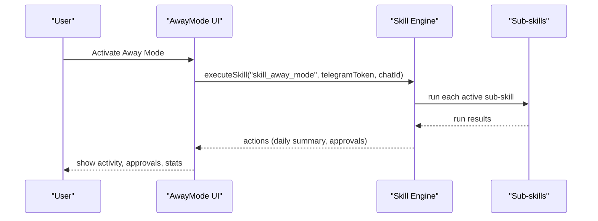
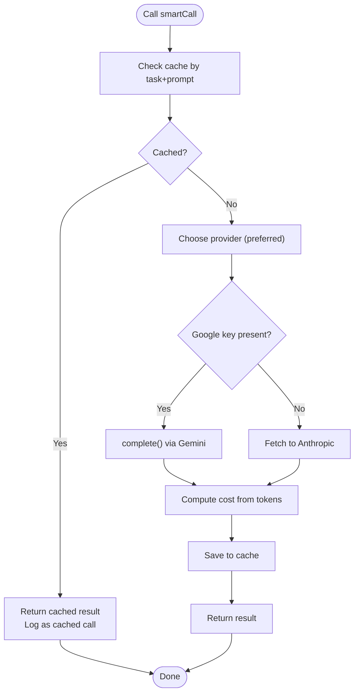
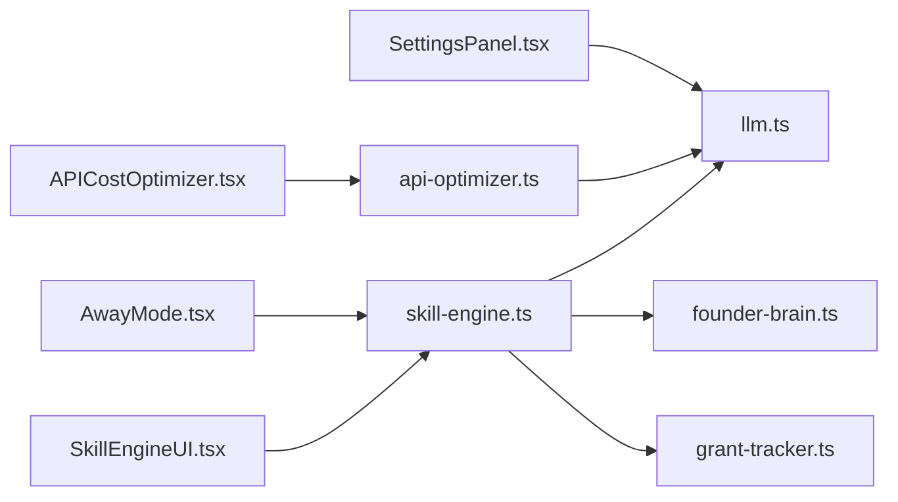

# Autonomous Systems

<cite>
**Referenced Files in This Document**
- [README.md](file://README.md)
- [skill-engine.ts](file://src/lib/skill-engine.ts)
- [APICostOptimizer.tsx](file://src/components/optimizer/APICostOptimizer.tsx)
- [api-optimizer.ts](file://src/lib/api-optimizer.ts)
- [llm.ts](file://src/lib/llm.ts)
- [AwayMode.tsx](file://src/components/skills/AwayMode.tsx)
- [SkillEngineUI.tsx](file://src/components/skills/SkillEngineUI.tsx)
- [SettingsPanel.tsx](file://src/components/settings/SettingsPanel.tsx)
- [founder-brain.ts](file://src/lib/founder-brain.ts)
- [grant-tracker.ts](file://src/lib/grant-tracker.ts)
</cite>

## Table of Contents
1. [Introduction](#introduction)
2. [Project Structure](#project-structure)
3. [Core Components](#core-components)
4. [Architecture Overview](#architecture-overview)
5. [Detailed Component Analysis](#detailed-component-analysis)
6. [Dependency Analysis](#dependency-analysis)
7. [Performance Considerations](#performance-considerations)
8. [Troubleshooting Guide](#troubleshooting-guide)
9. [Conclusion](#conclusion)
10. [Appendices](#appendices)

## Introduction
This document explains the Core Brim Tech OS autonomous systems: the Skill Engine (task automation and workflow orchestration), Away Mode (automated responses and scheduling), and the API Cost Optimizer (AI service cost management). Together, these modules enable self-sustaining operations by intelligently automating revenue-generating tasks, monitoring environments, and optimizing AI costs. The system integrates AI providers (Claude and Google Gemini), caches results, routes tasks to the cheapest suitable model, and surfaces actionable insights and approvals to the user.

## Project Structure
The autonomous systems live primarily in:
- src/lib: shared libraries for AI integration, cost optimization, and domain data (Founder Brain, Grants)
- src/components: UI modules for the Skill Engine, Away Mode, and API Cost Optimizer
- src/components/settings: Settings panel for provider selection and environment configuration



**Diagram sources**
- [llm.ts](file://src/lib/llm.ts#L1-L135)
- [api-optimizer.ts](file://src/lib/api-optimizer.ts#L1-L290)
- [skill-engine.ts](file://src/lib/skill-engine.ts#L1-L764)
- [founder-brain.ts](file://src/lib/founder-brain.ts#L1-L213)
- [grant-tracker.ts](file://src/lib/grant-tracker.ts#L1-L297)
- [SkillEngineUI.tsx](file://src/components/skills/SkillEngineUI.tsx#L1-L397)
- [AwayMode.tsx](file://src/components/skills/AwayMode.tsx#L1-L331)
- [APICostOptimizer.tsx](file://src/components/optimizer/APICostOptimizer.tsx#L1-L235)
- [SettingsPanel.tsx](file://src/components/settings/SettingsPanel.tsx#L1-L389)

**Section sources**
- [README.md](file://README.md#L1-L37)

## Core Components
- Skill Engine: Injectable, schedulable, event-triggered skills that run autonomously and surface approvals when needed. Supports revenue, research, outreach, monitoring, reporting, and automation categories.
- Away Mode: A high-level orchestrator that runs multiple skills while you are away, sending daily summaries and holding high-stakes actions for your approval.
- API Cost Optimizer: Smart model routing, caching, and cost tracking to reduce AI expenses by ~70% while preserving quality.

**Section sources**
- [skill-engine.ts](file://src/lib/skill-engine.ts#L1-L764)
- [AwayMode.tsx](file://src/components/skills/AwayMode.tsx#L1-L331)
- [APICostOptimizer.tsx](file://src/components/optimizer/APICostOptimizer.tsx#L1-L235)
- [api-optimizer.ts](file://src/lib/api-optimizer.ts#L1-L290)

## Architecture Overview
The autonomous systems integrate AI providers, domain knowledge, and cost optimization:

```mermaid
sequenceDiagram
participant User as "User"
participant UI as "SkillEngineUI/AwayMode"
participant Engine as "Skill Engine"
participant LLM as "LLM Layer"
participant Opt as "API Cost Optimizer"
participant Cache as "Local Cache"
participant Provider as "Anthropic/Google"
User->>UI : Configure provider and run skills
UI->>Engine : executeSkill(skillId)
Engine->>Opt : smartCall({task,prompt})
Opt->>Cache : checkCache(task,prompt)
alt Cache hit
Cache-->>Opt : cached result
else Cache miss
Opt->>LLM : complete({prompt,systemPrompt})
LLM->>Provider : API request
Provider-->>LLM : response
LLM-->>Opt : text
Opt->>Cache : setCache(task,prompt,result)
end
Opt-->>Engine : result
Engine-->>UI : run result + actions
UI-->>User : approvals/actions
```

**Diagram sources**
- [skill-engine.ts](file://src/lib/skill-engine.ts#L351-L431)
- [api-optimizer.ts](file://src/lib/api-optimizer.ts#L182-L266)
- [llm.ts](file://src/lib/llm.ts#L128-L134)

## Detailed Component Analysis

### Skill Engine
The Skill Engine defines skills, schedules, configurations, and execution lifecycle. It persists state to localStorage and coordinates approvals.

Key responsibilities:
- Define skill metadata, categories, triggers, and configs
- Persist skills and runs to localStorage
- Execute skills and collect outputs and actions
- Manage approvals for high-stakes actions
- Provide statistics and run history



**Diagram sources**
- [skill-engine.ts](file://src/lib/skill-engine.ts#L11-L56)
- [skill-engine.ts](file://src/lib/skill-engine.ts#L213-L289)
- [skill-engine.ts](file://src/lib/skill-engine.ts#L351-L431)

Configuration highlights:
- Built-in skills include Proposal Writer, Grant Drafter, Hackathon Auto-Builder, Competitor Monitor, Opportunity Scanner, Weekly Report Generator, Lead Outreach Writer, and Away Mode.
- Each skill has a category, trigger, optional schedule, and a config object with tunable parameters.

Execution flow:
- executeSkill resolves the active provider, logs the run, executes the skill runner, updates stats, and persists results.

Approvals:
- getPendingActions aggregates actions requiring approval across runs.
- approveAction marks actions approved and recorded.

**Section sources**
- [skill-engine.ts](file://src/lib/skill-engine.ts#L58-L209)
- [skill-engine.ts](file://src/lib/skill-engine.ts#L213-L338)
- [skill-engine.ts](file://src/lib/skill-engine.ts#L351-L431)
- [skill-engine.ts](file://src/lib/skill-engine.ts#L615-L763)

### Away Mode
Away Mode is a high-level orchestrator that runs multiple skills autonomously and sends a daily summary. It also holds high-stakes actions for your approval.

Key responsibilities:
- Orchestrate sub-skills (Opportunity Scanner, Competitor Monitor, Grant Drafter, Hackathon Auto-Builder)
- Generate a daily Telegram summary
- Allow enabling/disabling and configuring Telegram alerts
- Surface pending approvals



**Diagram sources**
- [AwayMode.tsx](file://src/components/skills/AwayMode.tsx#L83-L99)
- [skill-engine.ts](file://src/lib/skill-engine.ts#L729-L763)

Configuration highlights:
- Telegram token and chat ID are stored in the skill config.
- Daily briefing time and auto-run toggles are configurable.

**Section sources**
- [AwayMode.tsx](file://src/components/skills/AwayMode.tsx#L56-L331)
- [skill-engine.ts](file://src/lib/skill-engine.ts#L190-L208)

### API Cost Optimizer
The API Cost Optimizer reduces AI costs by routing tasks to cheaper models and aggressively caching results.

Key responsibilities:
- Route tasks to optimal model tiers (Haiku, Sonnet, Opus, Gemini Flash)
- Cache results with TTL and eviction
- Track usage and cost per model
- Provide cost estimates and recent call logs



**Diagram sources**
- [api-optimizer.ts](file://src/lib/api-optimizer.ts#L182-L266)

Configuration highlights:
- Task-to-model routing rules minimize cost while preserving quality.
- Pricing tiers and model IDs are defined centrally.
- Cache TTL is 24 hours with a maximum of 100 entries.

**Section sources**
- [api-optimizer.ts](file://src/lib/api-optimizer.ts#L27-L74)
- [api-optimizer.ts](file://src/lib/api-optimizer.ts#L76-L129)
- [api-optimizer.ts](file://src/lib/api-optimizer.ts#L146-L177)
- [api-optimizer.ts](file://src/lib/api-optimizer.ts#L182-L266)

### AI Provider Integration
The LLM layer abstracts provider selection and API calls.

Key responsibilities:
- Store and resolve preferred provider (Claude or Google)
- Provide unified completion function
- Enforce timeouts and handle errors

```mermaid
classDiagram
class LLM {
+getStoredAnthropicKey() string|undefined
+getStoredGoogleKey() string|undefined
+getPreferredProvider() AIProvider
+setPreferredProvider(provider)
+getActiveProvider() {provider, apiKey}|null
+complete(opts) string
}
class Provider {
+completeWithClaude(apiKey, opts) string
+completeWithGoogle(apiKey, opts) string
}
LLM --> Provider : "delegates"
```

**Diagram sources**
- [llm.ts](file://src/lib/llm.ts#L12-L46)
- [llm.ts](file://src/lib/llm.ts#L57-L134)

**Section sources**
- [llm.ts](file://src/lib/llm.ts#L1-L135)

### Domain Data Integration
Skills rely on domain knowledge and external data sources:
- Founder Brain: company, products, milestones, competitors, and metrics
- Grant Tracker: curated grants for African founders with statuses and fit scores

These are loaded by skills to inform AI prompts and actions.

**Section sources**
- [founder-brain.ts](file://src/lib/founder-brain.ts#L67-L86)
- [grant-tracker.ts](file://src/lib/grant-tracker.ts#L7-L31)

## Dependency Analysis
The modules depend on each other as follows:



**Diagram sources**
- [SkillEngineUI.tsx](file://src/components/skills/SkillEngineUI.tsx#L1-L397)
- [AwayMode.tsx](file://src/components/skills/AwayMode.tsx#L1-L331)
- [skill-engine.ts](file://src/lib/skill-engine.ts#L1-L764)
- [llm.ts](file://src/lib/llm.ts#L1-L135)
- [founder-brain.ts](file://src/lib/founder-brain.ts#L1-L213)
- [grant-tracker.ts](file://src/lib/grant-tracker.ts#L1-L297)
- [APICostOptimizer.tsx](file://src/components/optimizer/APICostOptimizer.tsx#L1-L235)
- [api-optimizer.ts](file://src/lib/api-optimizer.ts#L1-L290)
- [SettingsPanel.tsx](file://src/components/settings/SettingsPanel.tsx#L1-L389)

**Section sources**
- [skill-engine.ts](file://src/lib/skill-engine.ts#L1-L764)
- [api-optimizer.ts](file://src/lib/api-optimizer.ts#L1-L290)
- [llm.ts](file://src/lib/llm.ts#L1-L135)

## Performance Considerations
- Model routing: Tasks are routed to the cheapest suitable model to cut costs by ~70% while maintaining quality.
- Aggressive caching: Results are cached with a 24-hour TTL and a maximum of 100 entries to avoid redundant API calls.
- Token estimation: Cost estimator provides quick cost checks before running expensive tasks.
- Provider timeout: Requests are aborted after a 120-second timeout to prevent hanging calls.
- Local-first persistence: Skills and optimizer use localStorage for immediate availability and offline-friendly operation.

[No sources needed since this section provides general guidance]

## Troubleshooting Guide
Common issues and resolutions:
- No AI API key configured: The LLM layer throws an error if neither Claude nor Google keys are set. Configure keys in Settings and select a preferred provider.
- Provider mismatch: If you selected Google as preferred but only Claude key is set, the system falls back to Claude. Ensure the active provider matches your intended usage.
- Cache not reducing costs: Verify cache keys include task type and that prompts are sufficiently similar to trigger hits. Clear browser storage to reset cache if corrupted.
- Skills not running: Confirm skills are active and scheduled appropriately. Use the Skill Engine UI to toggle status and run on-demand.
- Telegram alerts not sent: Ensure Telegram token and chat ID are configured in Away Mode settings.

**Section sources**
- [llm.ts](file://src/lib/llm.ts#L128-L134)
- [SettingsPanel.tsx](file://src/components/settings/SettingsPanel.tsx#L97-L121)
- [api-optimizer.ts](file://src/lib/api-optimizer.ts#L194-L202)
- [skill-engine.ts](file://src/lib/skill-engine.ts#L262-L266)

## Conclusion
Core Brim Tech OS autonomous systems deliver self-sustaining operations by combining:
- Injectable skills that automate revenue, research, outreach, monitoring, and reporting
- A high-level orchestrator (Away Mode) that runs skills while you are away
- A cost optimizer that routes tasks to the cheapest models and caches results

Together, these modules enable intelligent automation, adaptive behavior, and continuous cost reduction, allowing the OS to operate effectively even when the founder is not actively engaged.

[No sources needed since this section summarizes without analyzing specific files]

## Appendices

### Configuration Options
- AI Provider Selection
  - Preferred provider: Claude or Google (Gemini)
  - Keys: Stored locally for this browser; also supported via environment variables
- Skill Engine
  - Built-in skills: Proposal Writer, Grant Drafter, Hackathon Auto-Builder, Competitor Monitor, Opportunity Scanner, Weekly Report Generator, Lead Outreach Writer, Away Mode
  - Configurable parameters per skill (e.g., tones, thresholds, auto-send toggles)
- Away Mode
  - Telegram token and chat ID
  - Daily briefing time and auto-run toggles
- API Cost Optimizer
  - Task-to-model routing rules
  - Pricing tiers and model IDs
  - Cache TTL and capacity

**Section sources**
- [SettingsPanel.tsx](file://src/components/settings/SettingsPanel.tsx#L202-L220)
- [skill-engine.ts](file://src/lib/skill-engine.ts#L58-L209)
- [AwayMode.tsx](file://src/components/skills/AwayMode.tsx#L202-L269)
- [api-optimizer.ts](file://src/lib/api-optimizer.ts#L27-L74)

### Example Automation Scenarios
- Revenue automation
  - Proposal Writer: Drafts client proposals when a lead reaches “proposal” stage using Founder Brain data.
  - Grant Drafter: Automatically drafts applications before deadlines based on grant fit scores.
  - Hackathon Auto-Builder: Builds hackathon projects when fit scores exceed thresholds.
- Monitoring automation
  - Competitor Monitor: Weekly intelligence briefings on competitors.
  - Opportunity Scanner: Daily scans for hackathons, grants, and RFPs.
- Reporting automation
  - Weekly Report Generator: Sunday-generated weekly report with revenue, goals, and competitor updates.
- Self-sustaining operations
  - Away Mode: Runs all sub-skills autonomously, sends daily summaries, and holds high-stakes actions for approval.

**Section sources**
- [skill-engine.ts](file://src/lib/skill-engine.ts#L440-L727)
- [skill-engine.ts](file://src/lib/skill-engine.ts#L729-L763)

### System Self-Improvement Mechanisms
- Cost awareness: The API Cost Optimizer tracks usage and savings, enabling informed tuning of model choices and caching strategies.
- Run history and success rates: Skills maintain run logs and success metrics to guide reconfiguration and prioritization.
- Adaptive behavior: Skills can be toggled on/off and reconfigured based on observed outcomes and cost impact.

**Section sources**
- [api-optimizer.ts](file://src/lib/api-optimizer.ts#L146-L177)
- [skill-engine.ts](file://src/lib/skill-engine.ts#L323-L338)