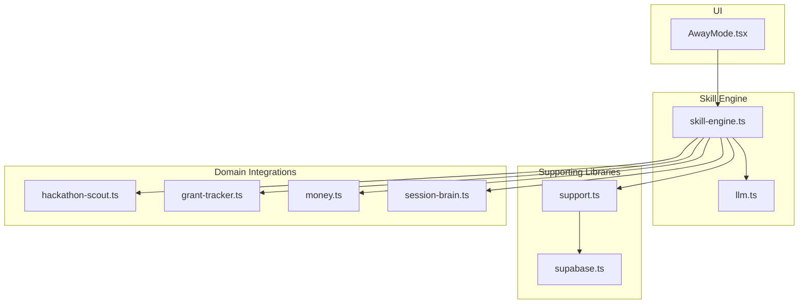
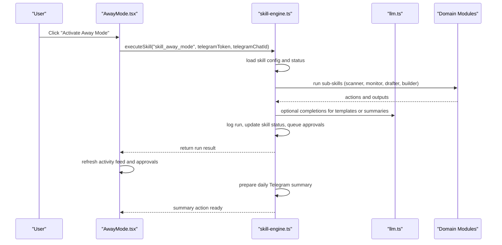
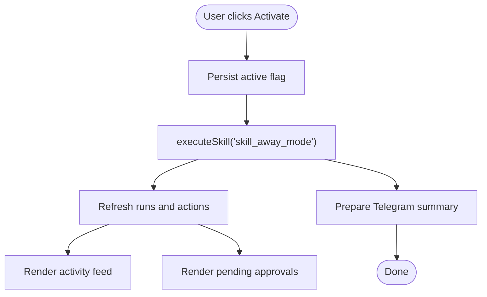
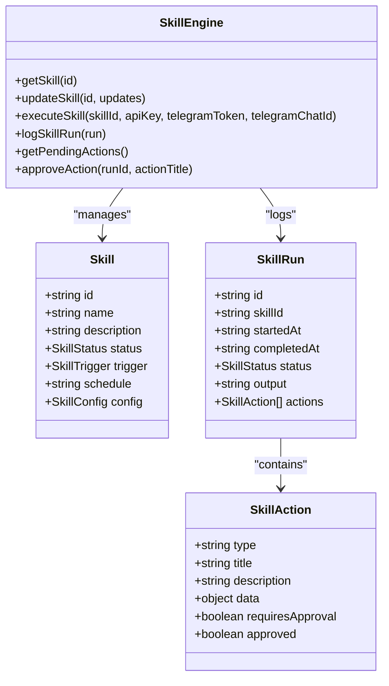
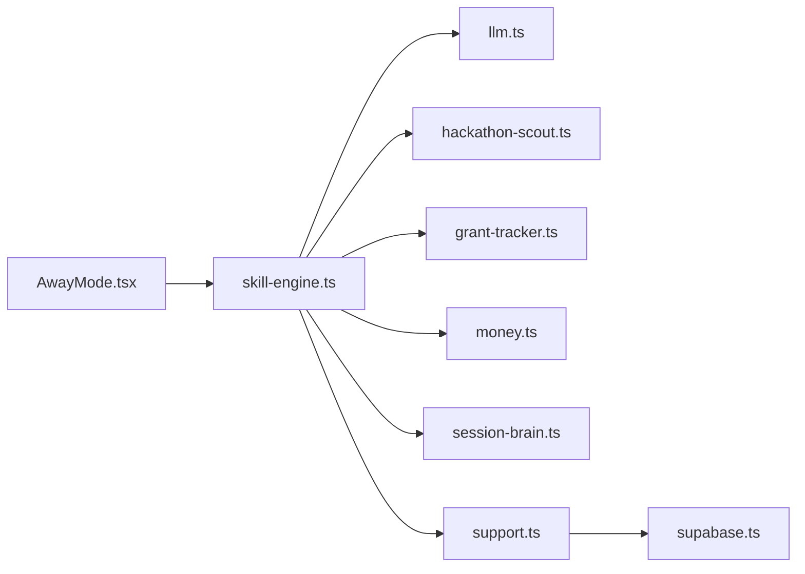

# Away Mode

<cite>
**Referenced Files in This Document**
- [AwayMode.tsx](file://src/components/skills/AwayMode.tsx)
- [skill-engine.ts](file://src/lib/skill-engine.ts)
- [llm.ts](file://src/lib/llm.ts)
- [support.ts](file://src/lib/support.ts)
- [hackathon-scout.ts](file://src/lib/hackathon-scout.ts)
- [grant-tracker.ts](file://src/lib/grant-tracker.ts)
- [money.ts](file://src/lib/money.ts)
- [session-brain.ts](file://src/lib/session-brain.ts)
- [supabase.ts](file://src/lib/supabase.ts)
</cite>

## Table of Contents
1. [Introduction](#introduction)
2. [Project Structure](#project-structure)
3. [Core Components](#core-components)
4. [Architecture Overview](#architecture-overview)
5. [Detailed Component Analysis](#detailed-component-analysis)
6. [Dependency Analysis](#dependency-analysis)
7. [Performance Considerations](#performance-considerations)
8. [Troubleshooting Guide](#troubleshooting-guide)
9. [Conclusion](#conclusion)
10. [Appendices](#appendices)

## Introduction
Away Mode is the autonomous operation layer of the Core Brim Tech Operating System (CBT OS). It enables users to activate a “do-not-disturb” state where the system continues to run critical skills—scouting opportunities, drafting applications, monitoring competition, and reporting—without requiring the user’s presence. The system sends a concise daily summary to Telegram and holds high-stakes actions for manual approval, preserving context and continuity across runs.

Away Mode is implemented as a skill within the Skill Engine, orchestrated by the UI component that manages activation, configuration, and visibility of activity logs and approvals.

## Project Structure
Away Mode spans several modules:
- UI component: renders activation controls, Telegram setup, pending approvals, and activity feed
- Skill Engine: defines skills, schedules, execution, and persistence
- LLM layer: provides unified access to Claude or Gemini for AI-powered content generation
- Supporting libraries: templates, scheduler, notifications, and data stores
- Domain integrations: grant tracking, hackathon scouting, revenue, and session continuity

**Diagram sources**
- [AwayMode.tsx](file://src/components/skills/AwayMode.tsx#L56-L331)
- [skill-engine.ts](file://src/lib/skill-engine.ts#L1-L764)
- [llm.ts](file://src/lib/llm.ts#L1-L135)
- [support.ts](file://src/lib/support.ts#L1-L753)
- [supabase.ts](file://src/lib/supabase.ts#L1-L292)
- [hackathon-scout.ts](file://src/lib/hackathon-scout.ts#L1-L377)
- [grant-tracker.ts](file://src/lib/grant-tracker.ts#L1-L297)
- [money.ts](file://src/lib/money.ts#L1-L221)
- [session-brain.ts](file://src/lib/session-brain.ts#L1-L278)

**Section sources**
- [AwayMode.tsx](file://src/components/skills/AwayMode.tsx#L56-L331)
- [skill-engine.ts](file://src/lib/skill-engine.ts#L1-L764)

## Core Components
- AwayMode UI component
  - Activation/deactivation controls
  - Telegram setup and connectivity status
  - Pending approvals queue
  - Activity feed and quick stats
- Skill Engine
  - Built-in skills and configuration
  - Execution orchestration and persistence
  - Action queue and approval gating
- LLM layer
  - Provider selection and API key management
  - Completion requests with timeouts and errors
- Supporting libraries
  - Email templates and template filling
  - Scheduler for recurring jobs
  - Notifications and system alerts
- Domain integrations
  - Grant tracking and scoring
  - Hackathon scouting and fit scoring
  - Revenue and client pipeline
  - Session continuity and context preservation

**Section sources**
- [AwayMode.tsx](file://src/components/skills/AwayMode.tsx#L56-L331)
- [skill-engine.ts](file://src/lib/skill-engine.ts#L1-L764)
- [llm.ts](file://src/lib/llm.ts#L1-L135)
- [support.ts](file://src/lib/support.ts#L1-L753)

## Architecture Overview
Away Mode is a skill that orchestrates other skills when activated. It compiles a daily summary and posts it to Telegram, while holding high-stakes actions for manual approval. The Skill Engine persists runs, tracks actions, and exposes a queue of pending approvals.

**Diagram sources**
- [AwayMode.tsx](file://src/components/skills/AwayMode.tsx#L83-L99)
- [skill-engine.ts](file://src/lib/skill-engine.ts#L351-L431)
- [llm.ts](file://src/lib/llm.ts#L128-L135)

## Detailed Component Analysis

### AwayMode UI Component
Responsibilities:
- Toggle Away Mode on/off and persist state locally
- Execute the skill immediately upon activation
- Manage Telegram bot configuration (token and chat ID)
- Render activity feed, pending approvals, and quick stats
- Integrate with other modules for revenue, grants, and hackathons

Key behaviors:
- Reads and writes activation state to localStorage
- Calls executeSkill with optional Telegram credentials
- Updates internal state and re-fetches runs and pending actions
- Renders a compact activity feed and approval queue

**Diagram sources**
- [AwayMode.tsx](file://src/components/skills/AwayMode.tsx#L83-L99)

**Section sources**
- [AwayMode.tsx](file://src/components/skills/AwayMode.tsx#L56-L331)

### Skill Engine and Execution
Responsibilities:
- Define built-in skills and their configurations
- Execute skills by ID, logging runs and updating statuses
- Orchestrate sub-skills for Away Mode
- Maintain action queues and approval gating
- Persist runs and skill metadata

Execution highlights:
- executeSkill routes to specific runners based on skillId
- runAwayMode orchestrates scanner, monitor, drafter, and builder
- Actions are marked requiresApproval and later approved via the queue
- SkillRun includes tokensUsed and costUSD for cost tracking

**Diagram sources**
- [skill-engine.ts](file://src/lib/skill-engine.ts#L38-L56)
- [skill-engine.ts](file://src/lib/skill-engine.ts#L15-L26)
- [skill-engine.ts](file://src/lib/skill-engine.ts#L28-L36)
- [skill-engine.ts](file://src/lib/skill-engine.ts#L351-L431)

**Section sources**
- [skill-engine.ts](file://src/lib/skill-engine.ts#L1-L764)

### AI-Powered Content Generation
Capabilities:
- Unified LLM layer supports Claude and Google providers
- Provider preference and API keys stored in localStorage
- Request timeout handling and error propagation
- Used by skills for content generation and summarization

Integration points:
- Skills call complete() with prompts and optional system prompts
- Timeout protection prevents hanging requests
- Errors surfaced as SkillRun failures

**Section sources**
- [llm.ts](file://src/lib/llm.ts#L1-L135)

### Response Template Management and Automation
Capabilities:
- Email templates with variable substitution
- Template categories and built-in sets
- Usage tracking and persistence
- Fill template function replaces placeholders

Automation:
- Templates can be used by skills to generate standardized responses
- Variable placeholders enable dynamic personalization
- Templates integrate with the scheduler and notifications

**Section sources**
- [support.ts](file://src/lib/support.ts#L444-L624)

### Escalation Patterns and Approval Queue
Mechanism:
- Skills mark high-stakes actions with requiresApproval
- Pending actions are aggregated and displayed in the UI
- Approve action updates run state and marks executedAt

Benefits:
- Prevents unintended actions while maintaining autonomy
- Preserves audit trail with run logs and timestamps
- Enables asynchronous decision-making

**Section sources**
- [skill-engine.ts](file://src/lib/skill-engine.ts#L292-L319)

### Conversation Continuity and Context Preservation
Mechanisms:
- Session Brain captures session entries, decisions, tasks, and notes
- Session summaries generated on end
- Active session persisted for continuity across runs

Implications:
- Context preserved across skill runs and user sessions
- Decisions and ideas captured for later synthesis
- Energy level and project tagging support prioritization

**Section sources**
- [session-brain.ts](file://src/lib/session-brain.ts#L1-L278)

### Integration with External Communication Channels
Telegram integration:
- Telegram token and chat ID stored in skill config
- Daily summary posted via a telegram action
- Connectivity status shown in UI

Other integrations:
- Email templates for outbound messages
- Notifications system for deadlines and opportunities
- Scheduler for recurring jobs

**Section sources**
- [AwayMode.tsx](file://src/components/skills/AwayMode.tsx#L202-L269)
- [skill-engine.ts](file://src/lib/skill-engine.ts#L729-L763)
- [support.ts](file://src/lib/support.ts#L626-L692)

### Availability Schedules and Timing Controls
Scheduler:
- Predefined jobs for grant drafter, opportunity scanner, competitor monitor, and weekly report
- Job toggles and next run calculation
- Logging of job runs and run counts

Timing controls:
- Daily and weekly schedules for recurring skills
- Daily briefing time configurable in skill config
- Local activation state persists across browser sessions

**Section sources**
- [support.ts](file://src/lib/support.ts#L626-L692)
- [skill-engine.ts](file://src/lib/skill-engine.ts#L190-L208)

### Common Use Cases and Examples
- Email auto-responses
  - Use email templates with variable substitution for personalized replies
  - Schedule follow-ups and reminders via notifications
- Meeting scheduling conflicts
  - Use session continuity to preserve context across scheduling decisions
  - Capture decisions and notes for later synthesis
- Customer inquiry handling
  - Use Proposal Writer or Lead Outreach skills to draft responses
  - Hold submissions for approval to prevent unintended sends

**Section sources**
- [support.ts](file://src/lib/support.ts#L444-L624)
- [skill-engine.ts](file://src/lib/skill-engine.ts#L440-L490)
- [session-brain.ts](file://src/lib/session-brain.ts#L145-L166)

## Dependency Analysis
Key dependencies:
- AwayMode UI depends on Skill Engine for activation and data
- Skill Engine depends on LLM layer for completions
- Skill Engine integrates with domain modules for data and actions
- Supporting libraries provide templates, scheduler, and notifications
- Supabase layer synchronizes data across devices

**Diagram sources**
- [AwayMode.tsx](file://src/components/skills/AwayMode.tsx#L56-L331)
- [skill-engine.ts](file://src/lib/skill-engine.ts#L1-L764)
- [llm.ts](file://src/lib/llm.ts#L1-L135)
- [support.ts](file://src/lib/support.ts#L1-L753)
- [supabase.ts](file://src/lib/supabase.ts#L1-L292)
- [hackathon-scout.ts](file://src/lib/hackathon-scout.ts#L1-L377)
- [grant-tracker.ts](file://src/lib/grant-tracker.ts#L1-L297)
- [money.ts](file://src/lib/money.ts#L1-L221)
- [session-brain.ts](file://src/lib/session-brain.ts#L1-L278)

**Section sources**
- [AwayMode.tsx](file://src/components/skills/AwayMode.tsx#L56-L331)
- [skill-engine.ts](file://src/lib/skill-engine.ts#L1-L764)

## Performance Considerations
- Local storage usage: All state is persisted in localStorage; consider migration to IndexedDB for larger datasets
- LLM request timeouts: Requests are aborted after a fixed timeout to prevent hangs
- Scheduler efficiency: Jobs are stored in localStorage; consider server-side scheduling for background execution
- UI responsiveness: Activity feed and approvals are refreshed after each run; debounce frequent refreshes if needed

[No sources needed since this section provides general guidance]

## Troubleshooting Guide
Common issues and resolutions:
- No AI API key configured
  - Symptom: LLM completion throws an error
  - Resolution: Configure Claude or Google API key in Settings
- Telegram not connected
  - Symptom: Daily summary not sent
  - Resolution: Enter bot token and chat ID in Away Mode setup
- Pending approvals not appearing
  - Symptom: Actions created but not shown as pending
  - Resolution: Approve actions from the pending queue; ensure requiresApproval is set
- Runs not logged
  - Symptom: Activity feed empty
  - Resolution: Ensure executeSkill is called and Skill Engine is initialized

**Section sources**
- [llm.ts](file://src/lib/llm.ts#L128-L135)
- [AwayMode.tsx](file://src/components/skills/AwayMode.tsx#L202-L269)
- [skill-engine.ts](file://src/lib/skill-engine.ts#L292-L319)

## Conclusion
Away Mode transforms the CBT OS into a truly autonomous system that operates seamlessly while the user is unavailable. By orchestrating core skills, preserving context, and maintaining a strict approval gate for high-stakes actions, it balances autonomy with control. The integration with Telegram, templates, and scheduling provides a robust foundation for external communications and intelligent automation.

[No sources needed since this section summarizes without analyzing specific files]

## Appendices

### Configuration Options
- Telegram
  - Bot token and chat ID stored in skill config
  - Daily summary posted via telegram action
- Skill scheduling
  - Predefined daily and weekly jobs
  - Enable/disable jobs and manage next run
- Tone and customization
  - Email templates support variable substitution
  - Skills expose configuration for tone and behavior

**Section sources**
- [AwayMode.tsx](file://src/components/skills/AwayMode.tsx#L202-L269)
- [support.ts](file://src/lib/support.ts#L444-L624)
- [support.ts](file://src/lib/support.ts#L626-L692)