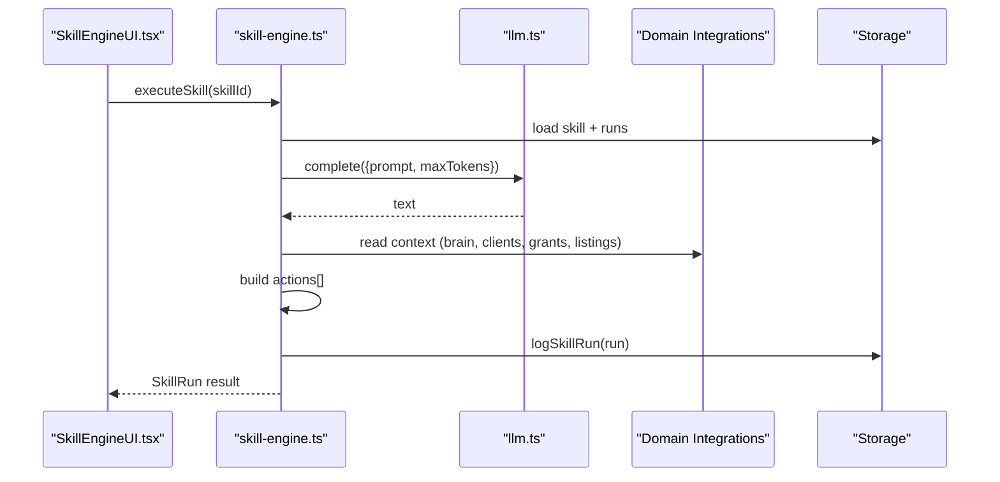
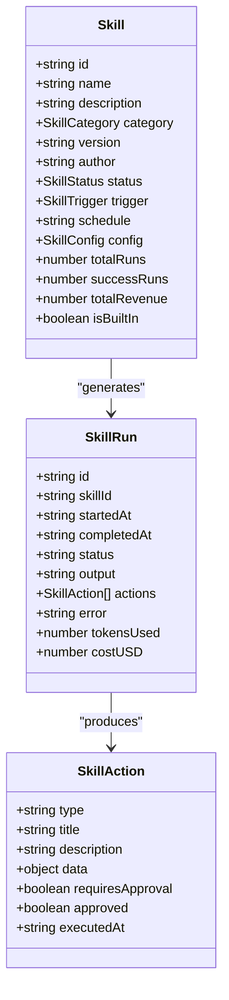
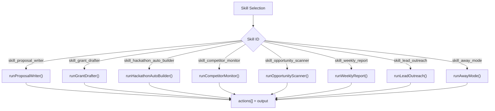
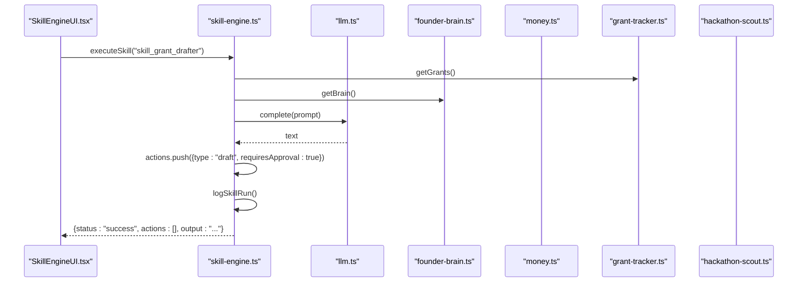
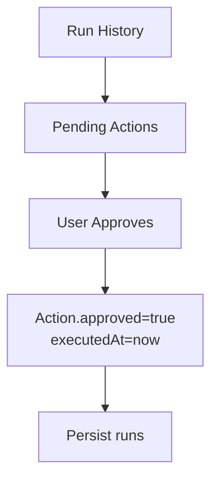
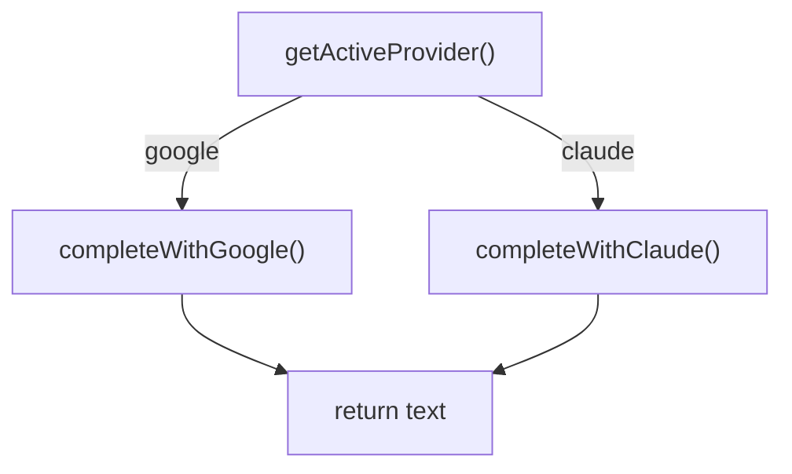
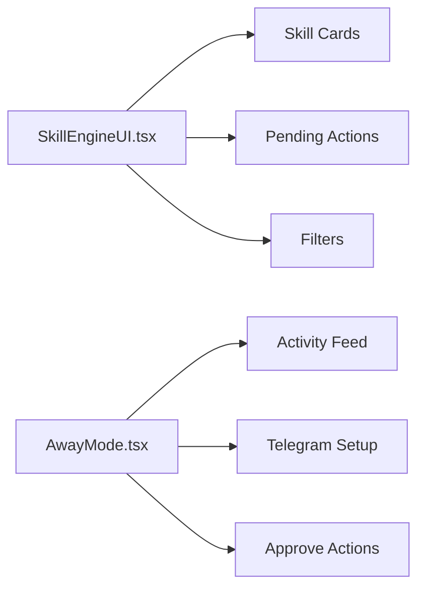
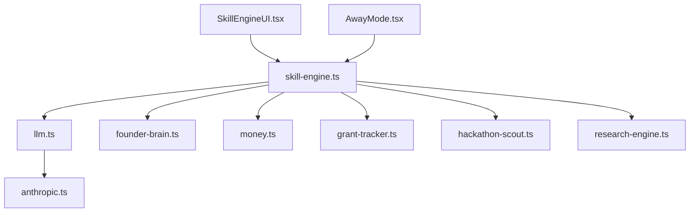

# Skill Engine

<cite>
**Referenced Files in This Document**
- [skill-engine.ts](file://src/lib/skill-engine.ts)
- [SkillEngineUI.tsx](file://src/components/skills/SkillEngineUI.tsx)
- [AwayMode.tsx](file://src/components/skills/AwayMode.tsx)
- [llm.ts](file://src/lib/llm.ts)
- [anthropic.ts](file://src/lib/anthropic.ts)
- [founder-brain.ts](file://src/lib/founder-brain.ts)
- [money.ts](file://src/lib/money.ts)
- [grant-tracker.ts](file://src/lib/grant-tracker.ts)
- [hackathon-scout.ts](file://src/lib/hackathon-scout.ts)
- [research-engine.ts](file://src/lib/research-engine.ts)
</cite>

## Table of Contents
1. [Introduction](#introduction)
2. [Project Structure](#project-structure)
3. [Core Components](#core-components)
4. [Architecture Overview](#architecture-overview)
5. [Detailed Component Analysis](#detailed-component-analysis)
6. [Dependency Analysis](#dependency-analysis)
7. [Performance Considerations](#performance-considerations)
8. [Troubleshooting Guide](#troubleshooting-guide)
9. [Conclusion](#conclusion)
10. [Appendices](#appendices)

## Introduction
The Skill Engine is an autonomous runtime that powers injectable, self-contained capabilities within the Core Brim Tech Operating System (CBT OS). Each skill is a modular agent capable of running on demand or on a schedule, orchestrating task automation and workflow orchestration across revenue, research, outreach, monitoring, reporting, and automation domains. Skills integrate with AI providers (Claude and Gemini) to perform intelligent tasks, maintain run history and action queues, and expose a UI for operators to manage, monitor, and approve autonomous actions.

## Project Structure
The Skill Engine spans a small set of cohesive modules:
- Runtime and orchestration: skill definitions, execution, storage, and action queue
- UI surfaces: Skill Engine dashboard and Away Mode
- AI integration: unified LLM layer with provider selection and timeouts
- Domain integrations: Founder Brain, Money (client pipeline and revenue), Grant Tracker, Hackathon Scout, Research Engine

```mermaid
graph TB
subgraph "Runtime"
SE["Skill Engine<br/>executeSkill(), run handlers"]
ST["Storage<br/>localStorage keys"]
AQ["Action Queue<br/>pending approvals"]
end
subgraph "UI"
UI["SkillEngineUI.tsx<br/>dashboard"]
AM["AwayMode.tsx<br/>autonomous mode"]
end
subgraph "AI"
LLM["llm.ts<br/>complete()"]
AN["anthropic.ts<br/>fetchWithTimeout()"]
end
subgraph "Domain Integrations"
FB["founder-brain.ts<br/>context"]
MONEY["money.ts<br/>clients, revenue"]
GT["grant-tracker.ts<br/>grants"]
HS["hackathon-scout.ts<br/>listings"]
RE["research-engine.ts<br/>deep research"]
end
UI --> SE
AM --> SE
SE --> LLM
LLM --> AN
SE --> FB
SE --> MONEY
SE --> GT
SE --> HS
SE --> RE
SE --> ST
SE --> AQ
```

**Diagram sources**
- [skill-engine.ts](file://src/lib/skill-engine.ts#L340-L764)
- [SkillEngineUI.tsx](file://src/components/skills/SkillEngineUI.tsx#L288-L397)
- [AwayMode.tsx](file://src/components/skills/AwayMode.tsx#L56-L331)
- [llm.ts](file://src/lib/llm.ts#L1-L135)
- [anthropic.ts](file://src/lib/anthropic.ts#L1-L32)
- [founder-brain.ts](file://src/lib/founder-brain.ts#L92-L104)
- [money.ts](file://src/lib/money.ts#L74-L130)
- [grant-tracker.ts](file://src/lib/grant-tracker.ts#L239-L246)
- [hackathon-scout.ts](file://src/lib/hackathon-scout.ts#L222-L230)
- [research-engine.ts](file://src/lib/research-engine.ts#L206-L394)

**Section sources**
- [skill-engine.ts](file://src/lib/skill-engine.ts#L1-L764)
- [SkillEngineUI.tsx](file://src/components/skills/SkillEngineUI.tsx#L1-L397)
- [AwayMode.tsx](file://src/components/skills/AwayMode.tsx#L1-L331)
- [llm.ts](file://src/lib/llm.ts#L1-L135)
- [anthropic.ts](file://src/lib/anthropic.ts#L1-L32)
- [founder-brain.ts](file://src/lib/founder-brain.ts#L1-L213)
- [money.ts](file://src/lib/money.ts#L1-L221)
- [grant-tracker.ts](file://src/lib/grant-tracker.ts#L1-L297)
- [hackathon-scout.ts](file://src/lib/hackathon-scout.ts#L1-L377)
- [research-engine.ts](file://src/lib/research-engine.ts#L1-L519)

## Core Components
- Skill model and lifecycle: typed skill metadata, status, scheduling, and configuration
- Built-in skills catalog: curated capabilities for revenue, monitoring, outreach, reporting, and automation
- Execution engine: dispatch by skill id, run handler per skill, logging, and stats
- Storage: localStorage-backed persistence for skills, runs, and queue
- Action queue: pending approvals with granular action metadata
- Stats and analytics: counts, success rates, and revenue aggregation
- AI provider integration: unified completion with Claude/Gemini, timeouts, and error handling
- Domain integrations: context from Founder Brain, client pipeline, grants, hackathons, and research

**Section sources**
- [skill-engine.ts](file://src/lib/skill-engine.ts#L7-L56)
- [skill-engine.ts](file://src/lib/skill-engine.ts#L60-L209)
- [skill-engine.ts](file://src/lib/skill-engine.ts#L219-L288)
- [skill-engine.ts](file://src/lib/skill-engine.ts#L290-L338)
- [llm.ts](file://src/lib/llm.ts#L35-L135)

## Architecture Overview
The Skill Engine is a client-side autonomous runtime with a clear separation of concerns:
- UI layer renders skill cards, filters, and action approvals
- Runtime orchestrates skill execution, maintains state, and persists logs
- AI layer abstracts provider selection and request handling
- Domain integrations supply contextual data for skill prompts and actions



**Diagram sources**
- [SkillEngineUI.tsx](file://src/components/skills/SkillEngineUI.tsx#L134-L144)
- [skill-engine.ts](file://src/lib/skill-engine.ts#L351-L431)
- [llm.ts](file://src/lib/llm.ts#L128-L135)
- [founder-brain.ts](file://src/lib/founder-brain.ts#L92-L98)
- [money.ts](file://src/lib/money.ts#L74-L76)
- [grant-tracker.ts](file://src/lib/grant-tracker.ts#L239-L246)
- [hackathon-scout.ts](file://src/lib/hackathon-scout.ts#L222-L230)

## Detailed Component Analysis

### Skill Model and Lifecycle
- Types define status, triggers, categories, and configuration shape
- Built-in skills enumerate capabilities with defaults and schedules
- Storage keys encapsulate skills, runs, and queue
- Lifecycle: init → run → log → update stats → return result



**Diagram sources**
- [skill-engine.ts](file://src/lib/skill-engine.ts#L7-L56)
- [skill-engine.ts](file://src/lib/skill-engine.ts#L15-L36)

**Section sources**
- [skill-engine.ts](file://src/lib/skill-engine.ts#L7-L56)
- [skill-engine.ts](file://src/lib/skill-engine.ts#L213-L242)

### Built-in Skills Catalog
- Proposal Writer: drafts client proposals using Founder Brain context
- Grant Application Drafter: auto-drafts applications for high-fit grants
- Hackathon Auto-Builder: auto-builds high-fit hackathons
- Competitor Monitor: intelligence summary for monitored competitors
- Opportunity Scanner: daily scan across platforms
- Weekly Report Generator: weekly report and optional Telegram posting
- Lead Outreach Writer: personalized outreach messages
- Away Mode: orchestrates other skills and sends daily summaries



**Diagram sources**
- [skill-engine.ts](file://src/lib/skill-engine.ts#L376-L403)
- [skill-engine.ts](file://src/lib/skill-engine.ts#L440-L490)
- [skill-engine.ts](file://src/lib/skill-engine.ts#L504-L562)
- [skill-engine.ts](file://src/lib/skill-engine.ts#L589-L613)
- [skill-engine.ts](file://src/lib/skill-engine.ts#L615-L636)
- [skill-engine.ts](file://src/lib/skill-engine.ts#L638-L658)
- [skill-engine.ts](file://src/lib/skill-engine.ts#L660-L686)
- [skill-engine.ts](file://src/lib/skill-engine.ts#L688-L727)
- [skill-engine.ts](file://src/lib/skill-engine.ts#L729-L763)

**Section sources**
- [skill-engine.ts](file://src/lib/skill-engine.ts#L60-L209)

### Execution Engine and Orchestration
- executeSkill resolves provider, initializes run, delegates to skill runner, logs outcome, updates stats
- Skill runners compose prompts from domain data, call LLM, and produce actions requiring approval
- Action queue aggregates pending approvals across runs and skills



**Diagram sources**
- [skill-engine.ts](file://src/lib/skill-engine.ts#L351-L431)
- [skill-engine.ts](file://src/lib/skill-engine.ts#L504-L562)
- [llm.ts](file://src/lib/llm.ts#L128-L135)
- [grant-tracker.ts](file://src/lib/grant-tracker.ts#L239-L246)
- [founder-brain.ts](file://src/lib/founder-brain.ts#L92-L98)

**Section sources**
- [skill-engine.ts](file://src/lib/skill-engine.ts#L351-L431)
- [skill-engine.ts](file://src/lib/skill-engine.ts#L504-L562)

### Action Queue and Approval Flow
- Pending actions are computed from runs and skills
- Approvals mark actions as approved and recorded with timestamps
- UI surfaces pending actions with expandable previews



**Diagram sources**
- [skill-engine.ts](file://src/lib/skill-engine.ts#L292-L319)
- [SkillEngineUI.tsx](file://src/components/skills/SkillEngineUI.tsx#L353-L362)

**Section sources**
- [skill-engine.ts](file://src/lib/skill-engine.ts#L292-L319)
- [SkillEngineUI.tsx](file://src/components/skills/SkillEngineUI.tsx#L46-L117)

### AI Provider Integration
- Provider selection prefers configured provider and key
- Unified completion function routes to Claude or Gemini
- Timeout handling and error extraction for robust operation



**Diagram sources**
- [llm.ts](file://src/lib/llm.ts#L35-L46)
- [llm.ts](file://src/lib/llm.ts#L57-L88)
- [llm.ts](file://src/lib/llm.ts#L90-L122)
- [llm.ts](file://src/lib/llm.ts#L128-L135)

**Section sources**
- [llm.ts](file://src/lib/llm.ts#L35-L135)
- [anthropic.ts](file://src/lib/anthropic.ts#L8-L32)

### Domain Integrations
- Founder Brain supplies company context, products, milestones, and competitors
- Money provides client pipeline and revenue entries for proposal/outreach workflows
- Grant Tracker provides grant opportunities and statuses for drafting workflows
- Hackathon Scout provides listings and scoring for auto-building workflows
- Research Engine provides streaming research reports for deep analysis

**Section sources**
- [founder-brain.ts](file://src/lib/founder-brain.ts#L92-L104)
- [money.ts](file://src/lib/money.ts#L74-L130)
- [grant-tracker.ts](file://src/lib/grant-tracker.ts#L239-L246)
- [hackathon-scout.ts](file://src/lib/hackathon-scout.ts#L222-L230)
- [research-engine.ts](file://src/lib/research-engine.ts#L206-L394)

### UI Surfaces
- SkillEngineUI: dashboard for managing skills, viewing stats, and approving actions
- AwayMode: autonomous orchestration with Telegram integration and activity feed



**Diagram sources**
- [SkillEngineUI.tsx](file://src/components/skills/SkillEngineUI.tsx#L288-L397)
- [AwayMode.tsx](file://src/components/skills/AwayMode.tsx#L56-L331)

**Section sources**
- [SkillEngineUI.tsx](file://src/components/skills/SkillEngineUI.tsx#L1-L397)
- [AwayMode.tsx](file://src/components/skills/AwayMode.tsx#L1-L331)

## Dependency Analysis
- Coupling: Skill engine depends on LLM layer and domain integrations; UI depends on runtime; no circular dependencies observed
- Cohesion: Each skill runner encapsulates its own logic and data sourcing
- External dependencies: localStorage for persistence, Anthropic/Gemini APIs for completions



**Diagram sources**
- [skill-engine.ts](file://src/lib/skill-engine.ts#L5-L5)
- [llm.ts](file://src/lib/llm.ts#L1-L10)
- [anthropic.ts](file://src/lib/anthropic.ts#L1-L4)
- [SkillEngineUI.tsx](file://src/components/skills/SkillEngineUI.tsx#L10-L15)
- [AwayMode.tsx](file://src/components/skills/AwayMode.tsx#L9-L12)

**Section sources**
- [skill-engine.ts](file://src/lib/skill-engine.ts#L1-L10)
- [llm.ts](file://src/lib/llm.ts#L1-L10)
- [anthropic.ts](file://src/lib/anthropic.ts#L1-L4)
- [SkillEngineUI.tsx](file://src/components/skills/SkillEngineUI.tsx#L1-L16)
- [AwayMode.tsx](file://src/components/skills/AwayMode.tsx#L1-L16)

## Performance Considerations
- Provider selection and caching: prefer configured provider and key to minimize retries
- Prompt sizing: adjust maxTokens per skill to balance quality and cost
- Batch operations: domain integrations already use efficient storage patterns
- UI responsiveness: keep run history capped and action previews lazy-expanded
- Network timeouts: Anthropic requests include 2-minute timeouts; Gemini requests use similar patterns

[No sources needed since this section provides general guidance]

## Troubleshooting Guide
- Missing API key: completion throws if no provider key is configured
- Request timeouts: Anthropic requests abort after 2 minutes; Gemini follows similar patterns
- Invalid provider responses: errors extracted and surfaced as run failures
- Action approvals: ensure approvals are recorded with timestamps to prevent re-execution

**Section sources**
- [llm.ts](file://src/lib/llm.ts#L128-L135)
- [anthropic.ts](file://src/lib/anthropic.ts#L8-L32)
- [skill-engine.ts](file://src/lib/skill-engine.ts#L420-L431)
- [skill-engine.ts](file://src/lib/skill-engine.ts#L310-L319)

## Conclusion
The Skill Engine provides a robust, extensible foundation for autonomous task automation and workflow orchestration. Its modular skill architecture, integrated AI provider layer, and approval-driven action queue enable safe, scalable autonomy across revenue, research, outreach, monitoring, reporting, and automation. The UI surfaces offer transparency and control, while domain integrations ensure skills operate with rich, contextual data.

## Appendices

### Practical Automation Scenarios
- Data processing workflows: Opportunity Scanner and Competitor Monitor surface structured insights for downstream analysis
- Notification systems: Weekly Report Generator and Away Mode post summaries to Telegram
- Routine maintenance tasks: Grant Drafter and Hackathon Auto-Builder prepare materials for high-fit opportunities

[No sources needed since this section provides general guidance]

### Configuration Options and Execution Priorities
- Skill configuration: per-skill key-value pairs controlling behavior (e.g., thresholds, toggles)
- Trigger types: manual, scheduled, event-driven
- Scheduling: daily/weekly cadences for scheduled skills
- Execution priorities: skills can be toggled active/paused; success rates and revenue metrics inform prioritization

**Section sources**
- [skill-engine.ts](file://src/lib/skill-engine.ts#L11-L13)
- [skill-engine.ts](file://src/lib/skill-engine.ts#L46-L48)
- [skill-engine.ts](file://src/lib/skill-engine.ts#L36-L42)

### Debugging and Self-Improvement
- Debugging: inspect run history, action previews, and error messages in the UI
- Error handling: centralized try/catch in executeSkill logs failures and updates status
- Self-improvement: success rates and revenue metrics can guide tuning of skill configurations and prompts

**Section sources**
- [SkillEngineUI.tsx](file://src/components/skills/SkillEngineUI.tsx#L215-L235)
- [skill-engine.ts](file://src/lib/skill-engine.ts#L420-L431)
- [skill-engine.ts](file://src/lib/skill-engine.ts#L323-L338)