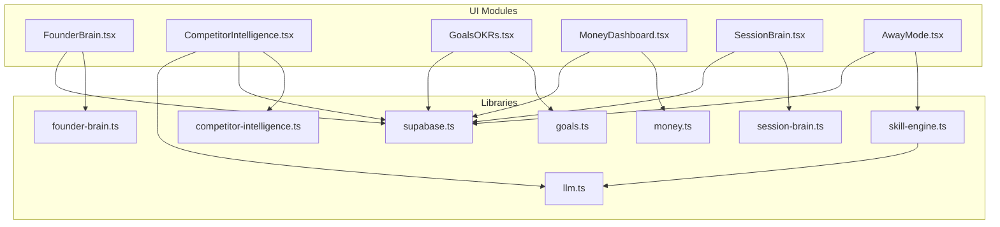
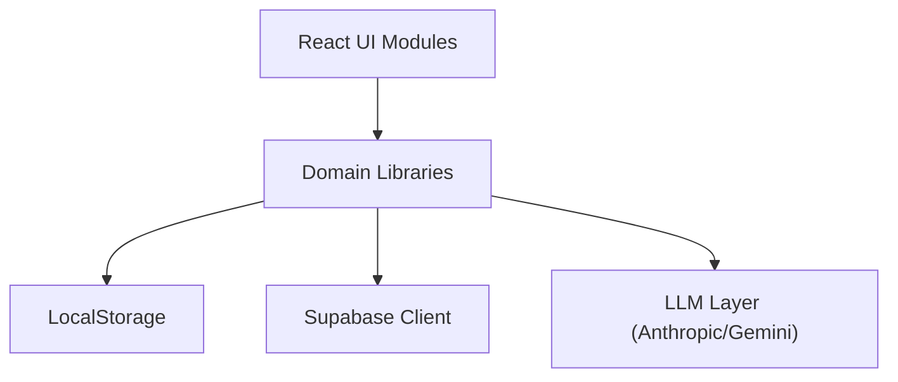
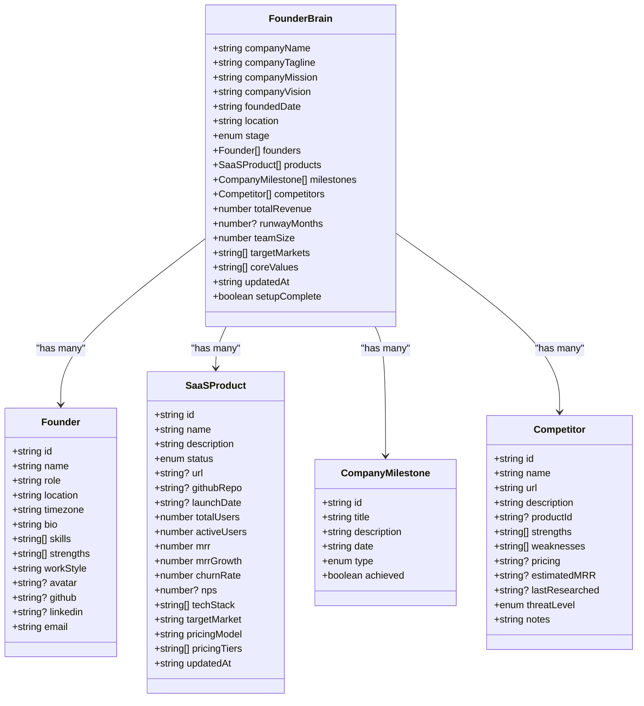
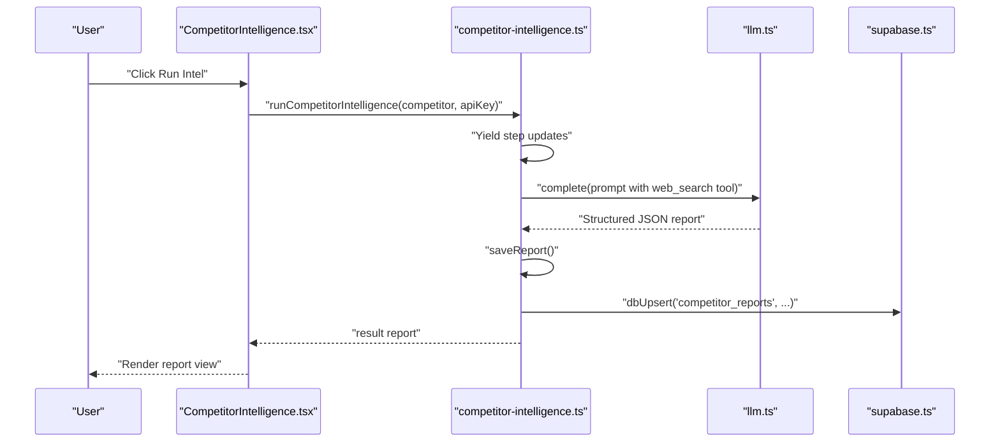
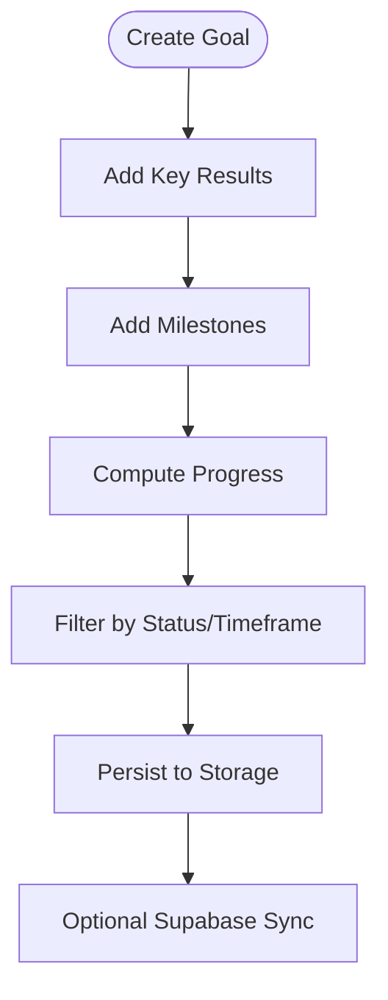
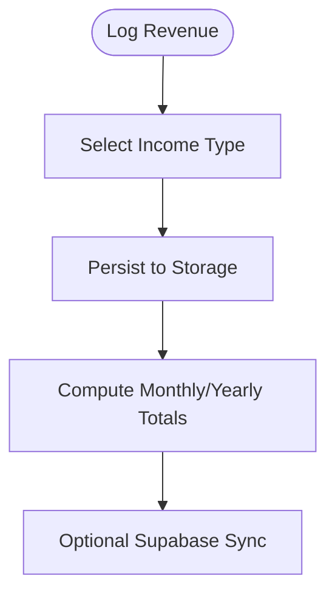
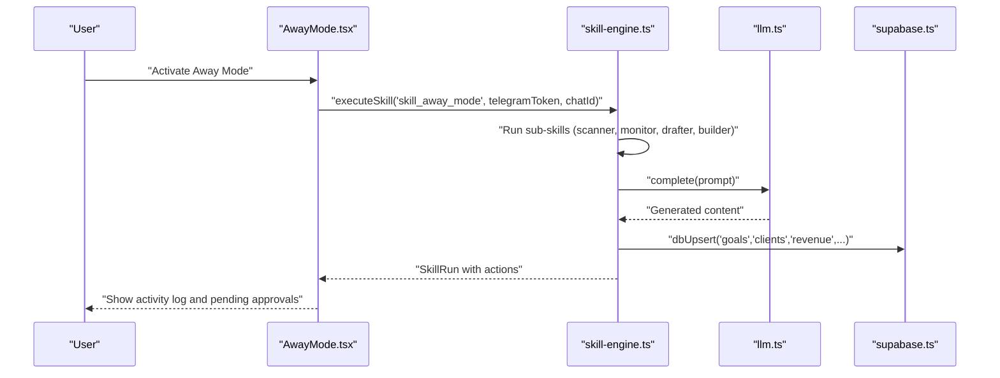
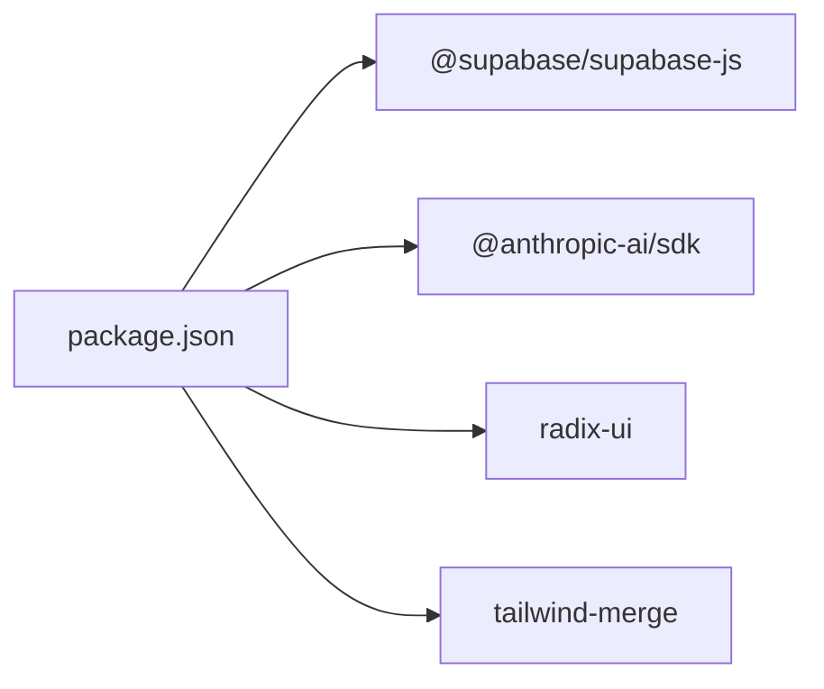

# Core Modules

<cite>
**Referenced Files in This Document**
- [README.md](file://README.md)
- [package.json](file://package.json)
- [src/app/layout.tsx](file://src/app/layout.tsx)
- [src/lib/supabase.ts](file://src/lib/supabase.ts)
- [src/lib/llm.ts](file://src/lib/llm.ts)
- [src/components/brain/FounderBrain.tsx](file://src/components/brain/FounderBrain.tsx)
- [src/lib/founder-brain.ts](file://src/lib/founder-brain.ts)
- [src/components/intelligence/CompetitorIntelligence.tsx](file://src/components/intelligence/CompetitorIntelligence.tsx)
- [src/lib/competitor-intelligence.ts](file://src/lib/competitor-intelligence.ts)
- [src/components/goals/GoalsOKRs.tsx](file://src/components/goals/GoalsOKRs.tsx)
- [src/lib/goals.ts](file://src/lib/goals.ts)
- [src/components/money/MoneyDashboard.tsx](file://src/components/money/MoneyDashboard.tsx)
- [src/lib/money.ts](file://src/lib/money.ts)
- [src/components/session/SessionBrain.tsx](file://src/components/session/SessionBrain.tsx)
- [src/lib/session-brain.ts](file://src/lib/session-brain.ts)
- [src/components/skills/AwayMode.tsx](file://src/components/skills/AwayMode.tsx)
- [src/lib/skill-engine.ts](file://src/lib/skill-engine.ts)
</cite>

## Table of Contents
1. [Introduction](#introduction)
2. [Project Structure](#project-structure)
3. [Core Components](#core-components)
4. [Architecture Overview](#architecture-overview)
5. [Detailed Component Analysis](#detailed-component-analysis)
6. [Dependency Analysis](#dependency-analysis)
7. [Performance Considerations](#performance-considerations)
8. [Troubleshooting Guide](#troubleshooting-guide)
9. [Conclusion](#conclusion)
10. [Appendices](#appendices)

## Introduction
This document describes the Core Brim Tech OS core modules and how they work together to power an internal operating system for the company. It covers the foundational intelligence layer (Founder Brain), competitive intelligence, operational tools (goals, sessions, ideas), financial management (dashboard, grants, invoices), and autonomous systems (skills, away mode). It also explains how modules integrate with shared services like Supabase and AI providers, and outlines configuration, customization, and extension points for future development.

## Project Structure
The application is a Next.js app with a modular component and library structure:
- UI components under src/components organize each module (e.g., brain, intelligence, goals, money, session, skills).
- Shared libraries under src/lib encapsulate domain logic, persistence, and integrations (e.g., Supabase, LLM providers).
- Supabase migrations define the database schema for persistent data.

**Diagram sources**
- [src/components/brain/FounderBrain.tsx](file://src/components/brain/FounderBrain.tsx#L1-L774)
- [src/lib/founder-brain.ts](file://src/lib/founder-brain.ts#L1-L213)
- [src/components/intelligence/CompetitorIntelligence.tsx](file://src/components/intelligence/CompetitorIntelligence.tsx#L1-L406)
- [src/lib/competitor-intelligence.ts](file://src/lib/competitor-intelligence.ts#L1-L298)
- [src/components/goals/GoalsOKRs.tsx](file://src/components/goals/GoalsOKRs.tsx#L1-L416)
- [src/lib/goals.ts](file://src/lib/goals.ts#L1-L252)
- [src/components/money/MoneyDashboard.tsx](file://src/components/money/MoneyDashboard.tsx#L1-L366)
- [src/lib/money.ts](file://src/lib/money.ts#L1-L221)
- [src/components/session/SessionBrain.tsx](file://src/components/session/SessionBrain.tsx#L1-L742)
- [src/lib/session-brain.ts](file://src/lib/session-brain.ts#L1-L278)
- [src/components/skills/AwayMode.tsx](file://src/components/skills/AwayMode.tsx#L1-L331)
- [src/lib/skill-engine.ts](file://src/lib/skill-engine.ts#L1-L764)
- [src/lib/llm.ts](file://src/lib/llm.ts#L1-L135)
- [src/lib/supabase.ts](file://src/lib/supabase.ts#L1-L292)

**Section sources**
- [README.md](file://README.md#L1-L37)
- [package.json](file://package.json#L1-L36)
- [src/app/layout.tsx](file://src/app/layout.tsx#L1-L22)

## Core Components
This section summarizes each major module’s responsibilities, data models, and integration patterns.

- Founder Brain
  - Purpose: Persistent intelligence layer capturing company identity, products, competitors, milestones, and metrics.
  - Data models: Founder, SaaSProduct, CompanyMilestone, Competitor, FounderBrain.
  - Integration: Local storage with optional Supabase sync; exposes helpers to compute summaries and totals.
  - Responsibilities: Onboarding wizard, dashboard, metrics aggregation, and cloud sync.

- Intelligence (Competitor)
  - Purpose: Deep competitive research, delta tracking, and actionable counter-strategies.
  - Data models: CompetitorReport, CounterStrategy, CompetitorDelta.
  - Integration: LLM provider selection (Anthropic/Gemini), streaming execution, mock fallback.
  - Responsibilities: Run intelligence per competitor, render structured reports, and sync to cloud.

- Goals & OKRs
  - Purpose: Objective-Key Result tracking with milestones and progress calculation.
  - Data models: Goal, KeyResult, Milestone, GoalStatus, GoalTimeframe.
  - Integration: Local storage with optional Supabase sync.
  - Responsibilities: Create/update goals, manage KR and milestones, compute progress, starter goals.

- Money (Revenue & Client Pipeline)
  - Purpose: Track income streams and sales pipeline.
  - Data models: Client, RevenueEntry, RevenueGoal, DealStatus, IncomeType.
  - Integration: Local storage with optional Supabase sync.
  - Responsibilities: Log revenue, manage client deals, compute stats, and categorise income.

- Session Brain
  - Purpose: Session continuity and context capture during focused work.
  - Data models: Session, SessionEntry, Task, Decision.
  - Integration: Local storage with optional Supabase sync.
  - Responsibilities: Start/end sessions, capture entries, manage tasks and decisions, generate summaries.

- Autonomous Systems (Skills & Away Mode)
  - Purpose: Automated agents that scout opportunities, draft content, monitor threats, and run independently.
  - Data models: Skill, SkillRun, SkillAction, SkillConfig.
  - Integration: LLM provider selection, action queues, Telegram alerts, and cloud sync.
  - Responsibilities: Execute skills on schedule/manual/event, orchestrate “Away Mode,” and maintain run history.

**Section sources**
- [src/components/brain/FounderBrain.tsx](file://src/components/brain/FounderBrain.tsx#L1-L774)
- [src/lib/founder-brain.ts](file://src/lib/founder-brain.ts#L1-L213)
- [src/components/intelligence/CompetitorIntelligence.tsx](file://src/components/intelligence/CompetitorIntelligence.tsx#L1-L406)
- [src/lib/competitor-intelligence.ts](file://src/lib/competitor-intelligence.ts#L1-L298)
- [src/components/goals/GoalsOKRs.tsx](file://src/components/goals/GoalsOKRs.tsx#L1-L416)
- [src/lib/goals.ts](file://src/lib/goals.ts#L1-L252)
- [src/components/money/MoneyDashboard.tsx](file://src/components/money/MoneyDashboard.tsx#L1-L366)
- [src/lib/money.ts](file://src/lib/money.ts#L1-L221)
- [src/components/session/SessionBrain.tsx](file://src/components/session/SessionBrain.tsx#L1-L742)
- [src/lib/session-brain.ts](file://src/lib/session-brain.ts#L1-L278)
- [src/components/skills/AwayMode.tsx](file://src/components/skills/AwayMode.tsx#L1-L331)
- [src/lib/skill-engine.ts](file://src/lib/skill-engine.ts#L1-L764)

## Architecture Overview
The system combines local-first persistence with optional cloud synchronization and AI-driven automation.

**Diagram sources**
- [src/lib/supabase.ts](file://src/lib/supabase.ts#L1-L292)
- [src/lib/llm.ts](file://src/lib/llm.ts#L1-L135)
- [src/lib/founder-brain.ts](file://src/lib/founder-brain.ts#L1-L213)
- [src/lib/competitor-intelligence.ts](file://src/lib/competitor-intelligence.ts#L1-L298)
- [src/lib/goals.ts](file://src/lib/goals.ts#L1-L252)
- [src/lib/money.ts](file://src/lib/money.ts#L1-L221)
- [src/lib/session-brain.ts](file://src/lib/session-brain.ts#L1-L278)
- [src/lib/skill-engine.ts](file://src/lib/skill-engine.ts#L1-L764)

## Detailed Component Analysis

### Founder Brain Module
- Responsibilities
  - Onboarding wizard to capture company identity, products, competitors, and milestones.
  - Dashboard summarizing company metrics and key insights.
  - Cloud sync via Supabase for persistence and multi-device sync.
- Data models
  - Founder, SaaSProduct, CompanyMilestone, Competitor, FounderBrain.
- Integration patterns
  - Local storage for fast reads/writes; Supabase upsert/load for persistence.
  - Uses shared LLM provider selection for optional AI assistance.
- User workflows
  - Setup wizard → activate brain → view dashboard → edit as needed.
- Extension points
  - Additional product attributes, competitor categories, and metrics computation hooks.

**Diagram sources**
- [src/lib/founder-brain.ts](file://src/lib/founder-brain.ts#L4-L86)

**Section sources**
- [src/components/brain/FounderBrain.tsx](file://src/components/brain/FounderBrain.tsx#L1-L774)
- [src/lib/founder-brain.ts](file://src/lib/founder-brain.ts#L1-L213)
- [src/lib/supabase.ts](file://src/lib/supabase.ts#L129-L153)

### Intelligence Module (Competitor)
- Responsibilities
  - Deep research on competitors, scanning websites/news/pricing/team/funding.
  - Generate structured reports with recent activity, SWOT, opportunities, warnings, and counter-strategies.
  - Stream execution with progress steps and optional mock mode.
- Data models
  - CompetitorReport, CounterStrategy, CompetitorDelta.
- Integration patterns
  - Anthropic/Gemini via unified LLM layer; web search tool in real mode; mock mode for demos.
  - Cloud sync for reports.
- User workflows
  - Select competitor → run intelligence → view report sections → re-run as needed.
- Extension points
  - Add new sources, refine prompts, and introduce additional report sections.

**Diagram sources**
- [src/components/intelligence/CompetitorIntelligence.tsx](file://src/components/intelligence/CompetitorIntelligence.tsx#L177-L252)
- [src/lib/competitor-intelligence.ts](file://src/lib/competitor-intelligence.ts#L177-L216)
- [src/lib/llm.ts](file://src/lib/llm.ts#L128-L134)
- [src/lib/supabase.ts](file://src/lib/supabase.ts#L295-L297)

**Section sources**
- [src/components/intelligence/CompetitorIntelligence.tsx](file://src/components/intelligence/CompetitorIntelligence.tsx#L1-L406)
- [src/lib/competitor-intelligence.ts](file://src/lib/competitor-intelligence.ts#L1-L298)
- [src/lib/llm.ts](file://src/lib/llm.ts#L1-L135)
- [src/lib/supabase.ts](file://src/lib/supabase.ts#L292-L297)

### Operational Tools (Goals, Sessions, Ideas)
- Goals & OKRs
  - Responsibilities: Define goals, attach KRs and milestones, compute progress, and filter by status/timeframe.
  - Data models: Goal, KeyResult, Milestone.
  - Integration: Local storage with optional Supabase sync.
- Session Brain
  - Responsibilities: Capture session entries, manage tasks and decisions, generate summaries, and maintain history.
  - Data models: Session, SessionEntry, Task, Decision.
  - Integration: Local storage with optional Supabase sync.
- Ideas
  - Not present in the current codebase; can be modeled similarly to session entries or integrated into the session module.

**Diagram sources**
- [src/components/goals/GoalsOKRs.tsx](file://src/components/goals/GoalsOKRs.tsx#L336-L416)
- [src/lib/goals.ts](file://src/lib/goals.ts#L58-L69)
- [src/lib/goals.ts](file://src/lib/goals.ts#L146-L159)
- [src/lib/supabase.ts](file://src/lib/supabase.ts#L263-L277)

**Section sources**
- [src/components/goals/GoalsOKRs.tsx](file://src/components/goals/GoalsOKRs.tsx#L1-L416)
- [src/lib/goals.ts](file://src/lib/goals.ts#L1-L252)
- [src/components/session/SessionBrain.tsx](file://src/components/session/SessionBrain.tsx#L1-L742)
- [src/lib/session-brain.ts](file://src/lib/session-brain.ts#L1-L278)

### Financial Management (Dashboard, Grants, Invoices)
- Money Dashboard
  - Responsibilities: Track revenue by source, manage client pipeline, compute stats, and log entries.
  - Data models: Client, RevenueEntry, RevenueGoal.
  - Integration: Local storage with optional Supabase sync.
- Grants
  - Not present in the current codebase; can be modeled using RevenueGoal and synced to cloud.
- Invoices
  - Not present in the current codebase; can be modeled as RevenueEntry with invoice-specific fields.

**Diagram sources**
- [src/components/money/MoneyDashboard.tsx](file://src/components/money/MoneyDashboard.tsx#L145-L179)
- [src/lib/money.ts](file://src/lib/money.ts#L140-L146)
- [src/lib/money.ts](file://src/lib/money.ts#L152-L187)
- [src/lib/supabase.ts](file://src/lib/supabase.ts#L209-L220)

**Section sources**
- [src/components/money/MoneyDashboard.tsx](file://src/components/money/MoneyDashboard.tsx#L1-L366)
- [src/lib/money.ts](file://src/lib/money.ts#L1-L221)
- [src/lib/supabase.ts](file://src/lib/supabase.ts#L209-L220)

### Autonomous Systems (Skills, Away Mode)
- Skills
  - Responsibilities: Built-in agents for proposal writing, grant drafting, hackathon auto-building, competitor monitoring, opportunity scanning, weekly reporting, lead outreach, and away mode.
  - Data models: Skill, SkillRun, SkillAction, SkillConfig.
  - Integration: LLM provider selection, action queues, Telegram alerts, cloud sync.
- Away Mode
  - Responsibilities: Orchestrates skills while the app is open, sends daily briefings, and holds high-stakes actions for approval.

**Diagram sources**
- [src/components/skills/AwayMode.tsx](file://src/components/skills/AwayMode.tsx#L56-L99)
- [src/lib/skill-engine.ts](file://src/lib/skill-engine.ts#L351-L431)
- [src/lib/skill-engine.ts](file://src/lib/skill-engine.ts#L729-L763)
- [src/lib/llm.ts](file://src/lib/llm.ts#L128-L134)
- [src/lib/supabase.ts](file://src/lib/supabase.ts#L295-L297)

**Section sources**
- [src/components/skills/AwayMode.tsx](file://src/components/skills/AwayMode.tsx#L1-L331)
- [src/lib/skill-engine.ts](file://src/lib/skill-engine.ts#L1-L764)
- [src/lib/llm.ts](file://src/lib/llm.ts#L1-L135)
- [src/lib/supabase.ts](file://src/lib/supabase.ts#L292-L297)

## Dependency Analysis
- Internal dependencies
  - UI components depend on domain libraries for state and persistence.
  - Libraries depend on shared services (Supabase, LLM).
- External dependencies
  - Supabase JS client for database operations.
  - Anthropic SDK for Claude API access.
  - Radix UI and Tailwind for UI primitives and styling.

**Diagram sources**
- [package.json](file://package.json#L11-L22)

**Section sources**
- [package.json](file://package.json#L1-L36)

## Performance Considerations
- Local-first design minimizes latency for frequent reads/writes.
- Cloud sync is asynchronous and optional; failures are handled gracefully.
- LLM calls are rate-limited by timeouts and provider selection; mock mode avoids external calls for demos.
- Large lists (e.g., sessions, goals) are paginated or truncated in UI to avoid rendering overhead.

## Troubleshooting Guide
- Supabase not configured
  - Symptom: Cloud sync disabled; operations silently fall back to local storage.
  - Resolution: Set NEXT_PUBLIC_SUPABASE_URL and NEXT_PUBLIC_SUPABASE_ANON_KEY.
- LLM key missing
  - Symptom: Skills fail to run; mock mode may be used depending on implementation.
  - Resolution: Configure Anthropic or Google API key in settings; select preferred provider.
- Data sync errors
  - Symptom: Sync status shows error; partial data persisted locally.
  - Resolution: Inspect sync status, retry, or migrate local data to cloud.

**Section sources**
- [src/lib/supabase.ts](file://src/lib/supabase.ts#L14-L26)
- [src/lib/supabase.ts](file://src/lib/supabase.ts#L168-L181)
- [src/lib/llm.ts](file://src/lib/llm.ts#L128-L134)

## Conclusion
Core Brim Tech OS integrates local-first persistence with optional cloud synchronization and AI-driven automation to streamline company intelligence, operations, and autonomy. The modular design enables incremental development, easy customization, and robust extensibility for future modules like grants and invoices.

## Appendices

### Module-Specific Configuration Options
- LLM Provider Selection
  - Preferred provider and API keys are stored in localStorage; used by skills and intelligence.
- Skill Configurations
  - Built-in skills expose tunable parameters (e.g., thresholds, schedules, alerts).
- Telegram Alerts
  - Away Mode supports Telegram integration via token and chat ID.

**Section sources**
- [src/lib/llm.ts](file://src/lib/llm.ts#L6-L33)
- [src/lib/skill-engine.ts](file://src/lib/skill-engine.ts#L59-L209)
- [src/components/skills/AwayMode.tsx](file://src/components/skills/AwayMode.tsx#L236-L267)

### Customization and Extension Points
- Add new data models
  - Extend domain libraries with new interfaces and CRUD helpers; register localStorage keys and Supabase tables.
- Introduce new modules
  - Create UI component and library pair; wire into navigation and integrate with Supabase and LLM layers.
- Enhance skills
  - Add new skill runners and update the executor switch; define action types and approval flows.

**Section sources**
- [src/lib/supabase.ts](file://src/lib/supabase.ts#L30-L49)
- [src/lib/skill-engine.ts](file://src/lib/skill-engine.ts#L351-L431)