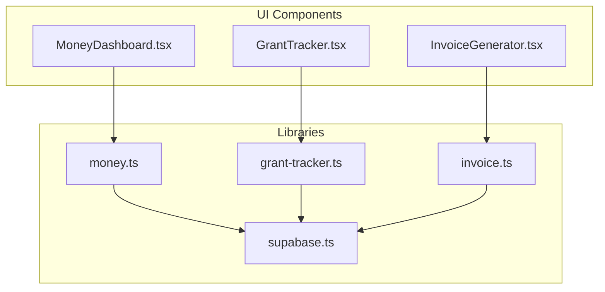
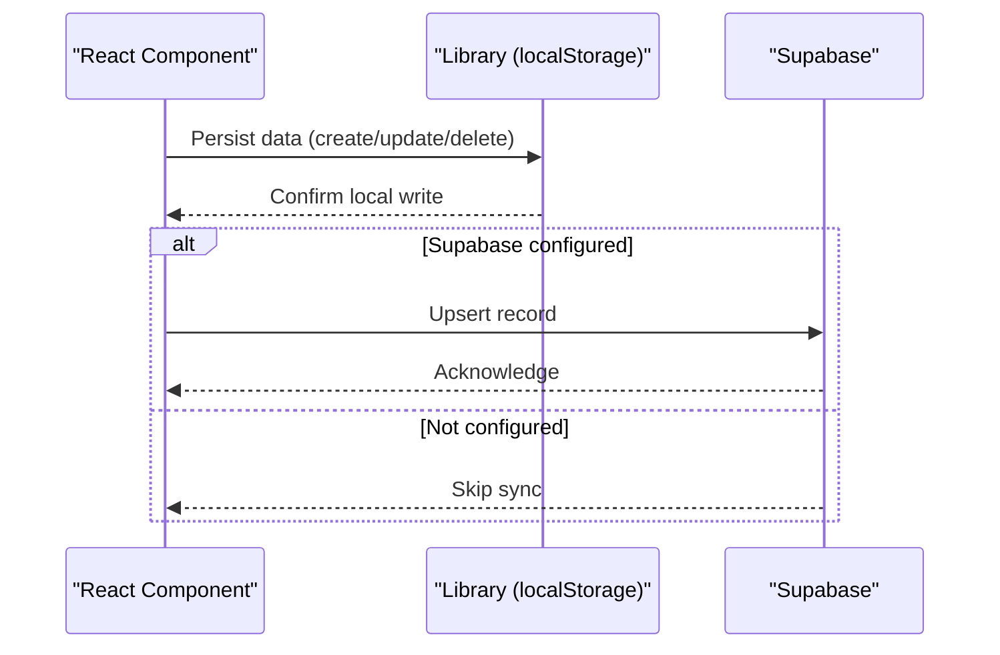
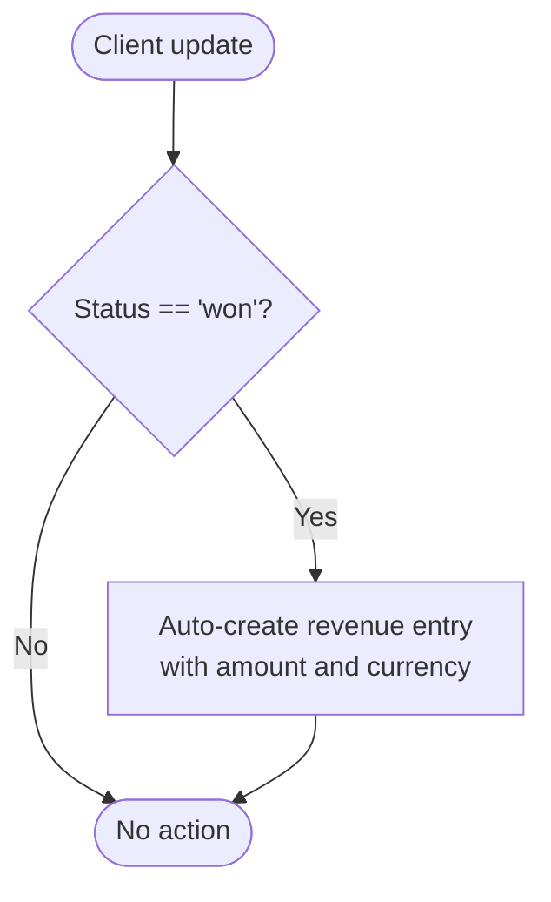
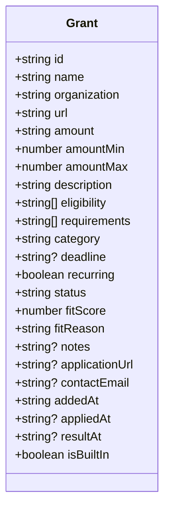
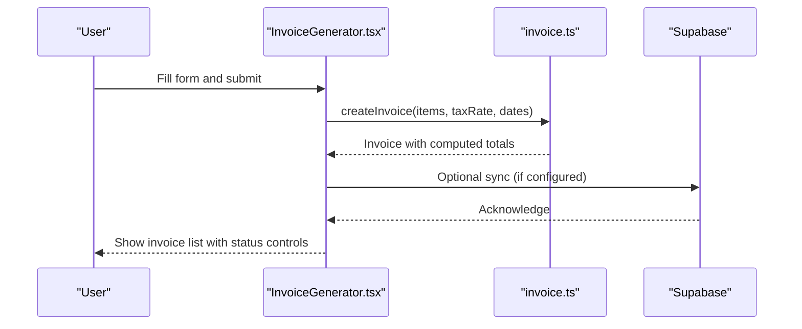
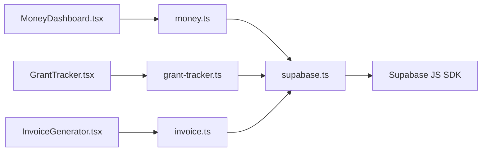

# Financial Management

<cite>
**Referenced Files in This Document**
- [MoneyDashboard.tsx](file://src/components/money/MoneyDashboard.tsx)
- [GrantTracker.tsx](file://src/components/money/GrantTracker.tsx)
- [InvoiceGenerator.tsx](file://src/components/money/InvoiceGenerator.tsx)
- [money.ts](file://src/lib/money.ts)
- [grant-tracker.ts](file://src/lib/grant-tracker.ts)
- [invoice.ts](file://src/lib/invoice.ts)
- [supabase.ts](file://src/lib/supabase.ts)
- [package.json](file://package.json)
- [README.md](file://README.md)
</cite>

## Table of Contents
1. [Introduction](#introduction)
2. [Project Structure](#project-structure)
3. [Core Components](#core-components)
4. [Architecture Overview](#architecture-overview)
5. [Detailed Component Analysis](#detailed-component-analysis)
6. [Dependency Analysis](#dependency-analysis)
7. [Performance Considerations](#performance-considerations)
8. [Troubleshooting Guide](#troubleshooting-guide)
9. [Conclusion](#conclusion)
10. [Appendices](#appendices)

## Introduction
This document explains the Financial Management modules in Core Brim Tech OS: Money Dashboard, Grant Tracker, and Invoice Generator. It covers how these modules collect, track, and visualize financial data, automate billing, and integrate with Supabase for persistence and synchronization. It also documents configuration options for currencies, tax calculations, and reporting capabilities, along with practical workflows and automation scenarios.

## Project Structure
The financial modules are organized as React components backed by lightweight local storage utilities with optional cloud synchronization via Supabase. The modules share a consistent pattern:
- UI components in src/components/money
- Business logic and persistence in src/lib
- Optional cloud sync through src/lib/supabase

**Diagram sources**
- [MoneyDashboard.tsx](file://src/components/money/MoneyDashboard.tsx#L1-L366)
- [GrantTracker.tsx](file://src/components/money/GrantTracker.tsx#L1-L249)
- [InvoiceGenerator.tsx](file://src/components/money/InvoiceGenerator.tsx#L1-L322)
- [money.ts](file://src/lib/money.ts#L1-L221)
- [grant-tracker.ts](file://src/lib/grant-tracker.ts#L1-L297)
- [invoice.ts](file://src/lib/invoice.ts#L1-L226)
- [supabase.ts](file://src/lib/supabase.ts#L1-L292)

**Section sources**
- [README.md](file://README.md#L1-L37)
- [package.json](file://package.json#L1-L36)

## Core Components
- Money Dashboard: Tracks client pipeline and revenue streams with Kanban-style stages, revenue logging, and analytics (all-time, monthly, yearly, growth, and income-type breakdown).
- Grant Tracker: Curates funding opportunities for African founders, ranks by fit, and tracks application lifecycle (watching, eligible, applying, submitted, won, rejected, missed).
- Invoice Generator: Creates professional invoices with line items, totals, tax calculation, status tracking, and printable HTML generation.

**Section sources**
- [MoneyDashboard.tsx](file://src/components/money/MoneyDashboard.tsx#L1-L366)
- [grant-tracker.ts](file://src/lib/grant-tracker.ts#L1-L297)
- [invoice.ts](file://src/lib/invoice.ts#L1-L226)

## Architecture Overview
The modules use a write-through persistence strategy:
- Local storage for fast offline-first UX
- Supabase for cloud sync and cross-device persistence

**Diagram sources**
- [supabase.ts](file://src/lib/supabase.ts#L57-L81)
- [money.ts](file://src/lib/money.ts#L209-L220)
- [grant-tracker.ts](file://src/lib/grant-tracker.ts#L290-L296)
- [invoice.ts](file://src/lib/invoice.ts#L46-L49)

## Detailed Component Analysis

### Money Dashboard
- Client Pipeline
  - Kanban-like statuses: lead, contacted, proposal, negotiating, won, lost, on_hold
  - Auto-logs revenue when a deal moves to won
  - Stats: active deals, pipeline value (weighted by win probability), won value, conversion rate
- Revenue Dashboard
  - Income types: hackathon, freelance, grant, consulting, product, other
  - Analytics: all-time, this year, this month, growth percentage, distribution by source
  - Revenue log with delete capability

**Diagram sources**
- [money.ts](file://src/lib/money.ts#L96-L108)

**Section sources**
- [MoneyDashboard.tsx](file://src/components/money/MoneyDashboard.tsx#L1-L366)
- [money.ts](file://src/lib/money.ts#L1-L221)

### Grant Tracker
- Built-in grants curated for African founders with fit scores and reasons
- Status lifecycle: watching, eligible, applying, submitted, won, rejected, missed
- Filtering by status or high-fit threshold
- Stats: total grants, eligible, applying, won, potential value

**Diagram sources**
- [grant-tracker.ts](file://src/lib/grant-tracker.ts#L7-L31)

**Section sources**
- [GrantTracker.tsx](file://src/components/money/GrantTracker.tsx#L1-L249)
- [grant-tracker.ts](file://src/lib/grant-tracker.ts#L1-L297)

### Invoice Generator
- Invoice creation with client info, line items, tax rate, due dates, and notes
- Automatic totals computation and invoice numbering
- Status tracking: draft, sent, paid, overdue, cancelled
- Preview/print via generated HTML

**Diagram sources**
- [InvoiceGenerator.tsx](file://src/components/money/InvoiceGenerator.tsx#L64-L111)
- [invoice.ts](file://src/lib/invoice.ts#L73-L88)
- [supabase.ts](file://src/lib/supabase.ts#L57-L66)

**Section sources**
- [InvoiceGenerator.tsx](file://src/components/money/InvoiceGenerator.tsx#L1-L322)
- [invoice.ts](file://src/lib/invoice.ts#L1-L226)

## Dependency Analysis
- Internal dependencies
  - Components depend on library modules for data access and persistence
  - Libraries encapsulate localStorage operations and optional Supabase sync
- External dependencies
  - Supabase client for cloud persistence
  - UI icons and styling via shared UI primitives

**Diagram sources**
- [money.ts](file://src/lib/money.ts#L209-L220)
- [grant-tracker.ts](file://src/lib/grant-tracker.ts#L290-L296)
- [invoice.ts](file://src/lib/invoice.ts#L46-L49)
- [supabase.ts](file://src/lib/supabase.ts#L5-L21)
- [package.json](file://package.json#L11-L22)

**Section sources**
- [package.json](file://package.json#L1-L36)
- [supabase.ts](file://src/lib/supabase.ts#L1-L292)

## Performance Considerations
- Local-first design minimizes latency and enables offline operation
- Supabase sync runs once on app load and can be triggered manually for migration or backup
- Invoices and grants lists are sorted and filtered client-side; consider pagination for large datasets
- Tax and totals computations are O(n) over line items

[No sources needed since this section provides general guidance]

## Troubleshooting Guide
- Supabase not configured
  - Symptom: No cloud sync occurs
  - Cause: Missing environment variables for Supabase URL/anonymous key
  - Resolution: Set NEXT_PUBLIC_SUPABASE_URL and NEXT_PUBLIC_SUPABASE_ANON_KEY
- Data not appearing across devices
  - Symptom: Local changes not reflected on another device
  - Resolution: Ensure Supabase is configured and run initial migration to push local data
- Invoice totals mismatch
  - Symptom: Discrepancy between subtotal, tax, and total
  - Resolution: Recompute totals after changing items or tax rate; totals are recalculated on update
- Grant list empty
  - Symptom: No grants shown
  - Resolution: Initialize grants on first run; built-in grants are seeded automatically

**Section sources**
- [supabase.ts](file://src/lib/supabase.ts#L23-L26)
- [grant-tracker.ts](file://src/lib/grant-tracker.ts#L223-L237)
- [invoice.ts](file://src/lib/invoice.ts#L90-L107)

## Conclusion
Core Brim Tech OS provides a cohesive financial management suite that combines intuitive UIs with robust local-first persistence and optional cloud synchronization. Money Dashboard offers clear visibility into revenue and sales pipelines, Grant Tracker helps founders discover and manage funding opportunities, and Invoice Generator streamlines billing with automated totals and professional printables.

[No sources needed since this section summarizes without analyzing specific files]

## Appendices

### Configuration Options
- Currency handling
  - Money Dashboard: Defaults to USD for clients and revenue
  - Invoice Generator: Supports configurable currency with multi-currency display
- Tax calculations
  - Invoice Generator: Percentage-based tax applied to subtotal; displayed and included in total
- Compliance and reporting
  - Export data as JSON/CSV for external systems
  - Sync to cloud for audit trails and cross-device continuity

**Section sources**
- [MoneyDashboard.tsx](file://src/components/money/MoneyDashboard.tsx#L49-L54)
- [InvoiceGenerator.tsx](file://src/components/money/InvoiceGenerator.tsx#L140-L143)
- [invoice.ts](file://src/lib/invoice.ts#L58-L63)
- [AllExtras.tsx](file://src/components/extras/AllExtras.tsx#L644-L670)

### Common Workflows and Automation Scenarios
- Track a new sale
  - Add a client in the pipeline; update status until “Won”; revenue auto-logs
- Monitor funding opportunities
  - Filter grants by “Best Fit” or “Applying”; update status as you apply
- Issue an invoice
  - Create invoice with line items and tax; preview/print; mark as sent/paid
- Automate recurring billing
  - Use revenue entries with recurring flags to track subscription-like income
- Cross-device continuity
  - Configure Supabase; run migration to push local data; enable sync on app load

**Section sources**
- [money.ts](file://src/lib/money.ts#L96-L108)
- [grant-tracker.ts](file://src/lib/grant-tracker.ts#L248-L255)
- [invoice.ts](file://src/lib/invoice.ts#L73-L88)
- [supabase.ts](file://src/lib/supabase.ts#L209-L246)