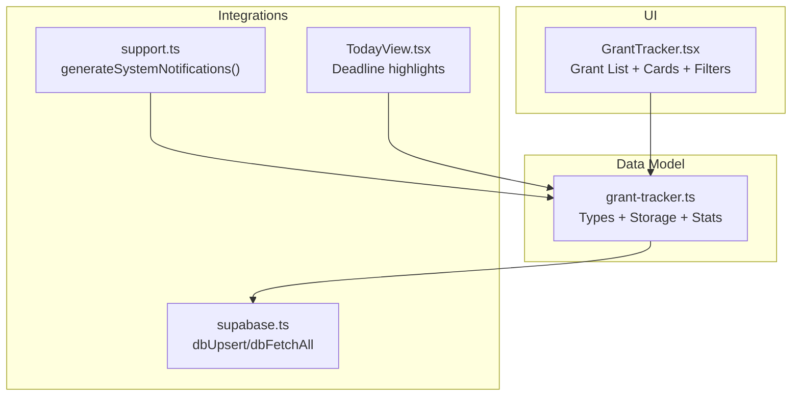
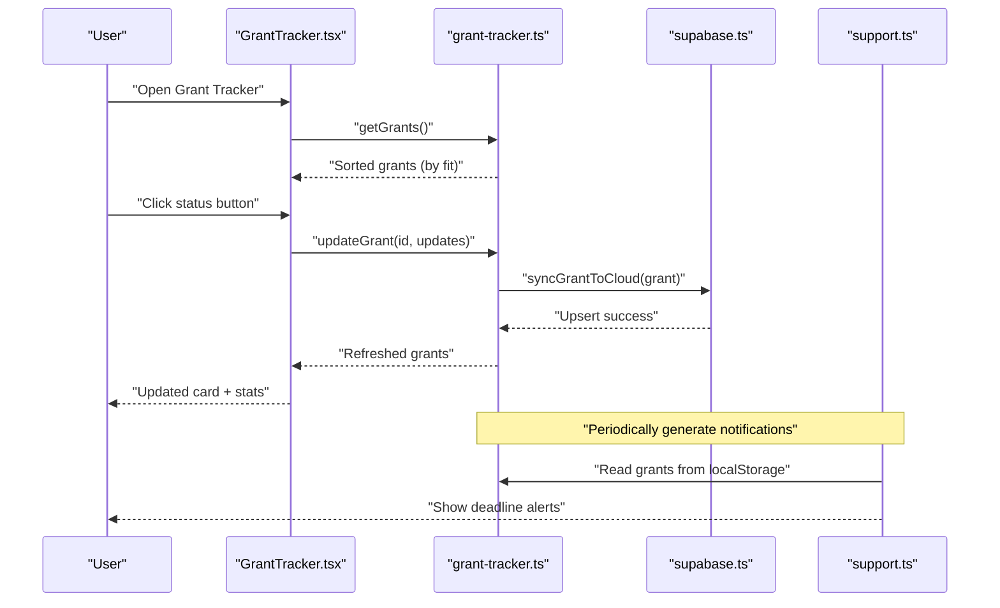
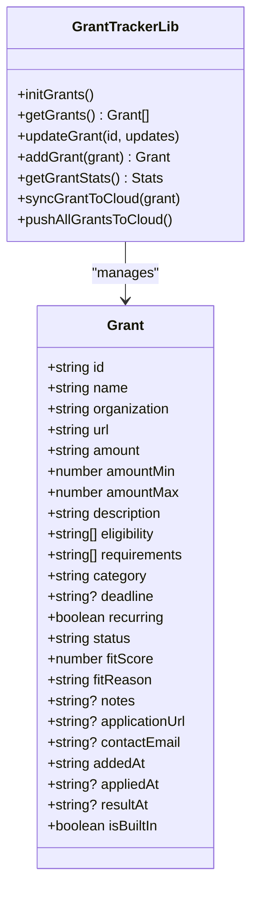
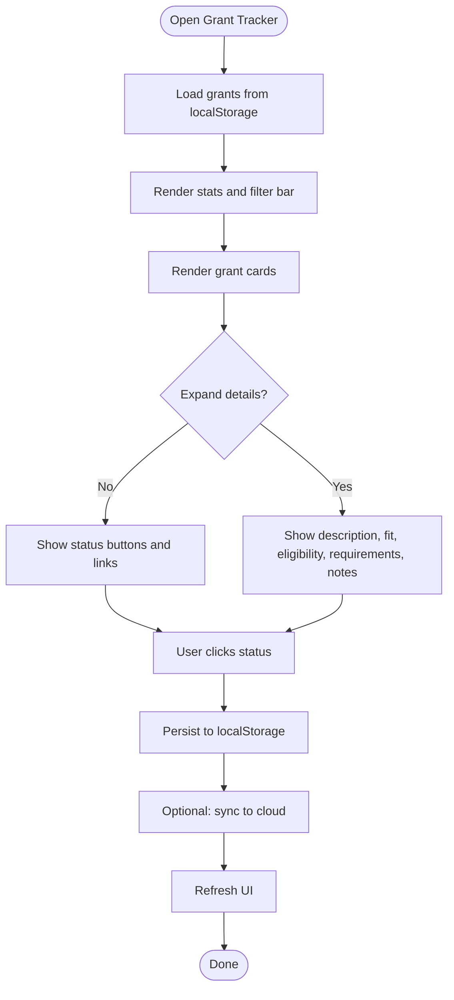
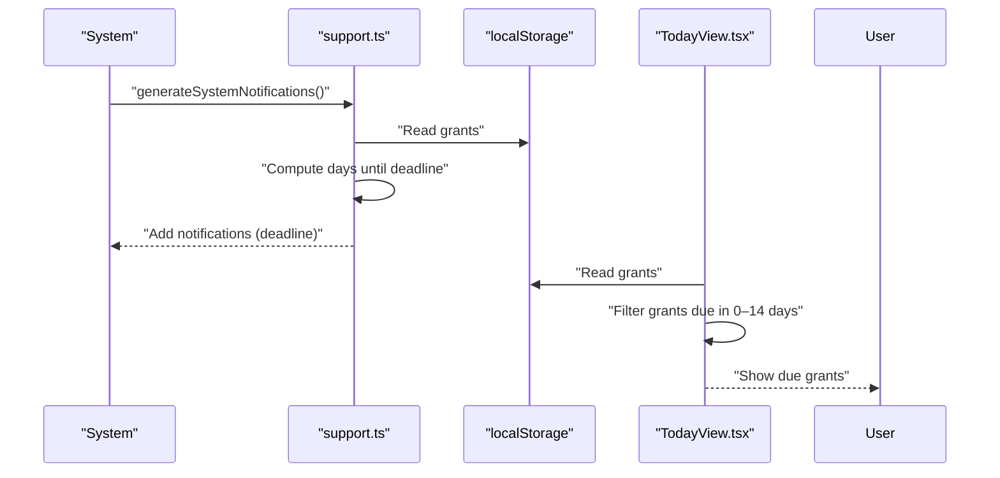
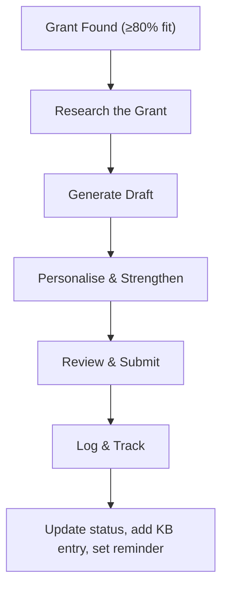
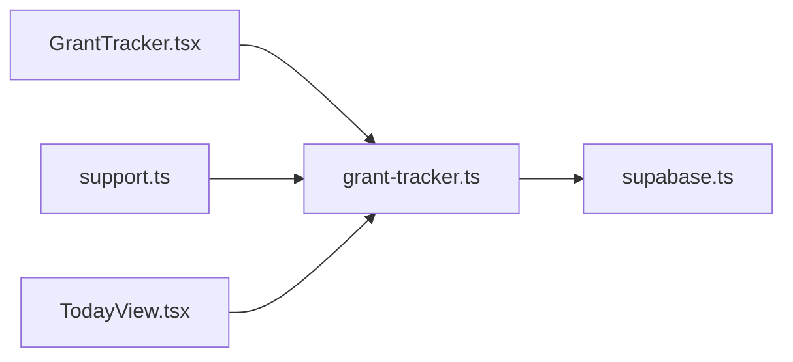

# Grant Tracker

<cite>
**Referenced Files in This Document**
- [grant-tracker.ts](file://src/lib/grant-tracker.ts)
- [GrantTracker.tsx](file://src/components/money/GrantTracker.tsx)
- [supabase.ts](file://src/lib/supabase.ts)
- [support.ts](file://src/lib/support.ts)
- [TodayView.tsx](file://src/components/today/TodayView.tsx)
- [20250228_add_support_tables.sql](file://supabase/migrations/20250228_add_support_tables.sql)
</cite>

## Table of Contents
1. [Introduction](#introduction)
2. [Project Structure](#project-structure)
3. [Core Components](#core-components)
4. [Architecture Overview](#architecture-overview)
5. [Detailed Component Analysis](#detailed-component-analysis)
6. [Dependency Analysis](#dependency-analysis)
7. [Performance Considerations](#performance-considerations)
8. [Troubleshooting Guide](#troubleshooting-guide)
9. [Conclusion](#conclusion)
10. [Appendices](#appendices)

## Introduction
The Grant Tracker module helps Core Brim Tech identify, apply for, and manage funding opportunities. It provides:
- Curated grant discovery for African founders
- Application tracking and status management
- Automated deadline alerts and notifications
- Built-in SOPs for grant applications
- Local-first storage with optional cloud sync via Supabase
- Knowledge base and portfolio logging for compliance and reporting

The system is designed to reduce friction in the grant lifecycle: from discovery and eligibility matching to submission and post-decision tracking.

## Project Structure
The Grant Tracker spans three primary areas:
- Data model and persistence: centralized in a dedicated library
- UI surface: a React component that renders grants, filters, and actions
- Integrations: Supabase for cloud sync and notifications for deadlines

**Diagram sources**
- [grant-tracker.ts](file://src/lib/grant-tracker.ts#L1-L31)
- [GrantTracker.tsx](file://src/components/money/GrantTracker.tsx#L167-L249)
- [supabase.ts](file://src/lib/supabase.ts#L57-L97)
- [support.ts](file://src/lib/support.ts#L378-L441)
- [TodayView.tsx](file://src/components/today/TodayView.tsx#L18-L48)

**Section sources**
- [grant-tracker.ts](file://src/lib/grant-tracker.ts#L1-L31)
- [GrantTracker.tsx](file://src/components/money/GrantTracker.tsx#L167-L249)
- [supabase.ts](file://src/lib/supabase.ts#L57-L97)
- [support.ts](file://src/lib/support.ts#L378-L441)
- [TodayView.tsx](file://src/components/today/TodayView.tsx#L18-L48)

## Core Components
- Grant data model and lifecycle:
  - Types define categories, statuses, and metadata for each grant
  - Built-in grants are curated for African founders and ranked by fit
  - Local storage is the primary store; cloud sync is optional
- UI for browsing and managing grants:
  - Filter by status or high fit (>80%)
  - Expand cards to review eligibility, requirements, and fit rationale
  - Update status with timestamps for applied and result dates
  - Open external links to learn more or apply
- Notifications and reminders:
  - System-generated deadline alerts for upcoming grants
  - Today view surfaces near-term deadlines
- SOPs for grant applications:
  - Step-by-step playbook to research, draft, personalize, review, and log applications
- Compliance and reporting:
  - Portfolio logging and Knowledge Base entries for audit trails
  - Win tracking and SOP usage statistics

**Section sources**
- [grant-tracker.ts](file://src/lib/grant-tracker.ts#L4-L31)
- [GrantTracker.tsx](file://src/components/money/GrantTracker.tsx#L8-L16)
- [support.ts](file://src/lib/support.ts#L241-L253)
- [support.ts](file://src/lib/support.ts#L378-L441)
- [TodayView.tsx](file://src/components/today/TodayView.tsx#L28-L33)

## Architecture Overview
The Grant Tracker follows a local-first architecture with optional cloud synchronization:
- Local state: grants stored in browser localStorage keyed by a dedicated storage key
- Cloud sync: write-through to Supabase using upsert operations
- Notifications: deadline alerts generated from local state
- UI: React component renders grants, applies filters, and updates status

**Diagram sources**
- [GrantTracker.tsx](file://src/components/money/GrantTracker.tsx#L167-L177)
- [grant-tracker.ts](file://src/lib/grant-tracker.ts#L239-L255)
- [grant-tracker.ts](file://src/lib/grant-tracker.ts#L290-L296)
- [supabase.ts](file://src/lib/supabase.ts#L57-L66)
- [support.ts](file://src/lib/support.ts#L378-L405)

## Detailed Component Analysis

### Data Model and Storage
- Types:
  - GrantStatus: Watching, Eligible, Applying, Submitted, Won, Rejected, Missed
  - GrantCategory: Startup, Tech, Social Impact, Research, Youth, Africa-specific
  - Grant interface includes identifiers, metadata, eligibility, requirements, fit score, and timestamps
- Built-in grants:
  - Preloaded grants curated for African founders, with fit scores and reasons
  - Recurring and non-recurring deadlines; curated tag for built-in grants
- Storage operations:
  - Initialize on first load, sort by fit score, update, add custom grants, compute stats
  - Optional cloud sync via Supabase upsert functions

**Diagram sources**
- [grant-tracker.ts](file://src/lib/grant-tracker.ts#L4-L31)
- [grant-tracker.ts](file://src/lib/grant-tracker.ts#L223-L296)

**Section sources**
- [grant-tracker.ts](file://src/lib/grant-tracker.ts#L4-L31)
- [grant-tracker.ts](file://src/lib/grant-tracker.ts#L37-L219)
- [grant-tracker.ts](file://src/lib/grant-tracker.ts#L223-L296)

### User Interface: Grant Browsing and Tracking
- Layout:
  - Header with module title and description
  - Stats dashboard summarizing total, eligible, applying, won, and potential value
  - Filter bar for “All Grants,” “High Fit,” and status-specific views
- Grant cards:
  - Title, organization, amount, status pill, optional deadline
  - Expandable details: description, fit rationale, eligibility, requirements, notes
  - Status buttons to move grants through the lifecycle
  - External links to learn more and apply
- Behavior:
  - Updates persist locally and optionally sync to cloud
  - Refreshes stats after each change

**Diagram sources**
- [GrantTracker.tsx](file://src/components/money/GrantTracker.tsx#L167-L249)
- [GrantTracker.tsx](file://src/components/money/GrantTracker.tsx#L30-L165)
- [grant-tracker.ts](file://src/lib/grant-tracker.ts#L239-L255)
- [grant-tracker.ts](file://src/lib/grant-tracker.ts#L290-L296)

**Section sources**
- [GrantTracker.tsx](file://src/components/money/GrantTracker.tsx#L167-L249)
- [GrantTracker.tsx](file://src/components/money/GrantTracker.tsx#L30-L165)

### Notifications and Deadline Management
- Automatic alerts:
  - System scans grants for upcoming deadlines (≤14 days) and creates notifications with urgency levels
  - Notifications include action labels and expiration tied to deadlines
- Today view:
  - Highlights grants due soon and integrates with the broader focus view

**Diagram sources**
- [support.ts](file://src/lib/support.ts#L378-L441)
- [TodayView.tsx](file://src/components/today/TodayView.tsx#L28-L33)

**Section sources**
- [support.ts](file://src/lib/support.ts#L378-L441)
- [TodayView.tsx](file://src/components/today/TodayView.tsx#L28-L33)

### SOPs: Grant Application Workflow
- Playbook structure:
  - Research the grant, generate a draft, personalize and strengthen, review and submit, log and track
  - Steps include checklists, time estimates, and optional tools
- Integration:
  - SOPs are stored locally and synced to cloud when configured
  - The SOPs module surfaces these playbooks for users to follow

**Diagram sources**
- [support.ts](file://src/lib/support.ts#L241-L253)

**Section sources**
- [support.ts](file://src/lib/support.ts#L241-L253)

### Compliance Tracking and Reporting
- Portfolio logging:
  - Wins can be logged with type, value, date, and tags for reporting
- Knowledge Base:
  - Entries categorized and tagged; useful for documenting approaches and lessons learned
- SOP usage:
  - Tracks how often playbooks are used and when last used
- Audit trail:
  - Status changes, notes, and timestamps provide a clear audit trail for internal and external reviews

**Section sources**
- [support.ts](file://src/lib/support.ts#L26-L84)
- [support.ts](file://src/lib/support.ts#L90-L172)
- [support.ts](file://src/lib/support.ts#L177-L298)

## Dependency Analysis
- Internal dependencies:
  - GrantTracker UI depends on grant-tracker library for data and stats
  - Notifications depend on grant state and generate alerts
  - Today view consumes grant data to highlight deadlines
- External dependencies:
  - Supabase client for optional cloud sync
  - Browser localStorage for persistence

**Diagram sources**
- [GrantTracker.tsx](file://src/components/money/GrantTracker.tsx#L5-L6)
- [grant-tracker.ts](file://src/lib/grant-tracker.ts#L288-L296)
- [supabase.ts](file://src/lib/supabase.ts#L57-L97)
- [support.ts](file://src/lib/support.ts#L378-L441)
- [TodayView.tsx](file://src/components/today/TodayView.tsx#L5-L9)

**Section sources**
- [GrantTracker.tsx](file://src/components/money/GrantTracker.tsx#L5-L6)
- [grant-tracker.ts](file://src/lib/grant-tracker.ts#L288-L296)
- [supabase.ts](file://src/lib/supabase.ts#L57-L97)
- [support.ts](file://src/lib/support.ts#L378-L441)
- [TodayView.tsx](file://src/components/today/TodayView.tsx#L5-L9)

## Performance Considerations
- Local-first design minimizes latency and avoids network overhead for typical operations
- Sorting by fit score occurs on read; keep the grant list size reasonable for smooth rendering
- Cloud sync is asynchronous and optional; failures are handled gracefully
- Notifications generation reads a small subset of grants and computes deadlines quickly

[No sources needed since this section provides general guidance]

## Troubleshooting Guide
- No grants appear:
  - Ensure initialization ran; the library initializes built-in grants on first load
- Status updates not reflected:
  - Verify localStorage availability and that updates are persisted
  - If cloud sync is enabled, confirm Supabase credentials and connectivity
- Deadlines not appearing:
  - Confirm grants have deadlines and are not in “Won” or “Rejected” status
  - Check notification filtering and expiration logic
- Cloud sync errors:
  - Verify environment variables for Supabase URL and anonymous key
  - Inspect console warnings for upsert errors

**Section sources**
- [grant-tracker.ts](file://src/lib/grant-tracker.ts#L223-L246)
- [grant-tracker.ts](file://src/lib/grant-tracker.ts#L248-L255)
- [supabase.ts](file://src/lib/supabase.ts#L14-L26)
- [supabase.ts](file://src/lib/supabase.ts#L57-L81)
- [support.ts](file://src/lib/support.ts#L378-L405)

## Conclusion
The Grant Tracker module provides a streamlined, local-first system for discovering, tracking, and applying to grants. Its integration with SOPs, notifications, and portfolio/Knowledge Base features supports a complete funding lifecycle—from discovery and preparation to submission and post-decision logging—while maintaining compliance and reporting readiness.

[No sources needed since this section summarizes without analyzing specific files]

## Appendices

### Appendix A: Cloud Setup and Migrations
- Supabase tables:
  - The migration script adds support module tables (e.g., wins, knowledge_base, sops, notifications, templates, scheduler)
- Sync behavior:
  - Local-first with optional write-through to Supabase
  - Sync status is tracked in localStorage

**Section sources**
- [20250228_add_support_tables.sql](file://supabase/migrations/20250228_add_support_tables.sql#L5-L45)
- [supabase.ts](file://src/lib/supabase.ts#L184-L203)
- [supabase.ts](file://src/lib/supabase.ts#L209-L246)