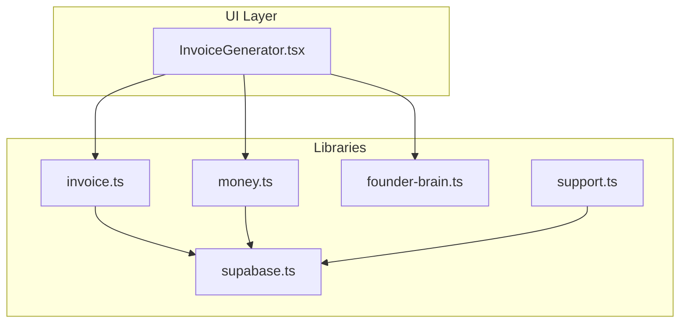
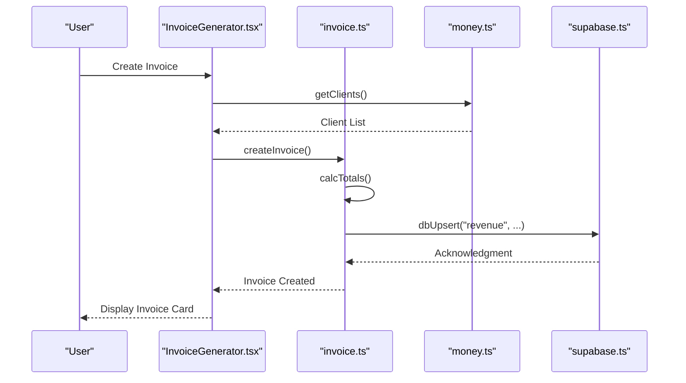
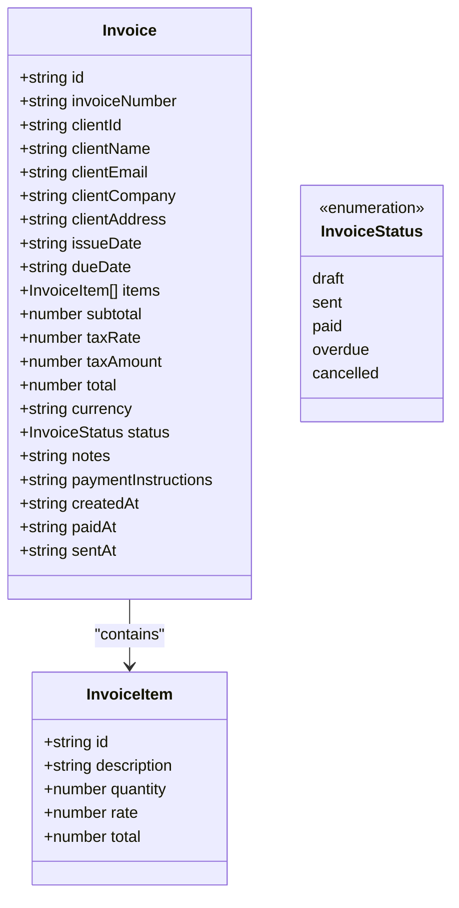
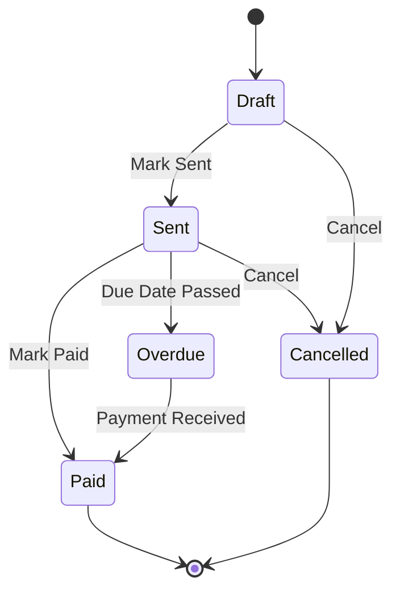
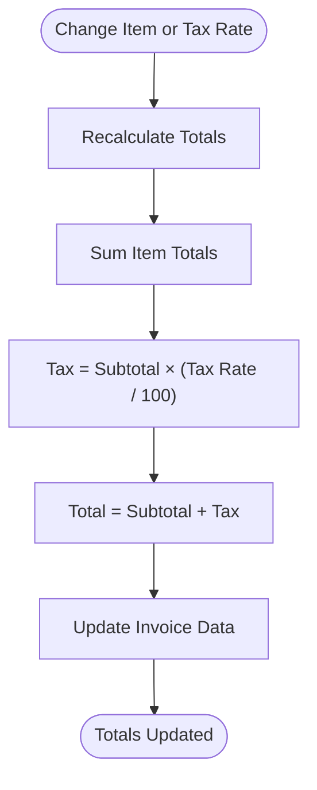
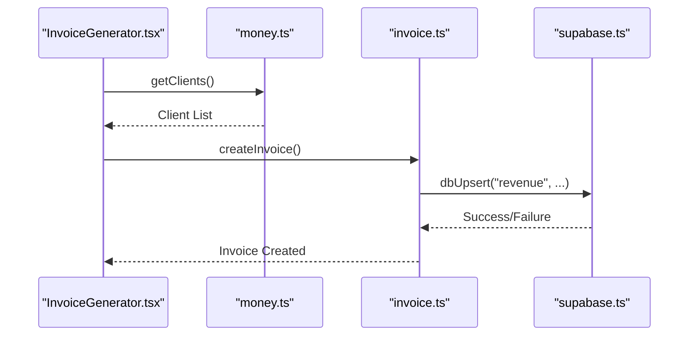
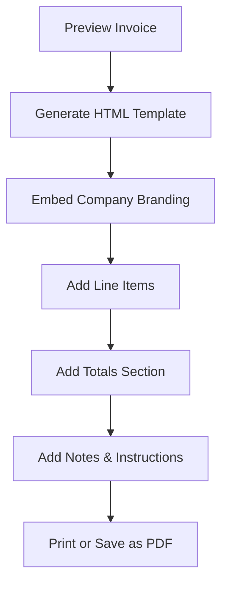
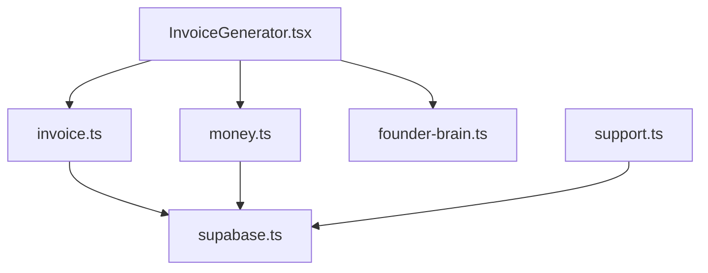

# Invoice Generator

<cite>
**Referenced Files in This Document**
- [InvoiceGenerator.tsx](file://src/components/money/InvoiceGenerator.tsx)
- [invoice.ts](file://src/lib/invoice.ts)
- [money.ts](file://src/lib/money.ts)
- [supabase.ts](file://src/lib/supabase.ts)
- [founder-brain.ts](file://src/lib/founder-brain.ts)
- [support.ts](file://src/lib/support.ts)
</cite>

## Table of Contents
1. [Introduction](#introduction)
2. [Project Structure](#project-structure)
3. [Core Components](#core-components)
4. [Architecture Overview](#architecture-overview)
5. [Detailed Component Analysis](#detailed-component-analysis)
6. [Dependency Analysis](#dependency-analysis)
7. [Performance Considerations](#performance-considerations)
8. [Troubleshooting Guide](#troubleshooting-guide)
9. [Conclusion](#conclusion)
10. [Appendices](#appendices)

## Introduction
The Invoice Generator is a core component of Core Brim Tech OS designed to automate billing and invoicing workflows. It enables users to create professional invoices, manage client billing profiles, track service delivery, and streamline payment collection. The system supports one-time invoices, recurring billing through external integrations, proforma invoicing for prepayments, and multi-currency support. It integrates with the broader money module for client pipeline management and revenue tracking, and with Supabase for cloud synchronization.

## Project Structure
The Invoice Generator is implemented as a React component with a dedicated library module for invoice data management. It leverages the money module for client data and integrates with Supabase for cloud persistence and synchronization.



**Diagram sources**
- [InvoiceGenerator.tsx](file://src/components/money/InvoiceGenerator.tsx#L1-L322)
- [invoice.ts](file://src/lib/invoice.ts#L1-L226)
- [money.ts](file://src/lib/money.ts#L1-L221)
- [supabase.ts](file://src/lib/supabase.ts#L1-L292)
- [founder-brain.ts](file://src/lib/founder-brain.ts#L1-L213)
- [support.ts](file://src/lib/support.ts#L1-L511)

**Section sources**
- [InvoiceGenerator.tsx](file://src/components/money/InvoiceGenerator.tsx#L1-L322)
- [invoice.ts](file://src/lib/invoice.ts#L1-L226)
- [money.ts](file://src/lib/money.ts#L1-L221)
- [supabase.ts](file://src/lib/supabase.ts#L1-L292)
- [founder-brain.ts](file://src/lib/founder-brain.ts#L1-L213)
- [support.ts](file://src/lib/support.ts#L1-L511)

## Core Components
- InvoiceGenerator UI: Provides the user interface for creating, previewing, filtering, and managing invoices. It supports real-time totals calculation, currency selection, and status transitions.
- Invoice Library: Manages invoice lifecycle, including creation, updates, deletion, statistics computation, and HTML generation for printing.
- Money Module: Supplies client data and pipeline status for invoice creation and revenue tracking.
- Supabase Integration: Enables cloud synchronization for invoices, clients, and revenue entries.
- Founder Brain: Supplies company branding and contact information for invoice templates.
- Support Templates: Includes email templates for invoice-related communications.

**Section sources**
- [InvoiceGenerator.tsx](file://src/components/money/InvoiceGenerator.tsx#L1-L322)
- [invoice.ts](file://src/lib/invoice.ts#L1-L226)
- [money.ts](file://src/lib/money.ts#L1-L221)
- [supabase.ts](file://src/lib/supabase.ts#L1-L292)
- [founder-brain.ts](file://src/lib/founder-brain.ts#L1-L213)
- [support.ts](file://src/lib/support.ts#L1-L511)

## Architecture Overview
The Invoice Generator follows a layered architecture:
- UI Layer: React component handles user interactions and displays invoice data.
- Business Logic Layer: Invoice library encapsulates invoice operations and calculations.
- Data Access Layer: Local storage with Supabase synchronization for persistence.
- Integration Layer: Money module for client data and email templates for communication.



**Diagram sources**
- [InvoiceGenerator.tsx](file://src/components/money/InvoiceGenerator.tsx#L64-L111)
- [invoice.ts](file://src/lib/invoice.ts#L73-L88)
- [money.ts](file://src/lib/money.ts#L74-L115)
- [supabase.ts](file://src/lib/supabase.ts#L57-L66)

## Detailed Component Analysis

### Invoice Data Model
The invoice system defines a comprehensive data model supporting multi-currency invoicing, tax calculations, and status tracking.



**Diagram sources**
- [invoice.ts](file://src/lib/invoice.ts#L4-L36)

**Section sources**
- [invoice.ts](file://src/lib/invoice.ts#L4-L36)

### Invoice Creation Workflow
The invoice creation process involves collecting client information, line items, and financial details, then generating a printable HTML invoice.

```mermaid
flowchart TD
Start([User Clicks "Create Invoice"]) --> LoadClients["Load Clients from Money Module"]
LoadClients --> FillForm["Populate Form Fields<br/>- Client Info<br/>- Issue/Due Dates<br/>- Currency<br/>- Tax Rate"]
FillForm --> AddItems["Add Line Items<br/>- Description<br/>- Quantity<br/>- Rate"]
AddItems --> CalcTotals["Calculate Subtotal, Tax, Total"]
CalcTotals --> ValidateForm{"Form Valid?"}
ValidateForm --> |No| ShowErrors["Show Validation Errors"]
ValidateForm --> |Yes| CreateInvoice["Create Invoice in Library"]
CreateInvoice --> PersistInvoice["Persist to Local Storage"]
PersistInvoice --> SyncCloud["Sync to Supabase"]
SyncCloud --> Success([Invoice Created])
ShowErrors --> End([End])
Success --> End
```

**Diagram sources**
- [InvoiceGenerator.tsx](file://src/components/money/InvoiceGenerator.tsx#L64-L111)
- [invoice.ts](file://src/lib/invoice.ts#L73-L88)

**Section sources**
- [InvoiceGenerator.tsx](file://src/components/money/InvoiceGenerator.tsx#L64-L111)
- [invoice.ts](file://src/lib/invoice.ts#L73-L88)

### Invoice Management and Status Tracking
The system supports status transitions and overdue detection to manage the billing lifecycle.



**Diagram sources**
- [InvoiceGenerator.tsx](file://src/components/money/InvoiceGenerator.tsx#L213-L259)
- [invoice.ts](file://src/lib/invoice.ts#L113-L131)

**Section sources**
- [InvoiceGenerator.tsx](file://src/components/money/InvoiceGenerator.tsx#L213-L259)
- [invoice.ts](file://src/lib/invoice.ts#L113-L131)

### Multi-Currency Support
The invoice system supports multiple currencies with dynamic formatting and exchange considerations.


**Diagram sources**
- [InvoiceGenerator.tsx](file://src/components/money/InvoiceGenerator.tsx#L140-L144)
- [invoice.ts](file://src/lib/invoice.ts#L134-L136)

**Section sources**
- [InvoiceGenerator.tsx](file://src/components/money/InvoiceGenerator.tsx#L140-L144)
- [invoice.ts](file://src/lib/invoice.ts#L134-L136)

### Tax Calculation System
The system implements configurable tax rates with automatic recalculation when items or rates change.



**Diagram sources**
- [invoice.ts](file://src/lib/invoice.ts#L58-L63)
- [InvoiceGenerator.tsx](file://src/components/money/InvoiceGenerator.tsx#L80-L87)

**Section sources**
- [invoice.ts](file://src/lib/invoice.ts#L58-L63)
- [InvoiceGenerator.tsx](file://src/components/money/InvoiceGenerator.tsx#L80-L87)

### Integration with Money Module
The Invoice Generator integrates with the money module for client pipeline management and revenue tracking.



**Diagram sources**
- [InvoiceGenerator.tsx](file://src/components/money/InvoiceGenerator.tsx#L65-L109)
- [money.ts](file://src/lib/money.ts#L74-L115)
- [supabase.ts](file://src/lib/supabase.ts#L57-L66)

**Section sources**
- [InvoiceGenerator.tsx](file://src/components/money/InvoiceGenerator.tsx#L65-L109)
- [money.ts](file://src/lib/money.ts#L74-L115)
- [supabase.ts](file://src/lib/supabase.ts#L57-L66)

### Export and Printing Capabilities
The system generates printable HTML invoices with embedded company branding and payment instructions.



**Diagram sources**
- [InvoiceGenerator.tsx](file://src/components/money/InvoiceGenerator.tsx#L25-L62)
- [invoice.ts](file://src/lib/invoice.ts#L134-L225)

**Section sources**
- [InvoiceGenerator.tsx](file://src/components/money/InvoiceGenerator.tsx#L25-L62)
- [invoice.ts](file://src/lib/invoice.ts#L134-L225)

## Dependency Analysis
The Invoice Generator has clear dependencies between UI, business logic, and data access layers.



**Diagram sources**
- [InvoiceGenerator.tsx](file://src/components/money/InvoiceGenerator.tsx#L1-L14)
- [invoice.ts](file://src/lib/invoice.ts#L1-L14)
- [money.ts](file://src/lib/money.ts#L1-L14)
- [supabase.ts](file://src/lib/supabase.ts#L1-L14)
- [founder-brain.ts](file://src/lib/founder-brain.ts#L1-L14)
- [support.ts](file://src/lib/support.ts#L1-L14)

**Section sources**
- [InvoiceGenerator.tsx](file://src/components/money/InvoiceGenerator.tsx#L1-L14)
- [invoice.ts](file://src/lib/invoice.ts#L1-L14)
- [money.ts](file://src/lib/money.ts#L1-L14)
- [supabase.ts](file://src/lib/supabase.ts#L1-L14)
- [founder-brain.ts](file://src/lib/founder-brain.ts#L1-L14)
- [support.ts](file://src/lib/support.ts#L1-L14)

## Performance Considerations
- Local Storage Operations: All invoice data is stored locally with Supabase as a backup. This ensures fast UI responsiveness while maintaining cloud persistence.
- Batch Operations: Supabase integration supports batch upsert operations for efficient data synchronization.
- Memory Management: The UI maintains minimal state and recalculates totals on-demand to reduce memory footprint.
- Rendering Optimization: The component uses efficient React patterns with controlled re-renders and memoized calculations.

## Troubleshooting Guide
Common issues and resolutions:
- Invoice Not Saving: Verify Supabase configuration and network connectivity. Check browser console for errors.
- Totals Not Updating: Ensure all line items have valid quantities and rates. The system recalculates totals when either changes.
- Currency Formatting Issues: Confirm currency selection matches the intended locale. The system formats amounts with currency codes.
- Overdue Detection: The system checks due dates against current time. Ensure dates are correctly formatted as ISO strings.
- Cloud Sync Failures: Review Supabase credentials and permissions. The system logs warnings for failed operations.

**Section sources**
- [supabase.ts](file://src/lib/supabase.ts#L57-L66)
- [invoice.ts](file://src/lib/invoice.ts#L41-L49)

## Conclusion
The Invoice Generator provides a robust foundation for automated billing and invoicing within Core Brim Tech OS. It supports essential invoicing workflows, integrates seamlessly with client management and revenue tracking, and offers extensible capabilities for future enhancements such as recurring billing, advanced tax calculations, and multi-currency processing. The modular architecture ensures maintainability and scalability as the system evolves.

## Appendices

### Invoice Types and Workflows
- One-Time Invoices: Standard invoices for completed services or delivered goods.
- Recurring Invoices: Implemented through external integrations and revenue entries with recurring flags.
- Proforma Invoices: Prepayment invoices for advance payments or deposits.
- Late Fee Calculations: Can be implemented by extending the invoice library with late fee calculations based on due dates.
- Dispute Resolution: Email templates in the support module facilitate communication during disputes.

**Section sources**
- [money.ts](file://src/lib/money.ts#L31-L44)
- [support.ts](file://src/lib/support.ts#L505-L511)

### Legal Compliance and International Invoicing
- Tax Regulations: The system supports configurable tax rates and can be extended to handle jurisdiction-specific tax rules.
- International Invoicing: Multi-currency support enables international transactions with proper currency formatting.
- Export Formats: Current implementation focuses on HTML/PDF printing; CSV export capabilities can be added through the money module's export infrastructure.

**Section sources**
- [InvoiceGenerator.tsx](file://src/components/money/InvoiceGenerator.tsx#L140-L144)
- [money.ts](file://src/lib/money.ts#L134-L188)