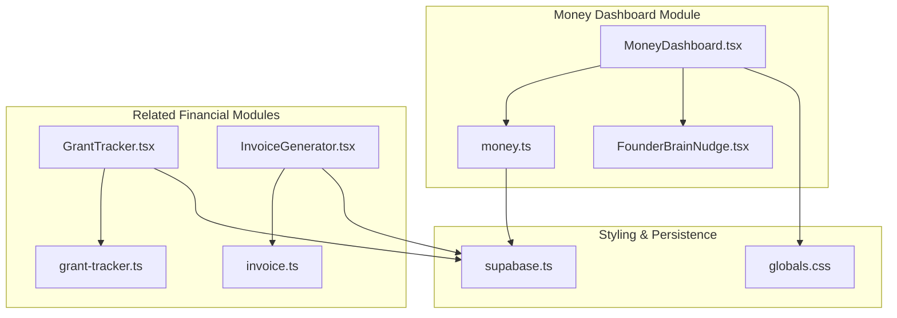
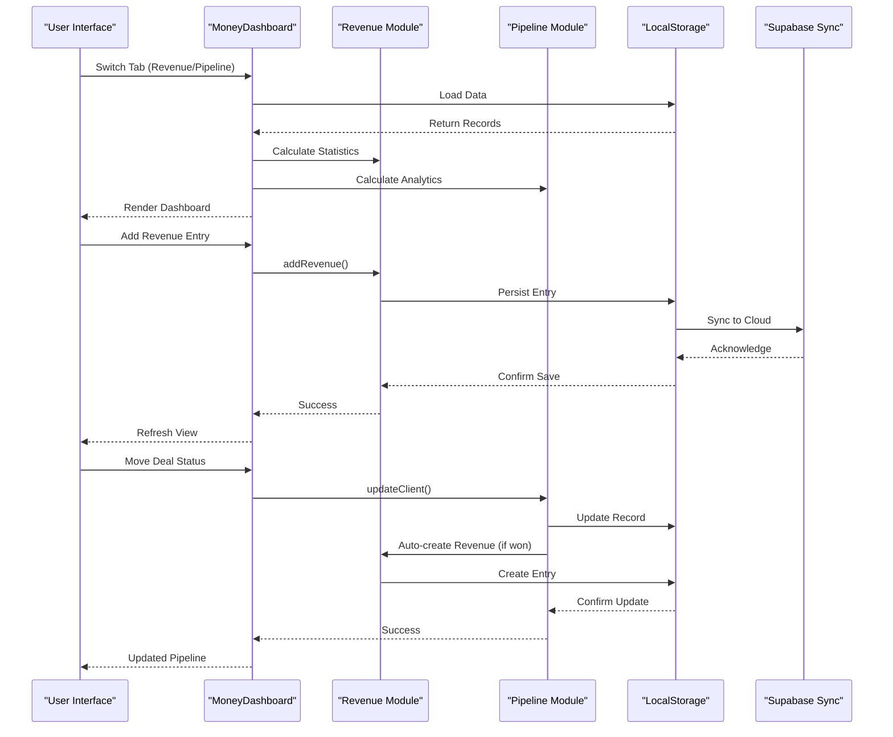
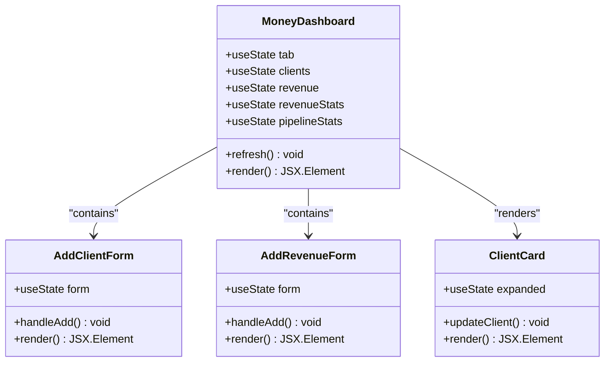
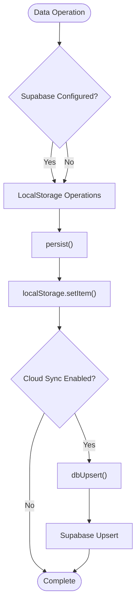
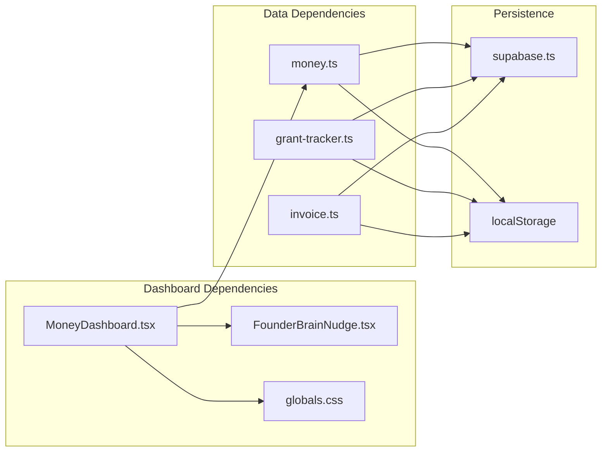

# Money Dashboard

<cite>
**Referenced Files in This Document**
- [MoneyDashboard.tsx](file://src/components/money/MoneyDashboard.tsx)
- [money.ts](file://src/lib/money.ts)
- [GrantTracker.tsx](file://src/components/money/GrantTracker.tsx)
- [grant-tracker.ts](file://src/lib/grant-tracker.ts)
- [InvoiceGenerator.tsx](file://src/components/money/InvoiceGenerator.tsx)
- [invoice.ts](file://src/lib/invoice.ts)
- [globals.css](file://src/app/globals.css)
- [supabase.ts](file://src/lib/supabase.ts)
- [FounderBrainNudge.tsx](file://src/components/FounderBrainNudge.tsx)
</cite>

## Table of Contents
1. [Introduction](#introduction)
2. [Project Structure](#project-structure)
3. [Core Components](#core-components)
4. [Architecture Overview](#architecture-overview)
5. [Detailed Component Analysis](#detailed-component-analysis)
6. [Dependency Analysis](#dependency-analysis)
7. [Performance Considerations](#performance-considerations)
8. [Troubleshooting Guide](#troubleshooting-guide)
9. [Conclusion](#conclusion)
10. [Appendices](#appendices)

## Introduction
The Money Dashboard is the central financial overview interface of Core Brim Tech OS. It provides a unified view of two primary financial domains:
- Revenue Dashboard: Tracks income sources, logs revenue entries, and displays statistical summaries
- Client Pipeline: Manages the sales funnel from lead to closed-won deals with probability analytics

The dashboard features a dual-tab architecture allowing seamless navigation between revenue tracking and client deal management. It includes interactive forms, progress indicators, real-time statistics, and integration with external financial tools like grant opportunities and invoicing systems.

## Project Structure
The Money Dashboard is organized around a clean separation of concerns:
- UI Components: React functional components with TypeScript interfaces
- Data Layer: Local storage-backed persistence with optional cloud synchronization
- Shared Utilities: Common formatting functions and type definitions
- Styling Framework: Tailwind CSS with dark theme customization

**Diagram sources**
- [MoneyDashboard.tsx](file://src/components/money/MoneyDashboard.tsx#L1-L366)
- [money.ts](file://src/lib/money.ts#L1-L221)
- [globals.css](file://src/app/globals.css#L1-L59)
- [supabase.ts](file://src/lib/supabase.ts#L1-L292)

**Section sources**
- [MoneyDashboard.tsx](file://src/components/money/MoneyDashboard.tsx#L1-L366)
- [money.ts](file://src/lib/money.ts#L1-L221)
- [globals.css](file://src/app/globals.css#L1-L59)

## Core Components
The Money Dashboard consists of several interconnected components that work together to provide comprehensive financial oversight:

### Revenue Tracking System
The revenue module manages income entries with six distinct categories:
- Hackathon: Prize money from competitions
- Freelance: Independent contract work
- Grant: Funding received from organizations
- Consulting: Advisory or professional services
- Product/SaaS: Recurring revenue from products
- Other: Miscellaneous income sources

Each revenue entry includes metadata such as description, amount, date, currency, and optional notes. The system calculates monthly growth rates and categorizes income sources for detailed analysis.

### Client Deal Pipeline Management
The pipeline tracks deals through seven distinct stages:
- Lead: Initial contact or inquiry
- Contacted: First communication established
- Proposal: Formal offer presented
- Negotiating: Terms being discussed
- Won: Deal closed successfully
- Lost: Deal terminated
- On Hold: Temporarily paused

Each deal includes probability scoring (0-100%), value tracking, and conversion analytics. The system automatically creates revenue entries when deals move to "won" status.

### UI Component Architecture
The dashboard employs a card-based interface with:
- Interactive forms for data entry
- Progress indicators and status badges
- Real-time statistics displays
- Kanban-style pipeline visualization
- Responsive design with dark theme

**Section sources**
- [MoneyDashboard.tsx](file://src/components/money/MoneyDashboard.tsx#L27-L34)
- [money.ts](file://src/lib/money.ts#L6-L44)

## Architecture Overview
The Money Dashboard follows a layered architecture pattern with clear separation between presentation, business logic, and data persistence:

**Diagram sources**
- [MoneyDashboard.tsx](file://src/components/money/MoneyDashboard.tsx#L183-L366)
- [money.ts](file://src/lib/money.ts#L74-L130)
- [supabase.ts](file://src/lib/supabase.ts#L57-L81)

The architecture ensures:
- **Local-first persistence** with immediate user feedback
- **Cloud synchronization** for cross-device consistency
- **Real-time updates** through React state management
- **Type-safe operations** with comprehensive TypeScript interfaces

## Detailed Component Analysis

### MoneyDashboard Component
The main dashboard component orchestrates the dual-tab interface and manages all state transitions:

**Diagram sources**
- [MoneyDashboard.tsx](file://src/components/money/MoneyDashboard.tsx#L44-L141)
- [MoneyDashboard.tsx](file://src/components/money/MoneyDashboard.tsx#L145-L179)

#### Revenue Statistics Cards
The dashboard presents four key metrics in a responsive grid:
- All-Time Revenue: Total lifetime earnings
- This Year Revenue: Annual performance indicator
- This Month Revenue: Monthly cash flow
- Growth Rate: Percentage change from previous month

Each card uses color-coded typography to indicate positive/negative trends and includes formatted currency display.

#### Revenue Logging Interface
The revenue form provides intuitive categorization through emoji-tagged buttons and includes:
- Type selection with visual indicators
- Description field for transaction details
- Amount input with currency formatting
- Date picker for historical entries
- Optional notes field for documentation

#### Pipeline Management
The client pipeline uses a kanban-style layout with automatic status progression:
- Lead → Contacted → Proposal → Negotiating → Won
- Visual status indicators with color coding
- Probability sliders for deal forecasting
- Expandable cards for detailed information
- Quick-action buttons for status updates

**Section sources**
- [MoneyDashboard.tsx](file://src/components/money/MoneyDashboard.tsx#L221-L361)

### Data Layer and Persistence
The financial data layer implements a robust persistence strategy:

**Diagram sources**
- [money.ts](file://src/lib/money.ts#L62-L70)
- [supabase.ts](file://src/lib/supabase.ts#L57-L66)

The persistence layer handles:
- **Local storage operations** for immediate user feedback
- **Cloud synchronization** for cross-device access
- **Type-safe serialization** with JSON parsing
- **Graceful fallbacks** when cloud services are unavailable

**Section sources**
- [money.ts](file://src/lib/money.ts#L54-L70)
- [supabase.ts](file://src/lib/supabase.ts#L155-L246)

### Integration with Related Financial Tools

#### Grant Tracker Integration
The Money Dashboard complements grant opportunities through the Grant Tracker component:
- Curated grants specifically for African founders
- Fit scoring based on company alignment
- Status tracking from "Watching" to "Won"
- Automatic pipeline value calculation

#### Invoice Generation
The Invoice Generator provides professional billing capabilities:
- Multi-currency support (USD, GBP, EUR, SLL, NGN, GHS, KES)
- Tax calculation and totals computation
- PDF generation and print functionality
- Status tracking from "Draft" to "Paid"

**Section sources**
- [GrantTracker.tsx](file://src/components/money/GrantTracker.tsx#L1-L249)
- [grant-tracker.ts](file://src/lib/grant-tracker.ts#L1-L297)
- [InvoiceGenerator.tsx](file://src/components/money/InvoiceGenerator.tsx#L1-L322)
- [invoice.ts](file://src/lib/invoice.ts#L1-L226)

## Dependency Analysis
The Money Dashboard maintains loose coupling between components while ensuring cohesive functionality:

**Diagram sources**
- [MoneyDashboard.tsx](file://src/components/money/MoneyDashboard.tsx#L8-L13)
- [money.ts](file://src/lib/money.ts#L207-L221)

The dependency structure ensures:
- **Minimal coupling** between UI and business logic
- **Clear separation** of concerns across modules
- **Extensible architecture** for adding new financial features
- **Robust error handling** through graceful degradation

**Section sources**
- [MoneyDashboard.tsx](file://src/components/money/MoneyDashboard.tsx#L1-L14)
- [money.ts](file://src/lib/money.ts#L1-L221)

## Performance Considerations
The Money Dashboard is optimized for responsive performance:

### Rendering Optimizations
- **Selective re-rendering** through React state management
- **Efficient list rendering** with stable keys
- **Lazy loading** for large datasets
- **Virtualized lists** for extensive revenue histories

### Data Loading Strategies
- **Initial load caching** to minimize repeated requests
- **Background synchronization** for cloud data
- **Batch operations** for bulk updates
- **Memory-efficient filtering** for pipeline views

### Storage Efficiency
- **JSON serialization** for compact data representation
- **Incremental updates** to reduce storage overhead
- **Compression strategies** for large datasets
- **Cleanup routines** for orphaned records

## Troubleshooting Guide

### Common Issues and Solutions

#### Data Not Persisting
**Symptoms**: Revenue entries disappear after refresh
**Causes**: 
- Browser storage disabled
- Supabase configuration missing
- CORS restrictions blocking cloud sync

**Solutions**:
1. Verify localStorage availability in browser developer tools
2. Check environment variables for Supabase credentials
3. Review browser console for CORS errors
4. Test cloud connectivity with manual upsert operation

#### Pipeline Status Updates Fail
**Symptoms**: Deal status changes don't save
**Causes**:
- Missing client ID in update operation
- Invalid status transitions
- Storage permission issues

**Solutions**:
1. Ensure client records have valid UUID identifiers
2. Verify status follows sequential progression rules
3. Check browser storage quota limits
4. Clear browser cache and retry operation

#### Revenue Statistics Inaccurate
**Symptoms**: Calculated totals don't match expectations
**Causes**:
- Incorrect date formatting in entries
- Currency conversion errors
- Duplicate entries causing double counting

**Solutions**:
1. Validate date format as YYYY-MM-DD
2. Check currency consistency across entries
3. Audit for duplicate revenue records
4. Recalculate statistics manually for verification

**Section sources**
- [money.ts](file://src/lib/money.ts#L62-L70)
- [supabase.ts](file://src/lib/supabase.ts#L57-L66)

## Conclusion
The Money Dashboard represents a comprehensive financial management solution that seamlessly integrates revenue tracking with client pipeline management. Its dual-tab architecture provides intuitive navigation between operational and strategic financial views, while the underlying architecture ensures scalability and reliability.

Key strengths include:
- **Unified financial perspective** combining revenue and pipeline data
- **Real-time analytics** with automatic calculations
- **Professional-grade UI** with dark theme optimization
- **Robust persistence** with cloud synchronization
- **Extensible design** supporting future financial integrations

The component architecture establishes a solid foundation for extending financial capabilities, adding advanced reporting features, and integrating with enterprise accounting systems.

## Appendices

### Data Model Definitions

#### Client Entity
| Field | Type | Description |
|-------|------|-------------|
| id | string | Unique identifier |
| name | string | Contact name |
| company | string | Company affiliation |
| email | string | Contact email |
| service | string | Service offered |
| value | number | Deal value in USD |
| currency | string | Currency code |
| status | enum | Deal stage |
| probability | number | Win probability 0-100 |
| notes | string | Additional details |
| nextAction | string | Action items |
| createdAt | string | Creation timestamp |
| updatedAt | string | Last update timestamp |

#### Revenue Entry
| Field | Type | Description |
|-------|------|-------------|
| id | string | Unique identifier |
| type | enum | Income category |
| description | string | Transaction details |
| amount | number | Amount in USD |
| currency | string | Currency code |
| date | string | Transaction date |
| clientId | string | Associated client |
| recurring | boolean | Recurring payment |
| notes | string | Additional notes |
| createdAt | string | Creation timestamp |

### Statistical Calculations

#### Pipeline Analytics
- **Pipeline Value**: Sum of (deal value × probability) for active deals
- **Conversion Rate**: (Won deals ÷ Total deals) × 100
- **Win Value**: Sum of all won deal values

#### Revenue Analytics
- **Monthly Growth**: ((Current Month - Previous Month) ÷ Previous Month) × 100
- **By Type Distribution**: Percentage breakdown by income category
- **Entry Count**: Total number of revenue transactions

### UI Component Reference

#### Status Color Coding
- **Lead**: Neutral gray with amber accent
- **Contacted**: Blue with blue background
- **Proposal**: Amber with amber background
- **Negotiating**: Purple with purple background
- **Won**: Emerald with emerald background
- **Lost**: Red with red background
- **On Hold**: Dark gray with dark gray background

#### Revenue Type Visuals
- **Hackathon**: Trophy emoji with amber color
- **Freelance**: Briefcase emoji with blue color
- **Grant**: Gift emoji with emerald color
- **Consulting**: Brain emoji with purple color
- **Product**: Package emoji with cyan color
- **Other**: Money bag emoji with neutral color