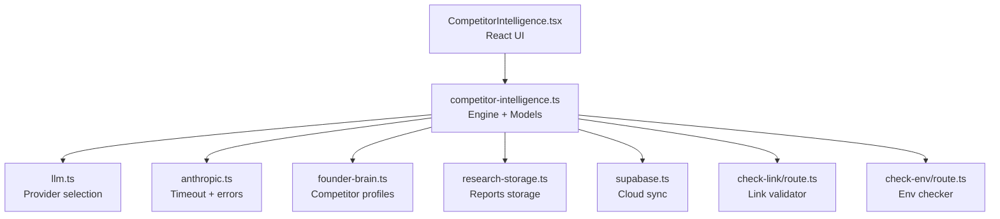
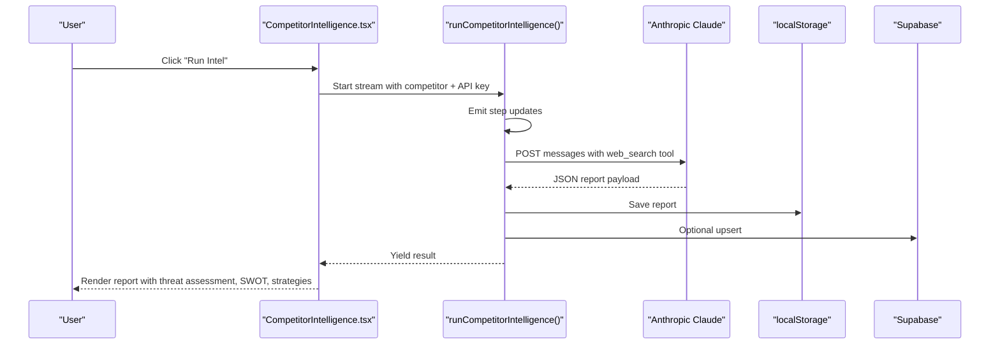
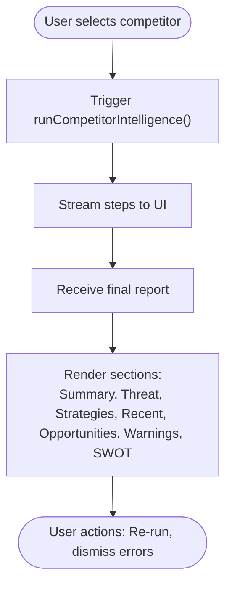
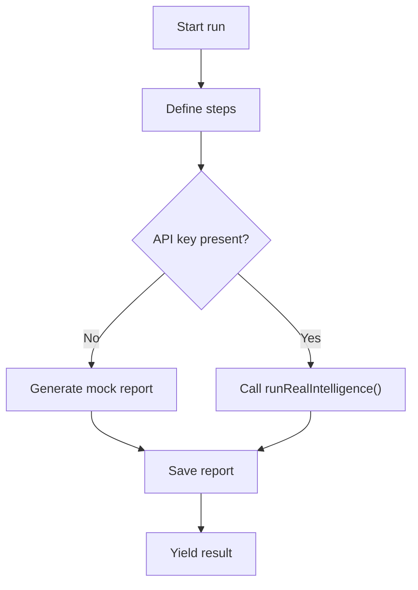
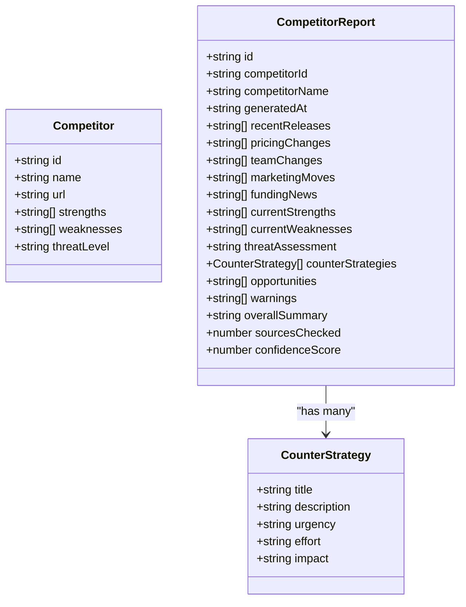
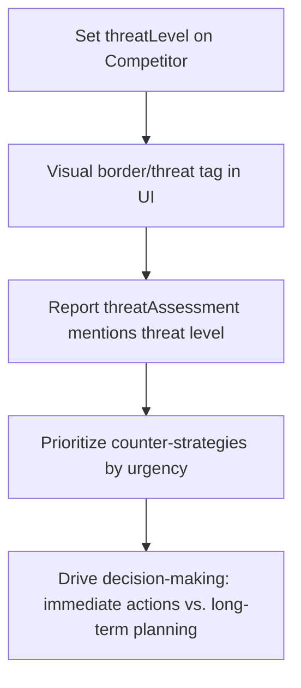
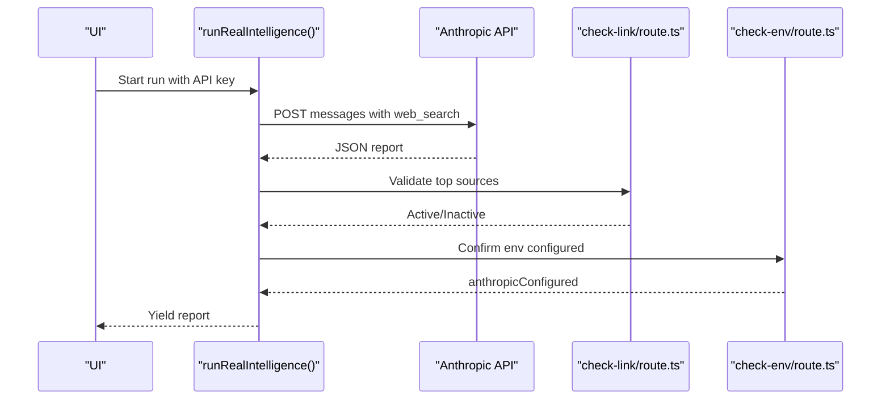
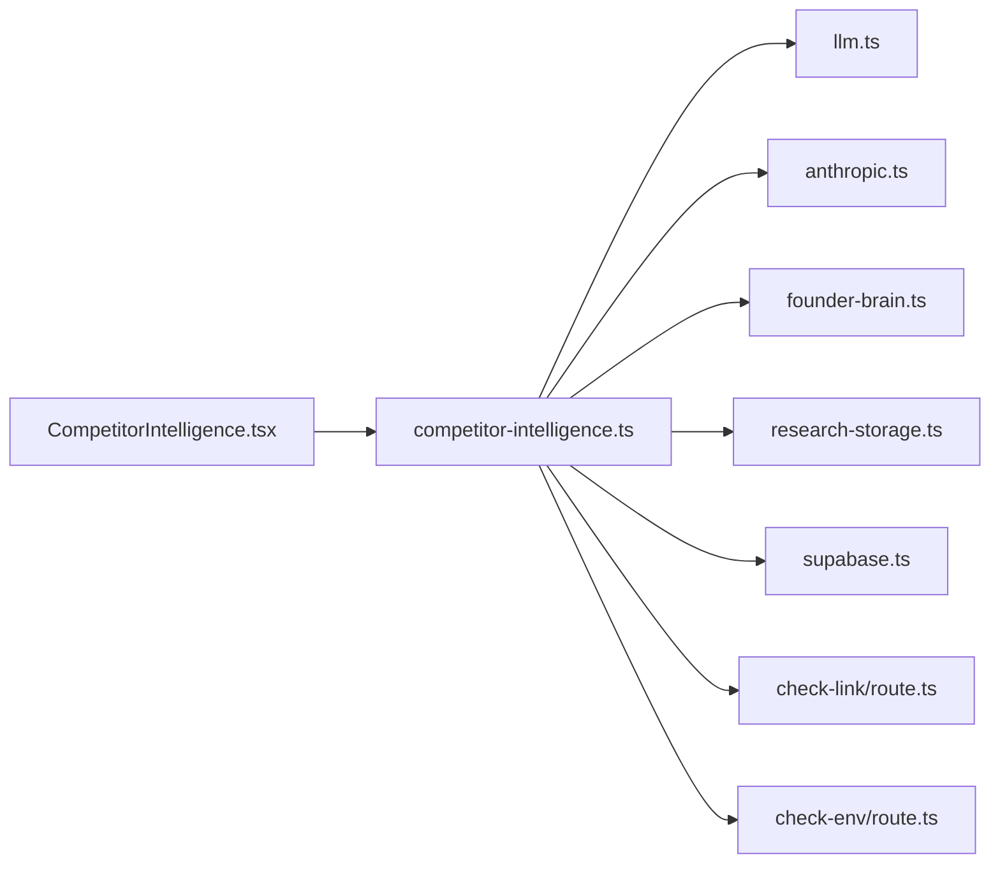

# Competitor Intelligence

<cite>
**Referenced Files in This Document**
- [CompetitorIntelligence.tsx](file://src/components/intelligence/CompetitorIntelligence.tsx)
- [competitor-intelligence.ts](file://src/lib/competitor-intelligence.ts)
- [research-engine.ts](file://src/lib/research-engine.ts)
- [research-storage.ts](file://src/lib/research-storage.ts)
- [llm.ts](file://src/lib/llm.ts)
- [founder-brain.ts](file://src/lib/founder-brain.ts)
- [anthropic.ts](file://src/lib/anthropic.ts)
- [supabase.ts](file://src/lib/supabase.ts)
- [route.ts](file://src/app/api/check-link/route.ts)
- [route.ts](file://src/app/api/check-env/route.ts)
</cite>

## Table of Contents
1. [Introduction](#introduction)
2. [Project Structure](#project-structure)
3. [Core Components](#core-components)
4. [Architecture Overview](#architecture-overview)
5. [Detailed Component Analysis](#detailed-component-analysis)
6. [Dependency Analysis](#dependency-analysis)
7. [Performance Considerations](#performance-considerations)
8. [Troubleshooting Guide](#troubleshooting-guide)
9. [Conclusion](#conclusion)
10. [Appendices](#appendices)

## Introduction
This document describes the Competitor Intelligence module that powers market analysis and competitive research within the Core Brim Tech OS. It explains how the system monitors the competitive landscape, assesses threats, and generates actionable strategic recommendations. It covers the data collection pipeline, analysis methodologies, visualization tools, and the integration with external market research sources and AI-powered analysis. It also documents the threat level classification system and how it influences decision-making, along with configuration options for industry sectors, geographic markets, and competitive metrics.

## Project Structure
The Competitor Intelligence feature is composed of:
- A React UI component that orchestrates runs, displays progress, and renders reports
- A library module that defines data models, orchestration, and AI integration
- Supporting libraries for research, storage, LLM selection, and Supabase synchronization
- API routes for link validation and environment checks

**Diagram sources**
- [CompetitorIntelligence.tsx](file://src/components/intelligence/CompetitorIntelligence.tsx#L1-L406)
- [competitor-intelligence.ts](file://src/lib/competitor-intelligence.ts#L1-L298)
- [llm.ts](file://src/lib/llm.ts#L1-L135)
- [anthropic.ts](file://src/lib/anthropic.ts#L1-L32)
- [founder-brain.ts](file://src/lib/founder-brain.ts#L52-L65)
- [research-storage.ts](file://src/lib/research-storage.ts#L1-L47)
- [supabase.ts](file://src/lib/supabase.ts#L1-L292)
- [route.ts](file://src/app/api/check-link/route.ts#L1-L43)
- [route.ts](file://src/app/api/check-env/route.ts#L1-L13)

**Section sources**
- [CompetitorIntelligence.tsx](file://src/components/intelligence/CompetitorIntelligence.tsx#L1-L406)
- [competitor-intelligence.ts](file://src/lib/competitor-intelligence.ts#L1-L298)

## Core Components
- UI orchestration and rendering:
  - Runs the intelligence pipeline, streams steps, and displays reports
  - Renders threat-assessed summaries, SWOT, opportunities/warnings, and counter-strategies
- Intelligence engine:
  - Defines report and strategy models
  - Streams steps and yields a structured report
  - Integrates with Anthropic’s Claude API for real runs or falls back to mock data
- Data models:
  - Competitor profile with strengths, weaknesses, and threat level
  - Competitor report with recent activity, SWOT, opportunities, warnings, and counter-strategies
  - Counter strategy with urgency, effort, and impact
- Storage and sync:
  - Local storage for reports and research library
  - Supabase upsert for persistence and cross-device sync
- LLM integration:
  - Provider selection and key management
  - Timeout handling and error parsing for Anthropic
- Link validation:
  - Server-side link checking to validate sources

**Section sources**
- [CompetitorIntelligence.tsx](file://src/components/intelligence/CompetitorIntelligence.tsx#L177-L406)
- [competitor-intelligence.ts](file://src/lib/competitor-intelligence.ts#L7-L47)
- [founder-brain.ts](file://src/lib/founder-brain.ts#L52-L65)
- [llm.ts](file://src/lib/llm.ts#L1-L135)
- [anthropic.ts](file://src/lib/anthropic.ts#L1-L32)
- [research-storage.ts](file://src/lib/research-storage.ts#L1-L47)
- [supabase.ts](file://src/lib/supabase.ts#L57-L81)

## Architecture Overview
The system follows a streaming, stepwise intelligence pipeline:
- The UI triggers a run for a selected competitor
- The engine emits step updates, simulating progress
- Real runs call Anthropic’s Claude with web search tools to gather and synthesize insights
- Reports are persisted locally and optionally synced to Supabase
- The UI renders a comprehensive view including threat assessment, SWOT, opportunities, warnings, and counter-strategies

**Diagram sources**
- [CompetitorIntelligence.tsx](file://src/components/intelligence/CompetitorIntelligence.tsx#L226-L252)
- [competitor-intelligence.ts](file://src/lib/competitor-intelligence.ts#L177-L216)
- [llm.ts](file://src/lib/llm.ts#L128-L134)
- [supabase.ts](file://src/lib/supabase.ts#L295-L297)

## Detailed Component Analysis

### UI: CompetitorIntelligence
- Displays a list of competitors with threat levels and last run metadata
- Streams and renders step-by-step progress during runs
- Shows a detailed report view with:
  - Intelligence summary and confidence
  - Threat assessment
  - Sections: Counter-Strategies, Recent Activity, Opportunities, Warnings, SWOT
- Supports re-running interrupted runs and error banners

**Diagram sources**
- [CompetitorIntelligence.tsx](file://src/components/intelligence/CompetitorIntelligence.tsx#L226-L406)

**Section sources**
- [CompetitorIntelligence.tsx](file://src/components/intelligence/CompetitorIntelligence.tsx#L177-L406)

### Intelligence Engine: runCompetitorIntelligence
- Defines the report and strategy models
- Emits a fixed sequence of steps for scanning, news, pricing, team/funding, and strategy generation
- Generates a mock report when no API key is present, otherwise calls the real engine
- Persists reports to localStorage and optionally syncs to Supabase

**Diagram sources**
- [competitor-intelligence.ts](file://src/lib/competitor-intelligence.ts#L177-L216)
- [competitor-intelligence.ts](file://src/lib/competitor-intelligence.ts#L218-L290)

**Section sources**
- [competitor-intelligence.ts](file://src/lib/competitor-intelligence.ts#L7-L47)
- [competitor-intelligence.ts](file://src/lib/competitor-intelligence.ts#L177-L216)
- [competitor-intelligence.ts](file://src/lib/competitor-intelligence.ts#L218-L290)

### Data Models: Competitor Profiles, Reports, and Strategies
- Competitor profile includes strengths, weaknesses, URL, and threat level
- Competitor report includes recent activity, SWOT, opportunities, warnings, and counter-strategies
- Counter strategy includes title, description, urgency, effort, and impact

**Diagram sources**
- [founder-brain.ts](file://src/lib/founder-brain.ts#L52-L65)
- [competitor-intelligence.ts](file://src/lib/competitor-intelligence.ts#L7-L47)

**Section sources**
- [founder-brain.ts](file://src/lib/founder-brain.ts#L52-L65)
- [competitor-intelligence.ts](file://src/lib/competitor-intelligence.ts#L7-L47)

### Threat Level Classification and Decision Influence
- Threat levels: low, medium, high, critical
- Visual indicators and borders reflect threat severity
- The threat assessment section in reports explicitly ties threat level to strategic posture
- Strategic recommendations are prioritized by urgency and impact

**Diagram sources**
- [CompetitorIntelligence.tsx](file://src/components/intelligence/CompetitorIntelligence.tsx#L24-L29)
- [founder-brain.ts](file://src/lib/founder-brain.ts#L63-L63)
- [competitor-intelligence.ts](file://src/lib/competitor-intelligence.ts#L112-L112)

**Section sources**
- [CompetitorIntelligence.tsx](file://src/components/intelligence/CompetitorIntelligence.tsx#L24-L29)
- [founder-brain.ts](file://src/lib/founder-brain.ts#L63-L63)
- [competitor-intelligence.ts](file://src/lib/competitor-intelligence.ts#L112-L112)

### AI-Powered Analysis and External Sources
- Real runs use Anthropic Claude with a web search tool to gather and synthesize insights
- Mock mode provides realistic scenarios for development and testing
- Link validation uses a server route to avoid CORS and ensure source reachability
- Environment checks confirm Anthropic API availability

**Diagram sources**
- [competitor-intelligence.ts](file://src/lib/competitor-intelligence.ts#L218-L290)
- [route.ts](file://src/app/api/check-link/route.ts#L1-L43)
- [route.ts](file://src/app/api/check-env/route.ts#L1-L13)

**Section sources**
- [competitor-intelligence.ts](file://src/lib/competitor-intelligence.ts#L218-L290)
- [route.ts](file://src/app/api/check-link/route.ts#L1-L43)
- [route.ts](file://src/app/api/check-env/route.ts#L1-L13)

### Practical Workflows and Examples
- Competitive analysis workflow:
  - Add competitors in Founder Brain
  - Run intelligence for each competitor
  - Review threat assessment and SWOT
  - Prioritize counter-strategies by urgency and impact
  - Track recent activity and warnings
- Market positioning strategies:
  - Use opportunities to identify underserved segments
  - Align messaging with weaknesses highlighted in the report
- Counter-strategy development:
  - Translate warnings into defensive actions
  - Develop short-term tactical moves and long-term strategic shifts

[No sources needed since this section provides general guidance]

### Configuration Options
- Industry sectors and geographic markets:
  - Competitor profiles include strengths/weaknesses and URLs
  - Reports leverage context from the broader Founder Brain to tailor insights
- Competitive metrics:
  - Threat level classification influences UI and strategy prioritization
  - Confidence score and sources checked inform report reliability

**Section sources**
- [founder-brain.ts](file://src/lib/founder-brain.ts#L52-L65)
- [competitor-intelligence.ts](file://src/lib/competitor-intelligence.ts#L28-L29)

## Dependency Analysis
The module exhibits clean separation of concerns:
- UI depends on the intelligence engine and models
- Engine depends on LLM utilities, Anthropic helpers, and storage
- Storage integrates with Supabase for persistence
- API routes support link validation and environment checks

**Diagram sources**
- [CompetitorIntelligence.tsx](file://src/components/intelligence/CompetitorIntelligence.tsx#L1-L15)
- [competitor-intelligence.ts](file://src/lib/competitor-intelligence.ts#L1-L10)
- [llm.ts](file://src/lib/llm.ts#L1-L10)
- [anthropic.ts](file://src/lib/anthropic.ts#L1-L10)
- [founder-brain.ts](file://src/lib/founder-brain.ts#L1-L10)
- [research-storage.ts](file://src/lib/research-storage.ts#L1-L5)
- [supabase.ts](file://src/lib/supabase.ts#L1-L10)
- [route.ts](file://src/app/api/check-link/route.ts#L1-L5)
- [route.ts](file://src/app/api/check-env/route.ts#L1-L5)

**Section sources**
- [CompetitorIntelligence.tsx](file://src/components/intelligence/CompetitorIntelligence.tsx#L1-L15)
- [competitor-intelligence.ts](file://src/lib/competitor-intelligence.ts#L1-L10)

## Performance Considerations
- Streaming steps provide responsive UI feedback during long runs
- Mock mode enables rapid iteration and testing without external dependencies
- Link validation is performed asynchronously with timeouts to prevent blocking
- Supabase upserts are used for persistence; local storage ensures immediate availability

[No sources needed since this section provides general guidance]

## Troubleshooting Guide
- Missing API key:
  - The engine falls back to mock data; configure an Anthropic key to enable real runs
- Request timeouts:
  - Anthropic requests are wrapped with timeouts; retry or simplify the request
- Link validation failures:
  - Some sources may be unreachable; the engine continues with collected sources
- Environment checks:
  - Use the environment route to verify Anthropic configuration

**Section sources**
- [llm.ts](file://src/lib/llm.ts#L128-L134)
- [anthropic.ts](file://src/lib/anthropic.ts#L8-L26)
- [route.ts](file://src/app/api/check-link/route.ts#L1-L43)
- [route.ts](file://src/app/api/check-env/route.ts#L1-L13)

## Conclusion
The Competitor Intelligence module delivers a robust, AI-powered competitive research system with clear threat assessments and prioritized counter-strategies. Its modular design integrates seamlessly with the broader OS, enabling teams to monitor the competitive landscape, act on timely insights, and align strategy with data-driven recommendations.

[No sources needed since this section summarizes without analyzing specific files]

## Appendices

### Data Model Reference
- Competitor: identity, URL, strengths, weaknesses, threat level
- CompetitorReport: recent activity, SWOT, opportunities, warnings, counter-strategies, metadata
- CounterStrategy: title, description, urgency, effort, impact

**Section sources**
- [founder-brain.ts](file://src/lib/founder-brain.ts#L52-L65)
- [competitor-intelligence.ts](file://src/lib/competitor-intelligence.ts#L7-L47)