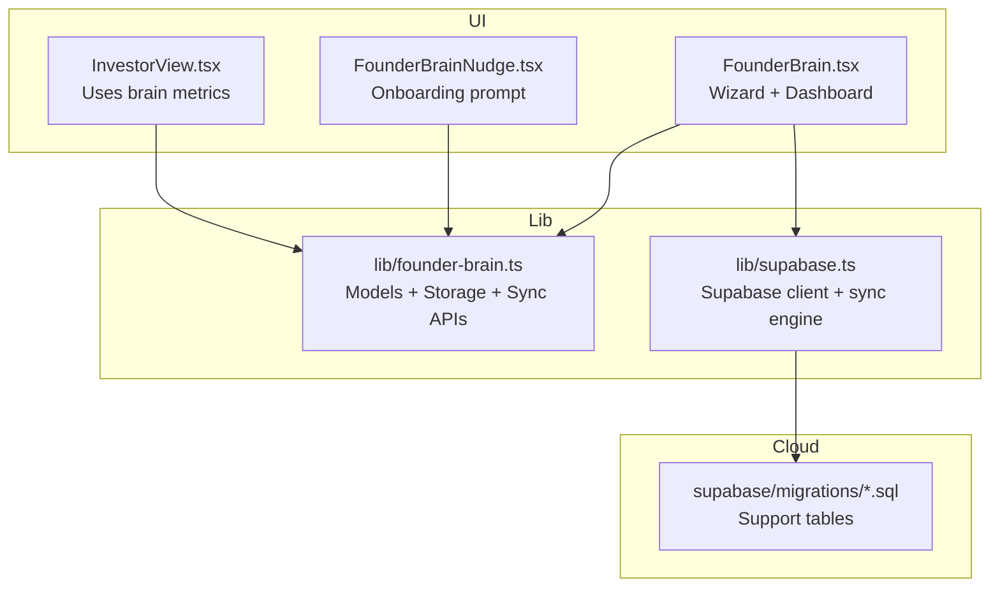
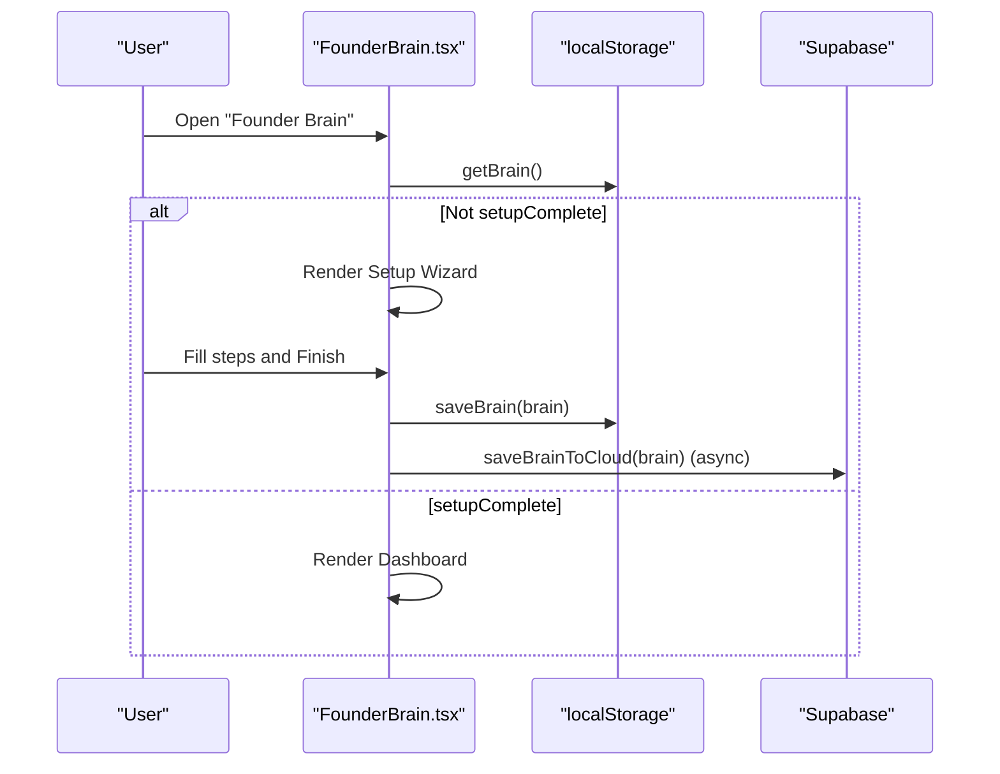
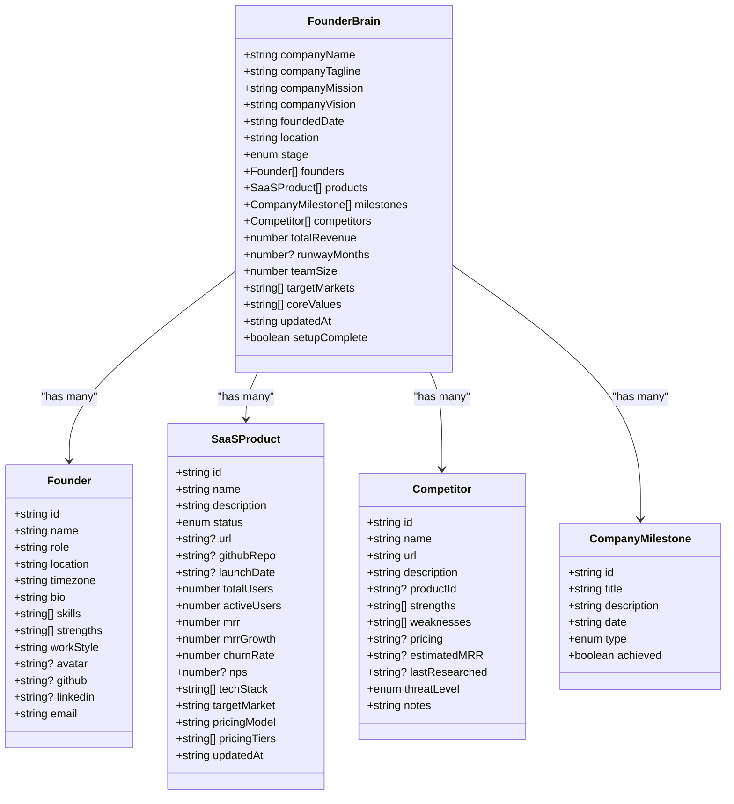
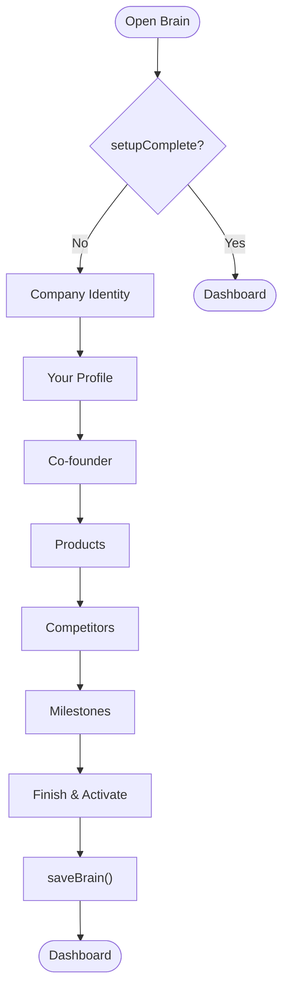
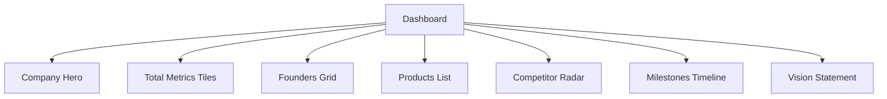
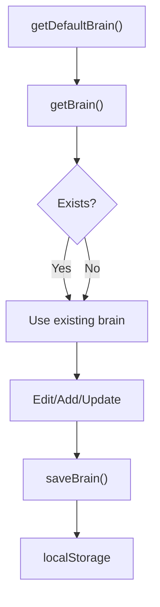
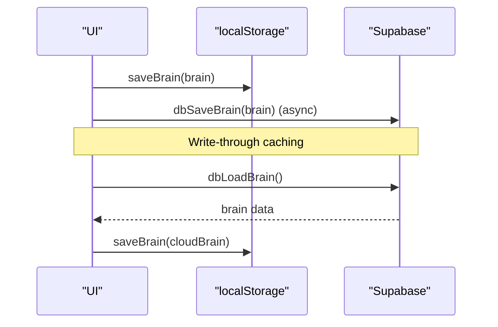
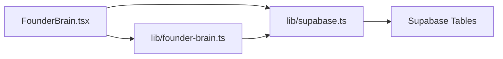

# Founder Brain

<cite>
**Referenced Files in This Document**
- [src/components/brain/FounderBrain.tsx](file://src/components/brain/FounderBrain.tsx)
- [src/lib/founder-brain.ts](file://src/lib/founder-brain.ts)
- [src/lib/supabase.ts](file://src/lib/supabase.ts)
- [supabase/migrations/20250228_add_support_tables.sql](file://supabase/migrations/20250228_add_support_tables.sql)
- [src/components/FounderBrainNudge.tsx](file://src/components/FounderBrainNudge.tsx)
- [src/components/reports/InvestorView.tsx](file://src/components/reports/InvestorView.tsx)
- [package.json](file://package.json)
</cite>

## Table of Contents
1. [Introduction](#introduction)
2. [Project Structure](#project-structure)
3. [Core Components](#core-components)
4. [Architecture Overview](#architecture-overview)
5. [Detailed Component Analysis](#detailed-component-analysis)
6. [Dependency Analysis](#dependency-analysis)
7. [Performance Considerations](#performance-considerations)
8. [Troubleshooting Guide](#troubleshooting-guide)
9. [Conclusion](#conclusion)
10. [Appendices](#appendices)

## Introduction
Founder Brain is the central intelligence hub of Core Brim Tech OS. It captures and maintains the foundational knowledge about your company, founders, products, competitors, and milestones. It provides:
- A guided setup wizard to bootstrap company identity, founder profiles, products, competitors, and milestones
- A dashboard that visualizes company metrics, product tracking, competitor analysis, and timeline management
- Local-first data storage with optional Supabase synchronization for persistence and cross-device sync

The module is designed to be the authoritative source of company intelligence used by other modules (e.g., grants, proposals, outreach, investor reports).

## Project Structure
The Founder Brain module spans UI components and a dedicated library for data models, persistence, and cloud sync:
- UI: a single-page wizard/dashboard component under the brain namespace
- Library: strongly typed models, local storage operations, and Supabase integration
- Cloud: optional Supabase tables for persistence and cross-device sync

**Diagram sources**
- [src/components/brain/FounderBrain.tsx](file://src/components/brain/FounderBrain.tsx#L1-L774)
- [src/lib/founder-brain.ts](file://src/lib/founder-brain.ts#L1-L213)
- [src/lib/supabase.ts](file://src/lib/supabase.ts#L1-L292)
- [supabase/migrations/20250228_add_support_tables.sql](file://supabase/migrations/20250228_add_support_tables.sql#L1-L46)
- [src/components/FounderBrainNudge.tsx](file://src/components/FounderBrainNudge.tsx#L1-L38)
- [src/components/reports/InvestorView.tsx](file://src/components/reports/InvestorView.tsx#L1-L269)

**Section sources**
- [src/components/brain/FounderBrain.tsx](file://src/components/brain/FounderBrain.tsx#L1-L774)
- [src/lib/founder-brain.ts](file://src/lib/founder-brain.ts#L1-L213)
- [src/lib/supabase.ts](file://src/lib/supabase.ts#L1-L292)
- [supabase/migrations/20250228_add_support_tables.sql](file://supabase/migrations/20250228_add_support_tables.sql#L1-L46)
- [src/components/FounderBrainNudge.tsx](file://src/components/FounderBrainNudge.tsx#L1-L38)
- [src/components/reports/InvestorView.tsx](file://src/components/reports/InvestorView.tsx#L1-L269)

## Core Components
- Wizard and Dashboard: Multi-step setup and visualization in a single React component
- Data models: Strongly typed interfaces for company, founders, products, competitors, and milestones
- Persistence: Local-first with localStorage and optional Supabase sync
- Cloud sync: Write-through caching and sync engine for cross-device consistency

Key responsibilities:
- Capture company identity, mission, vision, stage, and values
- Onboard founder profiles and co-founders
- Track SaaS products with metrics and tech stack
- Monitor competitors with threat levels and notes
- Maintain a timeline of milestones
- Expose summary and metrics to other modules

**Section sources**
- [src/components/brain/FounderBrain.tsx](file://src/components/brain/FounderBrain.tsx#L128-L322)
- [src/components/brain/FounderBrain.tsx](file://src/components/brain/FounderBrain.tsx#L543-L773)
- [src/lib/founder-brain.ts](file://src/lib/founder-brain.ts#L4-L86)
- [src/lib/founder-brain.ts](file://src/lib/founder-brain.ts#L92-L126)
- [src/lib/founder-brain.ts](file://src/lib/founder-brain.ts#L197-L213)

## Architecture Overview
The module follows a local-first design with optional cloud persistence:
- UI renders the wizard or dashboard based on setup state
- Data is stored in localStorage under a single key
- Optional Supabase integration persists and syncs data across devices
- Other modules consume brain data via exported helpers

**Diagram sources**
- [src/components/brain/FounderBrain.tsx](file://src/components/brain/FounderBrain.tsx#L754-L773)
- [src/lib/founder-brain.ts](file://src/lib/founder-brain.ts#L92-L104)
- [src/lib/founder-brain.ts](file://src/lib/founder-brain.ts#L200-L212)
- [src/lib/supabase.ts](file://src/lib/supabase.ts#L129-L153)

## Detailed Component Analysis

### Data Models
The brain stores a cohesive set of entities with explicit typing and defaults.

**Diagram sources**
- [src/lib/founder-brain.ts](file://src/lib/founder-brain.ts#L4-L86)

**Section sources**
- [src/lib/founder-brain.ts](file://src/lib/founder-brain.ts#L4-L86)

### Setup Wizard Flow
The wizard guides users through six steps: Company Identity, Your Profile, Co-founder, Products, Competitors, and Milestones. It updates the in-memory brain and persists on completion.

**Diagram sources**
- [src/components/brain/FounderBrain.tsx](file://src/components/brain/FounderBrain.tsx#L128-L322)
- [src/components/brain/FounderBrain.tsx](file://src/components/brain/FounderBrain.tsx#L754-L773)

**Section sources**
- [src/components/brain/FounderBrain.tsx](file://src/components/brain/FounderBrain.tsx#L128-L322)
- [src/components/brain/FounderBrain.tsx](file://src/components/brain/FounderBrain.tsx#L754-L773)

### Dashboard Visualization
The dashboard aggregates:
- Company hero with stage and core values
- Total metrics (users, MRR, products, competitors)
- Founders profile cards
- Products with status and KPIs
- Competitor radar with threat levels
- Timeline of milestones
- Vision statement

**Diagram sources**
- [src/components/brain/FounderBrain.tsx](file://src/components/brain/FounderBrain.tsx#L543-L750)

**Section sources**
- [src/components/brain/FounderBrain.tsx](file://src/components/brain/FounderBrain.tsx#L543-L750)

### Data Persistence Strategy
- Local-first: All data is stored in localStorage under a single key
- Defaults: A sensible default brain is provided for new users
- Metrics: Helper computes derived totals across products
- Summary: Exported function produces a concise summary string

**Diagram sources**
- [src/lib/founder-brain.ts](file://src/lib/founder-brain.ts#L106-L126)
- [src/lib/founder-brain.ts](file://src/lib/founder-brain.ts#L92-L104)

**Section sources**
- [src/lib/founder-brain.ts](file://src/lib/founder-brain.ts#L92-L126)
- [src/lib/founder-brain.ts](file://src/lib/founder-brain.ts#L186-L195)
- [src/lib/founder-brain.ts](file://src/lib/founder-brain.ts#L167-L184)

### Supabase Integration and Write-Through Caching
- Client setup: Lazy initialization with environment variables
- Write-through: Local cache updated immediately; async cloud write
- Sync engine: One-time pull to localStorage and batched push for migration
- Table mapping: Centralized mapping of table names to localStorage keys

**Diagram sources**
- [src/lib/founder-brain.ts](file://src/lib/founder-brain.ts#L200-L212)
- [src/lib/supabase.ts](file://src/lib/supabase.ts#L129-L153)
- [src/lib/supabase.ts](file://src/lib/supabase.ts#L209-L246)
- [src/lib/supabase.ts](file://src/lib/supabase.ts#L252-L291)

**Section sources**
- [src/lib/supabase.ts](file://src/lib/supabase.ts#L11-L26)
- [src/lib/supabase.ts](file://src/lib/supabase.ts#L57-L81)
- [src/lib/supabase.ts](file://src/lib/supabase.ts#L209-L246)
- [src/lib/supabase.ts](file://src/lib/supabase.ts#L252-L291)

### Configuration Options
The module exposes several configuration maps for consistent rendering and UX:
- Company stages: Pre-Idea, Idea Stage, MVP, Early Traction, Growth, Scaling
- Product statuses: Idea, Building, Beta, Live, Scaling, Paused
- Threat levels: Low, Medium, High, Critical
- Milestone types: Founding, Product, Revenue, Team, Partnership, Funding, Award

These are used to render labels, colors, and icons consistently across the wizard and dashboard.

**Section sources**
- [src/components/brain/FounderBrain.tsx](file://src/components/brain/FounderBrain.tsx#L19-L52)

### Practical Use Cases
- Onboarding workflows: Complete the wizard to unlock integrations and personalized experiences
- Strategic planning: Use the dashboard to review metrics, product health, and competitor positions
- Competitive analysis: Add and update competitors with threat levels and notes; leverage insights in other modules
- Investor reporting: Share the investor view that pulls from brain metrics and vision

**Section sources**
- [src/components/FounderBrainNudge.tsx](file://src/components/FounderBrainNudge.tsx#L1-L38)
- [src/components/reports/InvestorView.tsx](file://src/components/reports/InvestorView.tsx#L1-L269)
- [src/lib/founder-brain.ts](file://src/lib/founder-brain.ts#L167-L184)

## Dependency Analysis
- UI depends on:
  - Local storage APIs for persistence
  - Supabase client for optional cloud sync
  - Icons library for UI rendering
- Library depends on:
  - Supabase client for database operations
- Cloud tables:
  - Support tables exist for portfolio, knowledge base, SOPs, notifications, templates, and scheduler

**Diagram sources**
- [src/components/brain/FounderBrain.tsx](file://src/components/brain/FounderBrain.tsx#L1-L16)
- [src/lib/founder-brain.ts](file://src/lib/founder-brain.ts#L1-L10)
- [src/lib/supabase.ts](file://src/lib/supabase.ts#L1-L10)
- [supabase/migrations/20250228_add_support_tables.sql](file://supabase/migrations/20250228_add_support_tables.sql#L5-L45)

**Section sources**
- [package.json](file://package.json#L11-L22)
- [src/lib/supabase.ts](file://src/lib/supabase.ts#L11-L26)
- [supabase/migrations/20250228_add_support_tables.sql](file://supabase/migrations/20250228_add_support_tables.sql#L1-L46)

## Performance Considerations
- Local-first design ensures instant reads/writes during normal operation
- Cloud writes are asynchronous to avoid blocking the UI
- Batched upserts for initial migration reduce network overhead
- Derived metrics are computed on demand; keep product lists reasonably sized for smooth rendering

## Troubleshooting Guide
Common issues and resolutions:
- Supabase not configured
  - Symptom: Cloud sync disabled, warnings in console
  - Resolution: Set NEXT_PUBLIC_SUPABASE_URL and NEXT_PUBLIC_SUPABASE_ANON_KEY
- Sync failures
  - Symptom: Sync status shows error
  - Resolution: Check network connectivity and credentials; retry sync
- Data not persisting
  - Symptom: Refresh loses edits
  - Resolution: Verify localStorage availability; ensure saveBrain is called after edits
- Migration errors
  - Symptom: pushLocalToSupabase fails
  - Resolution: Inspect console logs and retry with corrected data

**Section sources**
- [src/lib/supabase.ts](file://src/lib/supabase.ts#L23-L26)
- [src/lib/supabase.ts](file://src/lib/supabase.ts#L241-L245)
- [src/lib/supabase.ts](file://src/lib/supabase.ts#L288-L290)

## Conclusion
Founder Brain centralizes company intelligence with a guided setup, robust data models, and a local-first architecture that optionally extends to Supabase. Its dashboard and metrics enable strategic planning, while its integration with other modules enhances personalization and productivity across the platform.

## Appendices

### Appendix A: Environment Variables
- NEXT_PUBLIC_SUPABASE_URL: Supabase project URL
- NEXT_PUBLIC_SUPABASE_ANON_KEY: Supabase anonymous API key

**Section sources**
- [src/lib/supabase.ts](file://src/lib/supabase.ts#L14-L26)

### Appendix B: Cloud Tables Reference
- Support tables created for portfolio, knowledge base, SOPs, notifications, templates, and scheduler

**Section sources**
- [supabase/migrations/20250228_add_support_tables.sql](file://supabase/migrations/20250228_add_support_tables.sql#L5-L45)