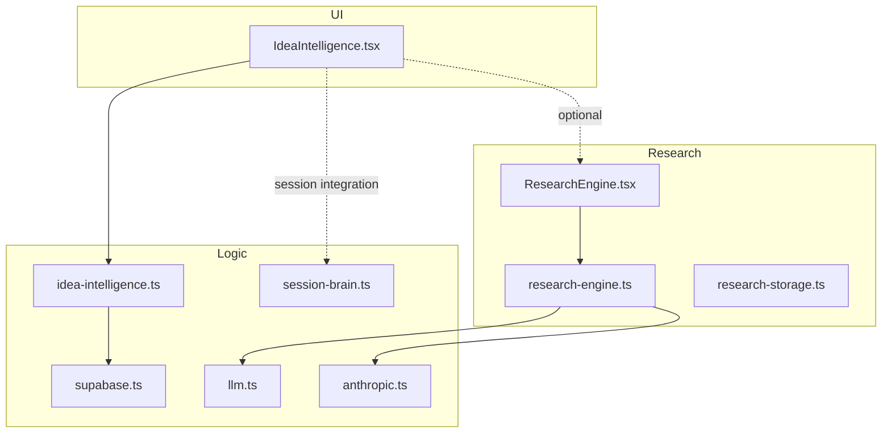
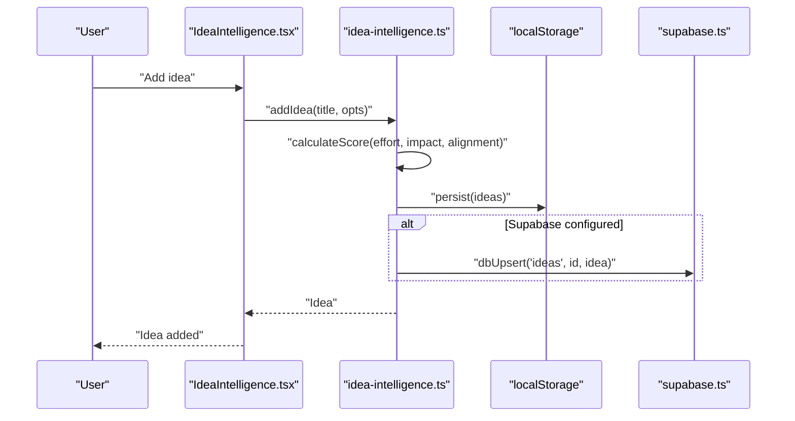
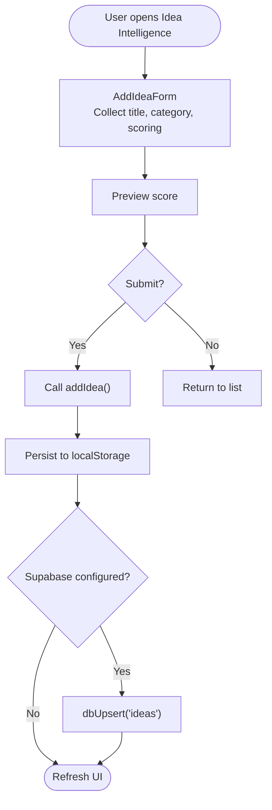
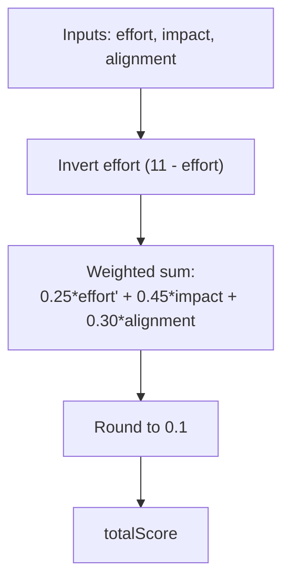
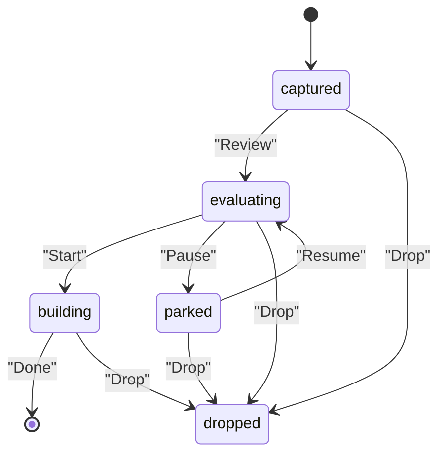
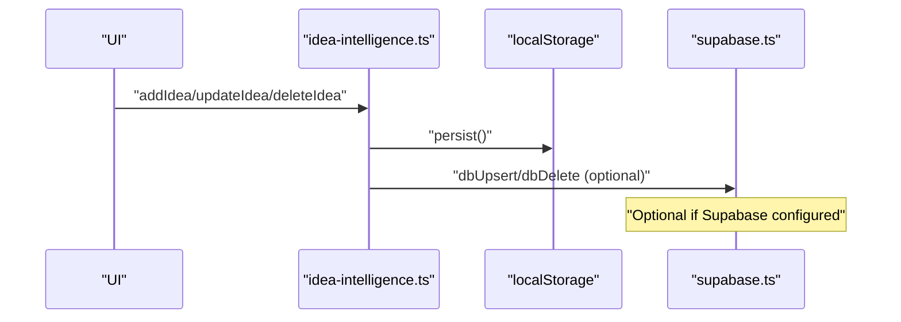
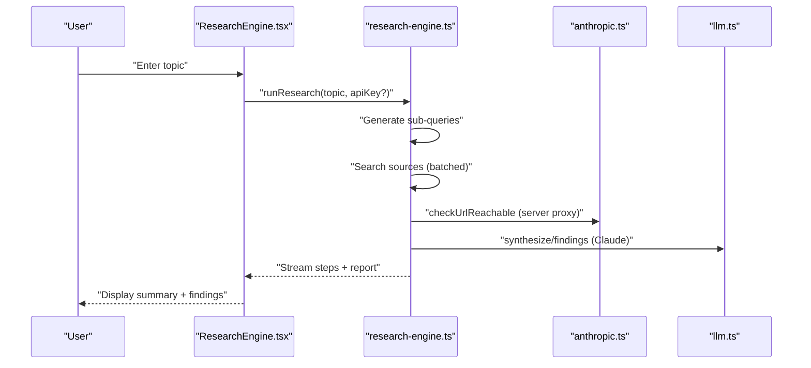
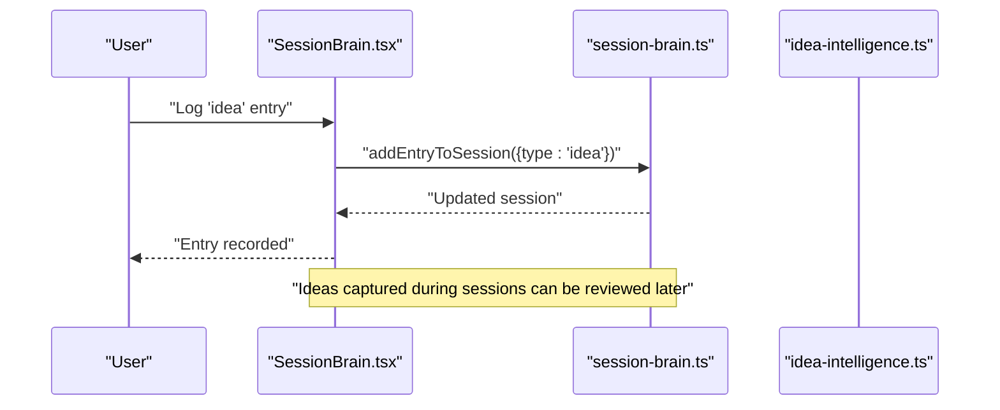
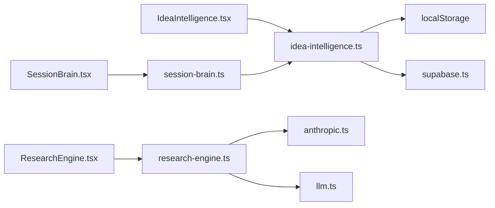

# Idea Intelligence

<cite>
**Referenced Files in This Document**
- [IdeaIntelligence.tsx](file://src/components/ideas/IdeaIntelligence.tsx)
- [idea-intelligence.ts](file://src/lib/idea-intelligence.ts)
- [supabase.ts](file://src/lib/supabase.ts)
- [SessionBrain.tsx](file://src/components/session/SessionBrain.tsx)
- [session-brain.ts](file://src/lib/session-brain.ts)
- [ResearchEngine.tsx](file://src/components/research/ResearchEngine.tsx)
- [research-engine.ts](file://src/lib/research-engine.ts)
- [research-storage.ts](file://src/lib/research-storage.ts)
- [llm.ts](file://src/lib/llm.ts)
- [anthropic.ts](file://src/lib/anthropic.ts)
- [SettingsPanel.tsx](file://src/components/settings/SettingsPanel.tsx)
- [20250228_add_support_tables.sql](file://supabase/migrations/20250228_add_support_tables.sql)
</cite>

## Table of Contents
1. [Introduction](#introduction)
2. [Project Structure](#project-structure)
3. [Core Components](#core-components)
4. [Architecture Overview](#architecture-overview)
5. [Detailed Component Analysis](#detailed-component-analysis)
6. [Dependency Analysis](#dependency-analysis)
7. [Performance Considerations](#performance-considerations)
8. [Troubleshooting Guide](#troubleshooting-guide)
9. [Conclusion](#conclusion)
10. [Appendices](#appendices)

## Introduction
Idea Intelligence is a structured innovation system designed to capture, score, rank, and act on ideas across their lifecycle. It integrates a lightweight scoring engine, a Kanban-style pipeline, and optional AI-powered research to fuel ideation and discovery. The module supports manual capture, session-driven idea logging, and optional cloud synchronization for persistence and cross-device continuity.

## Project Structure
The Idea Intelligence module centers on a UI component and a local-first library for ideas, with optional Supabase sync and integrations to AI research capabilities.

**Diagram sources**
- [IdeaIntelligence.tsx](file://src/components/ideas/IdeaIntelligence.tsx#L1-L355)
- [idea-intelligence.ts](file://src/lib/idea-intelligence.ts#L1-L156)
- [supabase.ts](file://src/lib/supabase.ts#L1-L292)
- [session-brain.ts](file://src/lib/session-brain.ts#L1-L278)
- [ResearchEngine.tsx](file://src/components/research/ResearchEngine.tsx#L1-L536)
- [research-engine.ts](file://src/lib/research-engine.ts#L1-L519)
- [research-storage.ts](file://src/lib/research-storage.ts#L1-L47)
- [llm.ts](file://src/lib/llm.ts#L1-L135)
- [anthropic.ts](file://src/lib/anthropic.ts#L1-L32)

**Section sources**
- [IdeaIntelligence.tsx](file://src/components/ideas/IdeaIntelligence.tsx#L1-L355)
- [idea-intelligence.ts](file://src/lib/idea-intelligence.ts#L1-L156)
- [supabase.ts](file://src/lib/supabase.ts#L1-L292)

## Core Components
- Idea capture and scoring UI: Provides a form to capture ideas with category, description, and a preview of a weighted score derived from effort, impact, and alignment.
- Idea pipeline: Displays ideas in a Kanban-like filterable list with status transitions (Captured, Evaluating, Building, Parked, Dropped).
- Idea scoring engine: Computes a total score from three 1–10 dimensions with a weighted formula and inverse effort scaling.
- Local-first persistence: Stores ideas in browser localStorage with optional write-through to Supabase.
- Optional research integration: Uses AI to generate research reports that can inform idea validation and opportunity identification.
- Optional session integration: Captures ideas during focused work sessions and aggregates them into session logs.

**Section sources**
- [IdeaIntelligence.tsx](file://src/components/ideas/IdeaIntelligence.tsx#L48-L155)
- [idea-intelligence.ts](file://src/lib/idea-intelligence.ts#L42-L46)
- [idea-intelligence.ts](file://src/lib/idea-intelligence.ts#L48-L155)
- [supabase.ts](file://src/lib/supabase.ts#L159-L246)
- [ResearchEngine.tsx](file://src/components/research/ResearchEngine.tsx#L284-L317)
- [research-engine.ts](file://src/lib/research-engine.ts#L206-L394)
- [session-brain.ts](file://src/lib/session-brain.ts#L97-L116)

## Architecture Overview
Idea Intelligence follows a write-through caching pattern: UI writes to localStorage immediately, then optionally to Supabase. The scoring engine is deterministic and client-side. Optional research and AI features are gated behind API keys and provider selection.

**Diagram sources**
- [IdeaIntelligence.tsx](file://src/components/ideas/IdeaIntelligence.tsx#L48-L155)
- [idea-intelligence.ts](file://src/lib/idea-intelligence.ts#L56-L96)
- [supabase.ts](file://src/lib/supabase.ts#L57-L66)

## Detailed Component Analysis

### Idea Capture and Pipeline UI
- AddIdeaForm: Collects title, category, and optional advanced scoring (effort, impact, alignment). Shows a live preview score and submits to the scoring library.
- IdeaCard: Renders idea metadata, status badges, and expanded details including per-dimension score bars and status buttons for quick transitions.
- Filtering and stats: Top-level filters by status, plus a “Top Ranked Idea” spotlight and summary cards for totals, backlog, building, and average score.

**Diagram sources**
- [IdeaIntelligence.tsx](file://src/components/ideas/IdeaIntelligence.tsx#L48-L155)
- [idea-intelligence.ts](file://src/lib/idea-intelligence.ts#L56-L96)
- [supabase.ts](file://src/lib/supabase.ts#L57-L66)

**Section sources**
- [IdeaIntelligence.tsx](file://src/components/ideas/IdeaIntelligence.tsx#L48-L155)
- [IdeaIntelligence.tsx](file://src/components/ideas/IdeaIntelligence.tsx#L157-L242)
- [IdeaIntelligence.tsx](file://src/components/ideas/IdeaIntelligence.tsx#L244-L355)

### Idea Scoring Engine
- Dimensions: Effort (inverted), Impact, Alignment, each on a 1–10 scale.
- Formula: Weighted total score computed client-side; effort is inverted so lower effort yields higher score contribution.
- Recalculation: When any dimension changes, the total score is recalculated and persisted.

**Diagram sources**
- [idea-intelligence.ts](file://src/lib/idea-intelligence.ts#L42-L46)

**Section sources**
- [idea-intelligence.ts](file://src/lib/idea-intelligence.ts#L42-L46)
- [idea-intelligence.ts](file://src/lib/idea-intelligence.ts#L98-L120)

### Idea Lifecycle Management
- States: captured, evaluating, building, parked, dropped.
- Transitions: From the IdeaCard, users can switch status directly.
- Validation and prioritization: Top ideas are surfaced for focus; filtering enables quick navigation by state.
- Execution: Parked ideas can be revisited; dropped ideas are visually muted and removable.

**Diagram sources**
- [IdeaIntelligence.tsx](file://src/components/ideas/IdeaIntelligence.tsx#L224-L237)
- [idea-intelligence.ts](file://src/lib/idea-intelligence.ts#L4-L5)

**Section sources**
- [IdeaIntelligence.tsx](file://src/components/ideas/IdeaIntelligence.tsx#L224-L237)
- [idea-intelligence.ts](file://src/lib/idea-intelligence.ts#L126-L130)

### Cloud Sync and Persistence
- Write-through cache: Every change is persisted locally immediately; optional Supabase upsert keeps data synchronized across devices.
- Sync status: Tracks last sync, syncing state, and errors.
- Migration: One-time push of existing localStorage data to Supabase.

**Diagram sources**
- [idea-intelligence.ts](file://src/lib/idea-intelligence.ts#L37-L40)
- [idea-intelligence.ts](file://src/lib/idea-intelligence.ts#L150-L155)
- [supabase.ts](file://src/lib/supabase.ts#L57-L66)
- [supabase.ts](file://src/lib/supabase.ts#L209-L246)

**Section sources**
- [supabase.ts](file://src/lib/supabase.ts#L159-L246)
- [supabase.ts](file://src/lib/supabase.ts#L252-L291)
- [idea-intelligence.ts](file://src/lib/idea-intelligence.ts#L147-L155)

### AI-Powered Research Integration
- Research Engine: Deep research with streaming steps, source validation, and synthesis into a report with findings and sources.
- Provider selection: Preferred provider (Claude or Google) configured in Settings; fallback behavior described.
- Idea enrichment: Research reports can inform idea validation and opportunity identification prior to building.

**Diagram sources**
- [ResearchEngine.tsx](file://src/components/research/ResearchEngine.tsx#L284-L317)
- [research-engine.ts](file://src/lib/research-engine.ts#L206-L394)
- [anthropic.ts](file://src/lib/anthropic.ts#L8-L26)
- [llm.ts](file://src/lib/llm.ts#L128-L134)

**Section sources**
- [ResearchEngine.tsx](file://src/components/research/ResearchEngine.tsx#L284-L317)
- [research-engine.ts](file://src/lib/research-engine.ts#L206-L394)
- [llm.ts](file://src/lib/llm.ts#L36-L46)

### Session-Based Idea Capture
- During active sessions, ideas can be logged directly into the session log with a dedicated quick-capture interface.
- Session entries increment counters for ideas captured, enabling retrospective insights and reporting.

**Diagram sources**
- [SessionBrain.tsx](file://src/components/session/SessionBrain.tsx#L305-L311)
- [session-brain.ts](file://src/lib/session-brain.ts#L97-L116)

**Section sources**
- [SessionBrain.tsx](file://src/components/session/SessionBrain.tsx#L305-L311)
- [session-brain.ts](file://src/lib/session-brain.ts#L97-L116)

## Dependency Analysis
- UI depends on the idea library for data and actions.
- Idea library persists to localStorage and conditionally to Supabase.
- Research engine depends on Anthropic utilities and LLM abstraction; UI streams progress and results.
- Settings panel configures providers and manages Supabase sync.

**Diagram sources**
- [IdeaIntelligence.tsx](file://src/components/ideas/IdeaIntelligence.tsx#L1-L10)
- [idea-intelligence.ts](file://src/lib/idea-intelligence.ts#L1-L10)
- [supabase.ts](file://src/lib/supabase.ts#L1-L10)
- [ResearchEngine.tsx](file://src/components/research/ResearchEngine.tsx#L1-L8)
- [research-engine.ts](file://src/lib/research-engine.ts#L1-L10)
- [anthropic.ts](file://src/lib/anthropic.ts#L1-L10)
- [llm.ts](file://src/lib/llm.ts#L1-L10)
- [SessionBrain.tsx](file://src/components/session/SessionBrain.tsx#L1-L14)
- [session-brain.ts](file://src/lib/session-brain.ts#L1-L10)

**Section sources**
- [idea-intelligence.ts](file://src/lib/idea-intelligence.ts#L1-L10)
- [supabase.ts](file://src/lib/supabase.ts#L1-L10)
- [research-engine.ts](file://src/lib/research-engine.ts#L1-L10)
- [anthropic.ts](file://src/lib/anthropic.ts#L1-L10)
- [llm.ts](file://src/lib/llm.ts#L1-L10)
- [session-brain.ts](file://src/lib/session-brain.ts#L1-L10)

## Performance Considerations
- Client-side scoring is fast and deterministic; keep scoring updates minimal to reduce re-renders.
- Research runs are asynchronous and streamed; ensure UI handles loading states and cancellations gracefully.
- Supabase sync is write-through; batch operations (where applicable) and avoid frequent polling.
- Local storage is synchronous; large datasets should be paginated or filtered to maintain responsiveness.

## Troubleshooting Guide
- Supabase not configured: UI indicates connection status; configure environment variables and run the schema migration.
- Sync failures: Check sync status and error fields; retry after resolving credentials.
- Missing API keys: Configure Anthropic or Google keys in Settings; preference determines provider selection.
- Research timeouts: Requests include timeouts; retry or simplify queries.

**Section sources**
- [SettingsPanel.tsx](file://src/components/settings/SettingsPanel.tsx#L271-L341)
- [supabase.ts](file://src/lib/supabase.ts#L168-L181)
- [llm.ts](file://src/lib/llm.ts#L36-L46)
- [research-engine.ts](file://src/lib/research-engine.ts#L58-L88)

## Conclusion
Idea Intelligence provides a practical, extensible framework for capturing and managing innovation ideas. Its write-through cache ensures reliability, while optional AI research and session integration enhance discovery and execution. The module’s design balances simplicity with powerful capabilities, supporting both individual ideation and team collaboration.

## Appendices

### Data Models
- Idea
  - Fields: id, title, description, category, status, project, source, effortScore, impactScore, alignmentScore, totalScore, createdAt, updatedAt, sessionId, tags, linkedResearch
  - Statuses: captured, evaluating, building, parked, dropped
  - Categories: product, feature, business, research, personal, other

- Session
  - Fields: id, title, status, startedAt, endedAt, entries, summary, tasksCompleted, decisionsCount, ideasCaptured, energyLevel, project
  - Entries: task_done, task_added, decision, idea, bug, note, code_context

- ResearchReport
  - Fields: id, topic, summary, keyFindings, sources, steps, createdAt, depth, subQueries, categories, totalPagesRead, gapQueriesResolved

**Section sources**
- [idea-intelligence.ts](file://src/lib/idea-intelligence.ts#L7-L25)
- [session-brain.ts](file://src/lib/session-brain.ts#L12-L25)
- [research-engine.ts](file://src/lib/research-engine.ts#L27-L40)

### Configuration Options
- Innovation domains: Category selection supports product, feature, business, research, personal, other.
- Creative methodologies: Scoring weights and dimensions can be tuned in the scoring function.
- Collaboration features: Supabase sync enables cross-device access and team sharing.
- AI integration: Provider selection (Claude or Google) and API key management in Settings.

**Section sources**
- [IdeaIntelligence.tsx](file://src/components/ideas/IdeaIntelligence.tsx#L18-L25)
- [idea-intelligence.ts](file://src/lib/idea-intelligence.ts#L42-L46)
- [SettingsPanel.tsx](file://src/components/settings/SettingsPanel.tsx#L198-L268)
- [llm.ts](file://src/lib/llm.ts#L24-L46)
- [supabase.ts](file://src/lib/supabase.ts#L209-L246)

### Ideation Workflows and Examples
- Quick capture: Use the “Capture Idea” form to quickly add sparks with category and optional scoring.
- Review and score: Evaluate ideas by adjusting effort/impact/alignment to refine total score.
- Prioritize: Filter by status to focus on captured or evaluating ideas; review top-ranked ideas.
- Validate: Use Research Engine to validate opportunities and gather evidence before building.
- Execute: Move ideas to building; revisit parked items; drop those not aligned or feasible.

**Section sources**
- [IdeaIntelligence.tsx](file://src/components/ideas/IdeaIntelligence.tsx#L244-L355)
- [ResearchEngine.tsx](file://src/components/research/ResearchEngine.tsx#L284-L317)