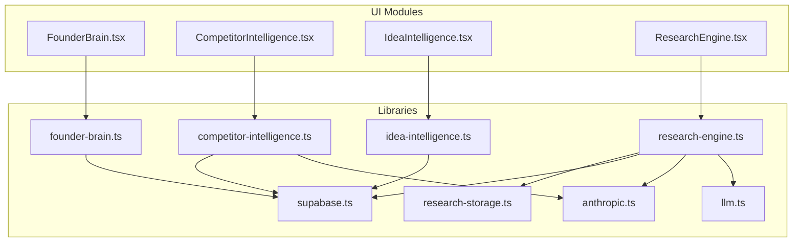
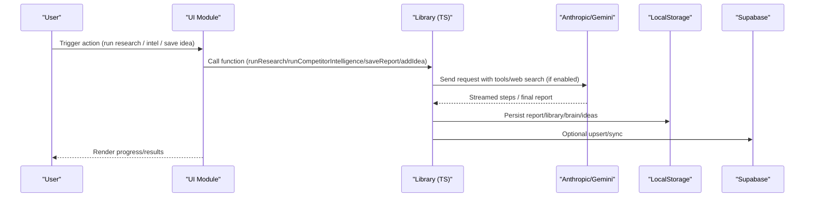
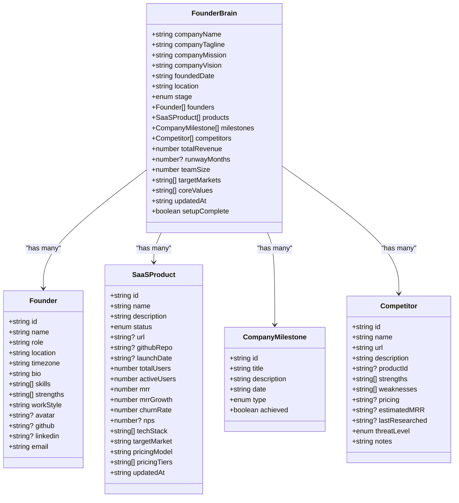
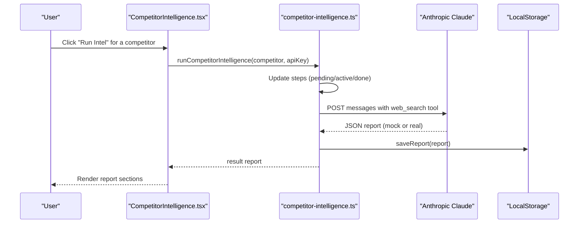
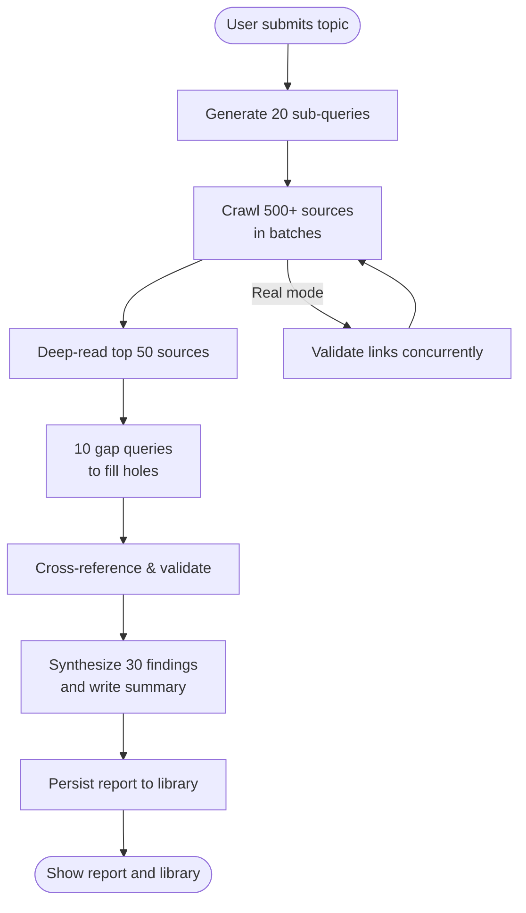
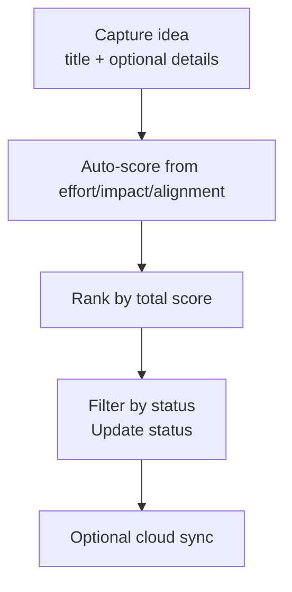
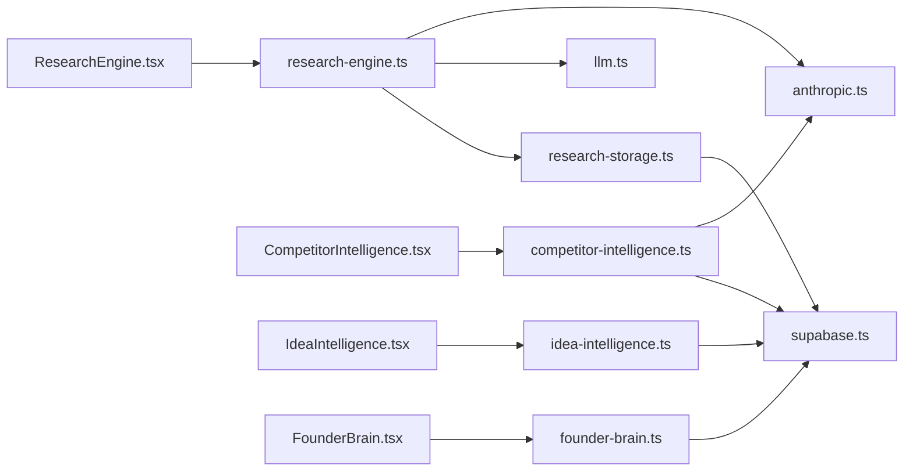

# Intelligence & Strategy

<cite>
**Referenced Files in This Document**
- [src/components/brain/FounderBrain.tsx](file://src/components/brain/FounderBrain.tsx)
- [src/components/intelligence/CompetitorIntelligence.tsx](file://src/components/intelligence/CompetitorIntelligence.tsx)
- [src/components/ideas/IdeaIntelligence.tsx](file://src/components/ideas/IdeaIntelligence.tsx)
- [src/components/research/ResearchEngine.tsx](file://src/components/research/ResearchEngine.tsx)
- [src/lib/founder-brain.ts](file://src/lib/founder-brain.ts)
- [src/lib/competitor-intelligence.ts](file://src/lib/competitor-intelligence.ts)
- [src/lib/idea-intelligence.ts](file://src/lib/idea-intelligence.ts)
- [src/lib/research-engine.ts](file://src/lib/research-engine.ts)
- [src/lib/research-storage.ts](file://src/lib/research-storage.ts)
- [src/lib/supabase.ts](file://src/lib/supabase.ts)
- [src/lib/llm.ts](file://src/lib/llm.ts)
- [src/lib/anthropic.ts](file://src/lib/anthropic.ts)
- [src/app/layout.tsx](file://src/app/layout.tsx)
- [package.json](file://package.json)
</cite>

## Table of Contents
1. [Introduction](#introduction)
2. [Project Structure](#project-structure)
3. [Core Components](#core-components)
4. [Architecture Overview](#architecture-overview)
5. [Detailed Component Analysis](#detailed-component-analysis)
6. [Dependency Analysis](#dependency-analysis)
7. [Performance Considerations](#performance-considerations)
8. [Troubleshooting Guide](#troubleshooting-guide)
9. [Conclusion](#conclusion)
10. [Appendices](#appendices)

## Introduction
This document explains the Intelligence & Strategy modules of Core Brim Tech OS: Founder Brain, Competitor Intelligence, Research Engine, and Idea Intelligence. It covers each module’s purpose, data models, user workflows, AI-powered capabilities, configuration options, customization features, and integrations with external data sources. Practical examples and decision-making workflows are included to help you apply these modules effectively.

## Project Structure
The Intelligence & Strategy modules are implemented as React components backed by TypeScript libraries that encapsulate data models, persistence, streaming AI workflows, and optional cloud synchronization.

**Diagram sources**
- [src/components/brain/FounderBrain.tsx](file://src/components/brain/FounderBrain.tsx#L1-L774)
- [src/components/intelligence/CompetitorIntelligence.tsx](file://src/components/intelligence/CompetitorIntelligence.tsx#L1-L406)
- [src/components/ideas/IdeaIntelligence.tsx](file://src/components/ideas/IdeaIntelligence.tsx#L1-L355)
- [src/components/research/ResearchEngine.tsx](file://src/components/research/ResearchEngine.tsx#L1-L536)
- [src/lib/founder-brain.ts](file://src/lib/founder-brain.ts#L1-L213)
- [src/lib/competitor-intelligence.ts](file://src/lib/competitor-intelligence.ts#L1-L298)
- [src/lib/idea-intelligence.ts](file://src/lib/idea-intelligence.ts#L1-L156)
- [src/lib/research-engine.ts](file://src/lib/research-engine.ts#L1-L519)
- [src/lib/research-storage.ts](file://src/lib/research-storage.ts#L1-L47)
- [src/lib/supabase.ts](file://src/lib/supabase.ts#L1-L292)
- [src/lib/llm.ts](file://src/lib/llm.ts#L1-L135)
- [src/lib/anthropic.ts](file://src/lib/anthropic.ts#L1-L32)

**Section sources**
- [src/app/layout.tsx](file://src/app/layout.tsx#L1-L22)
- [package.json](file://package.json#L1-L36)

## Core Components
- Founder Brain: Persistent company intelligence layer with company profile, founders, products, milestones, and competitors. Provides summaries and metrics used by other modules.
- Competitor Intelligence: Deep competitive research with streaming steps, mock/real AI workflows, and storage of structured reports with counter-strategies.
- Research Engine: Deep research pipeline with 5-level depth, 20 sub-queries, 500+ sources, and synthesis into a permanent report with a library.
- Idea Intelligence: Idea capture, scoring, filtering, and status management with cloud sync.

**Section sources**
- [src/components/brain/FounderBrain.tsx](file://src/components/brain/FounderBrain.tsx#L754-L774)
- [src/components/intelligence/CompetitorIntelligence.tsx](file://src/components/intelligence/CompetitorIntelligence.tsx#L177-L406)
- [src/components/research/ResearchEngine.tsx](file://src/components/research/ResearchEngine.tsx#L239-L536)
- [src/components/ideas/IdeaIntelligence.tsx](file://src/components/ideas/IdeaIntelligence.tsx#L244-L355)

## Architecture Overview
The modules integrate with local storage for fast persistence and with Supabase for cloud sync. AI workflows rely on Anthropic’s Claude API (with timeouts and error handling) and optionally Google Gemini via a unified LLM layer. The Research Engine validates source links and streams progress updates.

**Diagram sources**
- [src/lib/research-engine.ts](file://src/lib/research-engine.ts#L206-L394)
- [src/lib/competitor-intelligence.ts](file://src/lib/competitor-intelligence.ts#L177-L216)
- [src/lib/research-storage.ts](file://src/lib/research-storage.ts#L6-L10)
- [src/lib/supabase.ts](file://src/lib/supabase.ts#L57-L66)
- [src/lib/anthropic.ts](file://src/lib/anthropic.ts#L8-L26)
- [src/lib/llm.ts](file://src/lib/llm.ts#L128-L134)

## Detailed Component Analysis

### Founder Brain
Purpose
- Centralized company intelligence: identity, mission, vision, stage, founders, products, milestones, and competitors.
- Provides summaries and aggregated metrics for dashboards and downstream modules.

Key data models
- Founder, SaaSProduct, CompanyMilestone, Competitor, FounderBrain.

User workflows
- Setup wizard to configure company identity, founders, products, competitors, and milestones.
- Dashboard view to review company metrics, products, threats, and timeline.

AI/Integration notes
- Uses local storage with optional Supabase sync.
- Exposes summary and metrics used by other modules.

**Diagram sources**
- [src/lib/founder-brain.ts](file://src/lib/founder-brain.ts#L4-L86)

**Section sources**
- [src/components/brain/FounderBrain.tsx](file://src/components/brain/FounderBrain.tsx#L128-L774)
- [src/lib/founder-brain.ts](file://src/lib/founder-brain.ts#L92-L213)

### Competitor Intelligence
Purpose
- Deep competitive research on named competitors, producing structured reports with recent activity, SWOT, opportunities/warnings, and actionable counter-strategies.

Key data models
- CompetitorReport, CounterStrategy, IntelligenceStep.

User workflows
- Select a competitor from Founder Brain, run intelligence (streaming steps), view summary and sections (strategies, recent activity, opportunities, warnings, SWOT), re-run or dismiss errors.

AI/Integration notes
- Streaming engine with mock mode fallback.
- Real mode uses Anthropic Claude with web search tool.
- Stores reports in local storage with optional Supabase sync.

**Diagram sources**
- [src/components/intelligence/CompetitorIntelligence.tsx](file://src/components/intelligence/CompetitorIntelligence.tsx#L226-L252)
- [src/lib/competitor-intelligence.ts](file://src/lib/competitor-intelligence.ts#L177-L216)
- [src/lib/competitor-intelligence.ts](file://src/lib/competitor-intelligence.ts#L218-L290)

**Section sources**
- [src/components/intelligence/CompetitorIntelligence.tsx](file://src/components/intelligence/CompetitorIntelligence.tsx#L177-L406)
- [src/lib/competitor-intelligence.ts](file://src/lib/competitor-intelligence.ts#L7-L298)

### Research Engine
Purpose
- Deep research pipeline that generates 20 sub-queries, crawls 500+ sources across 12 categories, validates links, performs gap-filling, synthesizes findings, and produces a permanent report.

Key data models
- SearchResult, ResearchStep, ResearchReport.

User workflows
- Enter a topic, run research (streaming steps), view progress, save to library, browse library, search by topic/findings, delete reports.

AI/Integration notes
- Mock mode for development; real mode uses Anthropic Claude for sub-query generation, web search, synthesis, and key findings extraction.
- Validates source URLs safely and falls back to mock when needed.
- Streams source batches and step progress.

**Diagram sources**
- [src/lib/research-engine.ts](file://src/lib/research-engine.ts#L206-L394)
- [src/lib/research-storage.ts](file://src/lib/research-storage.ts#L6-L29)

**Section sources**
- [src/components/research/ResearchEngine.tsx](file://src/components/research/ResearchEngine.tsx#L239-L536)
- [src/lib/research-engine.ts](file://src/lib/research-engine.ts#L27-L519)
- [src/lib/research-storage.ts](file://src/lib/research-storage.ts#L1-L47)

### Idea Intelligence
Purpose
- Capture, score, rank, and manage ideas across categories and statuses. Supports quick scoring and advanced scoring with effort/impact/alignment weights.

Key data models
- Idea, IdeaStatus, IdeaCategory.

User workflows
- Capture ideas with category and optional scoring; filter by status; update status; view top ideas; delete ideas.

AI/Integration notes
- Local storage persistence with optional Supabase sync.
- Scores computed from effort (inverted), impact, and alignment.

**Diagram sources**
- [src/lib/idea-intelligence.ts](file://src/lib/idea-intelligence.ts#L42-L46)
- [src/lib/idea-intelligence.ts](file://src/lib/idea-intelligence.ts#L98-L120)

**Section sources**
- [src/components/ideas/IdeaIntelligence.tsx](file://src/components/ideas/IdeaIntelligence.tsx#L244-L355)
- [src/lib/idea-intelligence.ts](file://src/lib/idea-intelligence.ts#L1-L156)

## Dependency Analysis
External dependencies and integrations
- Anthropic SDK and API for Claude-based workflows.
- Supabase client for cloud persistence and sync.
- LLM abstraction supporting Claude and Google (Gemini).
- UI icons via lucide-react.

**Diagram sources**
- [src/components/research/ResearchEngine.tsx](file://src/components/research/ResearchEngine.tsx#L1-L8)
- [src/components/intelligence/CompetitorIntelligence.tsx](file://src/components/intelligence/CompetitorIntelligence.tsx#L1-L14)
- [src/components/ideas/IdeaIntelligence.tsx](file://src/components/ideas/IdeaIntelligence.tsx#L1-L8)
- [src/components/brain/FounderBrain.tsx](file://src/components/brain/FounderBrain.tsx#L1-L15)
- [src/lib/research-engine.ts](file://src/lib/research-engine.ts#L1-L4)
- [src/lib/competitor-intelligence.ts](file://src/lib/competitor-intelligence.ts#L4-L5)
- [src/lib/idea-intelligence.ts](file://src/lib/idea-intelligence.ts#L1-L2)
- [src/lib/founder-brain.ts](file://src/lib/founder-brain.ts#L1-L2)
- [src/lib/anthropic.ts](file://src/lib/anthropic.ts#L1-L32)
- [src/lib/llm.ts](file://src/lib/llm.ts#L1-L135)
- [src/lib/research-storage.ts](file://src/lib/research-storage.ts#L1-L47)
- [src/lib/supabase.ts](file://src/lib/supabase.ts#L1-L292)

**Section sources**
- [package.json](file://package.json#L11-L22)

## Performance Considerations
- Streaming progress: Both Research Engine and Competitor Intelligence stream updates to keep UI responsive.
- Link validation concurrency: Research Engine validates links concurrently with controlled concurrency and timeouts.
- Mock fallbacks: Modules provide mock modes to reduce API dependency during development.
- Local-first persistence: Fast reads/writes via localStorage; optional Supabase sync for multi-device consistency.

[No sources needed since this section provides general guidance]

## Troubleshooting Guide
Common issues and resolutions
- Missing API key: Intelligence modules require a stored Anthropic key; otherwise they fall back to mock mode or fail with an error.
- Timeout errors: Anthropic requests can time out; retry with a simpler request or adjust expectations.
- Interrupted runs: Sessions are persisted in sessionStorage to resume where you left off; check banners for reminders.
- Cloud sync: Ensure Supabase credentials are configured; otherwise, operations remain local.

**Section sources**
- [src/lib/llm.ts](file://src/lib/llm.ts#L12-L28)
- [src/lib/anthropic.ts](file://src/lib/anthropic.ts#L8-L31)
- [src/components/research/ResearchEngine.tsx](file://src/components/research/ResearchEngine.tsx#L237-L280)
- [src/components/intelligence/CompetitorIntelligence.tsx](file://src/components/intelligence/CompetitorIntelligence.tsx#L175-L215)
- [src/lib/supabase.ts](file://src/lib/supabase.ts#L23-L26)

## Conclusion
Core Brim Tech OS integrates a cohesive Intelligence & Strategy suite: a persistent Founder Brain, deep Research Engine, competitive intelligence with actionable counter-strategies, and an idea management system. Together, they enable rapid, AI-assisted decision-making, continuous market awareness, and disciplined innovation.

[No sources needed since this section summarizes without analyzing specific files]

## Appendices

### Configuration Options and Customization
- AI provider selection: Choose between Claude and Google (Gemini) via preferences and stored keys.
- Mock vs. real mode: Intelligence modules can run in mock mode for development; switch to real mode by adding an API key.
- Supabase sync: Enable cloud persistence and multi-device sync by configuring Supabase credentials.

**Section sources**
- [src/lib/llm.ts](file://src/lib/llm.ts#L12-L46)
- [src/lib/competitor-intelligence.ts](file://src/lib/competitor-intelligence.ts#L177-L216)
- [src/lib/research-engine.ts](file://src/lib/research-engine.ts#L206-L236)
- [src/lib/supabase.ts](file://src/lib/supabase.ts#L23-L26)

### Practical Use Cases and Decision-Making Workflows
- Market sizing and timing: Use the Research Engine to generate a comprehensive report, then export key findings to inform go-to-market strategy.
- Competitive response: Run Competitor Intelligence for a key rival, review counter-strategies, and update product roadmap accordingly.
- Idea funnel: Capture ideas with scoring, filter by status, and move top-ranked ideas into “Building” to align execution with highest impact.
- Company pulse: Use Founder Brain dashboard to track product metrics and milestones, informing quarterly planning.

[No sources needed since this section provides general guidance]