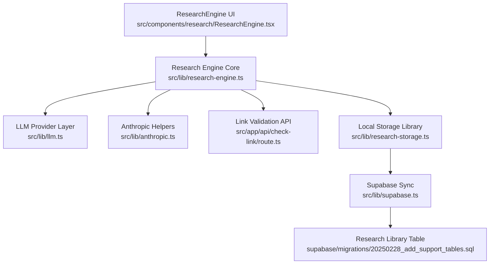
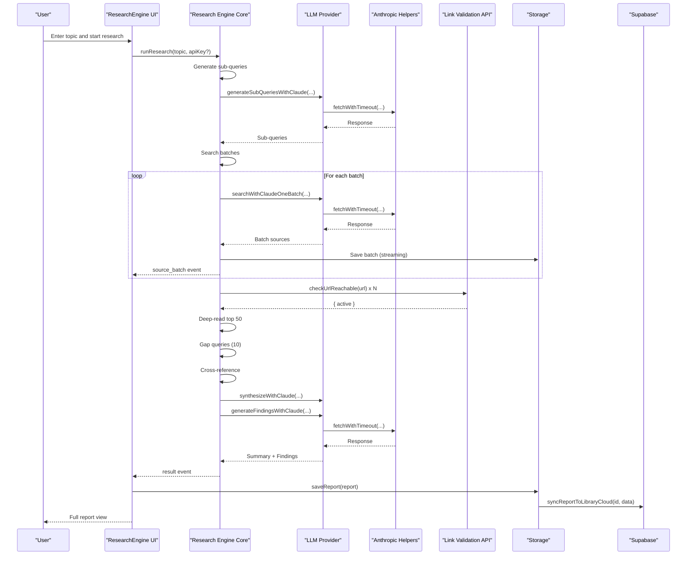
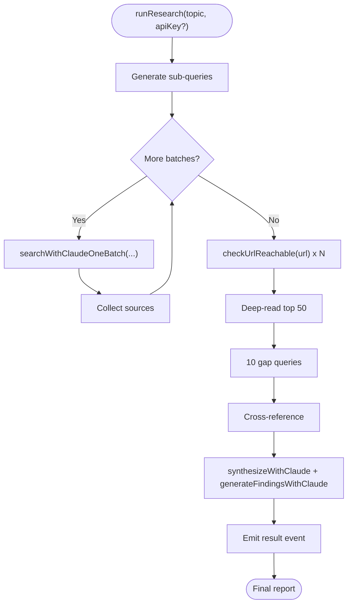
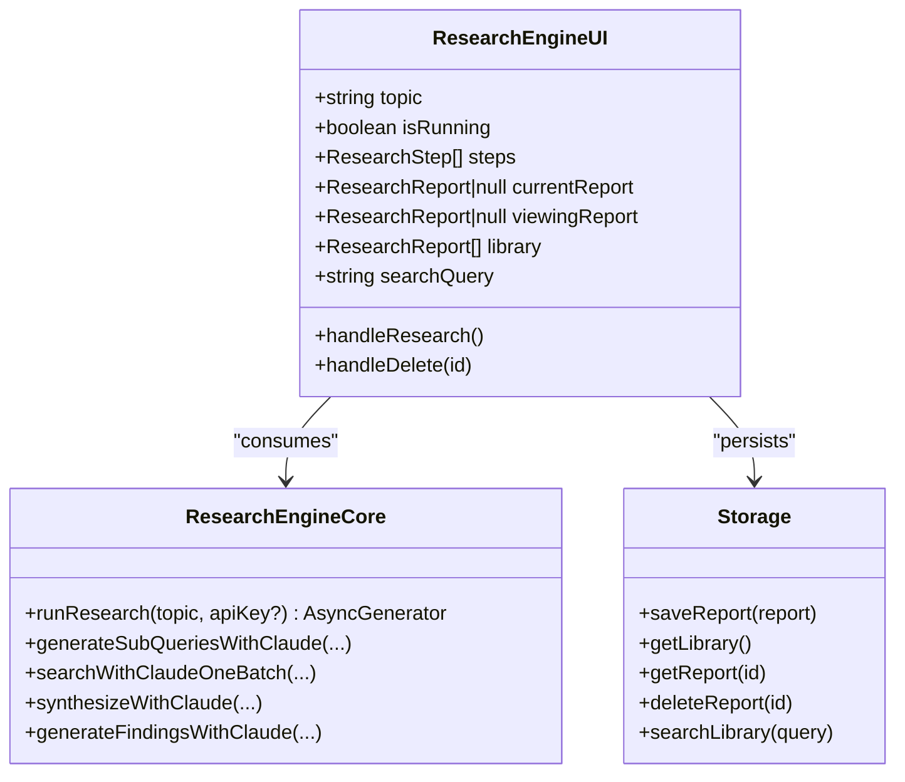
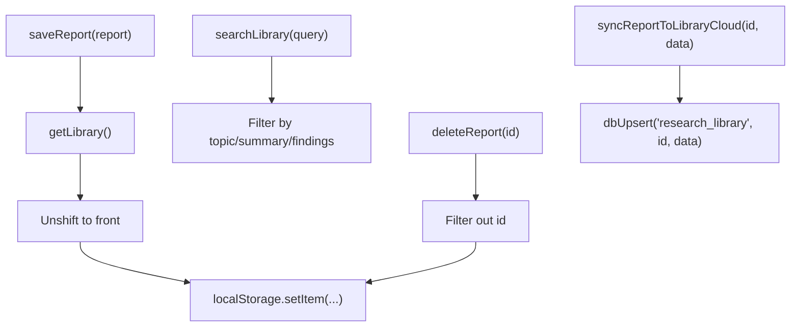
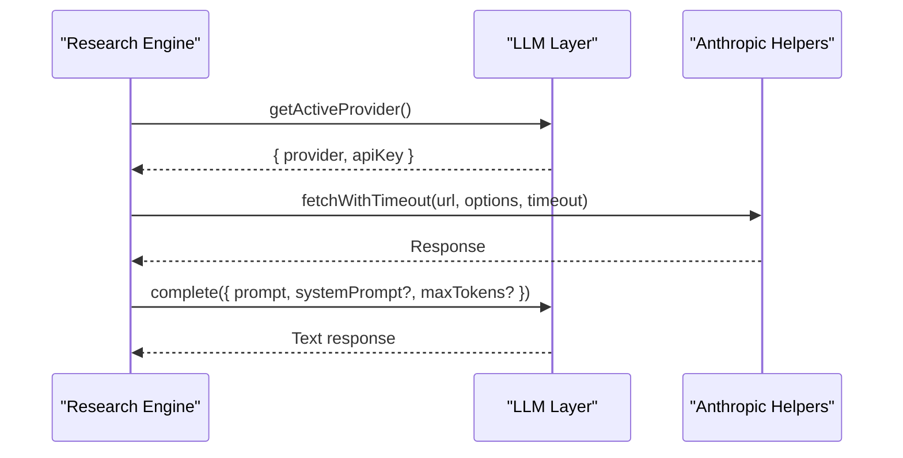
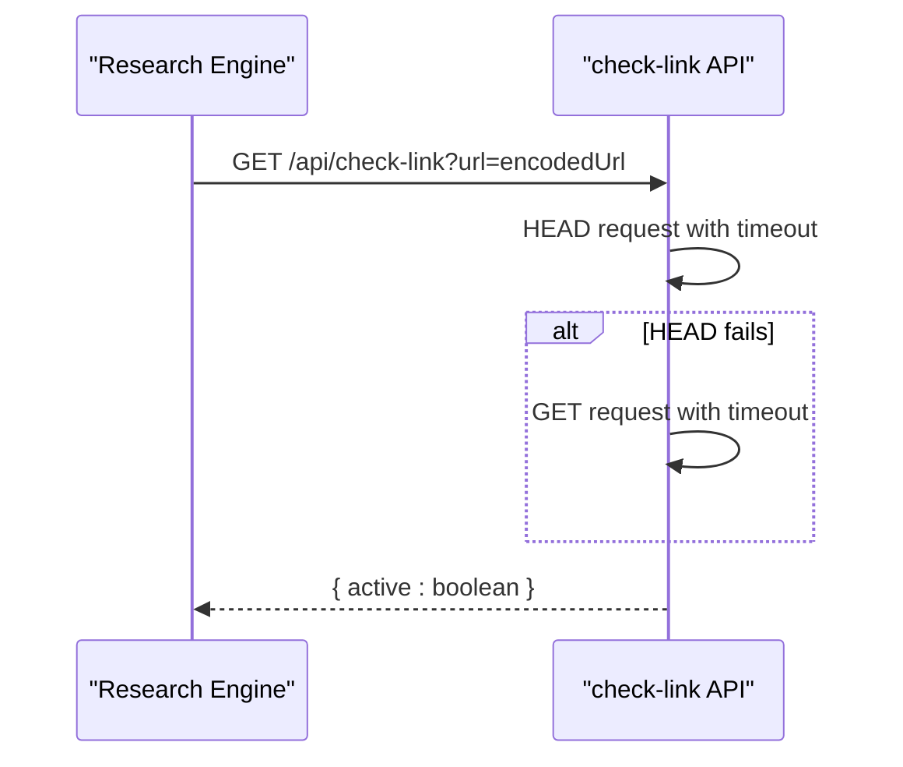
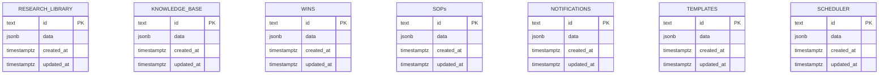
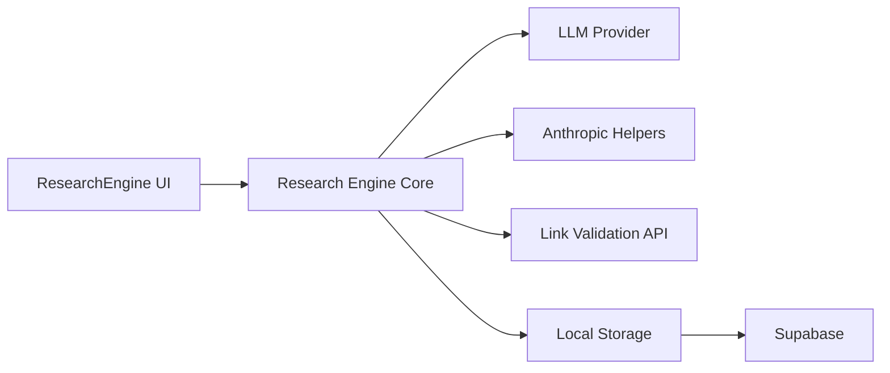

# Research Engine

<cite>
**Referenced Files in This Document**
- [ResearchEngine.tsx](file://src/components/research/ResearchEngine.tsx)
- [research-engine.ts](file://src/lib/research-engine.ts)
- [research-storage.ts](file://src/lib/research-storage.ts)
- [llm.ts](file://src/lib/llm.ts)
- [anthropic.ts](file://src/lib/anthropic.ts)
- [supabase.ts](file://src/lib/supabase.ts)
- [route.ts](file://src/app/api/check-link/route.ts)
- [20250228_add_support_tables.sql](file://supabase/migrations/20250228_add_support_tables.sql)
- [SettingsPanel.tsx](file://src/components/settings/SettingsPanel.tsx)
</cite>

## Table of Contents
1. [Introduction](#introduction)
2. [Project Structure](#project-structure)
3. [Core Components](#core-components)
4. [Architecture Overview](#architecture-overview)
5. [Detailed Component Analysis](#detailed-component-analysis)
6. [Dependency Analysis](#dependency-analysis)
7. [Performance Considerations](#performance-considerations)
8. [Troubleshooting Guide](#troubleshooting-guide)
9. [Conclusion](#conclusion)
10. [Appendices](#appendices)

## Introduction
The Research Engine is a knowledge discovery and synthesis system that transforms a user’s topic into a structured, actionable report. It performs multi-domain web search, validates and aggregates sources, deep-reads selected content, identifies gaps, cross-validates claims, and synthesizes findings into a comprehensive report. The system integrates with AI providers (currently Anthropic Claude) for advanced reasoning and summarization, while maintaining a robust local-first storage layer with optional cloud synchronization.

## Project Structure
The Research Engine spans UI, logic, and persistence layers:
- UI: React component that orchestrates the research lifecycle and renders results.
- Logic: Streaming research engine that emits step updates, source batches, and final reports.
- Persistence: Local storage for library and reports; optional Supabase integration for cloud sync.
- Infrastructure: API route for link validation and Supabase schema for research library and knowledge base.

**Diagram sources**
- [ResearchEngine.tsx](file://src/components/research/ResearchEngine.tsx#L239-L536)
- [research-engine.ts](file://src/lib/research-engine.ts#L206-L394)
- [llm.ts](file://src/lib/llm.ts#L36-L46)
- [anthropic.ts](file://src/lib/anthropic.ts#L8-L26)
- [route.ts](file://src/app/api/check-link/route.ts#L7-L42)
- [research-storage.ts](file://src/lib/research-storage.ts#L6-L29)
- [supabase.ts](file://src/lib/supabase.ts#L57-L66)
- [20250228_add_support_tables.sql](file://supabase/migrations/20250228_add_support_tables.sql#L12-L17)

**Section sources**
- [ResearchEngine.tsx](file://src/components/research/ResearchEngine.tsx#L1-L536)
- [research-engine.ts](file://src/lib/research-engine.ts#L1-L519)
- [research-storage.ts](file://src/lib/research-storage.ts#L1-L47)
- [supabase.ts](file://src/lib/supabase.ts#L1-L292)
- [route.ts](file://src/app/api/check-link/route.ts#L1-L43)
- [20250228_add_support_tables.sql](file://supabase/migrations/20250228_add_support_tables.sql#L1-L46)

## Core Components
- Research Engine Core: Orchestrates the research workflow, emits streaming updates, and produces a structured report.
- UI: Renders progress, source lists, and full report views; manages library and search.
- Storage: Persists reports locally and optionally syncs to Supabase.
- LLM Provider Layer: Selects provider and key, and executes completions.
- Anthropic Helpers: Provides timeout-aware fetch and error parsing.
- Link Validation API: Validates URLs server-side to avoid CORS and improve reliability.
- Supabase Integration: Upserts research library entries and supports sync operations.

**Section sources**
- [research-engine.ts](file://src/lib/research-engine.ts#L206-L394)
- [ResearchEngine.tsx](file://src/components/research/ResearchEngine.tsx#L239-L536)
- [research-storage.ts](file://src/lib/research-storage.ts#L6-L29)
- [llm.ts](file://src/lib/llm.ts#L36-L46)
- [anthropic.ts](file://src/lib/anthropic.ts#L8-L26)
- [route.ts](file://src/app/api/check-link/route.ts#L7-L42)
- [supabase.ts](file://src/lib/supabase.ts#L57-L66)

## Architecture Overview
The Research Engine follows a streaming, stepwise pipeline:
1. Query Generation: Creates multiple focused sub-queries.
2. Search: Executes batches of queries using AI-assisted web search.
3. Deep Read: Reads top sources; skims others.
4. Gap Analysis: Recursively resolves missing information.
5. Cross-Reference: Validates claims across multiple sources.
6. Synthesis: Produces summary and key findings.

**Diagram sources**
- [ResearchEngine.tsx](file://src/components/research/ResearchEngine.tsx#L284-L317)
- [research-engine.ts](file://src/lib/research-engine.ts#L206-L394)
- [llm.ts](file://src/lib/llm.ts#L128-L134)
- [anthropic.ts](file://src/lib/anthropic.ts#L8-L26)
- [route.ts](file://src/app/api/check-link/route.ts#L7-L42)
- [research-storage.ts](file://src/lib/research-storage.ts#L6-L9)
- [supabase.ts](file://src/lib/supabase.ts#L43-L46)

## Detailed Component Analysis

### Research Engine Core
The core engine defines data models for search results, research steps, and reports, and implements a streaming pipeline that yields step updates, source batches, and the final report. It supports a mock mode for development and a real mode powered by Anthropic’s API.

Key behaviors:
- Sub-query generation via AI.
- Batched search with web search tool.
- Source link validation via API route.
- Deep reading simulation and gap queries.
- Cross-reference and synthesis via AI.
- Emits structured events for UI rendering.

**Diagram sources**
- [research-engine.ts](file://src/lib/research-engine.ts#L206-L394)
- [research-engine.ts](file://src/lib/research-engine.ts#L427-L518)
- [route.ts](file://src/app/api/check-link/route.ts#L7-L42)

**Section sources**
- [research-engine.ts](file://src/lib/research-engine.ts#L6-L40)
- [research-engine.ts](file://src/lib/research-engine.ts#L206-L394)
- [research-engine.ts](file://src/lib/research-engine.ts#L427-L518)

### UI: Research Engine Component
The UI component manages state for the research lifecycle, displays progress, and renders the library and full report views. It integrates with the research engine via an async generator and persists results to local storage.

Highlights:
- Tabbed interface for engine and library.
- Streaming progress indicators and step details.
- Full report view with sub-queries, summary, findings, and source list.
- Library search and deletion.
- Session storage for interrupted runs.

**Diagram sources**
- [ResearchEngine.tsx](file://src/components/research/ResearchEngine.tsx#L239-L536)
- [research-engine.ts](file://src/lib/research-engine.ts#L206-L394)
- [research-storage.ts](file://src/lib/research-storage.ts#L6-L29)

**Section sources**
- [ResearchEngine.tsx](file://src/components/research/ResearchEngine.tsx#L239-L536)

### Storage and Persistence
The storage layer provides:
- Local-first persistence for research reports.
- Library search across topics, summaries, and findings.
- Optional cloud sync via Supabase upsert.

**Diagram sources**
- [research-storage.ts](file://src/lib/research-storage.ts#L6-L29)
- [supabase.ts](file://src/lib/supabase.ts#L57-L66)

**Section sources**
- [research-storage.ts](file://src/lib/research-storage.ts#L1-L47)
- [supabase.ts](file://src/lib/supabase.ts#L1-L292)

### LLM Provider Selection and Execution
The LLM layer selects the active provider and key, and executes completions with timeouts. The Research Engine uses this to generate sub-queries, summarize, and extract findings.

**Diagram sources**
- [llm.ts](file://src/lib/llm.ts#L36-L46)
- [llm.ts](file://src/lib/llm.ts#L128-L134)
- [anthropic.ts](file://src/lib/anthropic.ts#L8-L26)

**Section sources**
- [llm.ts](file://src/lib/llm.ts#L1-L135)
- [anthropic.ts](file://src/lib/anthropic.ts#L1-L32)

### Link Validation API
The link validation endpoint performs HEAD and fallback GET requests with timeouts and user-agent headers, returning whether a URL is reachable.

**Diagram sources**
- [route.ts](file://src/app/api/check-link/route.ts#L7-L42)
- [research-engine.ts](file://src/lib/research-engine.ts#L402-L423)

**Section sources**
- [route.ts](file://src/app/api/check-link/route.ts#L1-L43)
- [research-engine.ts](file://src/lib/research-engine.ts#L398-L423)

### Knowledge Base and Research Library Schema
Supabase tables support persistent storage for research reports and knowledge artifacts. The research library table stores JSON data with timestamps.

**Diagram sources**
- [20250228_add_support_tables.sql](file://supabase/migrations/20250228_add_support_tables.sql#L5-L45)

**Section sources**
- [20250228_add_support_tables.sql](file://supabase/migrations/20250228_add_support_tables.sql#L1-L46)
- [supabase.ts](file://src/lib/supabase.ts#L30-L49)

## Dependency Analysis
The Research Engine depends on:
- UI component for orchestration and rendering.
- Core engine for workflow and AI integrations.
- LLM provider layer for model selection and completions.
- Anthropic helpers for reliable HTTP calls.
- Link validation API for source verification.
- Storage for persistence and optional cloud sync.

**Diagram sources**
- [ResearchEngine.tsx](file://src/components/research/ResearchEngine.tsx#L239-L536)
- [research-engine.ts](file://src/lib/research-engine.ts#L206-L394)
- [llm.ts](file://src/lib/llm.ts#L36-L46)
- [anthropic.ts](file://src/lib/anthropic.ts#L8-L26)
- [route.ts](file://src/app/api/check-link/route.ts#L7-L42)
- [research-storage.ts](file://src/lib/research-storage.ts#L6-L29)
- [supabase.ts](file://src/lib/supabase.ts#L57-L66)

**Section sources**
- [ResearchEngine.tsx](file://src/components/research/ResearchEngine.tsx#L239-L536)
- [research-engine.ts](file://src/lib/research-engine.ts#L206-L394)
- [llm.ts](file://src/lib/llm.ts#L36-L46)
- [anthropic.ts](file://src/lib/anthropic.ts#L8-L26)
- [route.ts](file://src/app/api/check-link/route.ts#L7-L42)
- [research-storage.ts](file://src/lib/research-storage.ts#L6-L29)
- [supabase.ts](file://src/lib/supabase.ts#L57-L66)

## Performance Considerations
- Streaming updates: The engine emits incremental progress and source batches to keep the UI responsive during long runs.
- Concurrency: Link validation uses controlled concurrency to balance speed and reliability.
- Timeout handling: Anthropic fetch wrapper prevents hanging requests.
- Local-first design: Reduces latency by avoiding repeated network calls for UI state.
- Optional cloud sync: Enables cross-device continuity without impacting local responsiveness.

[No sources needed since this section provides general guidance]

## Troubleshooting Guide
Common issues and resolutions:
- API key not configured: The LLM layer throws if no provider key is present. Configure either Anthropic or Google keys in Settings.
- Link validation failures: The API route falls back from HEAD to GET; timeouts are handled gracefully.
- Network errors: The Anthropic helper converts AbortErrors into user-friendly messages.
- Storage sync: Supabase upserts and fetches are wrapped in try/catch with warnings logged.

**Section sources**
- [llm.ts](file://src/lib/llm.ts#L128-L134)
- [anthropic.ts](file://src/lib/anthropic.ts#L19-L25)
- [route.ts](file://src/app/api/check-link/route.ts#L16-L41)
- [supabase.ts](file://src/lib/supabase.ts#L57-L66)

## Conclusion
The Research Engine delivers a robust, streaming research pipeline that combines AI-powered search, validation, and synthesis into a reusable knowledge artifact. Its modular design enables easy extension to additional AI providers and knowledge domains, while local-first storage and optional cloud sync ensure flexibility and continuity.

[No sources needed since this section summarizes without analyzing specific files]

## Appendices

### Data Models
- SearchResult: Source metadata with credibility and category.
- ResearchStep: Lifecycle step with status and progress.
- ResearchReport: Complete research artifact with summary, findings, sources, and metadata.

**Section sources**
- [research-engine.ts](file://src/lib/research-engine.ts#L6-L40)

### Configuration Options
- AI provider selection: Choose between Claude and Google (Gemini) in Settings.
- API keys: Store keys in browser storage or environment variables.
- Research library: Toggle cloud sync via Supabase.

**Section sources**
- [SettingsPanel.tsx](file://src/components/settings/SettingsPanel.tsx#L66-L126)
- [llm.ts](file://src/lib/llm.ts#L24-L46)
- [supabase.ts](file://src/lib/supabase.ts#L23-L26)

### Practical Examples
- Research methodologies: Use the UI to enter topics, observe step progress, and review synthesized findings.
- Knowledge synthesis workflows: Combine multiple sub-queries, validate sources, and produce a final report.
- Decision-support applications: Use findings to inform product strategy, market entry, or funding decisions.

[No sources needed since this section provides general guidance]