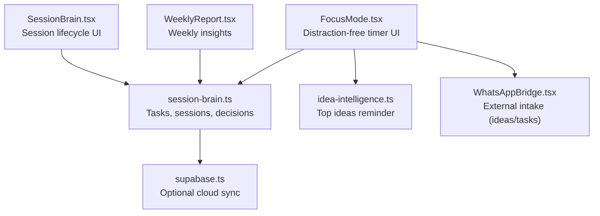
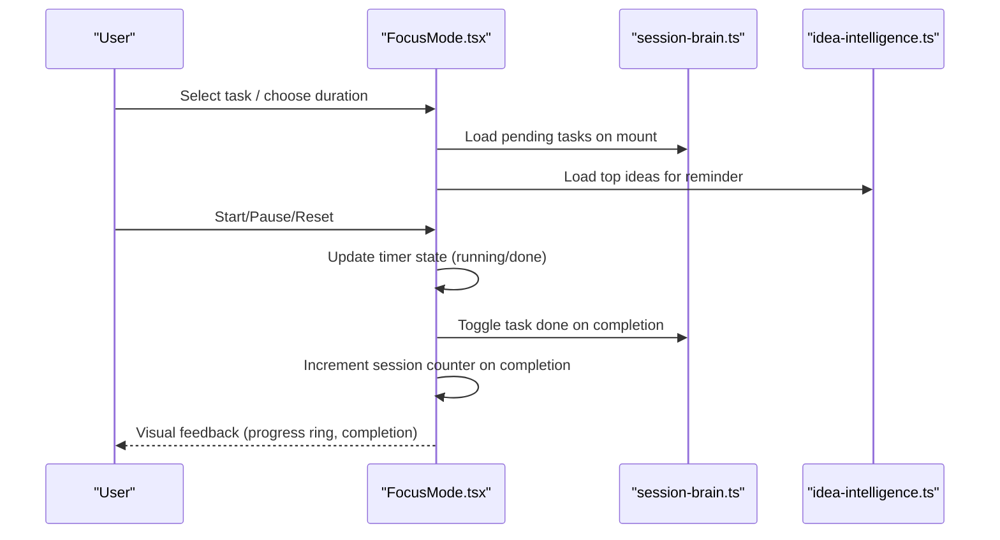
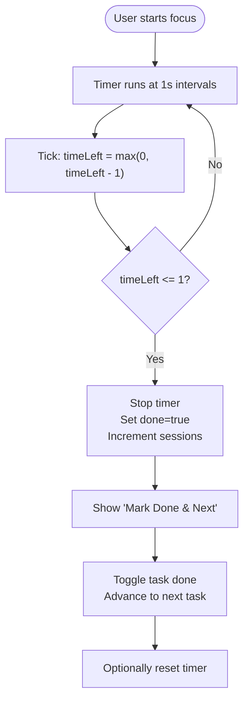
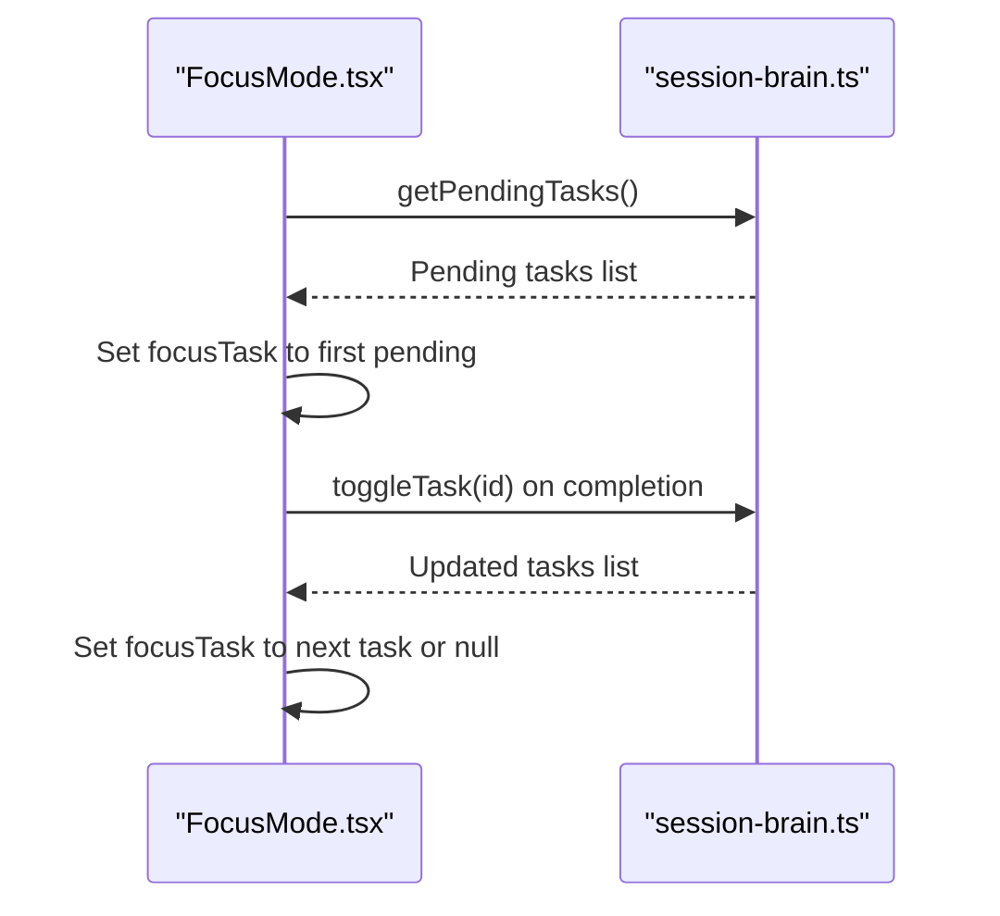
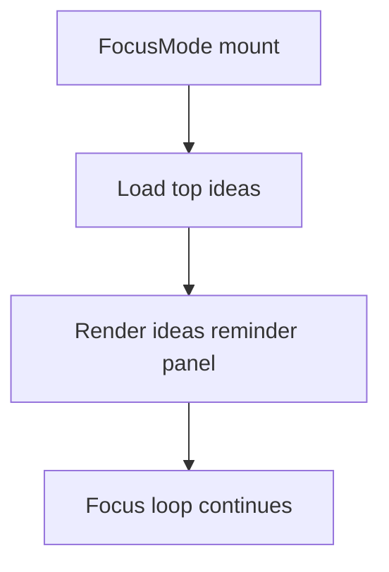
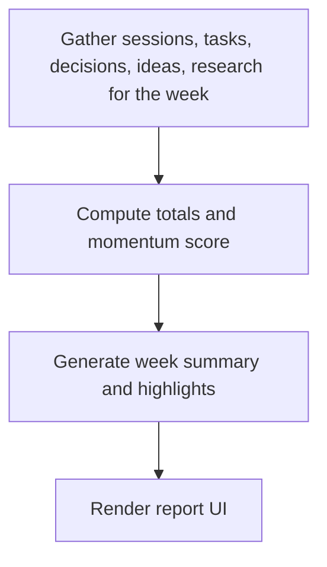
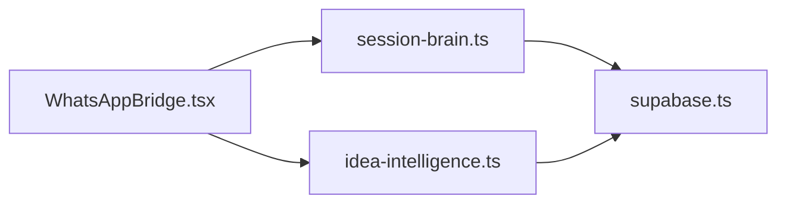
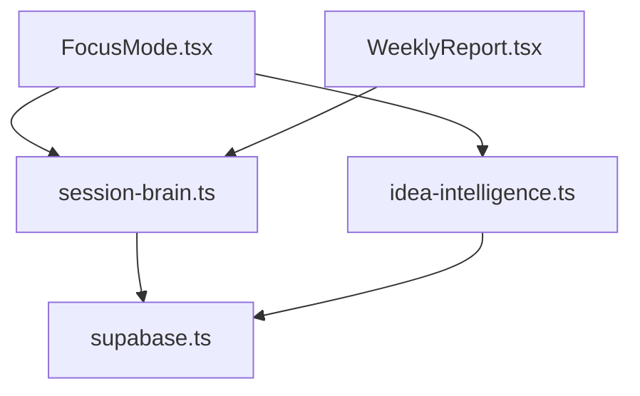

# Focus Mode

<cite>
**Referenced Files in This Document**
- [FocusMode.tsx](file://src/components/focus/FocusMode.tsx)
- [session-brain.ts](file://src/lib/session-brain.ts)
- [idea-intelligence.ts](file://src/lib/idea-intelligence.ts)
- [SessionBrain.tsx](file://src/components/session/SessionBrain.tsx)
- [WeeklyReport.tsx](file://src/components/reports/WeeklyReport.tsx)
- [supabase.ts](file://src/lib/supabase.ts)
- [page.tsx](file://src/app/page.tsx)
- [WhatsAppBridge.tsx](file://src/components/whatsapp/WhatsAppBridge.tsx)
</cite>

## Table of Contents
1. [Introduction](#introduction)
2. [Project Structure](#project-structure)
3. [Core Components](#core-components)
4. [Architecture Overview](#architecture-overview)
5. [Detailed Component Analysis](#detailed-component-analysis)
6. [Dependency Analysis](#dependency-analysis)
7. [Performance Considerations](#performance-considerations)
8. [Troubleshooting Guide](#troubleshooting-guide)
9. [Conclusion](#conclusion)
10. [Appendices](#appendices)

## Introduction
Focus Mode is a deep work and concentration enhancement system designed to minimize distractions and maximize productivity. It provides a distraction-free interface centered on a configurable focus timer, integrates with task management and idea capture, and supports habit formation through session tracking and weekly insights. The module emphasizes time-blocking, task-centric focus, and ambient reminders to sustain deep work momentum.

## Project Structure
Focus Mode lives under the components and libraries that support session continuity, task tracking, and idea scoring. It integrates with Session Brain for tasks and session logs, and with Idea Intelligence for idea recall during focus.

**Diagram sources**
- [FocusMode.tsx](file://src/components/focus/FocusMode.tsx#L1-L255)
- [session-brain.ts](file://src/lib/session-brain.ts#L1-L278)
- [idea-intelligence.ts](file://src/lib/idea-intelligence.ts#L1-L156)
- [supabase.ts](file://src/lib/supabase.ts#L1-L292)
- [SessionBrain.tsx](file://src/components/session/SessionBrain.tsx#L1-L742)
- [WeeklyReport.tsx](file://src/components/reports/WeeklyReport.tsx#L1-L237)
- [WhatsAppBridge.tsx](file://src/components/whatsapp/WhatsAppBridge.tsx#L1-L211)

**Section sources**
- [FocusMode.tsx](file://src/components/focus/FocusMode.tsx#L1-L255)
- [session-brain.ts](file://src/lib/session-brain.ts#L1-L278)
- [idea-intelligence.ts](file://src/lib/idea-intelligence.ts#L1-L156)
- [SessionBrain.tsx](file://src/components/session/SessionBrain.tsx#L1-L742)
- [WeeklyReport.tsx](file://src/components/reports/WeeklyReport.tsx#L1-L237)
- [supabase.ts](file://src/lib/supabase.ts#L1-L292)
- [WhatsAppBridge.tsx](file://src/components/whatsapp/WhatsAppBridge.tsx#L1-L211)

## Core Components
- Focus Timer: A circular countdown with preset durations (25, 45, 90 minutes), play/pause/reset controls, and completion handling that increments session counters.
- Task Selection: Auto-selection of the first pending task and manual switching among pending tasks to maintain a single focus item.
- Ambient Reminders: Periodic top ideas reminder to keep inspiration close during focus.
- Habit Tracking: Session counter and completion messaging to reinforce streaks and momentum.
- Integration Points: Hooks into Session Brain for tasks and session continuity, and Idea Intelligence for periodic idea prompts.

**Section sources**
- [FocusMode.tsx](file://src/components/focus/FocusMode.tsx#L8-L85)
- [session-brain.ts](file://src/lib/session-brain.ts#L177-L221)
- [idea-intelligence.ts](file://src/lib/idea-intelligence.ts#L126-L130)

## Architecture Overview
Focus Mode orchestrates a minimal, distraction-free loop around a single task and a configurable timer. It relies on local persistence for tasks and sessions, optionally synchronized to a remote database. Weekly reporting aggregates focus outcomes to reinforce habit formation.

**Diagram sources**
- [FocusMode.tsx](file://src/components/focus/FocusMode.tsx#L20-L82)
- [session-brain.ts](file://src/lib/session-brain.ts#L179-L215)
- [idea-intelligence.ts](file://src/lib/idea-intelligence.ts#L126-L130)

## Detailed Component Analysis

### Focus Timer and Controls
- Preset durations: 25, 45, and 90 minutes.
- Circular progress visualization with dynamic stroke color based on state.
- Completion triggers incrementing session count and enabling “Mark Done & Next” action.
- Reset behavior restores timer to selected duration and clears paused state.

**Diagram sources**
- [FocusMode.tsx](file://src/components/focus/FocusMode.tsx#L37-L53)
- [FocusMode.tsx](file://src/components/focus/FocusMode.tsx#L55-L82)

**Section sources**
- [FocusMode.tsx](file://src/components/focus/FocusMode.tsx#L8-L85)

### Task Management Integration
- Loads pending tasks on mount and selects the first if none is chosen.
- Supports switching tasks and toggling completion, which also logs a session entry for completed tasks.
- Ensures focus remains on a single task until completion.

**Diagram sources**
- [FocusMode.tsx](file://src/components/focus/FocusMode.tsx#L31-L35)
- [FocusMode.tsx](file://src/components/focus/FocusMode.tsx#L75-L82)
- [session-brain.ts](file://src/lib/session-brain.ts#L183-L215)

**Section sources**
- [FocusMode.tsx](file://src/components/focus/FocusMode.tsx#L20-L82)
- [session-brain.ts](file://src/lib/session-brain.ts#L179-L221)

### Ambient Idea Reminders
- Retrieves top ideas filtered by status to display as gentle prompts during focus.
- Encourages continuity of creative momentum by surfacing high-value ideas.

**Diagram sources**
- [FocusMode.tsx](file://src/components/focus/FocusMode.tsx#L28-L29)
- [idea-intelligence.ts](file://src/lib/idea-intelligence.ts#L126-L130)

**Section sources**
- [FocusMode.tsx](file://src/components/focus/FocusMode.tsx#L230-L249)
- [idea-intelligence.ts](file://src/lib/idea-intelligence.ts#L126-L130)

### Weekly Insights and Habit Formation
- WeeklyReport aggregates sessions, tasks completed, decisions, ideas, and research to compute a momentum score and weekly summary.
- Provides a historical perspective to reinforce long-term focus habits.

**Diagram sources**
- [WeeklyReport.tsx](file://src/components/reports/WeeklyReport.tsx#L44-L96)

**Section sources**
- [WeeklyReport.tsx](file://src/components/reports/WeeklyReport.tsx#L1-L237)

### External Integrations
- WhatsAppBridge demonstrates external intake routing ideas and tasks into the system, which complements Focus Mode by feeding it content and tasks from mobile channels.
- Supabase integration enables optional synchronization of tasks, sessions, and other data across devices.

**Diagram sources**
- [WhatsAppBridge.tsx](file://src/components/whatsapp/WhatsAppBridge.tsx#L4-L48)
- [supabase.ts](file://src/lib/supabase.ts#L263-L278)

**Section sources**
- [WhatsAppBridge.tsx](file://src/components/whatsapp/WhatsAppBridge.tsx#L1-L211)
- [supabase.ts](file://src/lib/supabase.ts#L1-L292)

## Dependency Analysis
- FocusMode depends on:
  - session-brain for task state and session continuity.
  - idea-intelligence for ambient idea prompts.
- Optional cloud sync via supabase enhances portability and backup.
- WeeklyReport consumes session-brain data to produce insights.

**Diagram sources**
- [FocusMode.tsx](file://src/components/focus/FocusMode.tsx#L1-L7)
- [session-brain.ts](file://src/lib/session-brain.ts#L1-L278)
- [idea-intelligence.ts](file://src/lib/idea-intelligence.ts#L1-L156)
- [WeeklyReport.tsx](file://src/components/reports/WeeklyReport.tsx#L1-L8)
- [supabase.ts](file://src/lib/supabase.ts#L1-L292)

**Section sources**
- [FocusMode.tsx](file://src/components/focus/FocusMode.tsx#L1-L7)
- [session-brain.ts](file://src/lib/session-brain.ts#L1-L278)
- [idea-intelligence.ts](file://src/lib/idea-intelligence.ts#L1-L156)
- [WeeklyReport.tsx](file://src/components/reports/WeeklyReport.tsx#L1-L8)
- [supabase.ts](file://src/lib/supabase.ts#L1-L292)

## Performance Considerations
- Timer tick frequency: 1 second is lightweight and appropriate for UI updates.
- Local-first design minimizes latency; optional cloud sync is asynchronous and non-blocking.
- Rendering optimizations: SVG progress circle and memoized idea lists reduce unnecessary re-renders.

## Troubleshooting Guide
- Timer not starting: Verify a task is selected and the timer is not locked while running.
- No tasks shown: Ensure tasks exist in Session Brain; pending tasks are loaded on mount.
- Completion not recorded: Confirm the task toggle completes and the next task is selected.
- Cloud sync not appearing: Check Supabase configuration and network connectivity.

**Section sources**
- [FocusMode.tsx](file://src/components/focus/FocusMode.tsx#L55-L82)
- [session-brain.ts](file://src/lib/session-brain.ts#L179-L215)
- [supabase.ts](file://src/lib/supabase.ts#L23-L26)

## Conclusion
Focus Mode delivers a streamlined, distraction-free environment for deep work. By centering on a single task, offering flexible time blocks, and integrating with task and idea systems, it supports habit formation and measurable productivity gains. Optional cloud sync and weekly insights further reinforce consistency and progress awareness.

## Appendices

### Examples and Workflows
- Starting a focus session:
  - Choose a task from pending tasks.
  - Select a duration (25/45/90 minutes).
  - Start the timer; focus until completion.
  - Mark task done to advance to the next task.
- Weekly review:
  - Open Weekly Report to review focus time, sessions, tasks completed, and momentum score.

**Section sources**
- [FocusMode.tsx](file://src/components/focus/FocusMode.tsx#L55-L82)
- [WeeklyReport.tsx](file://src/components/reports/WeeklyReport.tsx#L114-L237)

### Integration Touchpoints
- Session Brain: Start/end sessions, log entries, manage tasks and decisions.
- Idea Intelligence: Capture and score ideas; retrieve top ideas for reminders.
- Supabase: Optional synchronization of tasks, sessions, and ideas across devices.
- WhatsAppBridge: External intake of ideas and tasks for seamless capture.

**Section sources**
- [SessionBrain.tsx](file://src/components/session/SessionBrain.tsx#L669-L742)
- [idea-intelligence.ts](file://src/lib/idea-intelligence.ts#L1-L156)
- [supabase.ts](file://src/lib/supabase.ts#L1-L292)
- [WhatsAppBridge.tsx](file://src/components/whatsapp/WhatsAppBridge.tsx#L1-L211)

### Navigation Badge Reference
- The home page highlights “Focus” as a badge, indicating the module’s prominence in the OS.

**Section sources**
- [page.tsx](file://src/app/page.tsx#L94-L107)