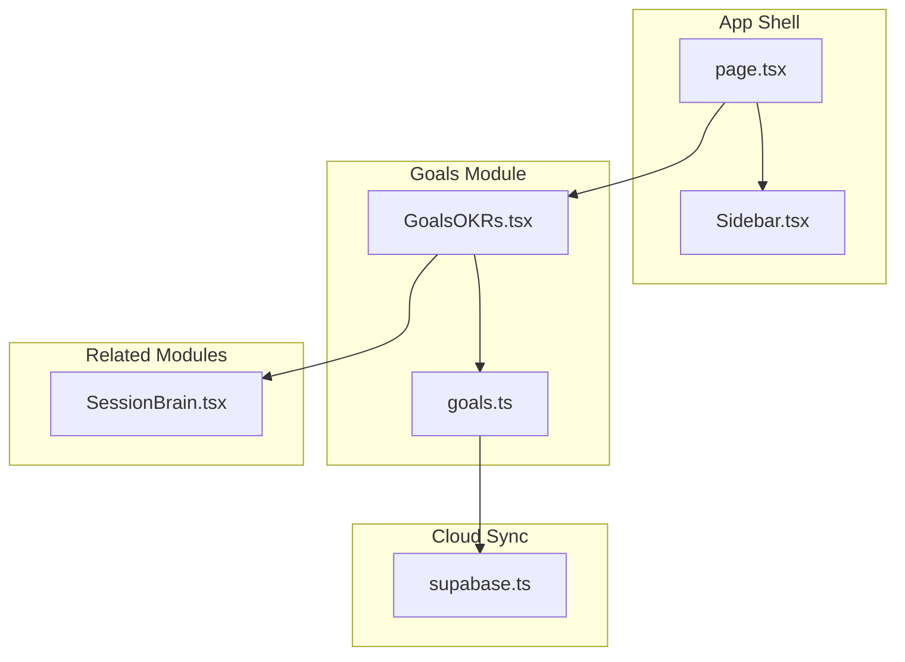
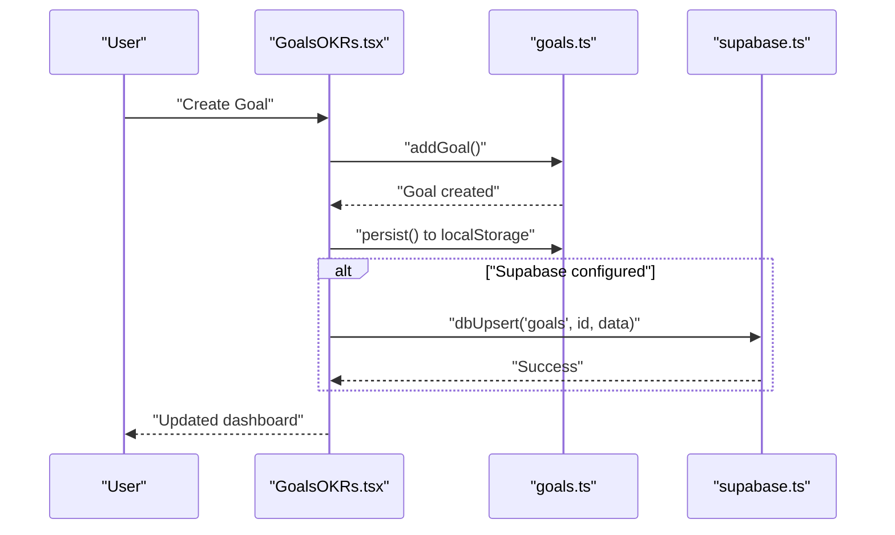
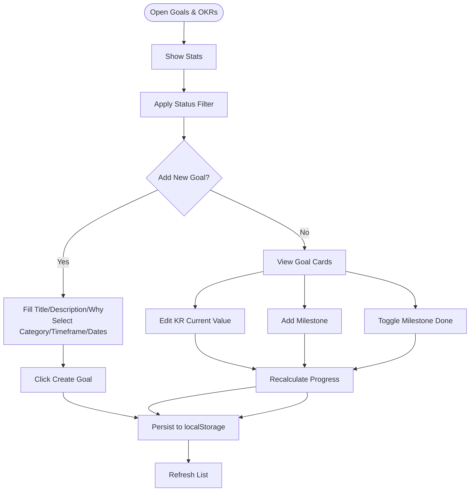
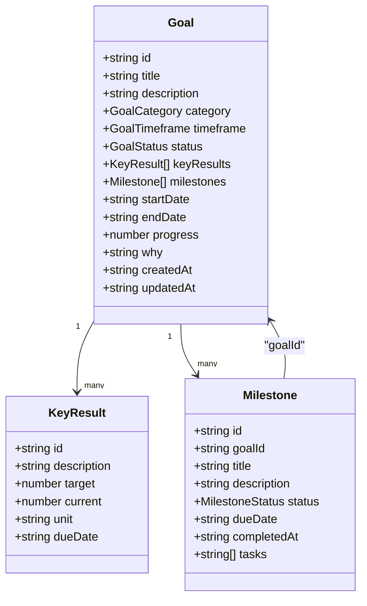
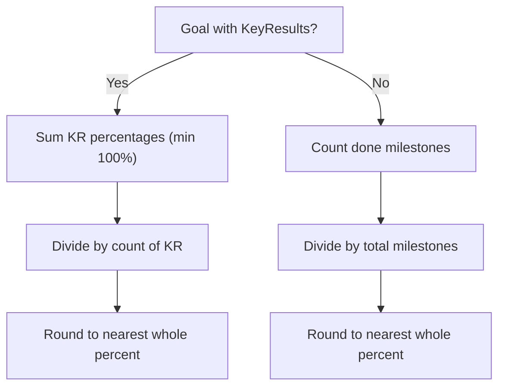
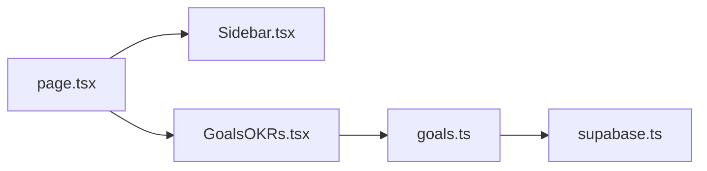

# Goals and OKRs

<cite>
**Referenced Files in This Document**
- [GoalsOKRs.tsx](file://src/components/goals/GoalsOKRs.tsx)
- [goals.ts](file://src/lib/goals.ts)
- [page.tsx](file://src/app/page.tsx)
- [Sidebar.tsx](file://src/components/Sidebar.tsx)
- [supabase.ts](file://src/lib/supabase.ts)
- [SessionBrain.tsx](file://src/components/session/SessionBrain.tsx)
</cite>

## Table of Contents
1. [Introduction](#introduction)
2. [Project Structure](#project-structure)
3. [Core Components](#core-components)
4. [Architecture Overview](#architecture-overview)
5. [Detailed Component Analysis](#detailed-component-analysis)
6. [Dependency Analysis](#dependency-analysis)
7. [Performance Considerations](#performance-considerations)
8. [Troubleshooting Guide](#troubleshooting-guide)
9. [Conclusion](#conclusion)
10. [Appendices](#appendices)

## Introduction
This document explains the Goals and OKRs module: how to define company-wide objectives, departmental goals, and individual OKRs; how to structure them hierarchically; track progress and milestones; integrate with performance dashboards; and collaborate effectively. It also covers automated progress reporting, cascading objectives, and practical workflows for quarterly planning.

## Project Structure
The Goals and OKRs module is implemented as a React component that renders a dashboard-style UI for creating, editing, and tracking goals, key results, and milestones. It persists data locally and optionally synchronizes with a cloud database.

**Diagram sources**
- [page.tsx](file://src/app/page.tsx#L126-L210)
- [Sidebar.tsx](file://src/components/Sidebar.tsx#L24-L98)
- [GoalsOKRs.tsx](file://src/components/goals/GoalsOKRs.tsx#L336-L416)
- [goals.ts](file://src/lib/goals.ts#L48-L56)
- [supabase.ts](file://src/lib/supabase.ts#L184-L203)
- [SessionBrain.tsx](file://src/components/session/SessionBrain.tsx#L1-L200)

**Section sources**
- [page.tsx](file://src/app/page.tsx#L126-L210)
- [Sidebar.tsx](file://src/components/Sidebar.tsx#L24-L98)

## Core Components
- GoalsOKRs component: Renders the OKR dashboard, goal cards, key results, milestones, filters, and statistics.
- goals library: Provides data model, CRUD operations, progress calculation, and starter goals initialization.
- Cloud sync: Integrates with Supabase for persistence and cross-device synchronization.

Key capabilities:
- Create company-wide objectives and individual OKRs
- Define measurable key results with units and targets
- Track progress via key results or milestones
- Manage milestones with due dates and statuses
- Filter and view goal statistics
- Optionally sync with cloud for backup and collaboration

**Section sources**
- [GoalsOKRs.tsx](file://src/components/goals/GoalsOKRs.tsx#L336-L416)
- [goals.ts](file://src/lib/goals.ts#L48-L56)

## Architecture Overview
The module follows a layered architecture:
- UI layer: GoalsOKRs renders cards, forms, and stats
- Domain layer: goals.ts defines types, calculates progress, and manages lifecycle
- Persistence layer: localStorage-backed with optional Supabase sync
- Integration layer: links to Session Brain for task alignment

**Diagram sources**
- [GoalsOKRs.tsx](file://src/components/goals/GoalsOKRs.tsx#L272-L334)
- [goals.ts](file://src/lib/goals.ts#L82-L95)
- [supabase.ts](file://src/lib/supabase.ts#L57-L66)

## Detailed Component Analysis

### GoalsOKRs Dashboard
Responsibilities:
- Render global stats (active, completed, average progress, at-risk)
- Provide filters (active/all/completed/paused)
- Add new goals with category, timeframe, dates, and “why”
- Expand/collapse goal cards to show key results and milestones
- Inline editing for key result current values
- Toggle milestone completion and add new milestones
- Quick actions: mark goal done, delete goal

User flows:
- Creating a goal: Fill form and click Create Goal; the system initializes progress and stores in localStorage
- Tracking progress: Edit KR current values to reflect actual progress
- Milestone management: Add milestones with due dates and toggle completion
- Filtering: Switch between status filters to focus on active or completed goals

**Diagram sources**
- [GoalsOKRs.tsx](file://src/components/goals/GoalsOKRs.tsx#L272-L334)
- [GoalsOKRs.tsx](file://src/components/goals/GoalsOKRs.tsx#L128-L270)
- [GoalsOKRs.tsx](file://src/components/goals/GoalsOKRs.tsx#L336-L416)

**Section sources**
- [GoalsOKRs.tsx](file://src/components/goals/GoalsOKRs.tsx#L336-L416)
- [GoalsOKRs.tsx](file://src/components/goals/GoalsOKRs.tsx#L128-L270)

### Data Model and Progress Calculation
The goals library defines the core types and calculates progress:
- Goal: title, description, category, timeframe, status, keyResults, milestones, dates, progress, why, timestamps
- KeyResult: description, target, current, unit, optional due date
- Milestone: title, description, status, due date, optional completedAt, tasks (IDs from Session Brain)
- Progress: computed as average of KR percentages when KR present; otherwise ratio of done milestones

**Diagram sources**
- [goals.ts](file://src/lib/goals.ts#L9-L44)

**Section sources**
- [goals.ts](file://src/lib/goals.ts#L48-L69)

### Progress Calculation Logic
Progress is calculated differently depending on whether key results exist:
- If no key results: progress equals 100 × (number of done milestones / total milestones)
- If key results exist: progress equals the average of each KR’s percentage (capped at 100%)

**Diagram sources**
- [goals.ts](file://src/lib/goals.ts#L58-L69)

**Section sources**
- [goals.ts](file://src/lib/goals.ts#L58-L69)

### Starter Goals and Initialization
On first load, the system seeds three starter goals to help users understand the OKR structure. These demonstrate:
- Company-wide revenue goals
- Clear KR definitions with units
- Milestones aligned to deadlines
- “Why” statements to keep motivation high

**Section sources**
- [goals.ts](file://src/lib/goals.ts#L162-L241)

### Cloud Sync and Persistence
- Local storage: All goals are persisted in localStorage under a dedicated key
- Supabase sync: Optional cloud persistence via upsert/delete operations
- Sync engine: On app load, data is pulled from Supabase and merged with local storage

Integration points:
- goals.ts exposes functions to sync a single goal to cloud
- supabase.ts centralizes dbUpsert/dbDelete and sync orchestration

**Section sources**
- [goals.ts](file://src/lib/goals.ts#L48-L56)
- [goals.ts](file://src/lib/goals.ts#L246-L251)
- [supabase.ts](file://src/lib/supabase.ts#L57-L66)
- [supabase.ts](file://src/lib/supabase.ts#L209-L246)

### Integration with Session Brain and Tasks
Milestones can reference tasks from Session Brain via task IDs. This creates a direct link between daily work and OKR progress, enabling:
- Cascading alignment: tasks feed milestones and KR progress
- Visibility: users can see which tasks contribute to specific milestones
- Automation potential: future enhancements could auto-update KR progress based on task completion

Note: The goals library declares that milestone tasks are task IDs from Session Brain, but the current UI does not expose task selection within the Goals module.

**Section sources**
- [goals.ts](file://src/lib/goals.ts#L26)
- [SessionBrain.tsx](file://src/components/session/SessionBrain.tsx#L1-L200)

## Dependency Analysis
- GoalsOKRs depends on goals.ts for data operations and constants
- goals.ts depends on localStorage for persistence and supabase.ts for optional cloud sync
- The app shell (page.tsx) routes to GoalsOKRs and includes Sidebar navigation

**Diagram sources**
- [page.tsx](file://src/app/page.tsx#L126-L210)
- [Sidebar.tsx](file://src/components/Sidebar.tsx#L24-L98)
- [GoalsOKRs.tsx](file://src/components/goals/GoalsOKRs.tsx#L336-L416)
- [goals.ts](file://src/lib/goals.ts#L48-L56)
- [supabase.ts](file://src/lib/supabase.ts#L184-L203)

**Section sources**
- [page.tsx](file://src/app/page.tsx#L126-L210)
- [Sidebar.tsx](file://src/components/Sidebar.tsx#L24-L98)
- [GoalsOKRs.tsx](file://src/components/goals/GoalsOKRs.tsx#L336-L416)
- [goals.ts](file://src/lib/goals.ts#L48-L56)
- [supabase.ts](file://src/lib/supabase.ts#L184-L203)

## Performance Considerations
- Local-first design: All operations are fast because they operate on localStorage
- Batch updates: When updating KR current values or toggling milestones, progress recalculations are lightweight
- UI responsiveness: The component re-renders only the affected goal card and stats
- Cloud sync: Upserts are asynchronous and do not block UI; errors are surfaced via toast messages

[No sources needed since this section provides general guidance]

## Troubleshooting Guide
Common issues and resolutions:
- Goals not appearing after refresh
  - Cause: No goals exist or localStorage cleared
  - Resolution: The system initializes starter goals on first load; ensure the component mounts and runs initialization
- Progress not updating after editing KR
  - Cause: Missing persistence or stale state
  - Resolution: Ensure updates call the library functions and trigger a refresh
- Cloud sync failures
  - Cause: Missing or invalid Supabase credentials
  - Resolution: Verify environment variables and retry sync; the UI shows a status indicator and allows retry

**Section sources**
- [goals.ts](file://src/lib/goals.ts#L162-L241)
- [supabase.ts](file://src/lib/supabase.ts#L23-L26)
- [supabase.ts](file://src/lib/supabase.ts#L147-L175)

## Conclusion
The Goals and OKRs module provides a practical, local-first solution for tracking objectives, key results, and milestones. It supports hierarchical alignment, progress automation, and optional cloud sync. By connecting milestones to tasks from Session Brain, teams can cascade work upward toward company-wide outcomes.

## Appendices

### Best Practices for Key Results
- Make KR measurable with clear units (e.g., users, USD, %, count)
- Set realistic targets aligned with milestones
- Include due dates for KR and milestones to improve visibility
- Use “why” statements to anchor motivation and explain impact

### Example Workflows
- Creating a company-wide revenue goal:
  - Choose category “revenue,” timeframe “quarterly,” set start/end dates
  - Add KR like “Increase MRR” with target and unit
  - Add milestones aligned to quarter deadlines
- Cascading to departments:
  - Create departmental goals with KR aligned to corporate KR
  - Link department milestones to projects/tasks
- Individual OKRs:
  - Align personal KR to departmental goals
  - Track progress via daily tasks and milestones

### Quarterly Planning Process
- Define corporate objectives and KR for Q1
- Cascade to departments with quarterly milestones
- Break down into individual OKRs with monthly milestones
- Review progress monthly; adjust KR targets and timelines as needed

[No sources needed since this section provides general guidance]