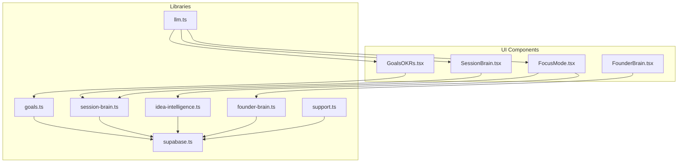
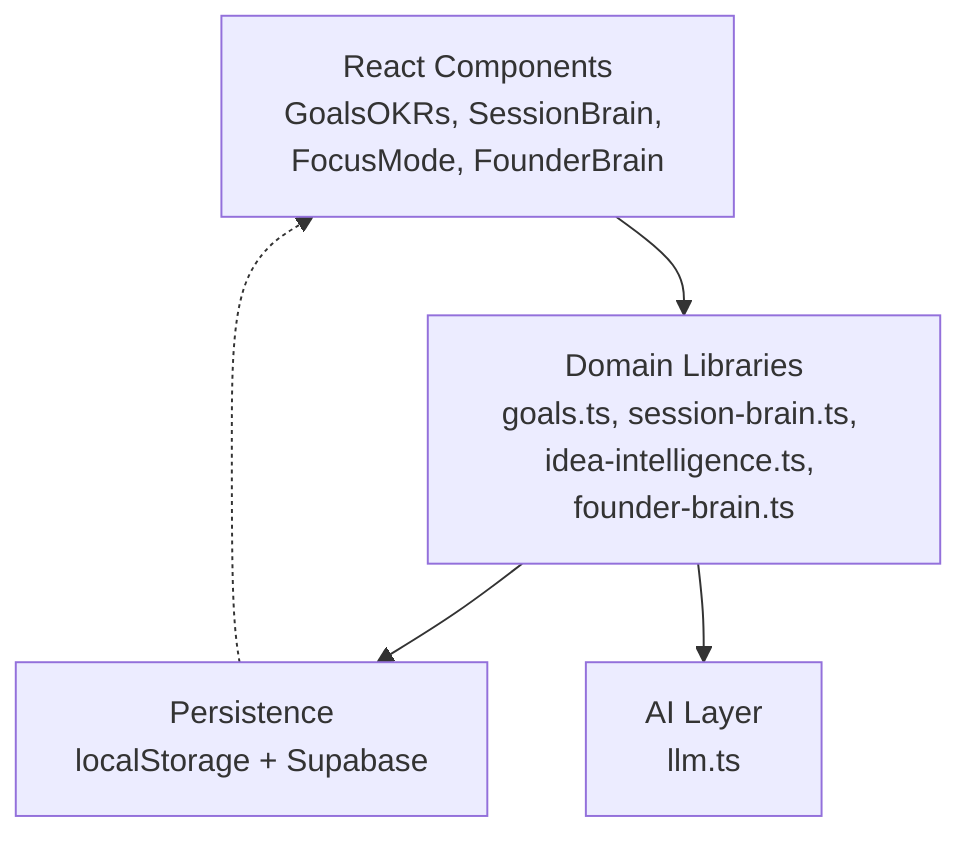
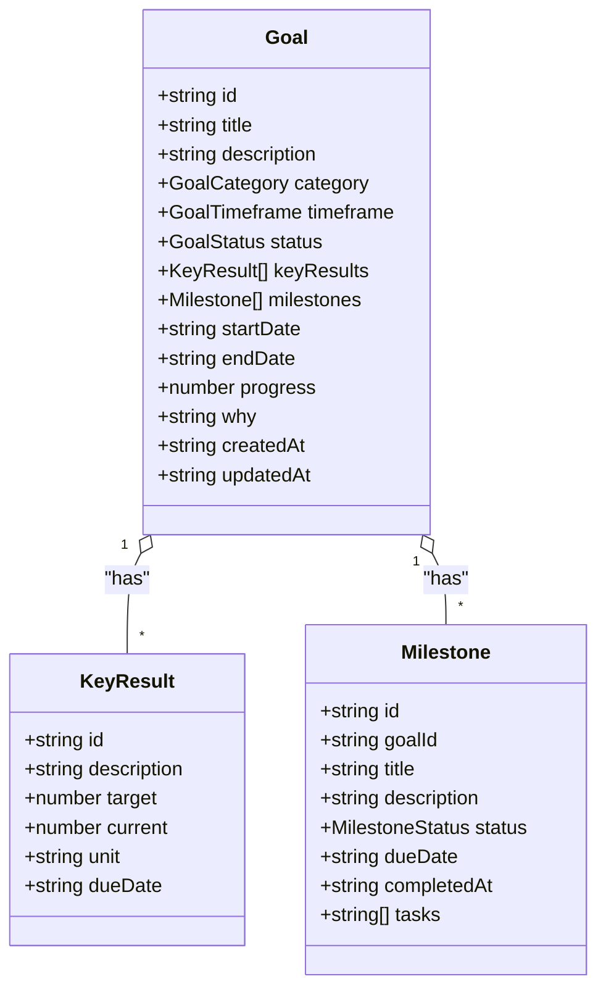
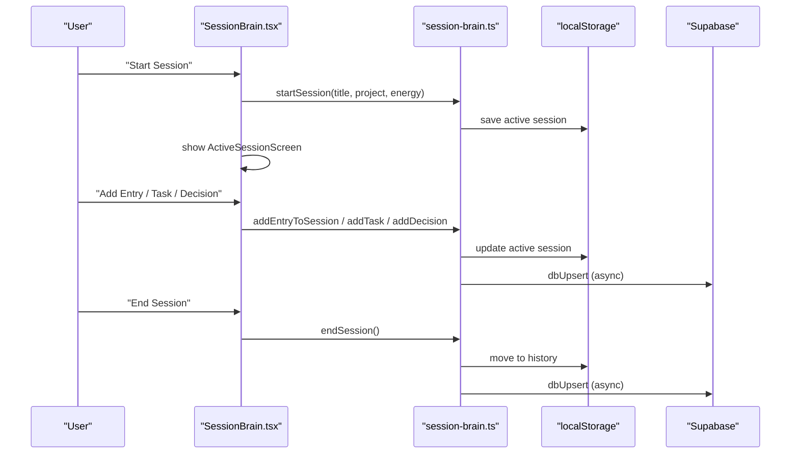
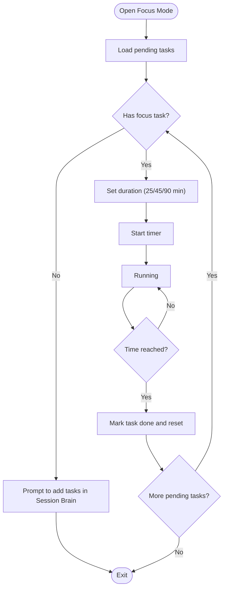
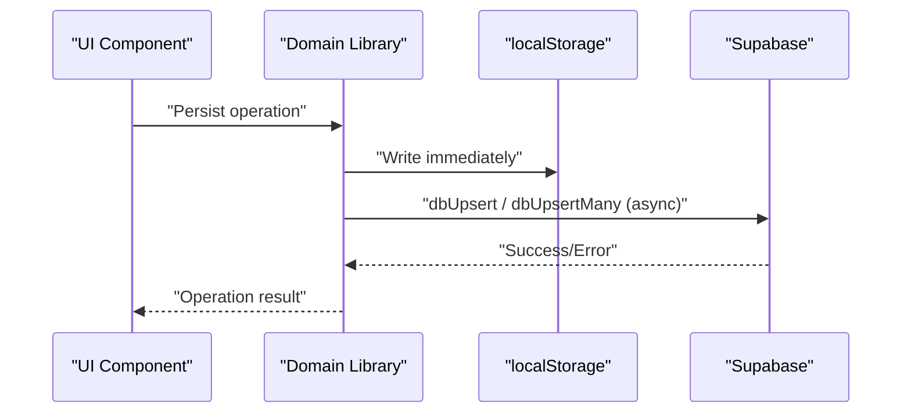
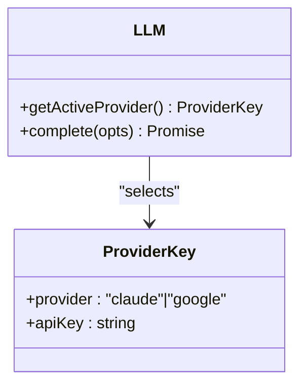
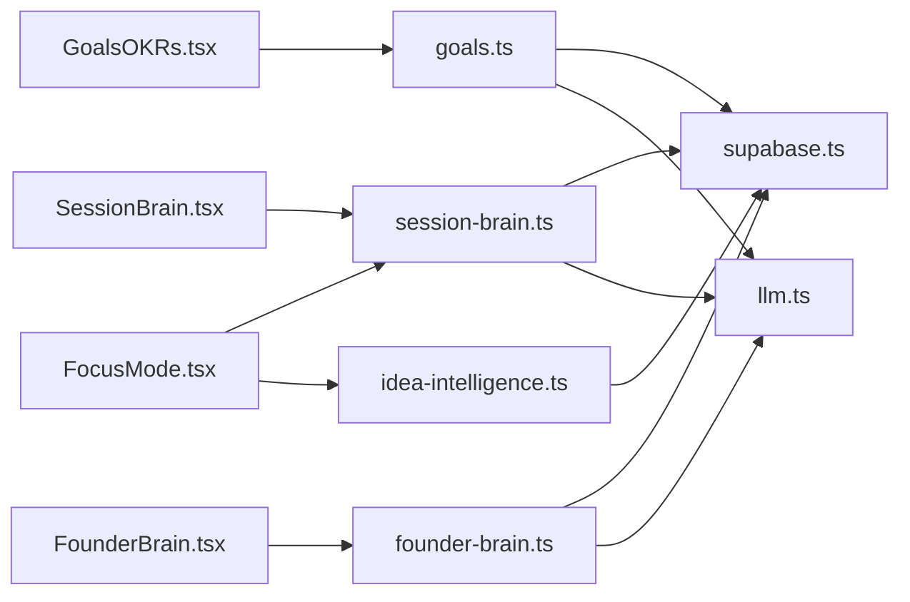

# Operational Excellence

<cite>
**Referenced Files in This Document**
- [GoalsOKRs.tsx](file://src/components/goals/GoalsOKRs.tsx)
- [Goals library](file://src/lib/goals.ts)
- [SessionBrain.tsx](file://src/components/session/SessionBrain.tsx)
- [Session Brain library](file://src/lib/session-brain.ts)
- [FocusMode.tsx](file://src/components/focus/FocusMode.tsx)
- [Idea Intelligence library](file://src/lib/idea-intelligence.ts)
- [LLM layer](file://src/lib/llm.ts)
- [Supabase client](file://src/lib/supabase.ts)
- [Founder Brain module](file://src/components/brain/FounderBrain.tsx)
- [Founder Brain library](file://src/lib/founder-brain.ts)
- [Support utilities](file://src/lib/support.ts)
</cite>

## Table of Contents
1. [Introduction](#introduction)
2. [Project Structure](#project-structure)
3. [Core Components](#core-components)
4. [Architecture Overview](#architecture-overview)
5. [Detailed Component Analysis](#detailed-component-analysis)
6. [Dependency Analysis](#dependency-analysis)
7. [Performance Considerations](#performance-considerations)
8. [Troubleshooting Guide](#troubleshooting-guide)
9. [Conclusion](#conclusion)

## Introduction
This document explains the operational excellence modules that power productivity, focus, and strategic alignment in Core Brim Tech OS. It covers:
- Goals and OKRs: Objective and key results tracking with measurable outcomes and progress
- Session Brain: Context-aware memory and session continuity for deep work
- Focus Mode: Pomodoro-style deep work with task prioritization and idea reminders

It also documents data persistence strategies, AI integration for task automation, user workflow patterns, configuration options, calendar integration hooks, and performance tracking capabilities.

## Project Structure
The operational excellence modules are implemented as React components backed by TypeScript libraries. Data is persisted locally with automatic synchronization to Supabase for cross-device continuity.

**Diagram sources**
- [GoalsOKRs.tsx](file://src/components/goals/GoalsOKRs.tsx#L1-L416)
- [SessionBrain.tsx](file://src/components/session/SessionBrain.tsx#L1-L742)
- [FocusMode.tsx](file://src/components/focus/FocusMode.tsx#L1-L255)
- [Goals library](file://src/lib/goals.ts#L1-L252)
- [Session Brain library](file://src/lib/session-brain.ts#L1-L278)
- [Idea Intelligence library](file://src/lib/idea-intelligence.ts#L1-L156)
- [LLM layer](file://src/lib/llm.ts#L1-L135)
- [Supabase client](file://src/lib/supabase.ts#L1-L292)
- [Founder Brain module](file://src/components/brain/FounderBrain.tsx#L1-L774)
- [Founder Brain library](file://src/lib/founder-brain.ts#L1-L213)
- [Support utilities](file://src/lib/support.ts#L1-L200)

**Section sources**
- [GoalsOKRs.tsx](file://src/components/goals/GoalsOKRs.tsx#L1-L416)
- [SessionBrain.tsx](file://src/components/session/SessionBrain.tsx#L1-L742)
- [FocusMode.tsx](file://src/components/focus/FocusMode.tsx#L1-L255)
- [Goals library](file://src/lib/goals.ts#L1-L252)
- [Session Brain library](file://src/lib/session-brain.ts#L1-L278)
- [Idea Intelligence library](file://src/lib/idea-intelligence.ts#L1-L156)
- [LLM layer](file://src/lib/llm.ts#L1-L135)
- [Supabase client](file://src/lib/supabase.ts#L1-L292)
- [Founder Brain module](file://src/components/brain/FounderBrain.tsx#L1-L774)
- [Founder Brain library](file://src/lib/founder-brain.ts#L1-L213)
- [Support utilities](file://src/lib/support.ts#L1-L200)

## Core Components
- Goals and OKRs: Create goals, define key results and milestones, track progress, and visualize performance
- Session Brain: Start, manage, and end focused work sessions; capture tasks, decisions, ideas, bugs, and code context
- Focus Mode: Time-boxed deep work with task selection, timer, and idea prompts to sustain concentration

These modules integrate with:
- Local storage for immediate responsiveness
- Supabase for cloud sync and cross-device continuity
- LLM layer for AI-powered automation and insights

**Section sources**
- [GoalsOKRs.tsx](file://src/components/goals/GoalsOKRs.tsx#L1-L416)
- [Goals library](file://src/lib/goals.ts#L1-L252)
- [SessionBrain.tsx](file://src/components/session/SessionBrain.tsx#L1-L742)
- [Session Brain library](file://src/lib/session-brain.ts#L1-L278)
- [FocusMode.tsx](file://src/components/focus/FocusMode.tsx#L1-L255)
- [Idea Intelligence library](file://src/lib/idea-intelligence.ts#L1-L156)
- [Supabase client](file://src/lib/supabase.ts#L1-L292)
- [LLM layer](file://src/lib/llm.ts#L1-L135)

## Architecture Overview
The system follows a layered architecture:
- UI layer: React components render views and orchestrate user interactions
- Domain libraries: Encapsulate business logic for goals, sessions, tasks, decisions, ideas, and founder brain
- Persistence layer: Local-first with write-through to Supabase for backup and sync
- AI layer: Unified LLM client supporting Claude and Gemini for automation

**Diagram sources**
- [GoalsOKRs.tsx](file://src/components/goals/GoalsOKRs.tsx#L1-L416)
- [SessionBrain.tsx](file://src/components/session/SessionBrain.tsx#L1-L742)
- [FocusMode.tsx](file://src/components/focus/FocusMode.tsx#L1-L255)
- [Founder Brain module](file://src/components/brain/FounderBrain.tsx#L1-L774)
- [Goals library](file://src/lib/goals.ts#L1-L252)
- [Session Brain library](file://src/lib/session-brain.ts#L1-L278)
- [Idea Intelligence library](file://src/lib/idea-intelligence.ts#L1-L156)
- [Founder Brain library](file://src/lib/founder-brain.ts#L1-L213)
- [Supabase client](file://src/lib/supabase.ts#L1-L292)
- [LLM layer](file://src/lib/llm.ts#L1-L135)

## Detailed Component Analysis

### Goals and OKRs
- Purpose: Align efforts with measurable outcomes via objectives, key results, and milestones
- Key features:
  - Create goals with categories (revenue, product, growth, team, personal, research, partnerships) and timeframes (weekly to long-term)
  - Define key results with targets and units
  - Track milestones with due dates and statuses
  - Auto-compute progress percentages
  - Filter and visualize statistics (active, completed, average progress, at-risk)
  - Starter goals preloaded for new users
  - Cloud sync via Supabase

**Diagram sources**
- [Goals library](file://src/lib/goals.ts#L9-L44)

**Section sources**
- [GoalsOKRs.tsx](file://src/components/goals/GoalsOKRs.tsx#L1-L416)
- [Goals library](file://src/lib/goals.ts#L1-L252)

### Session Brain
- Purpose: Context-aware memory and session continuity for deep work
- Key features:
  - Start/end sessions with title, project, and energy level
  - Capture entries: tasks added/completed, decisions, ideas, bugs, notes, code context
  - Manage tasks: add, toggle, delete, and link to sessions
  - Track decisions with reasoning and optional alternatives
  - Live timer and elapsed time display during active sessions
  - Session history with summaries and entry timelines
  - Stats dashboard (total sessions, this week, pending tasks, total decisions)

**Diagram sources**
- [SessionBrain.tsx](file://src/components/session/SessionBrain.tsx#L67-L226)
- [SessionBrain.tsx](file://src/components/session/SessionBrain.tsx#L230-L570)
- [SessionBrain.tsx](file://src/components/session/SessionBrain.tsx#L572-L738)
- [Session Brain library](file://src/lib/session-brain.ts#L72-L134)
- [Session Brain library](file://src/lib/session-brain.ts#L179-L243)
- [Supabase client](file://src/lib/supabase.ts#L57-L66)

**Section sources**
- [SessionBrain.tsx](file://src/components/session/SessionBrain.tsx#L1-L742)
- [Session Brain library](file://src/lib/session-brain.ts#L1-L278)

### Focus Mode
- Purpose: Enhance deep work and concentration with timeboxing and task prioritization
- Key features:
  - Choose focus durations (25/45/90 minutes)
  - Circular progress indicator and countdown timer
  - Select focus task from pending tasks
  - Mark task complete and advance to next
  - Remind top ideas to build next
  - Track sessions completed per day

**Diagram sources**
- [FocusMode.tsx](file://src/components/focus/FocusMode.tsx#L20-L82)

**Section sources**
- [FocusMode.tsx](file://src/components/focus/FocusMode.tsx#L1-L255)
- [Session Brain library](file://src/lib/session-brain.ts#L179-L220)
- [Idea Intelligence library](file://src/lib/idea-intelligence.ts#L126-L130)

### Data Persistence Strategies
- Local-first with localStorage for immediate availability and offline readiness
- Write-through to Supabase for cloud sync and cross-device continuity
- Sync engine supports:
  - Upsert single and multiple records
  - Fetch all records by table
  - Delete records
  - Sync status tracking
  - Migration from localStorage to Supabase

**Diagram sources**
- [Supabase client](file://src/lib/supabase.ts#L57-L81)
- [Goals library](file://src/lib/goals.ts#L53-L56)
- [Session Brain library](file://src/lib/session-brain.ts#L65-L68)
- [Idea Intelligence library](file://src/lib/idea-intelligence.ts#L37-L40)

**Section sources**
- [Supabase client](file://src/lib/supabase.ts#L1-L292)
- [Goals library](file://src/lib/goals.ts#L48-L56)
- [Session Brain library](file://src/lib/session-brain.ts#L57-L68)
- [Idea Intelligence library](file://src/lib/idea-intelligence.ts#L27-L40)

### AI Integration for Task Automation
- Unified LLM layer supports Claude and Gemini
- Provider selection and API key management stored in localStorage
- Request timeout handling and provider fallback
- Used by skills and other modules for automation (e.g., session summaries, idea scoring, research synthesis)

**Diagram sources**
- [LLM layer](file://src/lib/llm.ts#L36-L46)
- [LLM layer](file://src/lib/llm.ts#L128-L134)

**Section sources**
- [LLM layer](file://src/lib/llm.ts#L1-L135)
- [Support utilities](file://src/lib/support.ts#L648-L692)

### Configuration Options for Personalization
- AI provider preference and API keys (Claude/Gemini)
- Session energy level (low/medium/high)
- Goal categories and timeframes
- Task priorities and projects
- Scheduler jobs for automated skills

**Section sources**
- [LLM layer](file://src/lib/llm.ts#L24-L33)
- [SessionBrain.tsx](file://src/components/session/SessionBrain.tsx#L195-L210)
- [GoalsOKRs.tsx](file://src/components/goals/GoalsOKRs.tsx#L27-L40)
- [Support utilities](file://src/lib/support.ts#L648-L692)

### Integration with Calendar Systems
- The codebase includes a scheduler abstraction and job management for recurring tasks
- Calendar integration can be implemented by connecting scheduled jobs to external calendar APIs (conceptual extension)
- Current scheduler supports daily and weekly cadences with next run calculation

**Section sources**
- [Support utilities](file://src/lib/support.ts#L629-L692)

### Performance Tracking Capabilities
- Goals module computes progress percentages and aggregates stats (active, completed, average progress, at-risk)
- Session Brain tracks session counts, decisions, and pending tasks
- Idea Intelligence ranks ideas by calculated scores
- Scheduler logs run counts and next scheduled execution

**Section sources**
- [Goals library](file://src/lib/goals.ts#L146-L159)
- [Session Brain library](file://src/lib/session-brain.ts#L247-L261)
- [Idea Intelligence library](file://src/lib/idea-intelligence.ts#L136-L144)
- [Support utilities](file://src/lib/support.ts#L678-L692)

## Dependency Analysis
- UI components depend on domain libraries for state and persistence
- Domain libraries depend on localStorage and Supabase for data
- LLM layer is consumed by domain libraries and UI components for AI-driven features
- Support utilities coordinate cross-cutting concerns like scheduling and exports

**Diagram sources**
- [GoalsOKRs.tsx](file://src/components/goals/GoalsOKRs.tsx#L1-L14)
- [SessionBrain.tsx](file://src/components/session/SessionBrain.tsx#L3-L14)
- [FocusMode.tsx](file://src/components/focus/FocusMode.tsx#L3-L6)
- [Founder Brain module](file://src/components/brain/FounderBrain.tsx#L3-L15)
- [Goals library](file://src/lib/goals.ts#L244-L251)
- [Session Brain library](file://src/lib/session-brain.ts#L263-L277)
- [Idea Intelligence library](file://src/lib/idea-intelligence.ts#L147-L155)
- [Founder Brain library](file://src/lib/founder-brain.ts#L197-L212)
- [LLM layer](file://src/lib/llm.ts#L1-L135)
- [Supabase client](file://src/lib/supabase.ts#L1-L292)

**Section sources**
- [GoalsOKRs.tsx](file://src/components/goals/GoalsOKRs.tsx#L1-L14)
- [SessionBrain.tsx](file://src/components/session/SessionBrain.tsx#L3-L14)
- [FocusMode.tsx](file://src/components/focus/FocusMode.tsx#L3-L6)
- [Founder Brain module](file://src/components/brain/FounderBrain.tsx#L3-L15)
- [Goals library](file://src/lib/goals.ts#L244-L251)
- [Session Brain library](file://src/lib/session-brain.ts#L263-L277)
- [Idea Intelligence library](file://src/lib/idea-intelligence.ts#L147-L155)
- [Founder Brain library](file://src/lib/founder-brain.ts#L197-L212)
- [LLM layer](file://src/lib/llm.ts#L1-L135)
- [Supabase client](file://src/lib/supabase.ts#L1-L292)

## Performance Considerations
- Local-first design minimizes latency and improves responsiveness
- Supabase sync is asynchronous to avoid blocking UI
- Scheduler jobs prevent excessive automation runs and reduce API costs
- Idea scoring and goal progress calculations are lightweight and cached in UI state

[No sources needed since this section provides general guidance]

## Troubleshooting Guide
- Missing AI API keys: Configure Claude or Gemini keys in settings; otherwise LLM operations will fail
- Supabase not configured: The app continues to operate using localStorage; configure environment variables to enable cloud sync
- Session stuck as active: Manually end the session to clear the active state
- Focus timer not updating: Ensure the browser tab remains active; intervals rely on the page lifecycle

**Section sources**
- [LLM layer](file://src/lib/llm.ts#L128-L134)
- [Supabase client](file://src/lib/supabase.ts#L23-L26)
- [SessionBrain.tsx](file://src/components/session/SessionBrain.tsx#L300-L303)

## Conclusion
Core Brim Tech OS operational excellence modules provide a cohesive framework for strategic alignment, context-rich work sessions, and sustained deep work. By combining local-first persistence with cloud sync, AI-driven automation, and robust performance tracking, users can organize tasks, maintain context, and optimize productivity across devices and workflows.