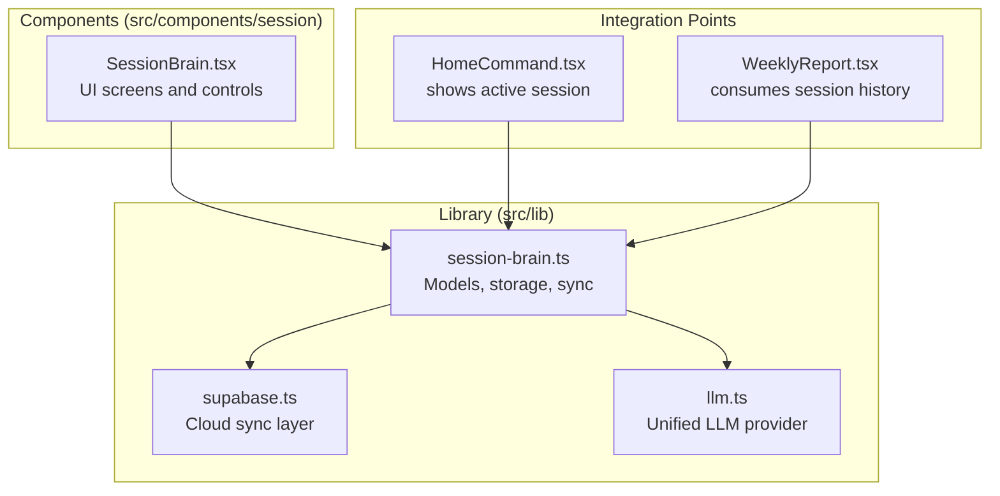
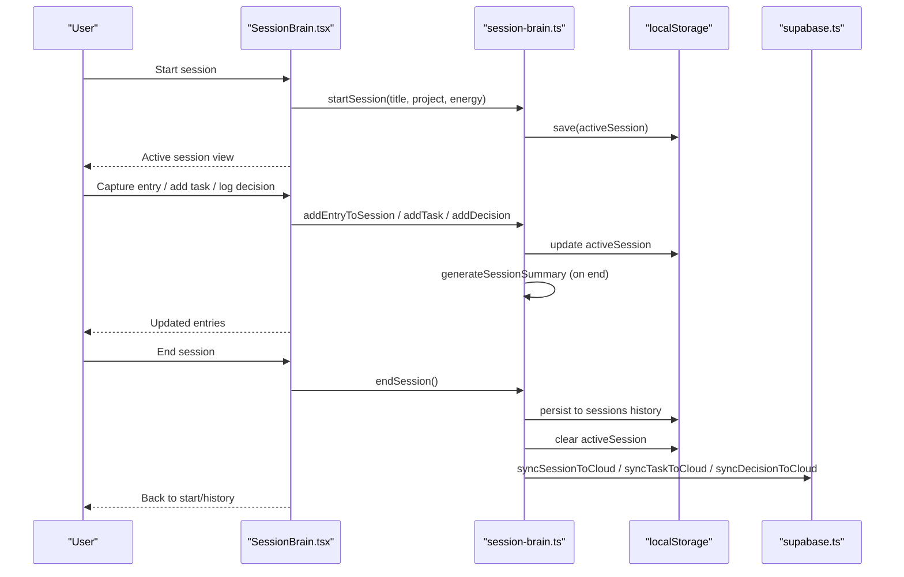
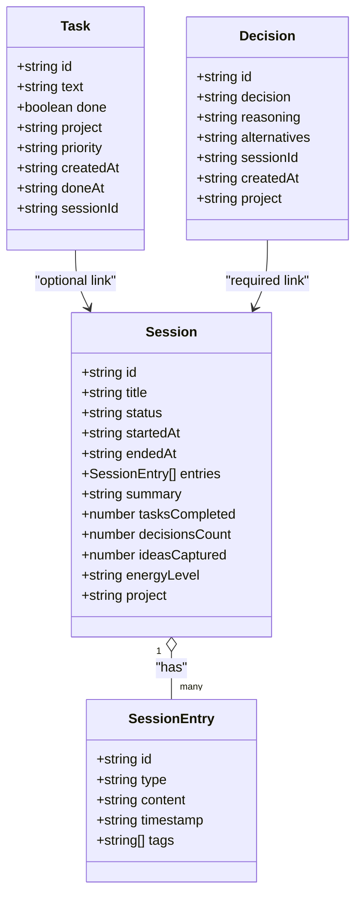
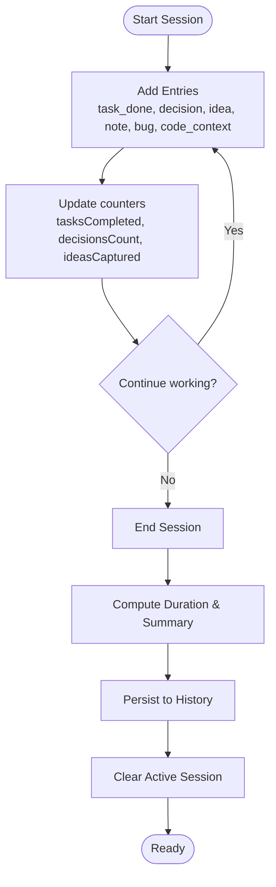
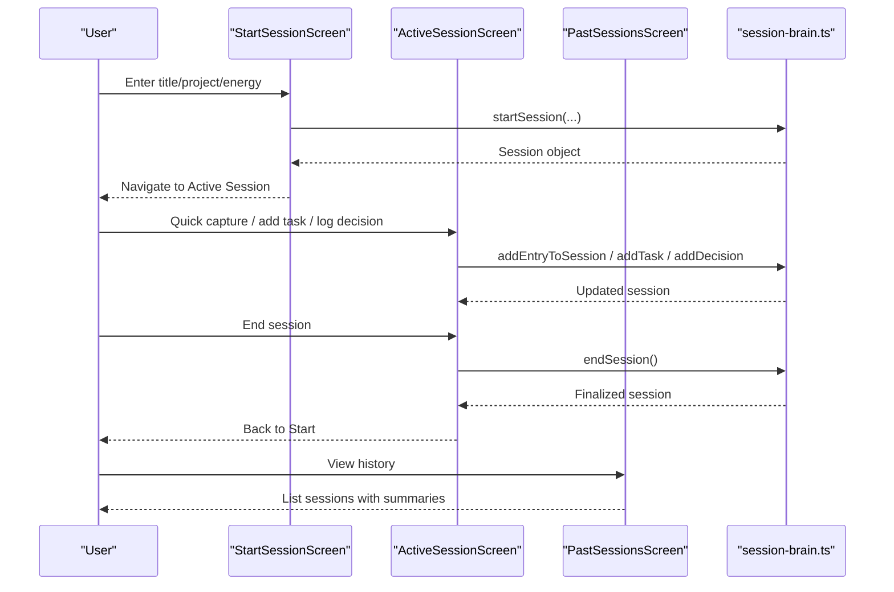
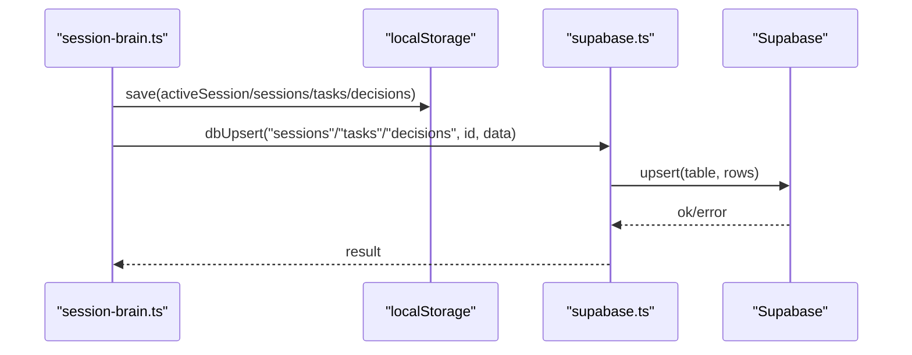
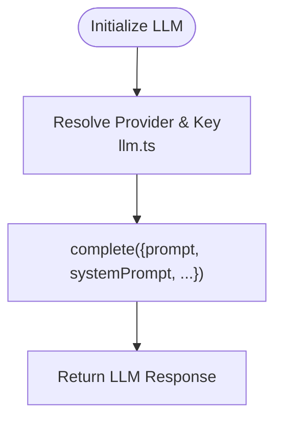
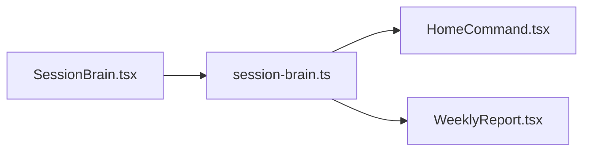
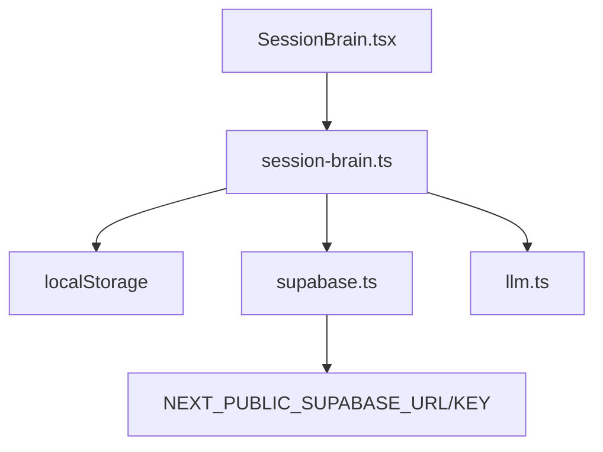

# Session Brain

<cite>
**Referenced Files in This Document**
- [session-brain.ts](file://src/lib/session-brain.ts)
- [SessionBrain.tsx](file://src/components/session/SessionBrain.tsx)
- [supabase.ts](file://src/lib/supabase.ts)
- [HomeCommand.tsx](file://src/components/home/HomeCommand.tsx)
- [WeeklyReport.tsx](file://src/components/reports/WeeklyReport.tsx)
- [llm.ts](file://src/lib/llm.ts)
</cite>

## Table of Contents
1. [Introduction](#introduction)
2. [Project Structure](#project-structure)
3. [Core Components](#core-components)
4. [Architecture Overview](#architecture-overview)
5. [Detailed Component Analysis](#detailed-component-analysis)
6. [Dependency Analysis](#dependency-analysis)
7. [Performance Considerations](#performance-considerations)
8. [Troubleshooting Guide](#troubleshooting-guide)
9. [Conclusion](#conclusion)
10. [Appendices](#appendices)

## Introduction
Session Brain is the context-aware memory system that captures, stores, and retrieves contextual information from user sessions. It maintains conversation history, extracts key insights, and builds long-term context for intelligent interactions. The system supports session recording, metadata extraction, automatic summarization, and integrates with cloud synchronization for persistence and cross-device continuity. It also exposes hooks for AI-powered context retrieval and relevance scoring via external LLM integrations.

## Project Structure
Session Brain spans two primary areas:
- A pure TypeScript/React library module that defines data models, local storage-backed persistence, and cloud sync helpers.
- A React UI component that provides an interactive interface for starting, capturing, reviewing, and ending sessions.

**Diagram sources**
- [session-brain.ts](file://src/lib/session-brain.ts#L1-L278)
- [SessionBrain.tsx](file://src/components/session/SessionBrain.tsx#L1-L742)
- [supabase.ts](file://src/lib/supabase.ts#L1-L292)
- [HomeCommand.tsx](file://src/components/home/HomeCommand.tsx#L1-L281)
- [WeeklyReport.tsx](file://src/components/reports/WeeklyReport.tsx#L1-L237)
- [llm.ts](file://src/lib/llm.ts#L1-L135)

**Section sources**
- [session-brain.ts](file://src/lib/session-brain.ts#L1-L278)
- [SessionBrain.tsx](file://src/components/session/SessionBrain.tsx#L1-L742)

## Core Components
- Session model: encapsulates title, status, timestamps, entries, summary, and counters.
- SessionEntry model: typed entries (task_done, task_added, decision, idea, bug, note, code_context) with content and tags.
- Task and Decision models: separate persisted entities linked to sessions.
- Storage layer: localStorage-backed with keys for sessions, tasks, decisions, and active session.
- Cloud sync: write-through to Supabase via upsert/delete operations.
- UI: Start Session screen, Active Session screen with quick capture, tasks, and decisions, and a Past Sessions history view.

Key responsibilities:
- Capture contextual entries during a session.
- Maintain a running summary and counters.
- Persist across browser sessions and optionally synchronize to the cloud.
- Provide a UI for quick logging and review.

**Section sources**
- [session-brain.ts](file://src/lib/session-brain.ts#L4-L46)
- [session-brain.ts](file://src/lib/session-brain.ts#L50-L138)
- [SessionBrain.tsx](file://src/components/session/SessionBrain.tsx#L67-L226)
- [SessionBrain.tsx](file://src/components/session/SessionBrain.tsx#L229-L569)
- [SessionBrain.tsx](file://src/components/session/SessionBrain.tsx#L572-L741)

## Architecture Overview
Session Brain follows a layered architecture:
- UI layer: React components render and orchestrate user actions.
- Domain layer: session-brain.ts manages models, lifecycle, and persistence.
- Cloud layer: supabase.ts provides optional write-through persistence.
- Integration layer: other modules consume session data (e.g., HomeCommand, WeeklyReport).

**Diagram sources**
- [SessionBrain.tsx](file://src/components/session/SessionBrain.tsx#L67-L226)
- [SessionBrain.tsx](file://src/components/session/SessionBrain.tsx#L229-L569)
- [session-brain.ts](file://src/lib/session-brain.ts#L72-L134)
- [session-brain.ts](file://src/lib/session-brain.ts#L266-L277)
- [supabase.ts](file://src/lib/supabase.ts#L57-L124)

## Detailed Component Analysis

### Data Models and Storage
- Models define the shape of sessions, entries, tasks, and decisions. Entries carry type, content, timestamp, and optional tags.
- Storage keys separate active session from historical sessions and persist tasks and decisions independently.
- Persistence uses localStorage with safe parsing and fallbacks.

**Diagram sources**
- [session-brain.ts](file://src/lib/session-brain.ts#L4-L46)

**Section sources**
- [session-brain.ts](file://src/lib/session-brain.ts#L4-L46)
- [session-brain.ts](file://src/lib/session-brain.ts#L50-L68)

### Session Lifecycle and Automatic Summarization
- Start: Creates an active session with metadata and initializes counters.
- Capture: Adds typed entries with timestamps and updates counters.
- End: Finalizes the session, computes a human-readable summary, persists history, and clears active session.
- Summary generation aggregates counts and selected highlights from entries.

**Diagram sources**
- [session-brain.ts](file://src/lib/session-brain.ts#L72-L134)
- [session-brain.ts](file://src/lib/session-brain.ts#L145-L166)

**Section sources**
- [session-brain.ts](file://src/lib/session-brain.ts#L72-L134)
- [session-brain.ts](file://src/lib/session-brain.ts#L145-L166)

### UI Workflows: Start, Capture, Review, End
- Start Session Screen: Collects title, project, and energy level; preloads stats and last session summary.
- Active Session Screen: Live timer, quick capture buttons, tabs for log, tasks, and decisions; supports adding tasks and decisions inline.
- Past Sessions Screen: Lists historical sessions with expandable details and summary highlights.

**Diagram sources**
- [SessionBrain.tsx](file://src/components/session/SessionBrain.tsx#L67-L226)
- [SessionBrain.tsx](file://src/components/session/SessionBrain.tsx#L229-L569)
- [SessionBrain.tsx](file://src/components/session/SessionBrain.tsx#L572-L741)
- [session-brain.ts](file://src/lib/session-brain.ts#L72-L134)

**Section sources**
- [SessionBrain.tsx](file://src/components/session/SessionBrain.tsx#L67-L226)
- [SessionBrain.tsx](file://src/components/session/SessionBrain.tsx#L229-L569)
- [SessionBrain.tsx](file://src/components/session/SessionBrain.tsx#L572-L741)

### Cloud Sync and Cross-Device Continuity
- Local-first with optional cloud sync: writes to localStorage and upserts to Supabase tables.
- Session, Task, and Decision entities are synced individually.
- Supabase client is initialized from environment variables with graceful fallbacks.

**Diagram sources**
- [session-brain.ts](file://src/lib/session-brain.ts#L266-L277)
- [supabase.ts](file://src/lib/supabase.ts#L57-L124)

**Section sources**
- [session-brain.ts](file://src/lib/session-brain.ts#L263-L277)
- [supabase.ts](file://src/lib/supabase.ts#L1-L292)

### AI-Powered Context Retrieval and Relevance Scoring
- The system does not implement an internal semantic search index or vector database.
- It exposes a unified LLM layer (llm.ts) that resolves provider and key preferences and performs completions.
- Integrators can leverage this LLM layer to implement semantic search, embeddings, and relevance scoring externally (e.g., by indexing session summaries and entries and querying with LLM prompts).

**Diagram sources**
- [llm.ts](file://src/lib/llm.ts#L36-L134)

**Section sources**
- [llm.ts](file://src/lib/llm.ts#L1-L135)

### Integration with Other Modules
- HomeCommand displays the currently active session in the dashboard header.
- WeeklyReport consumes session history to compute weekly metrics and highlights.

**Diagram sources**
- [HomeCommand.tsx](file://src/components/home/HomeCommand.tsx#L103-L128)
- [WeeklyReport.tsx](file://src/components/reports/WeeklyReport.tsx#L44-L96)
- [SessionBrain.tsx](file://src/components/session/SessionBrain.tsx#L669-L738)

**Section sources**
- [HomeCommand.tsx](file://src/components/home/HomeCommand.tsx#L103-L128)
- [WeeklyReport.tsx](file://src/components/reports/WeeklyReport.tsx#L4-L96)
- [SessionBrain.tsx](file://src/components/session/SessionBrain.tsx#L669-L738)

## Dependency Analysis
- UI depends on session-brain for state transitions and data access.
- session-brain depends on localStorage for persistence and optionally on Supabase for cloud sync.
- Supabase client initialization depends on environment variables.
- LLM layer is decoupled and can be used by other modules for AI features.

**Diagram sources**
- [SessionBrain.tsx](file://src/components/session/SessionBrain.tsx#L1-L14)
- [session-brain.ts](file://src/lib/session-brain.ts#L264-L277)
- [supabase.ts](file://src/lib/supabase.ts#L14-L26)
- [llm.ts](file://src/lib/llm.ts#L36-L46)

**Section sources**
- [SessionBrain.tsx](file://src/components/session/SessionBrain.tsx#L1-L14)
- [session-brain.ts](file://src/lib/session-brain.ts#L263-L277)
- [supabase.ts](file://src/lib/supabase.ts#L1-L292)
- [llm.ts](file://src/lib/llm.ts#L1-L135)

## Performance Considerations
- Local-first design minimizes latency and avoids network dependencies.
- Large session histories: consider pagination or virtualization in the history view to avoid rendering overhead.
- Cloud sync batching: upsertMany in supabase.ts batches records to reduce round trips.
- Avoid frequent re-renders: memoize derived data (e.g., summaries) and use shallow comparisons where possible.
- Cache and TTL strategies: while not implemented in Session Brain, the LLM layer demonstrates patterns for caching and cost optimization that can inspire future enhancements.

[No sources needed since this section provides general guidance]

## Troubleshooting Guide
- Supabase not configured: getSupabaseClient returns null when environment variables are missing; cloud sync functions become no-ops.
- localStorage unavailable: load/save functions include guards and fallbacks to prevent crashes.
- API key missing: LLM layer throws if no provider key is configured; ensure keys are set in Settings and provider preference is selected.
- Session not ending cleanly: ensure endSession clears active session and persists history; verify localStorage keys.

**Section sources**
- [supabase.ts](file://src/lib/supabase.ts#L11-L26)
- [session-brain.ts](file://src/lib/session-brain.ts#L57-L68)
- [llm.ts](file://src/lib/llm.ts#L128-L134)

## Conclusion
Session Brain provides a robust, local-first foundation for capturing and preserving context across user sessions. Its clean separation of concerns enables seamless UI interactions, reliable persistence, and optional cloud synchronization. While semantic search and advanced retrieval are not built-in, the unified LLM layer offers a clear path to integrate AI-powered context retrieval and relevance scoring. With careful attention to performance and privacy, Session Brain scales to support long-term, intelligent interactions across the platform.

[No sources needed since this section summarizes without analyzing specific files]

## Appendices

### Privacy and Data Retention
- Local-first storage keeps data on-device by default; enable Supabase only if desired.
- No sensitive defaults are written to cloud; integrators must configure credentials and opt-in to sync.
- Consider exporting and deleting local data using support utilities if needed.

**Section sources**
- [supabase.ts](file://src/lib/supabase.ts#L1-L292)

### Example Workflows
- Start a session: choose title, project, energy; navigate to Active Session.
- Capture quickly: select entry type (note, idea, decision, bug, code), enter content, press Log.
- Add tasks and decisions inline: use the Tasks and Decisions tabs in Active Session.
- End and review: confirm to save; view summary and history in Past Sessions.

**Section sources**
- [SessionBrain.tsx](file://src/components/session/SessionBrain.tsx#L67-L226)
- [SessionBrain.tsx](file://src/components/session/SessionBrain.tsx#L229-L569)
- [SessionBrain.tsx](file://src/components/session/SessionBrain.tsx#L572-L741)