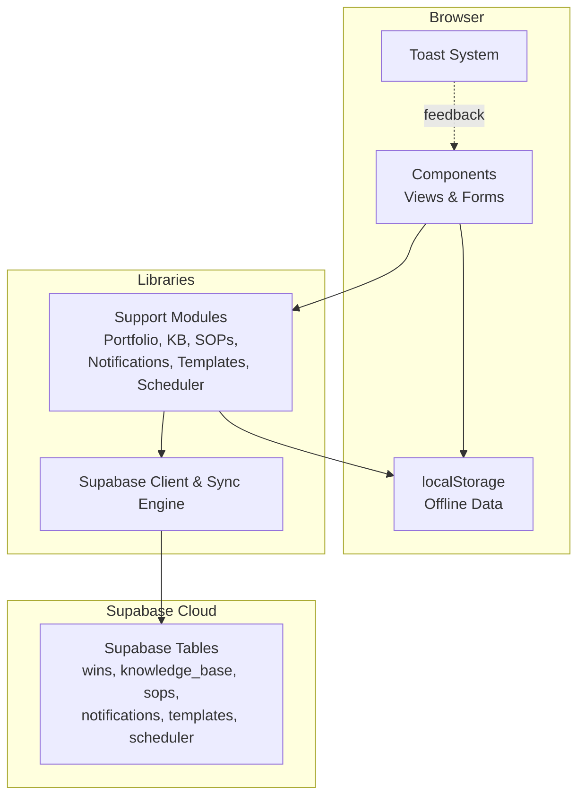
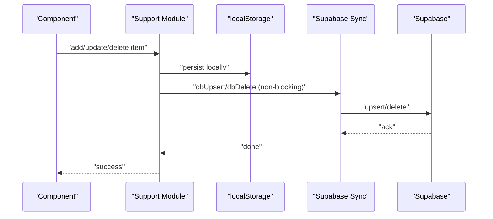
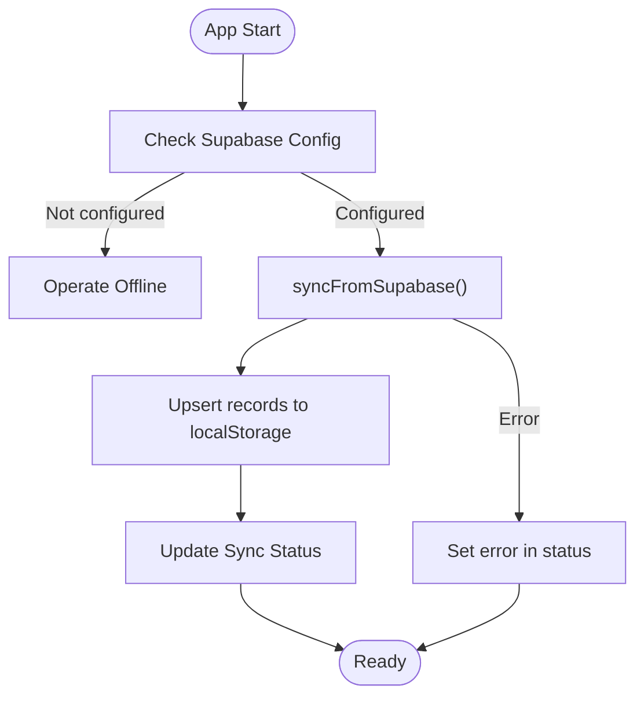
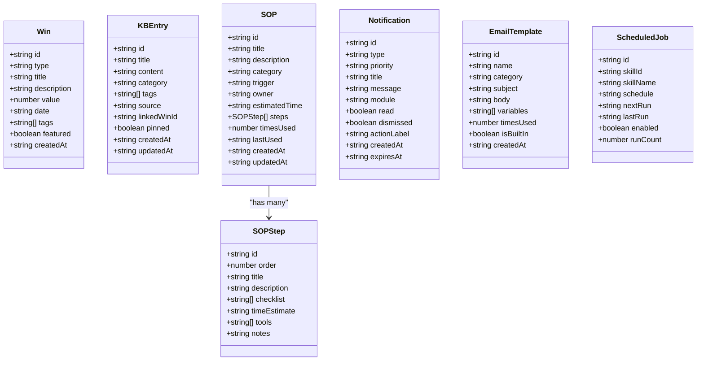
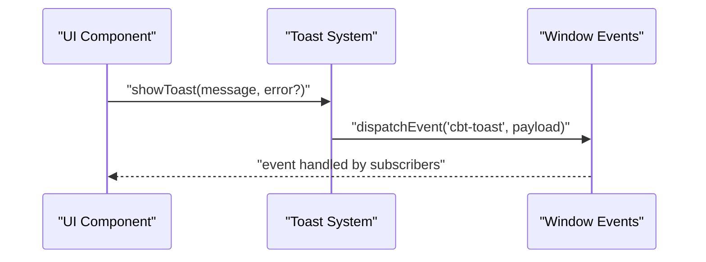
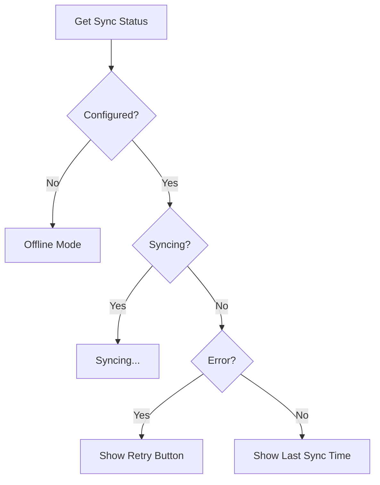
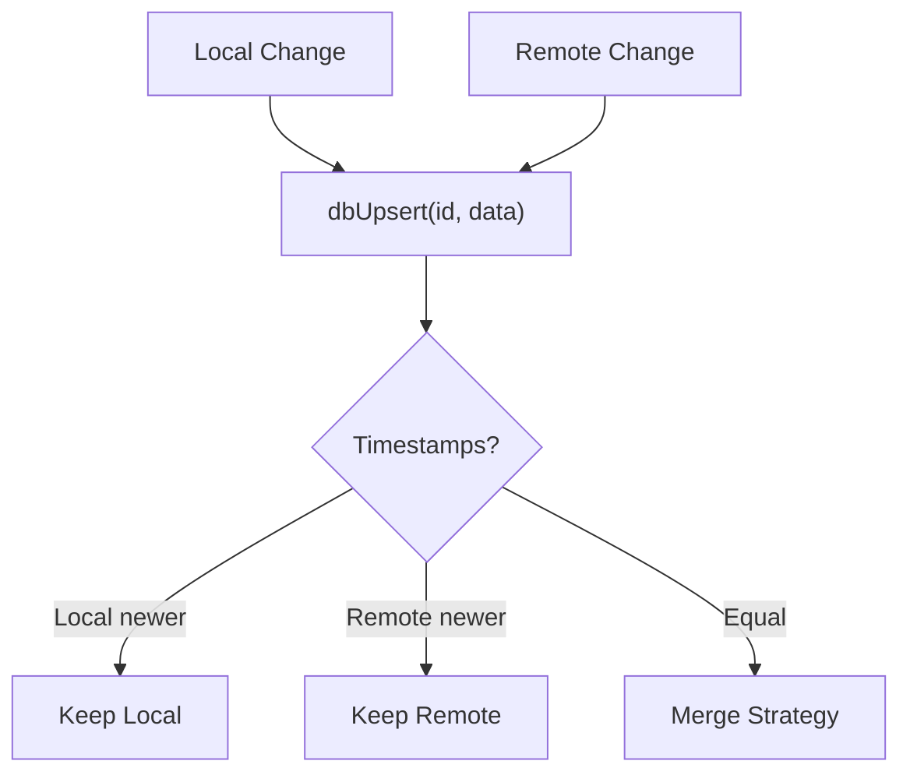
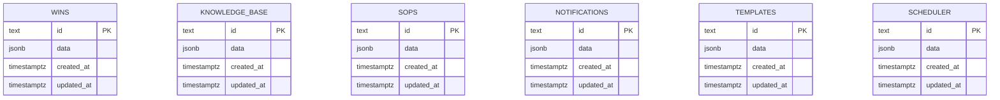
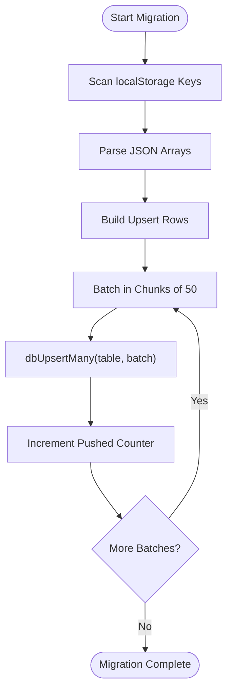
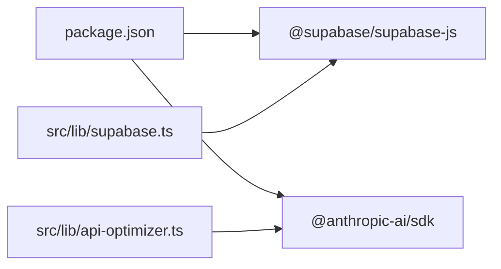

# Data Management

<cite>
**Referenced Files in This Document**
- [supabase.ts](file://src/lib/supabase.ts)
- [support.ts](file://src/lib/support.ts)
- [toast.ts](file://src/lib/toast.ts)
- [20250228_add_support_tables.sql](file://supabase/migrations/20250228_add_support_tables.sql)
- [page.tsx](file://src/app/page.tsx)
- [api-optimizer.ts](file://src/lib/api-optimizer.ts)
- [money.ts](file://src/lib/money.ts)
- [goals.ts](file://src/lib/goals.ts)
- [package.json](file://package.json)
</cite>

## Table of Contents
1. [Introduction](#introduction)
2. [Project Structure](#project-structure)
3. [Core Components](#core-components)
4. [Architecture Overview](#architecture-overview)
5. [Detailed Component Analysis](#detailed-component-analysis)
6. [Dependency Analysis](#dependency-analysis)
7. [Performance Considerations](#performance-considerations)
8. [Troubleshooting Guide](#troubleshooting-guide)
9. [Conclusion](#conclusion)
10. [Appendices](#appendices)

## Introduction
This document explains the data management strategy for Core Brim Tech OS, focusing on a dual persistence model that combines immediate offline access via localStorage with real-time synchronization and cloud backup through Supabase. It details the write-through caching mechanism, the sync engine, conflict resolution strategies, database schema design, table relationships, data migration patterns, user feedback via toast notifications, support ticketing integration, validation patterns, performance optimizations, data lifecycle management, and security considerations for sensitive business information.

## Project Structure
The data management system spans three primary layers:
- Local-first persistence: localStorage-backed modules for offline availability and instant reads/writes.
- Supabase synchronization: a write-through pattern that mirrors local changes to the cloud for backup and cross-device sync.
- UI integration: toast notifications for user feedback and a sync status bar for visibility.

**Diagram sources**
- [supabase.ts](file://src/lib/supabase.ts#L155-L291)
- [support.ts](file://src/lib/support.ts#L1-L753)
- [toast.ts](file://src/lib/toast.ts#L1-L18)

**Section sources**
- [supabase.ts](file://src/lib/supabase.ts#L1-L292)
- [support.ts](file://src/lib/support.ts#L1-L753)
- [toast.ts](file://src/lib/toast.ts#L1-L18)

## Core Components
- Supabase client and sync engine: centralized client initialization, table names, CRUD wrappers, and sync status management.
- Support modules: portfolio wins, knowledge base, SOPs/playbooks, notifications center, email templates, scheduler, and data export/import.
- Toast notification system: global event-driven notifications for user feedback.
- Sync status UI: a status bar showing sync state and last sync time.

Key responsibilities:
- Write-through caching: all local mutations are mirrored to Supabase via upsert/delete operations.
- Sync orchestration: initial pull on app load and optional push for migration.
- Conflict resolution: optimistic concurrency via upsert timestamps; last-write-wins semantics with explicit merge guidance.
- Data lifecycle: initialization of starter content, soft deletion via dismissal flags, and export/import for backup.

**Section sources**
- [supabase.ts](file://src/lib/supabase.ts#L1-L292)
- [support.ts](file://src/lib/support.ts#L1-L753)
- [toast.ts](file://src/lib/toast.ts#L1-L18)
- [page.tsx](file://src/app/page.tsx#L32-L62)

## Architecture Overview
The system follows a write-through caching pattern:
- Components read/write from localStorage for immediate responsiveness.
- Each write triggers a non-blocking Supabase upsert operation.
- On app startup, the sync engine pulls the latest Supabase data and merges it into localStorage, ensuring freshness across devices.
- A dedicated status store tracks sync progress and errors.

**Diagram sources**
- [support.ts](file://src/lib/support.ts#L7-L21)
- [supabase.ts](file://src/lib/supabase.ts#L57-L124)

**Section sources**
- [supabase.ts](file://src/lib/supabase.ts#L155-L291)
- [support.ts](file://src/lib/support.ts#L1-L753)

## Detailed Component Analysis

### Supabase Client and Sync Engine
- Client initialization: lazy singleton with environment variable guards.
- Table names: strongly typed union of supported tables.
- Core operations: upsert, upsert many, fetch all/fetch one, delete, and special-case brain save/load.
- Sync status: persisted in localStorage with fields for last sync, syncing flag, error, and per-table counts.
- Sync from Supabase: pulls all registered tables and writes to localStorage; sets status on completion or failure.
- Push to Supabase: migrates existing localStorage data to Supabase in batches; assigns synthetic IDs for missing records.

**Diagram sources**
- [supabase.ts](file://src/lib/supabase.ts#L159-L246)

**Section sources**
- [supabase.ts](file://src/lib/supabase.ts#L1-L292)

### Support Modules: Portfolio, Knowledge Base, SOPs, Notifications, Templates, Scheduler
- Portfolio (wins): CRUD with write-through to Supabase; statistics aggregation.
- Knowledge Base: CRUD with pinned entries and timestamps; starter content initialization.
- SOPs/Playbooks: CRUD with usage counters and scheduling; starter SOPs initialization.
- Notifications Center: CRUD with read/dismiss flags, expiration, and smart generation from system state.
- Email Templates: CRUD with variable substitution and usage tracking.
- Scheduler: scheduled job management with next/last run calculation and toggles.
- Export/Import: bundle serialization/deserialization for backup and restore.

**Diagram sources**
- [support.ts](file://src/lib/support.ts#L26-L203)

**Section sources**
- [support.ts](file://src/lib/support.ts#L1-L753)

### Toast Notification System
- Event-driven notifications via a custom event bus.
- Global dispatcher and subscription helpers.
- Used across modules for success/error feedback during sync and CRUD operations.

**Diagram sources**
- [toast.ts](file://src/lib/toast.ts#L8-L17)

**Section sources**
- [toast.ts](file://src/lib/toast.ts#L1-L18)

### Sync Status UI
- Displays offline, syncing, error, or last-synced state.
- Provides retry action when sync fails.

**Diagram sources**
- [page.tsx](file://src/app/page.tsx#L41-L62)

**Section sources**
- [page.tsx](file://src/app/page.tsx#L32-L62)

### Conflict Resolution Strategies
- Optimistic concurrency: upsert operations include updated_at timestamps; last write wins.
- Merge guidance: when pulling from Supabase, components should merge local and remote records by id, preferring newer timestamps.
- Batch operations: pushLocalToSupabase assigns synthetic IDs for missing records to avoid collisions during migration.

**Diagram sources**
- [supabase.ts](file://src/lib/supabase.ts#L57-L66)
- [supabase.ts](file://src/lib/supabase.ts#L218-L230)

**Section sources**
- [supabase.ts](file://src/lib/supabase.ts#L155-L291)

### Database Schema Design and Table Relationships
Supabase tables mirror the structure used in localStorage, storing a JSONB data field alongside id, created_at, and updated_at. The migration script defines the support module tables.

**Diagram sources**
- [20250228_add_support_tables.sql](file://supabase/migrations/20250228_add_support_tables.sql#L5-L45)

**Section sources**
- [20250228_add_support_tables.sql](file://supabase/migrations/20250228_add_support_tables.sql#L1-L46)

### Data Migration Patterns
- Initial migration: pushLocalToSupabase scans localStorage keys, converts arrays to upsert rows, and batches writes.
- ID assignment: missing ids receive synthetic identifiers to preserve records during migration.
- Post-migration: subsequent writes use proper ids and upsert semantics.

**Diagram sources**
- [supabase.ts](file://src/lib/supabase.ts#L252-L291)

**Section sources**
- [supabase.ts](file://src/lib/supabase.ts#L252-L291)

### Validation Patterns
- Input sanitization and defaults: components validate required fields and initialize defaults before persisting.
- Starter content: modules initialize with predefined entries to ensure a smooth onboarding experience.
- Export safety: exportAllData serializes localStorage content; importData replaces keys wholesale.

Examples of validation and initialization:
- Win form requires title and date; adds createdAt automatically.
- Knowledge Base initializes with pinned starter entries.
- SOPs initializes with curated playbooks.
- Notifications center trims to a bounded list and filters expired/dismissed items.
- Templates initializes with built-in email templates.

**Section sources**
- [support.ts](file://src/lib/support.ts#L50-L84)
- [support.ts](file://src/lib/support.ts#L107-L138)
- [support.ts](file://src/lib/support.ts#L207-L258)
- [support.ts](file://src/lib/support.ts#L323-L376)
- [support.ts](file://src/lib/support.ts#L463-L581)
- [support.ts](file://src/lib/support.ts#L648-L666)
- [support.ts](file://src/lib/support.ts#L704-L740)

### Data Lifecycle Management
- Initialization: modules initialize with starter content if absent.
- Soft deletion: notifications support dismissal; wins and KB entries support logical removal.
- Archiving: export/import enables backup and restoration.
- Cleanup: scheduler maintains bounded caches and logs.

**Section sources**
- [support.ts](file://src/lib/support.ts#L107-L138)
- [support.ts](file://src/lib/support.ts#L207-L258)
- [support.ts](file://src/lib/support.ts#L323-L376)
- [support.ts](file://src/lib/support.ts#L463-L581)
- [support.ts](file://src/lib/support.ts#L648-L666)
- [support.ts](file://src/lib/support.ts#L704-L740)

### Security Considerations
- Environment variables: Supabase client initialization checks for configured URLs and keys.
- API keys: AI provider selection avoids exposing keys in UI; cost optimizer throws when keys are missing.
- Data exposure: localStorage stores business-sensitive data; ensure HTTPS and secure cookies for any server-side features.
- Access control: restrict Supabase row-level security policies to authenticated users and enforce minimal permissions.

**Section sources**
- [supabase.ts](file://src/lib/supabase.ts#L11-L26)
- [api-optimizer.ts](file://src/lib/api-optimizer.ts#L225-L228)

## Dependency Analysis
External dependencies relevant to data management:
- @supabase/supabase-js: Supabase client for database operations.
- @anthropic-ai/sdk: AI model integration used by the API optimizer.

**Diagram sources**
- [package.json](file://package.json#L11-L22)
- [supabase.ts](file://src/lib/supabase.ts#L5-L5)
- [api-optimizer.ts](file://src/lib/api-optimizer.ts#L180-L180)

**Section sources**
- [package.json](file://package.json#L1-L36)
- [supabase.ts](file://src/lib/supabase.ts#L1-L292)
- [api-optimizer.ts](file://src/lib/api-optimizer.ts#L1-L290)

## Performance Considerations
- Write-through caching: minimize UI latency by writing to localStorage first, then non-blocking Supabase upserts.
- Batch operations: pushLocalToSupabase batches upserts to reduce network overhead.
- Cache and cost tracking: API optimizer reduces repeated calls with a 24-hour TTL cache and logs costs for transparency.
- Export size: exportAllData includes only localStorage keys; consider selective exports for large datasets.

Recommendations:
- Debounce frequent writes in UI to reduce redundant upserts.
- Use pagination for large lists; lazy-load data where appropriate.
- Monitor sync status and surface errors to users promptly.

**Section sources**
- [supabase.ts](file://src/lib/supabase.ts#L278-L283)
- [api-optimizer.ts](file://src/lib/api-optimizer.ts#L78-L128)
- [api-optimizer.ts](file://src/lib/api-optimizer.ts#L132-L176)

## Troubleshooting Guide
Common issues and resolutions:
- Supabase not configured: UI displays offline mode; configure NEXT_PUBLIC_SUPABASE_URL and key.
- Sync failures: inspect sync status error field; retry via UI; check network connectivity.
- Data not appearing across devices: ensure sync completes; verify Supabase credentials and table permissions.
- Excessive API costs: enable caching and model routing in the API optimizer; review recent calls.
- Backup/restore: use exportAllData and importData to migrate between environments.

**Section sources**
- [supabase.ts](file://src/lib/supabase.ts#L11-L26)
- [supabase.ts](file://src/lib/supabase.ts#L168-L181)
- [page.tsx](file://src/app/page.tsx#L41-L62)
- [api-optimizer.ts](file://src/lib/api-optimizer.ts#L146-L176)
- [support.ts](file://src/lib/support.ts#L704-L740)

## Conclusion
Core Brim Tech OS employs a robust dual persistence strategy: immediate offline access via localStorage with real-time synchronization and cloud backup through Supabase. The write-through caching mechanism ensures data durability and cross-device consistency, while the sync engine and migration utilities streamline setup and maintenance. With explicit conflict resolution, validation patterns, performance optimizations, and security safeguards, the system supports reliable, scalable data management for business-critical workflows.

## Appendices

### API Definitions and Contracts
- Supabase client initialization and configuration checks.
- Sync status contract stored in localStorage.
- Export bundle structure for backup and restore.

**Section sources**
- [supabase.ts](file://src/lib/supabase.ts#L11-L26)
- [supabase.ts](file://src/lib/supabase.ts#L159-L181)
- [support.ts](file://src/lib/support.ts#L698-L740)