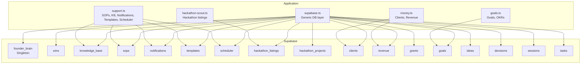
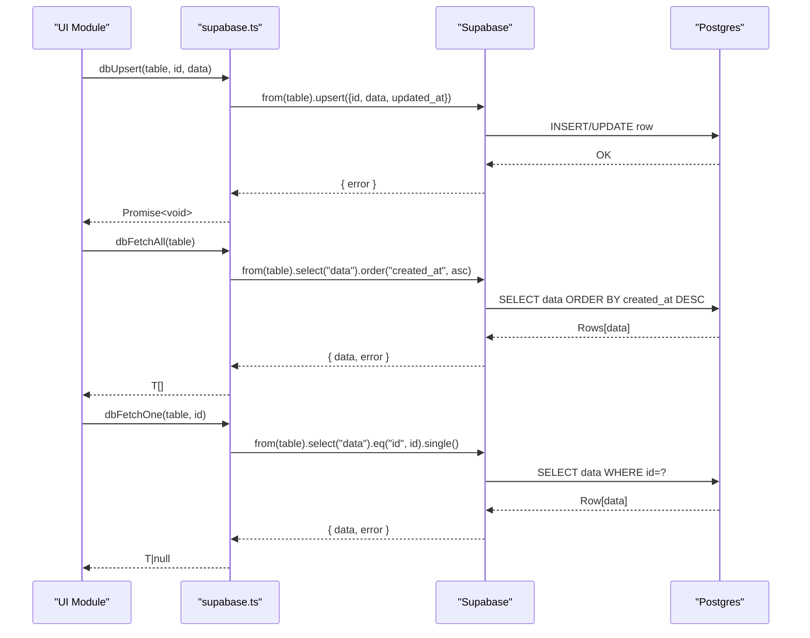
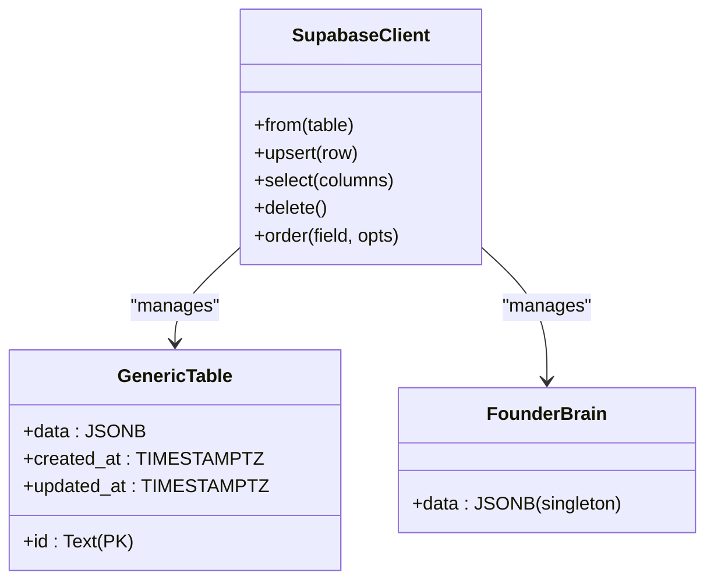

# Database Schema

<cite>
**Referenced Files in This Document**
- [20250228_add_support_tables.sql](file://supabase/migrations/20250228_add_support_tables.sql)
- [supabase.ts](file://src/lib/supabase.ts)
- [support.ts](file://src/lib/support.ts)
- [hackathon-scout.ts](file://src/lib/hackathon-scout.ts)
- [money.ts](file://src/lib/money.ts)
- [goals.ts](file://src/lib/goals.ts)
- [FounderBrain.tsx](file://src/components/brain/FounderBrain.tsx)
- [FounderBrainNudge.tsx](file://src/components/FounderBrainNudge.tsx)
- [HomeCommand.tsx](file://src/components/home/HomeCommand.tsx)
- [MoneyDashboard.tsx](file://src/components/money/MoneyDashboard.tsx)
- [HackathonScout.tsx](file://src/components/hackathon/HackathonScout.tsx)
</cite>

## Table of Contents
1. [Introduction](#introduction)
2. [Project Structure](#project-structure)
3. [Core Components](#core-components)
4. [Architecture Overview](#architecture-overview)
5. [Detailed Component Analysis](#detailed-component-analysis)
6. [Dependency Analysis](#dependency-analysis)
7. [Performance Considerations](#performance-considerations)
8. [Troubleshooting Guide](#troubleshooting-guide)
9. [Conclusion](#conclusion)

## Introduction
This document describes the database schema used by Core Brim Tech OS for persistence. The application uses a hybrid write-through pattern: data is written to local storage immediately for responsiveness and synchronized to Supabase for persistence and cross-device sync. The Supabase schema consists of generic tables that store structured JSON documents keyed by id, plus a specialized table for the Founder Brain singleton. This document details each table’s structure, fields, constraints, and relationships, and explains how the application interacts with them.

## Project Structure
The database schema is defined by:
- A Supabase migration that creates generic support tables (wins, knowledge_base, sops, notifications, templates, scheduler) with a consistent id → data JSONB pattern.
- A dedicated founder_brain table for the company-founder profile.
- Application libraries that define the JSON shapes stored in the data column for each table.

**Diagram sources**
- [supabase.ts](file://src/lib/supabase.ts#L30-L49)
- [20250228_add_support_tables.sql](file://supabase/migrations/20250228_add_support_tables.sql#L5-L45)
- [support.ts](file://src/lib/support.ts#L107-L124)
- [hackathon-scout.ts](file://src/lib/hackathon-scout.ts#L6-L28)
- [money.ts](file://src/lib/money.ts#L9-L44)
- [goals.ts](file://src/lib/goals.ts#L206-L228)

**Section sources**
- [supabase.ts](file://src/lib/supabase.ts#L30-L49)
- [20250228_add_support_tables.sql](file://supabase/migrations/20250228_add_support_tables.sql#L1-L46)

## Core Components
- Generic JSON tables (wins, knowledge_base, sops, notifications, templates, scheduler):
  - id: Text (Primary Key)
  - data: JSONB (Arbitrary structured data)
  - created_at: TIMESTAMPTZ
  - updated_at: TIMESTAMPTZ
- founder_brain:
  - Stores a single JSON document representing the company-founder profile. The application reads/writes this as a singleton, inserting or updating the first record.
- Application-specific tables (declared in the Supabase client type union):
  - sessions, tasks, decisions, ideas, goals, grants, clients, revenue, hackathon_projects, hackathon_listings, competitor_reports, research_library
  - These follow the same id → data JSONB pattern and are managed via the generic DB layer.

Constraints and defaults observed:
- All generic tables define id as PRIMARY KEY and include created_at and updated_at with default NOW().
- The Supabase client supports upsert, select, delete, and ordering by created_at.

**Section sources**
- [20250228_add_support_tables.sql](file://supabase/migrations/20250228_add_support_tables.sql#L5-L45)
- [supabase.ts](file://src/lib/supabase.ts#L57-L124)

## Architecture Overview
The database architecture is a thin relational layer atop JSONB documents. Each table stores a single JSONB payload per row, enabling flexible schema evolution without migrations. The Supabase client exposes a uniform interface for CRUD operations across all tables.

**Diagram sources**
- [supabase.ts](file://src/lib/supabase.ts#L57-L110)

## Detailed Component Analysis

### Table: founder_brain
- Purpose: Singleton profile for the company and founding team.
- Fields:
  - id: UUID or text (primary key)
  - data: JSONB containing the full profile object
  - created_at: TIMESTAMPTZ
  - updated_at: TIMESTAMPTZ
- Constraints:
  - Primary key on id
  - created_at and updated_at default to current time
- Notes:
  - The application treats this as a singleton. It inserts if none exists, otherwise updates the existing record.
  - The UI prompts users to complete the profile before enabling dependent features.

Typical data shape (from the UI and logic):
- Company info: name, tagline, mission, vision, founded date, location, stage, team size
- Founders: array of profiles
- Products: array of SaaS products
- Milestones: array of company milestones
- Competitors: array of competitive intelligence entries
- Metrics: total revenue, runway, targets, values
- Flags: setupComplete, timestamps

Validation and behavior:
- The application validates presence of a completed profile before enabling certain modules.
- The Supabase layer persists the entire object graph in a single JSONB field.

**Section sources**
- [supabase.ts](file://src/lib/supabase.ts#L129-L153)
- [FounderBrain.tsx](file://src/components/brain/FounderBrain.tsx#L754-L773)
- [FounderBrainNudge.tsx](file://src/components/FounderBrainNudge.tsx#L1-L38)
- [HomeCommand.tsx](file://src/components/home/HomeCommand.tsx#L1-L36)

### Table: wins
- Purpose: Store notable achievements and wins.
- Fields:
  - id: Text (Primary Key)
  - data: JSONB (Structured win record)
  - created_at: TIMESTAMPTZ
  - updated_at: TIMESTAMPTZ
- Typical data structure:
  - Title, description, date, category, links, notes
- Indexing and performance:
  - No explicit index; queries rely on created_at ordering.

**Section sources**
- [20250228_add_support_tables.sql](file://supabase/migrations/20250228_add_support_tables.sql#L5-L10)

### Table: knowledge_base
- Purpose: Central repository of curated knowledge articles.
- Fields:
  - id: Text (Primary Key)
  - data: JSONB (Article metadata and content)
  - created_at: TIMESTAMPTZ
  - updated_at: TIMESTAMPTZ
- Typical data structure:
  - Title, content, category, tags, source, pinned flag, timestamps

**Section sources**
- [20250228_add_support_tables.sql](file://supabase/migrations/20250228_add_support_tables.sql#L12-L17)
- [support.ts](file://src/lib/support.ts#L107-L124)

### Table: sops
- Purpose: Standard Operating Procedures for repeatable workflows.
- Fields:
  - id: Text (Primary Key)
  - data: JSONB (Procedure definition)
  - created_at: TIMESTAMPTZ
  - updated_at: TIMESTAMPTZ
- Typical data structure:
  - Title, description, steps, checklist, time estimate, tools, timestamps, usage stats

**Section sources**
- [20250228_add_support_tables.sql](file://supabase/migrations/20250228_add_support_tables.sql#L19-L24)
- [support.ts](file://src/lib/support.ts#L256-L298)

### Table: notifications
- Purpose: Store notification events and reminders.
- Fields:
  - id: Text (Primary Key)
  - data: JSONB (Notification payload)
  - created_at: TIMESTAMPTZ
  - updated_at: TIMESTAMPTZ
- Typical data structure:
  - Title, message, urgency, module, read status, timestamps

**Section sources**
- [20250228_add_support_tables.sql](file://supabase/migrations/20250228_add_support_tables.sql#L26-L31)

### Table: templates
- Purpose: Reusable content templates for proposals, emails, etc.
- Fields:
  - id: Text (Primary Key)
  - data: JSONB (Template content and metadata)
  - created_at: TIMESTAMPTZ
  - updated_at: TIMESTAMPTZ
- Typical data structure:
  - Title, content, category, tags, timestamps

**Section sources**
- [20250228_add_support_tables.sql](file://supabase/migrations/20250228_add_support_tables.sql#L33-L38)

### Table: scheduler
- Purpose: Schedule and track recurring tasks and reminders.
- Fields:
  - id: Text (Primary Key)
  - data: JSONB (Schedule item)
  - created_at: TIMESTAMPTZ
  - updated_at: TIMESTAMPTZ
- Typical data structure:
  - Title, frequency, next run, status, linked items, timestamps

**Section sources**
- [20250228_add_support_tables.sql](file://supabase/migrations/20250228_add_support_tables.sql#L40-L45)

### Table: hackathon_listings
- Purpose: Persist discovered hackathons with fit scoring and status.
- Fields:
  - id: Text (Primary Key)
  - data: JSONB (Listing object)
  - created_at: TIMESTAMPTZ
  - updated_at: TIMESTAMPTZ
- Typical data structure:
  - title, organizer, url, platform, prizeTotal, prizeDisplay, theme, tags, deadline, teamSize, online, fitScore, fitReasons, difficulty, estimatedHours, roi, status, scoutedAt, notes

**Section sources**
- [hackathon-scout.ts](file://src/lib/hackathon-scout.ts#L6-L28)
- [HackathonScout.tsx](file://src/components/hackathon/HackathonScout.tsx#L1-L300)

### Table: clients
- Purpose: Client pipeline and deal tracking.
- Fields:
  - id: Text (Primary Key)
  - data: JSONB (Client record)
  - created_at: TIMESTAMPTZ
  - updated_at: TIMESTAMPTZ
- Typical data structure:
  - name, company, email, phone, source, status, service, value, currency, notes, nextAction, nextActionDate, probability, timestamps, won/lost markers

**Section sources**
- [money.ts](file://src/lib/money.ts#L9-L29)
- [MoneyDashboard.tsx](file://src/components/money/MoneyDashboard.tsx#L1-L153)

### Table: revenue
- Purpose: Track income streams and amounts.
- Fields:
  - id: Text (Primary Key)
  - data: JSONB (Revenue entry)
  - created_at: TIMESTAMPTZ
  - updated_at: TIMESTAMPTZ
- Typical data structure:
  - type, description, amount, currency, date, clientId, projectId, grantId, recurring, recurringInterval, notes

**Section sources**
- [money.ts](file://src/lib/money.ts#L31-L44)
- [MoneyDashboard.tsx](file://src/components/money/MoneyDashboard.tsx#L145-L153)

### Table: goals
- Purpose: OKRs and goal tracking.
- Fields:
  - id: Text (Primary Key)
  - data: JSONB (Goal record)
  - created_at: TIMESTAMPTZ
  - updated_at: TIMESTAMPTZ
- Typical data structure:
  - id, title, description, category, timeframe, status, why, keyResults, milestones, progress, dates, timestamps

**Section sources**
- [goals.ts](file://src/lib/goals.ts#L206-L228)

### Additional tables (declared in the Supabase client type union)
- sessions, tasks, decisions, ideas, grants, hackathon_projects, competitor_reports, research_library
- Pattern: id (Text, Primary Key), data (JSONB), created_at (TIMESTAMPTZ), updated_at (TIMESTAMPTZ)

These tables follow the same generic schema and are accessed via the same DB layer.

**Section sources**
- [supabase.ts](file://src/lib/supabase.ts#L30-L49)

## Dependency Analysis
- Application-to-DB mapping:
  - The Supabase client type union defines all table names used by the app.
  - The generic DB layer maps each table to a localStorage key for offline-first behavior and to a JSONB data column for persistence.
- Singleton vs. collections:
  - founder_brain is treated as a singleton; other tables are arrays of records.
- Cross-table relationships:
  - No foreign keys exist between tables. Relationships are implicit via JSONB fields (e.g., revenue entries may reference clients or grants by id).
- External integrations:
  - Hackathon listings are populated from an external search tool and synced to the hackathon_listings table.
  - Client and revenue data are managed locally and synced to Supabase.

**Diagram sources**
- [supabase.ts](file://src/lib/supabase.ts#L57-L124)
- [20250228_add_support_tables.sql](file://supabase/migrations/20250228_add_support_tables.sql#L5-L45)

**Section sources**
- [supabase.ts](file://src/lib/supabase.ts#L30-L49)
- [supabase.ts](file://src/lib/supabase.ts#L184-L203)

## Performance Considerations
- JSONB flexibility:
  - Storing arbitrary JSON reduces schema rigidity but can increase storage and complicate indexing.
- Query patterns:
  - The generic layer selects by id and orders by created_at. For large datasets, consider adding indexes on frequently queried fields within data (e.g., status, category, date).
- Batch operations:
  - Upserts are performed in batches (e.g., 50) when migrating data to Supabase to reduce round trips.
- Offline-first:
  - Local storage ensures immediate writes; sync runs on app load and can be triggered manually.

[No sources needed since this section provides general guidance]

## Troubleshooting Guide
- Supabase not configured:
  - The DB layer checks for environment variables and gracefully falls back to no-op operations if missing.
- Sync failures:
  - The sync engine captures errors and stores a sync status object in localStorage with lastSync, syncing flag, and error messages.
- Common issues:
  - Missing environment variables prevent Supabase operations.
  - Network errors during upsert/delete are logged and do not crash the app.
  - For large datasets, consider batching and pagination to avoid timeouts.

**Section sources**
- [supabase.ts](file://src/lib/supabase.ts#L11-L26)
- [supabase.ts](file://src/lib/supabase.ts#L168-L181)
- [supabase.ts](file://src/lib/supabase.ts#L252-L291)

## Conclusion
Core Brim Tech OS employs a minimal, flexible database schema centered on JSONB documents stored in simple tables with id primary keys and standardized timestamps. This design enables rapid iteration and cross-device synchronization while keeping the backend lightweight. The Supabase client abstracts table operations uniformly, and the application manages both singleton and collection-style data through a consistent interface.