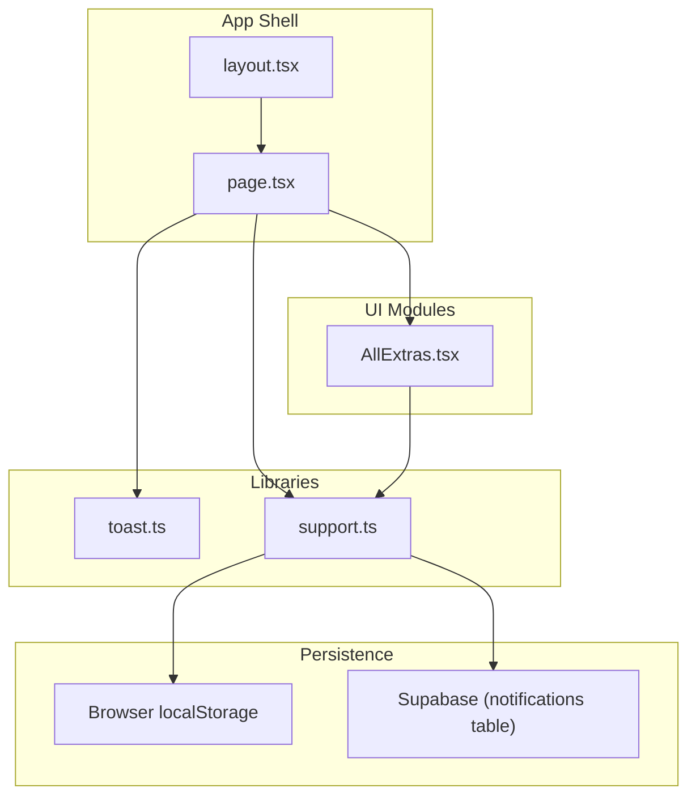
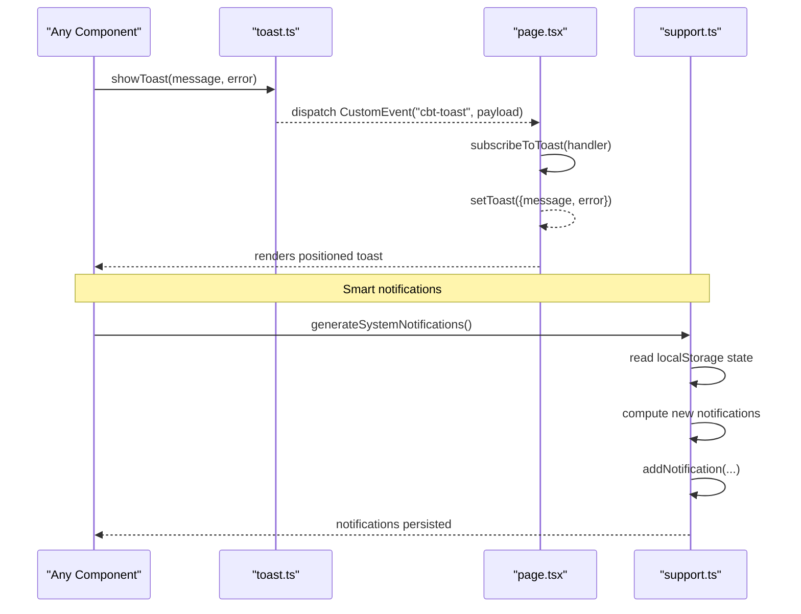
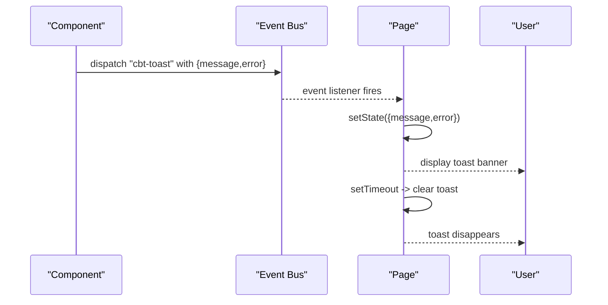
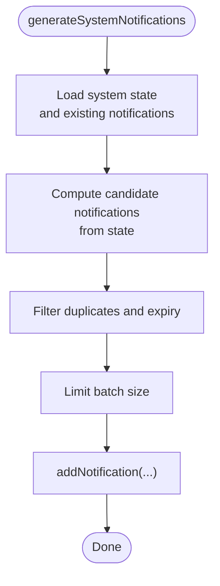
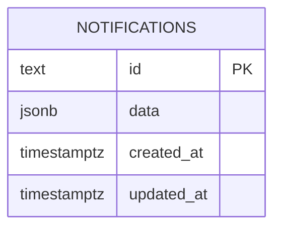
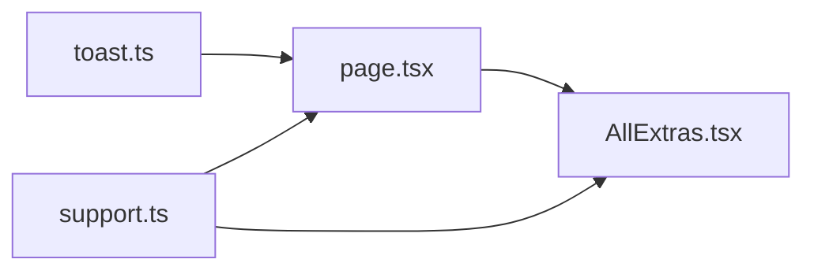

# Notification System

<cite>
**Referenced Files in This Document**
- [toast.ts](file://src/lib/toast.ts)
- [support.ts](file://src/lib/support.ts)
- [page.tsx](file://src/app/page.tsx)
- [AllExtras.tsx](file://src/components/extras/AllExtras.tsx)
- [layout.tsx](file://src/app/layout.tsx)
- [20250228_add_support_tables.sql](file://supabase/migrations/20250228_add_support_tables.sql)
</cite>

## Table of Contents
1. [Introduction](#introduction)
2. [Project Structure](#project-structure)
3. [Core Components](#core-components)
4. [Architecture Overview](#architecture-overview)
5. [Detailed Component Analysis](#detailed-component-analysis)
6. [Dependency Analysis](#dependency-analysis)
7. [Performance Considerations](#performance-considerations)
8. [Troubleshooting Guide](#troubleshooting-guide)
9. [Conclusion](#conclusion)

## Introduction
This document describes the notification and support system in Core Brim Tech OS. It covers:
- The global toast notification mechanism used for success, error, and informational feedback
- The Notification Center for persistent, prioritized alerts derived from system state
- Integration patterns across modules
- Positioning, timing, and user interaction behaviors
- Accessibility considerations
- Extensibility guidelines for adding new notification types and support features

## Project Structure
The notification system spans three primary areas:
- Global toast library for ephemeral feedback
- Local storage-backed Notification Center with smart generation
- UI integration in the main page and extras panel

**Diagram sources**
- [layout.tsx](file://src/app/layout.tsx#L1-L22)
- [page.tsx](file://src/app/page.tsx#L1-L253)
- [toast.ts](file://src/lib/toast.ts#L1-L18)
- [support.ts](file://src/lib/support.ts#L1-L753)
- [AllExtras.tsx](file://src/components/extras/AllExtras.tsx#L1-L731)

**Section sources**
- [layout.tsx](file://src/app/layout.tsx#L1-L22)
- [page.tsx](file://src/app/page.tsx#L1-L253)
- [toast.ts](file://src/lib/toast.ts#L1-L18)
- [support.ts](file://src/lib/support.ts#L1-L753)
- [AllExtras.tsx](file://src/components/extras/AllExtras.tsx#L1-L731)

## Core Components
- Global toast library
  - Provides a publish/subscribe event bus for toast messages
  - Exposes a single function to emit a toast and a subscription hook for rendering
- Notification Center
  - Manages persisted notifications in local storage
  - Generates contextual notifications from system state
  - Supports marking as read, dismissing, and bulk actions

Key APIs:
- Toast
  - showToast(message, error?)
  - subscribeToToast(callback)
- Notifications
  - getNotifications(includeRead?)
  - addNotification(notification)
  - markRead(id)
  - markAllRead()
  - dismissNotification(id)
  - getUnreadCount()
  - generateSystemNotifications()

**Section sources**
- [toast.ts](file://src/lib/toast.ts#L1-L18)
- [support.ts](file://src/lib/support.ts#L300-L377)
- [support.ts](file://src/lib/support.ts#L378-L441)

## Architecture Overview
The system uses a unidirectional data flow:
- Components call APIs in the libraries
- Libraries persist state (local storage and optional remote sync)
- UI subscribes to events or reads state to render

**Diagram sources**
- [toast.ts](file://src/lib/toast.ts#L8-L11)
- [page.tsx](file://src/app/page.tsx#L166-L177)
- [support.ts](file://src/lib/support.ts#L378-L441)

## Detailed Component Analysis

### Toast Notification Implementation
The toast system is a lightweight event-driven mechanism:
- Dispatches a custom event with a payload containing the message and error flag
- The page subscribes and renders a transient banner near the top center
- Automatic dismissal after a fixed duration

Positioning and timing:
- Fixed position at the top center of the viewport
- Dismissal timer set to a short duration suitable for quick feedback
- Uses distinct styles for success vs error states

User interaction patterns:
- Clicking the toast does nothing; it auto-dismisses
- Error toasts use a red tone; success toasts use a green tone
- Announced to assistive technologies via live region attributes

**Diagram sources**
- [toast.ts](file://src/lib/toast.ts#L8-L11)
- [page.tsx](file://src/app/page.tsx#L166-L177)
- [page.tsx](file://src/app/page.tsx#L214-L226)

**Section sources**
- [toast.ts](file://src/lib/toast.ts#L1-L18)
- [page.tsx](file://src/app/page.tsx#L166-L177)
- [page.tsx](file://src/app/page.tsx#L214-L226)

### Notification Center
The Notification Center manages persistent alerts:
- Types: deadline, opportunity, approval, win, alert, reminder, system
- Priorities: urgent, high, medium, low
- Fields include title, message, module navigation hint, read/dismissed flags, timestamps, optional expiration

Smart generation:
- Scans system state (e.g., grants, clients, goals, hackathon listings)
- Creates contextual notifications with appropriate priority and action labels
- Deduplicates against existing IDs and caps batch size

UI behavior:
- Renders with visual priority indicators and icons
- Allows dismissing individual items and marking all as read
- Shows unread count in the sidebar

**Diagram sources**
- [support.ts](file://src/lib/support.ts#L378-L441)
- [support.ts](file://src/lib/support.ts#L337-L345)

**Section sources**
- [support.ts](file://src/lib/support.ts#L300-L377)
- [support.ts](file://src/lib/support.ts#L378-L441)
- [AllExtras.tsx](file://src/components/extras/AllExtras.tsx#L402-L469)

### Integration Across Modules
- Main page integrates toast subscription and renders the toast banner
- Extras panel hosts the Notification Center UI and triggers smart generation
- Both rely on the shared support library for persistence and computation

Usage examples:
- Sync operations trigger toasts for success/error outcomes
- Notification Center refresh button regenerates contextual alerts
- Sidebar badge reflects unread notification count

**Section sources**
- [page.tsx](file://src/app/page.tsx#L147-L177)
- [AllExtras.tsx](file://src/components/extras/AllExtras.tsx#L402-L417)

### Persistence and Remote Sync
- Local storage holds all data keyed by module-specific identifiers
- Helper functions wrap database upsert/delete operations and continue on failures
- Supabase migration defines the notifications table schema

**Diagram sources**
- [20250228_add_support_tables.sql](file://supabase/migrations/20250228_add_support_tables.sql#L26-L31)

**Section sources**
- [support.ts](file://src/lib/support.ts#L7-L20)
- [20250228_add_support_tables.sql](file://supabase/migrations/20250228_add_support_tables.sql#L1-L46)

## Dependency Analysis
- toast.ts depends on browser window events and is consumed by page.tsx
- page.tsx depends on toast.ts for rendering and support.ts for notifications
- AllExtras.tsx depends on support.ts for UI and state management
- support.ts persists to localStorage and optionally syncs to Supabase

**Diagram sources**
- [toast.ts](file://src/lib/toast.ts#L1-L18)
- [page.tsx](file://src/app/page.tsx#L1-L253)
- [support.ts](file://src/lib/support.ts#L1-L753)
- [AllExtras.tsx](file://src/components/extras/AllExtras.tsx#L1-L731)

**Section sources**
- [toast.ts](file://src/lib/toast.ts#L1-L18)
- [page.tsx](file://src/app/page.tsx#L1-L253)
- [support.ts](file://src/lib/support.ts#L1-L753)
- [AllExtras.tsx](file://src/components/extras/AllExtras.tsx#L1-L731)

## Performance Considerations
- Toast rendering is lightweight and avoids heavy computations
- Notification generation scans local state; keep state sizes reasonable
- Limit batch size during smart generation to avoid blocking UI
- Debounce repeated generation triggers if invoked frequently

## Troubleshooting Guide
Common issues and resolutions:
- Toast not appearing
  - Ensure the page subscribes to the toast event and that the component is hydrated
  - Verify the event name and payload shape match the library
- Notifications not updating
  - Confirm smart generation is called and local storage is accessible
  - Check for exceptions during state parsing
- Remote sync failures
  - Inspect network connectivity and Supabase configuration
  - Review sync helpers that swallow errors for resilience

**Section sources**
- [page.tsx](file://src/app/page.tsx#L166-L177)
- [support.ts](file://src/lib/support.ts#L7-L20)
- [support.ts](file://src/lib/support.ts#L378-L441)

## Conclusion
Core Brim Tech OS provides a cohesive notification and support system:
- A minimal, reliable toast mechanism for immediate feedback
- A robust Notification Center with contextual generation and persistent storage
- Clean separation of concerns and straightforward extension points

Guidelines for extending the system:
- Toast
  - Use showToast with clear, concise messages
  - Respect error vs success semantics for consistent UX
- Notifications
  - Add new types/priorities to the respective enums
  - Implement new smart generation rules in the generator function
  - Extend UI to render new types consistently
- Accessibility
  - Keep messages scannable and screen-reader friendly
  - Provide keyboard-accessible controls for dismiss and read actions
  - Maintain sufficient color contrast and clear visual hierarchy