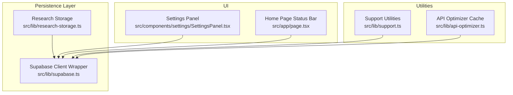
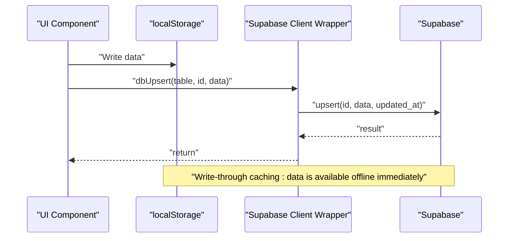
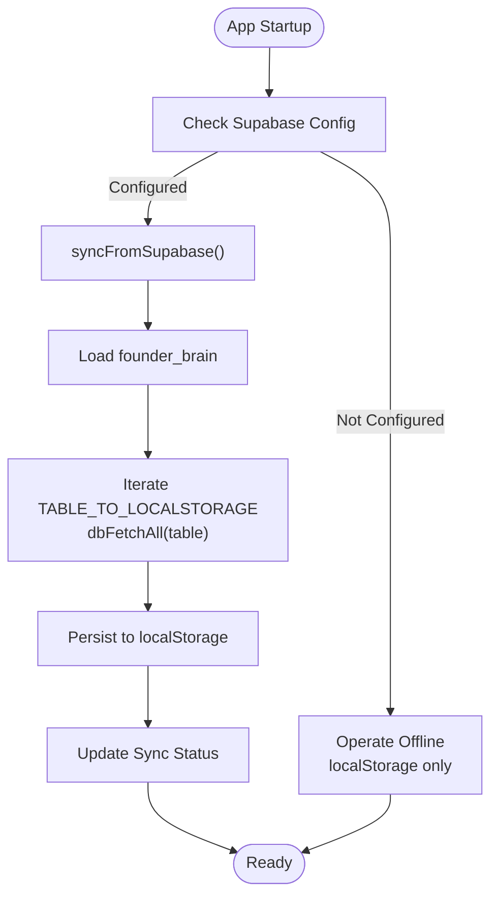
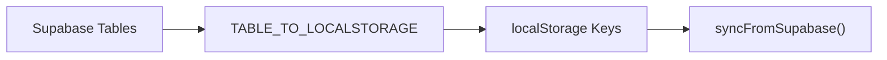
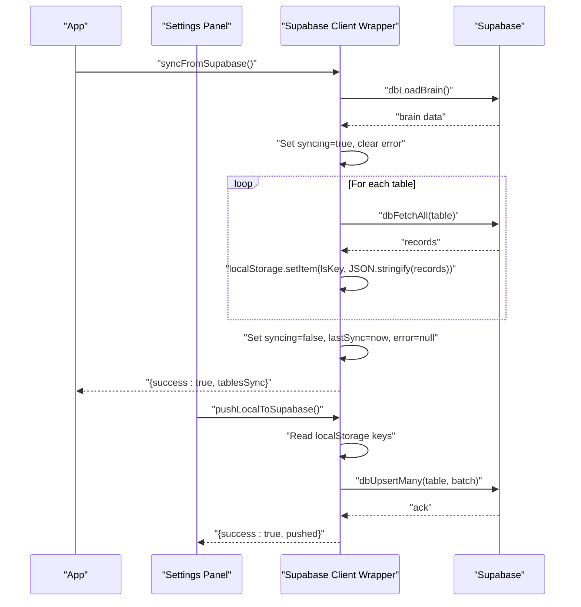
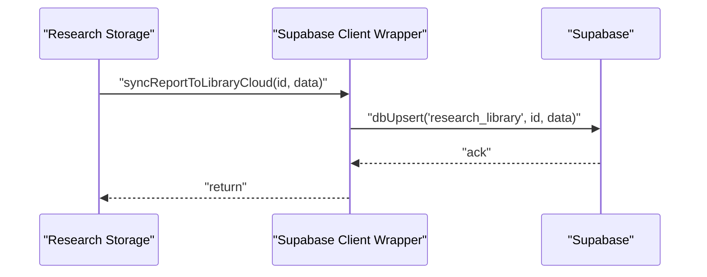
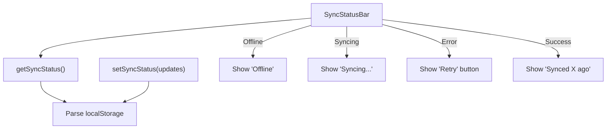
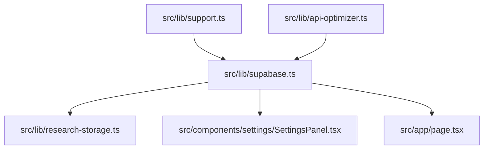

# Persistence Strategy

<cite>
**Referenced Files in This Document**
- [src/lib/supabase.ts](file://src/lib/supabase.ts)
- [src/lib/research-storage.ts](file://src/lib/research-storage.ts)
- [src/components/settings/SettingsPanel.tsx](file://src/components/settings/SettingsPanel.tsx)
- [src/app/page.tsx](file://src/app/page.tsx)
- [src/lib/support.ts](file://src/lib/support.ts)
- [src/lib/api-optimizer.ts](file://src/lib/api-optimizer.ts)
</cite>

## Table of Contents
1. [Introduction](#introduction)
2. [Project Structure](#project-structure)
3. [Core Components](#core-components)
4. [Architecture Overview](#architecture-overview)
5. [Detailed Component Analysis](#detailed-component-analysis)
6. [Dependency Analysis](#dependency-analysis)
7. [Performance Considerations](#performance-considerations)
8. [Troubleshooting Guide](#troubleshooting-guide)
9. [Conclusion](#conclusion)

## Introduction
This document explains the dual persistence strategy used by Core Brim Tech OS. It describes how the system achieves immediate offline availability via localStorage while simultaneously writing to Supabase for real-time synchronization and cloud backup. It documents the fallback behavior when Supabase is not configured, graceful degradation patterns, and data consistency guarantees. It also details the sync engine, including sync status tracking, conflict handling, error handling, and the TABLE_TO_LOCALSTORAGE mapping system that orchestrates synchronization between local and remote storage. Finally, it covers performance optimizations, data lifecycle management, and best practices for maintaining data integrity across both storage layers.

## Project Structure
The persistence strategy spans a small set of focused modules:
- A Supabase client wrapper that centralizes database operations and sync orchestration
- A specialized research storage module that currently uses localStorage but integrates with Supabase via the shared persistence layer
- UI components that surface sync status and provide manual sync controls
- Utilities for exporting/importing data and managing caches

**Diagram sources**
- [src/lib/supabase.ts](file://src/lib/supabase.ts#L1-L292)
- [src/lib/research-storage.ts](file://src/lib/research-storage.ts#L1-L47)
- [src/components/settings/SettingsPanel.tsx](file://src/components/settings/SettingsPanel.tsx#L324-L362)
- [src/app/page.tsx](file://src/app/page.tsx#L32-L62)
- [src/lib/support.ts](file://src/lib/support.ts#L707-L740)
- [src/lib/api-optimizer.ts](file://src/lib/api-optimizer.ts#L98-L132)

**Section sources**
- [src/lib/supabase.ts](file://src/lib/supabase.ts#L1-L292)
- [src/lib/research-storage.ts](file://src/lib/research-storage.ts#L1-L47)
- [src/components/settings/SettingsPanel.tsx](file://src/components/settings/SettingsPanel.tsx#L324-L362)
- [src/app/page.tsx](file://src/app/page.tsx#L32-L62)
- [src/lib/support.ts](file://src/lib/support.ts#L707-L740)
- [src/lib/api-optimizer.ts](file://src/lib/api-optimizer.ts#L98-L132)

## Core Components
- Supabase client wrapper: Provides a drop-in replacement for localStorage operations with write-through caching. It exposes typed table names, CRUD helpers, and a robust sync engine.
- Research storage: Manages a research report library using localStorage and integrates with the Supabase persistence layer for cloud sync.
- Sync UI: Displays sync status and provides manual controls to pull from cloud or push to cloud.
- Support utilities: Offer export/import of localStorage data and manage caches.

Key responsibilities:
- Write-through caching: Every save operation writes to localStorage immediately and attempts to upsert to Supabase.
- Graceful degradation: When Supabase is not configured, operations silently fall back to localStorage-only behavior.
- Sync engine: On app load, pulls latest data from Supabase into localStorage; supports manual migration from localStorage to Supabase.
- Consistency model: Supabase is authoritative for cross-device synchronization; localStorage is the single source of truth for the current browser session.

**Section sources**
- [src/lib/supabase.ts](file://src/lib/supabase.ts#L53-L153)
- [src/lib/supabase.ts](file://src/lib/supabase.ts#L159-L291)
- [src/lib/research-storage.ts](file://src/lib/research-storage.ts#L1-L47)
- [src/components/settings/SettingsPanel.tsx](file://src/components/settings/SettingsPanel.tsx#L324-L362)
- [src/app/page.tsx](file://src/app/page.tsx#L32-L62)

## Architecture Overview
The dual persistence strategy follows a write-through pattern:
- Immediate offline access: All reads/writes target localStorage.
- Real-time synchronization: Each write attempts to upsert to Supabase.
- Recovery and portability: On app load, data is pulled from Supabase into localStorage; users can manually migrate existing localStorage data to Supabase.

**Diagram sources**
- [src/lib/supabase.ts](file://src/lib/supabase.ts#L57-L66)
- [src/lib/supabase.ts](file://src/lib/supabase.ts#L86-L97)

## Detailed Component Analysis

### Supabase Client Wrapper
This module encapsulates:
- Client initialization and configuration detection
- Typed table names for supported domains
- Core CRUD operations with graceful fallback
- Sync engine for pulling/pushing data
- Sync status tracking persisted in localStorage

Implementation highlights:
- Client setup: Lazily creates a Supabase client only when environment variables are present and valid.
- Fallback behavior: All database operations return early if the client is unavailable, ensuring the app remains functional offline.
- Write-through caching: Each upsert operation targets both localStorage and Supabase.
- Sync engine:
  - Pull: Loads data from Supabase into localStorage on app startup and updates sync status.
  - Push: Migrates existing localStorage data to Supabase for the first time.
- Conflict handling: Supabase upsert semantics update existing records; the sync engine replaces local data with the latest remote snapshot.

**Diagram sources**
- [src/lib/supabase.ts](file://src/lib/supabase.ts#L23-L26)
- [src/lib/supabase.ts](file://src/lib/supabase.ts#L209-L246)
- [src/lib/supabase.ts](file://src/lib/supabase.ts#L183-L203)

**Section sources**
- [src/lib/supabase.ts](file://src/lib/supabase.ts#L11-L26)
- [src/lib/supabase.ts](file://src/lib/supabase.ts#L53-L153)
- [src/lib/supabase.ts](file://src/lib/supabase.ts#L159-L291)

### TABLE_TO_LOCALSTORAGE Mapping System
The mapping defines which Supabase tables correspond to which localStorage keys. This enables the sync engine to iterate over tables and apply consistent synchronization logic.

**Diagram sources**
- [src/lib/supabase.ts](file://src/lib/supabase.ts#L183-L203)
- [src/lib/supabase.ts](file://src/lib/supabase.ts#L209-L246)

**Section sources**
- [src/lib/supabase.ts](file://src/lib/supabase.ts#L183-L203)

### Sync Engine
The sync engine manages:
- Sync status tracking: Persisted in localStorage for visibility and resilience across reloads.
- Pull strategy: On startup, fetches all relevant tables from Supabase and writes them to localStorage.
- Push strategy: Migrates existing localStorage data to Supabase for the first time.
- Error handling: Captures exceptions, sets error state, and allows retry.

**Diagram sources**
- [src/lib/supabase.ts](file://src/lib/supabase.ts#L209-L246)
- [src/lib/supabase.ts](file://src/lib/supabase.ts#L252-L291)
- [src/components/settings/SettingsPanel.tsx](file://src/components/settings/SettingsPanel.tsx#L324-L362)

**Section sources**
- [src/lib/supabase.ts](file://src/lib/supabase.ts#L159-L181)
- [src/lib/supabase.ts](file://src/lib/supabase.ts#L209-L246)
- [src/lib/supabase.ts](file://src/lib/supabase.ts#L252-L291)
- [src/components/settings/SettingsPanel.tsx](file://src/components/settings/SettingsPanel.tsx#L324-L362)

### Research Storage Integration
Research storage currently uses localStorage for the research library. It integrates with the Supabase persistence layer by delegating cloud sync to the shared dbUpsert function.

**Diagram sources**
- [src/lib/research-storage.ts](file://src/lib/research-storage.ts#L44-L46)
- [src/lib/supabase.ts](file://src/lib/supabase.ts#L57-L66)

**Section sources**
- [src/lib/research-storage.ts](file://src/lib/research-storage.ts#L1-L47)
- [src/lib/supabase.ts](file://src/lib/supabase.ts#L53-L81)

### Sync Status Tracking and UI
The UI displays sync status and provides controls to trigger manual sync operations. It reflects offline mode when Supabase is not configured and shows human-readable timestamps for last sync.

**Diagram sources**
- [src/lib/supabase.ts](file://src/lib/supabase.ts#L168-L181)
- [src/app/page.tsx](file://src/app/page.tsx#L32-L62)
- [src/components/settings/SettingsPanel.tsx](file://src/components/settings/SettingsPanel.tsx#L324-L362)

**Section sources**
- [src/lib/supabase.ts](file://src/lib/supabase.ts#L168-L181)
- [src/app/page.tsx](file://src/app/page.tsx#L32-L62)
- [src/components/settings/SettingsPanel.tsx](file://src/components/settings/SettingsPanel.tsx#L324-L362)

## Dependency Analysis
The persistence strategy exhibits low coupling and high cohesion:
- Supabase client wrapper is the central dependency for all persistence operations.
- Research storage depends on the wrapper for cloud sync.
- UI components depend on the wrapper for sync status and manual operations.
- Export/import utilities depend on localStorage keys managed by the sync engine.

**Diagram sources**
- [src/lib/supabase.ts](file://src/lib/supabase.ts#L1-L292)
- [src/lib/research-storage.ts](file://src/lib/research-storage.ts#L1-L47)
- [src/components/settings/SettingsPanel.tsx](file://src/components/settings/SettingsPanel.tsx#L324-L362)
- [src/app/page.tsx](file://src/app/page.tsx#L32-L62)
- [src/lib/support.ts](file://src/lib/support.ts#L707-L740)
- [src/lib/api-optimizer.ts](file://src/lib/api-optimizer.ts#L98-L132)

**Section sources**
- [src/lib/supabase.ts](file://src/lib/supabase.ts#L1-L292)
- [src/lib/research-storage.ts](file://src/lib/research-storage.ts#L1-L47)
- [src/components/settings/SettingsPanel.tsx](file://src/components/settings/SettingsPanel.tsx#L324-L362)
- [src/app/page.tsx](file://src/app/page.tsx#L32-L62)
- [src/lib/support.ts](file://src/lib/support.ts#L707-L740)
- [src/lib/api-optimizer.ts](file://src/lib/api-optimizer.ts#L98-L132)

## Performance Considerations
- Batched upserts: The push pipeline batches upserts to Supabase to reduce network overhead.
- Local caching: Frequent reads leverage localStorage for minimal latency.
- Cache management: The API optimizer maintains a bounded in-memory cache in localStorage to avoid redundant requests.
- Export/import: Utilities enable quick backup and restore of localStorage state, supporting maintenance and migration scenarios.

Recommendations:
- Prefer batched operations for bulk inserts/updates.
- Monitor sync status to detect and recover from transient failures.
- Use export/import during maintenance windows to minimize downtime.

**Section sources**
- [src/lib/supabase.ts](file://src/lib/supabase.ts#L278-L283)
- [src/lib/api-optimizer.ts](file://src/lib/api-optimizer.ts#L98-L132)
- [src/lib/support.ts](file://src/lib/support.ts#L707-L740)

## Troubleshooting Guide
Common issues and resolutions:
- Supabase not configured: Operations silently fall back to localStorage. Verify environment variables and reconfigure if needed.
- Sync failures: Inspect the sync status error field and retry. Review console logs for underlying errors.
- Data divergence: Trigger a pull from Supabase to refresh localStorage with the latest authoritative data.
- Migration from localStorage to Supabase: Use the push utility to migrate existing data in batches.

Best practices:
- Always write through to both localStorage and Supabase for critical data.
- Monitor sync status and surface user-facing feedback.
- Back up localStorage periodically using the export utility.

**Section sources**
- [src/lib/supabase.ts](file://src/lib/supabase.ts#L177-L181)
- [src/lib/supabase.ts](file://src/lib/supabase.ts#L241-L245)
- [src/lib/supabase.ts](file://src/lib/supabase.ts#L252-L291)
- [src/components/settings/SettingsPanel.tsx](file://src/components/settings/SettingsPanel.tsx#L324-L362)
- [src/lib/support.ts](file://src/lib/support.ts#L707-L740)

## Conclusion
Core Brim Tech OS employs a robust dual persistence strategy that prioritizes immediate offline availability while ensuring long-term durability and cross-device synchronization through Supabase. The write-through caching mechanism guarantees that data is always accessible locally and consistently backed up remotely. The sync engine provides reliable mechanisms to pull and push data, with clear fallback behavior when Supabase is unavailable. By leveraging the TABLE_TO_LOCALSTORAGE mapping and consistent sync status tracking, the system maintains data integrity and offers a resilient foundation for growth and team collaboration.