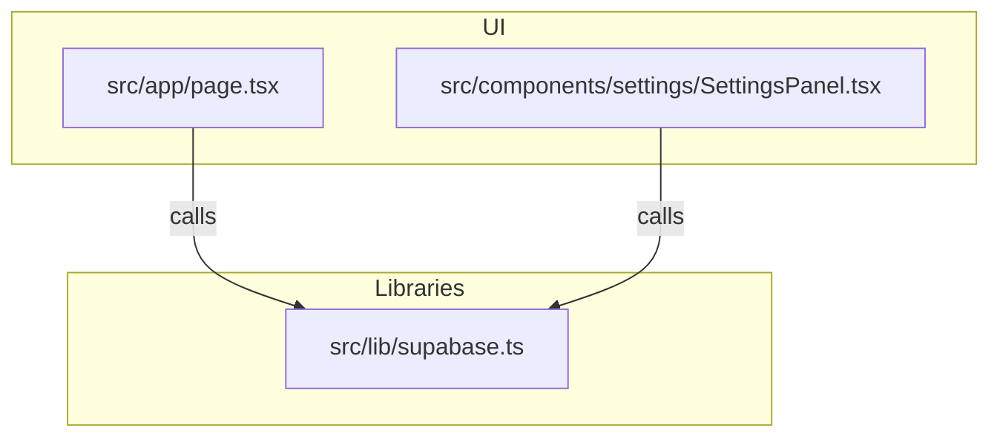
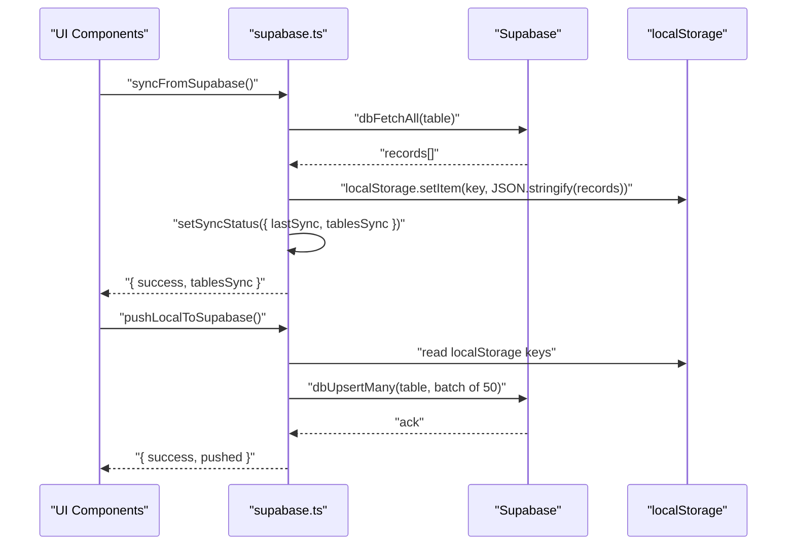
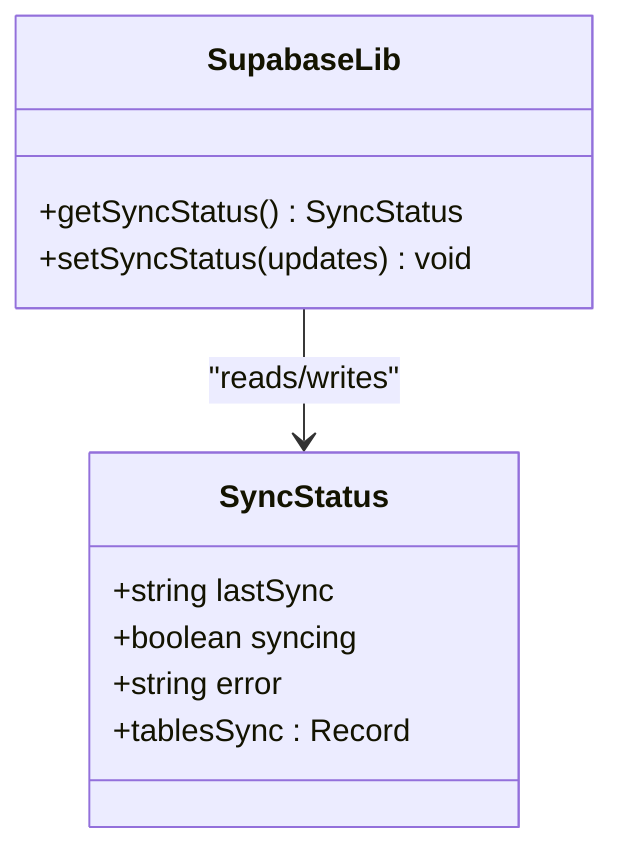
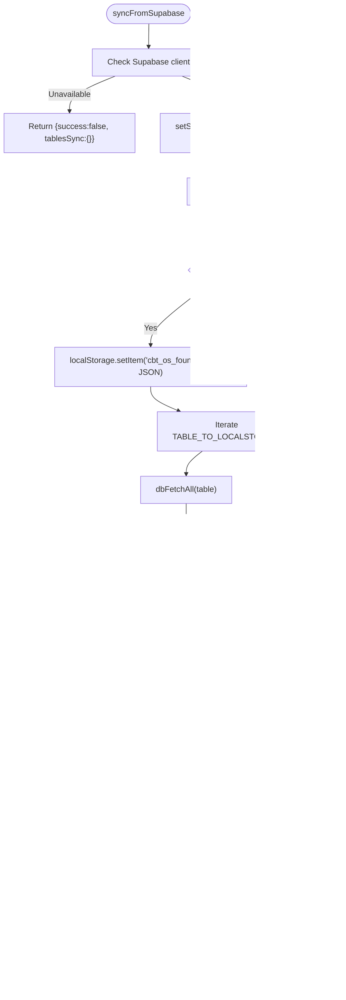
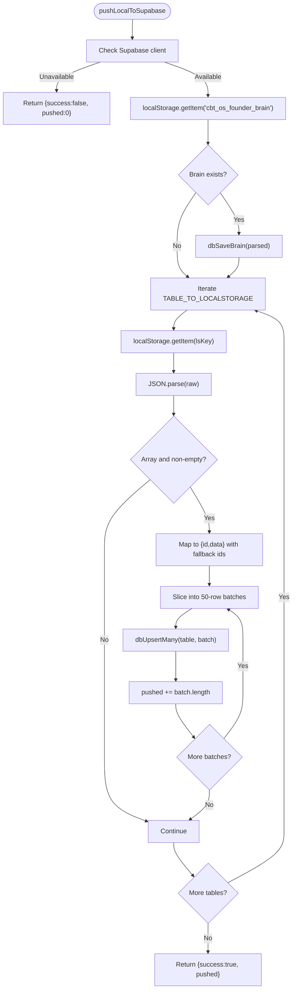
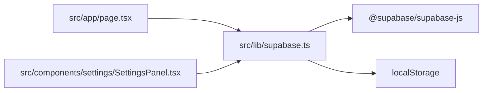

# Sync Engine

<cite>
**Referenced Files in This Document**
- [supabase.ts](file://src/lib/supabase.ts)
- [SettingsPanel.tsx](file://src/components/settings/SettingsPanel.tsx)
- [page.tsx](file://src/app/page.tsx)
</cite>

## Table of Contents
1. [Introduction](#introduction)
2. [Project Structure](#project-structure)
3. [Core Components](#core-components)
4. [Architecture Overview](#architecture-overview)
5. [Detailed Component Analysis](#detailed-component-analysis)
6. [Dependency Analysis](#dependency-analysis)
7. [Performance Considerations](#performance-considerations)
8. [Troubleshooting Guide](#troubleshooting-guide)
9. [Conclusion](#conclusion)
10. [Appendices](#appendices)

## Introduction
This document explains the sync engine implementation in Core Brim Tech OS, focusing on two primary functions: pulling data from Supabase into localStorage and pushing localStorage data to Supabase. It covers execution patterns, error handling, sync status tracking, batch processing for large datasets, performance optimizations, monitoring, and recovery strategies. It also documents the integration with localStorage and fallback behavior when Supabase is unavailable.

## Project Structure
The sync engine is implemented in a dedicated library module and surfaced through UI components for manual operations and automatic startup synchronization.

**Diagram sources**
- [supabase.ts](file://src/lib/supabase.ts#L155-L292)
- [page.tsx](file://src/app/page.tsx#L147-L160)
- [SettingsPanel.tsx](file://src/components/settings/SettingsPanel.tsx#L128-L142)

**Section sources**
- [supabase.ts](file://src/lib/supabase.ts#L1-L292)
- [page.tsx](file://src/app/page.tsx#L1-L253)
- [SettingsPanel.tsx](file://src/components/settings/SettingsPanel.tsx#L1-L389)

## Core Components
- Supabase client initialization and configuration checks
- Core database operations: upsert, fetch, delete, and special handling for the “founder brain”
- Sync engine: pull from Supabase to localStorage and push from localStorage to Supabase
- Sync status tracking persisted in localStorage
- Batch processing for large datasets during push operations

**Section sources**
- [supabase.ts](file://src/lib/supabase.ts#L11-L26)
- [supabase.ts](file://src/lib/supabase.ts#L57-L124)
- [supabase.ts](file://src/lib/supabase.ts#L209-L291)
- [supabase.ts](file://src/lib/supabase.ts#L168-L181)

## Architecture Overview
The sync engine follows a write-through caching model:
- Every operation writes to localStorage immediately for fast UX.
- Operations also attempt to write to Supabase for persistence and cross-device sync.
- On app startup, data is pulled from Supabase into localStorage.
- Users can manually trigger push/pull operations from the Settings panel.

**Diagram sources**
- [supabase.ts](file://src/lib/supabase.ts#L209-L246)
- [supabase.ts](file://src/lib/supabase.ts#L252-L291)
- [supabase.ts](file://src/lib/supabase.ts#L86-L97)
- [supabase.ts](file://src/lib/supabase.ts#L71-L81)

## Detailed Component Analysis

### Sync Status Tracking
The sync status is modeled as a typed object persisted in localStorage. It tracks:
- lastSync: ISO timestamp of the last successful sync
- syncing: boolean flag indicating ongoing sync
- error: last error message or null
- tablesSync: counts per table synced

**Diagram sources**
- [supabase.ts](file://src/lib/supabase.ts#L159-L181)

**Section sources**
- [supabase.ts](file://src/lib/supabase.ts#L159-L181)

### syncFromSupabase
Purpose:
- Pull all arrays and the “founder brain” from Supabase into localStorage on app load.

Execution pattern:
- Sets syncing flag and clears previous errors.
- Loads “founder brain” if present.
- Iterates over mapped tables and fetches all records.
- Writes fetched arrays to corresponding localStorage keys.
- Updates sync status with completion metadata.

Error handling:
- Catches exceptions, sets error state, and returns failure result.

**Diagram sources**
- [supabase.ts](file://src/lib/supabase.ts#L209-L246)
- [supabase.ts](file://src/lib/supabase.ts#L184-L203)
- [supabase.ts](file://src/lib/supabase.ts#L145-L153)
- [supabase.ts](file://src/lib/supabase.ts#L86-L97)

**Section sources**
- [supabase.ts](file://src/lib/supabase.ts#L209-L246)

### pushLocalToSupabase
Purpose:
- Migrate existing localStorage data to Supabase for the first-time setup.

Execution pattern:
- Reads “founder brain” and saves to Supabase.
- Iterates over mapped tables, reads arrays from localStorage, and upserts to Supabase.
- Applies a 50-record batch limit per upsert operation.

Batch processing:
- Slices arrays into chunks of 50 and calls dbUpsertMany for each chunk.
- Tracks total records pushed.

Error handling:
- Catches exceptions, logs to console, and returns failure result.

**Diagram sources**
- [supabase.ts](file://src/lib/supabase.ts#L252-L291)
- [supabase.ts](file://src/lib/supabase.ts#L267-L284)
- [supabase.ts](file://src/lib/supabase.ts#L273-L283)
- [supabase.ts](file://src/lib/supabase.ts#L129-L143)
- [supabase.ts](file://src/lib/supabase.ts#L71-L81)

**Section sources**
- [supabase.ts](file://src/lib/supabase.ts#L252-L291)

### Core Database Operations
- dbUpsert(table, id, data): Upserts a single record; falls back gracefully if Supabase is unavailable.
- dbUpsertMany(table, records[]): Upserts multiple records; falls back gracefully if Supabase is unavailable.
- dbFetchAll(table): Fetches all records ordered by creation time; returns empty array if unavailable.
- dbFetchOne(table, id): Fetches a single record by id; returns null if unavailable.
- dbDelete(table, id): Deletes a record; falls back gracefully if unavailable.
- dbSaveBrain(data): Upserts the “founder brain” record with update semantics.
- dbLoadBrain(): Loads the “founder brain” record; returns null if unavailable.

Error handling:
- Operations log warnings to console and return safe defaults when Supabase is unavailable.

**Section sources**
- [supabase.ts](file://src/lib/supabase.ts#L57-L124)
- [supabase.ts](file://src/lib/supabase.ts#L129-L153)

### UI Integration and Manual Sync Controls
- Settings panel exposes buttons to:
  - Push local data to Supabase (one-time migration)
  - Pull cloud data to local storage (device sync)
- The main page runs syncFromSupabase on startup and displays a status bar with retry capability.

**Section sources**
- [SettingsPanel.tsx](file://src/components/settings/SettingsPanel.tsx#L128-L142)
- [page.tsx](file://src/app/page.tsx#L147-L160)

## Dependency Analysis
- supabase.ts depends on:
  - @supabase/supabase-js client
  - localStorage for persistence and status tracking
  - Internal mapping of table names to localStorage keys
- UI components depend on supabase.ts for:
  - Running sync operations
  - Reading and updating sync status

**Diagram sources**
- [supabase.ts](file://src/lib/supabase.ts#L5-L21)
- [page.tsx](file://src/app/page.tsx#L5)
- [SettingsPanel.tsx](file://src/components/settings/SettingsPanel.tsx#L10-L12)

**Section sources**
- [supabase.ts](file://src/lib/supabase.ts#L5-L21)
- [page.tsx](file://src/app/page.tsx#L5)
- [SettingsPanel.tsx](file://src/components/settings/SettingsPanel.tsx#L10-L12)

## Performance Considerations
- Batch size: pushLocalToSupabase uses a 50-record batch limit for upsert operations to balance throughput and reliability.
- Write-through cache: All operations write to localStorage immediately, minimizing latency and ensuring offline readiness.
- Selective fetch ordering: dbFetchAll orders by created_at descending to prioritize recent data.
- Graceful degradation: When Supabase is unavailable, operations still succeed locally and can be retried later.

Optimization opportunities:
- Parallelize table syncs in syncFromSupabase for improved startup time.
- Add exponential backoff for retries on transient failures.
- Consider incremental syncs by tracking lastSync timestamps per table.

**Section sources**
- [supabase.ts](file://src/lib/supabase.ts#L278-L283)
- [supabase.ts](file://src/lib/supabase.ts#L86-L97)
- [supabase.ts](file://src/lib/supabase.ts#L213-L238)

## Troubleshooting Guide
Common issues and resolutions:
- Supabase not configured:
  - Symptom: Sync status shows offline; push/sync buttons disabled.
  - Resolution: Add NEXT_PUBLIC_SUPABASE_URL and NEXT_PUBLIC_SUPABASE_ANON_KEY to .env.local and restart the dev server.
- Sync fails with an error:
  - Symptom: Sync status shows error; retry button available.
  - Resolution: Check network connectivity, Supabase dashboard status, and credentials. Retry after fixing.
- Large dataset push timeouts:
  - Symptom: Slow progress or partial uploads.
  - Resolution: Ensure stable network; consider reducing concurrent operations or batching strategy.
- Data not appearing on new device:
  - Symptom: Fresh device lacks data.
  - Resolution: Run “Pull from Supabase” in Settings to sync from cloud to localStorage.

Monitoring sync health:
- Use the status bar in the main page to observe last sync time and error state.
- Inspect localStorage key for sync status to confirm lastSync and tablesSync counts.
- In Settings, review push/sync results and retry actions.

Recovery mechanisms:
- Retry sync on demand via the status bar or Settings controls.
- Re-run pushLocalToSupabase after initial setup to migrate existing data.
- Clear localStorage keys selectively if corrupted data is suspected; re-sync from Supabase.

**Section sources**
- [SettingsPanel.tsx](file://src/components/settings/SettingsPanel.tsx#L295-L341)
- [page.tsx](file://src/app/page.tsx#L41-L62)
- [supabase.ts](file://src/lib/supabase.ts#L168-L181)

## Conclusion
The sync engine in Core Brim Tech OS provides a robust, resilient, and user-friendly mechanism for keeping data synchronized across devices. It combines immediate write-through caching with asynchronous persistence to Supabase, offers explicit manual controls, and maintains a clear sync status for monitoring and recovery. The 50-record batch limit during push operations balances performance and reliability, while graceful fallback ensures continued functionality when Supabase is unavailable.

## Appendices

### Practical Sync Workflows
- First-time setup:
  - Configure Supabase credentials in .env.local and restart the dev server.
  - In Settings, run “Push to Supabase” to migrate existing localStorage data.
- Switching devices:
  - On the new device, run “Pull from Supabase” to sync all data from Supabase to localStorage.
- Daily sync:
  - Launch the app; syncFromSupabase runs automatically to refresh data from Supabase.

### Sync Status Monitoring UI
- Status bar shows:
  - Offline when Supabase is not configured
  - Syncing... during active sync
  - Error with retry option when sync fails
  - Human-readable “Synced X time ago” otherwise

**Section sources**
- [page.tsx](file://src/app/page.tsx#L41-L62)