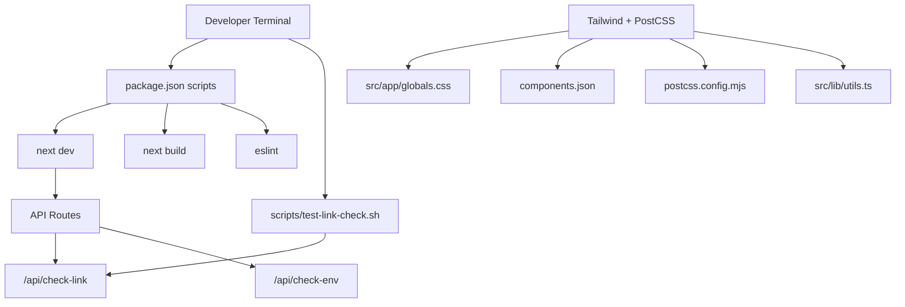
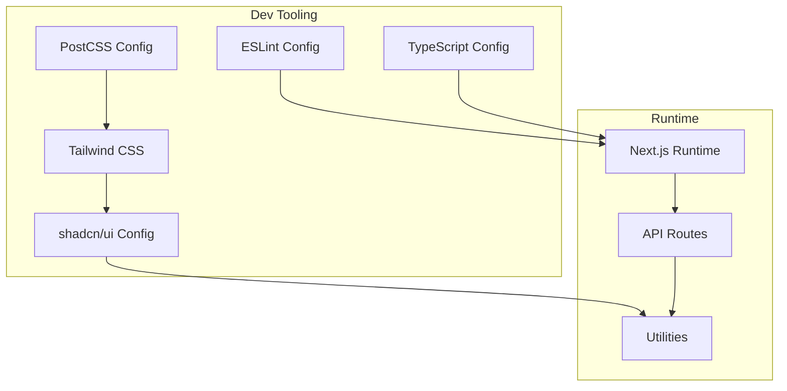
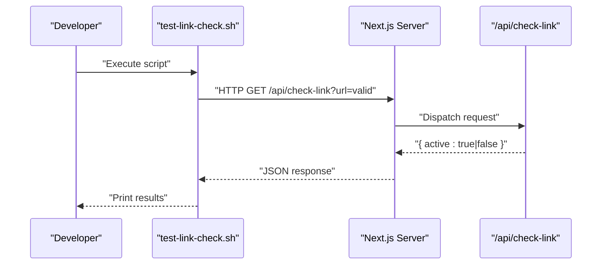
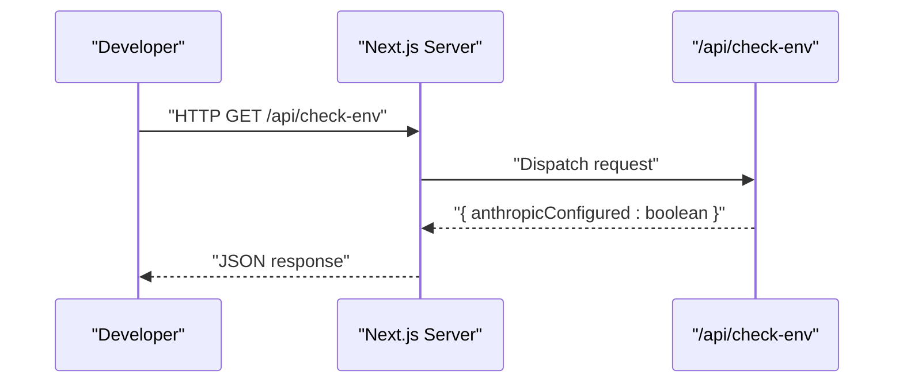
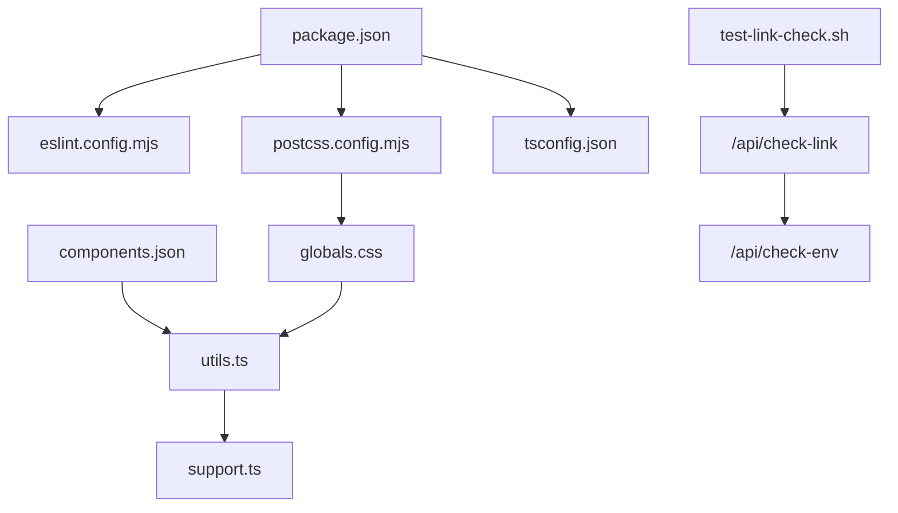

# Development Tools

<cite>
**Referenced Files in This Document**
- [package.json](file://package.json)
- [eslint.config.mjs](file://eslint.config.mjs)
- [postcss.config.mjs](file://postcss.config.mjs)
- [components.json](file://components.json)
- [next.config.ts](file://next.config.ts)
- [scripts/test-link-check.sh](file://scripts/test-link-check.sh)
- [src/app/api/check-link/route.ts](file://src/app/api/check-link/route.ts)
- [src/app/api/check-env/route.ts](file://src/app/api/check-env/route.ts)
- [src/app/globals.css](file://src/app/globals.css)
- [src/lib/utils.ts](file://src/lib/utils.ts)
- [src/lib/support.ts](file://src/lib/support.ts)
- [tsconfig.json](file://tsconfig.json)
- [README.md](file://README.md)
</cite>

## Table of Contents
1. [Introduction](#introduction)
2. [Project Structure](#project-structure)
3. [Core Components](#core-components)
4. [Architecture Overview](#architecture-overview)
5. [Detailed Component Analysis](#detailed-component-analysis)
6. [Dependency Analysis](#dependency-analysis)
7. [Performance Considerations](#performance-considerations)
8. [Troubleshooting Guide](#troubleshooting-guide)
9. [Contribution Guidelines and Release Management](#contribution-guidelines-and-release-management)
10. [Conclusion](#conclusion)

## Introduction
This document describes the development tools and workflows for Core Brim Tech OS. It covers:
- Testing utilities, including the link checker script and the automated endpoint it exercises
- Code quality enforcement via ESLint configuration for TypeScript and React
- CSS processing with PostCSS and Tailwind v4
- UI component configuration for shadcn/ui integration
- Development workflow best practices, debugging techniques, and performance profiling guidance
- Contribution guidelines, code review processes, and release management procedures

## Project Structure
The project is a Next.js application configured with Tailwind CSS v4, shadcn/ui, and TypeScript. Key development tooling is centralized in configuration files and a small set of scripts.

**Diagram sources**
- [package.json](file://package.json#L5-L10)
- [scripts/test-link-check.sh](file://scripts/test-link-check.sh#L1-L12)
- [src/app/api/check-link/route.ts](file://src/app/api/check-link/route.ts#L1-L43)
- [src/app/api/check-env/route.ts](file://src/app/api/check-env/route.ts#L1-L13)
- [src/app/globals.css](file://src/app/globals.css#L1-L59)
- [components.json](file://components.json#L1-L24)
- [postcss.config.mjs](file://postcss.config.mjs#L1-L8)
- [src/lib/utils.ts](file://src/lib/utils.ts#L1-L7)

**Section sources**
- [package.json](file://package.json#L1-L36)
- [README.md](file://README.md#L1-L37)

## Core Components
- Development scripts: dev, build, start, lint
- ESLint configuration combining Next.js core web vitals and TypeScript rulesets
- PostCSS configuration integrating Tailwind v4
- Tailwind setup via CSS imports and layer directives
- UI component framework configured for shadcn/ui with aliases and registry defaults
- Utility helpers for class merging and component composition
- Support libraries for local-first data and system notifications

**Section sources**
- [package.json](file://package.json#L5-L10)
- [eslint.config.mjs](file://eslint.config.mjs#L1-L19)
- [postcss.config.mjs](file://postcss.config.mjs#L1-L8)
- [components.json](file://components.json#L1-L24)
- [src/app/globals.css](file://src/app/globals.css#L1-L59)
- [src/lib/utils.ts](file://src/lib/utils.ts#L1-L7)
- [src/lib/support.ts](file://src/lib/support.ts#L1-L753)

## Architecture Overview
The development toolchain centers on Next.js runtime, with code quality enforced by ESLint and CSS processed through PostCSS/Tailwind v4. The link checker utility validates external URLs via a dedicated API route, enabling quick smoke tests during development.

**Diagram sources**
- [eslint.config.mjs](file://eslint.config.mjs#L1-L19)
- [tsconfig.json](file://tsconfig.json#L1-L35)
- [postcss.config.mjs](file://postcss.config.mjs#L1-L8)
- [components.json](file://components.json#L1-L24)
- [src/app/globals.css](file://src/app/globals.css#L1-L59)
- [src/lib/utils.ts](file://src/lib/utils.ts#L1-L7)
- [src/app/api/check-link/route.ts](file://src/app/api/check-link/route.ts#L1-L43)

## Detailed Component Analysis

### Link Checker Script and Endpoint
The link checker script automates verification of external URLs against the link-check API endpoint. It demonstrates:
- Running the dev server locally
- Calling the endpoint with a live URL and an invalid URL
- Observing the returned active flag

**Diagram sources**
- [scripts/test-link-check.sh](file://scripts/test-link-check.sh#L1-L12)
- [src/app/api/check-link/route.ts](file://src/app/api/check-link/route.ts#L1-L43)

**Section sources**
- [scripts/test-link-check.sh](file://scripts/test-link-check.sh#L1-L12)
- [src/app/api/check-link/route.ts](file://src/app/api/check-link/route.ts#L1-L43)

### Environment Health Check Endpoint
The environment health endpoint verifies whether required environment variables are configured. It is useful for ensuring local development prerequisites are met.

**Diagram sources**
- [src/app/api/check-env/route.ts](file://src/app/api/check-env/route.ts#L1-L13)

**Section sources**
- [src/app/api/check-env/route.ts](file://src/app/api/check-env/route.ts#L1-L13)

### ESLint Configuration for TypeScript and React
The ESLint configuration composes Next.js core web vitals and TypeScript presets, overriding default ignores to include development artifacts and build outputs as needed.

Key characteristics:
- Uses Next.js ESLint presets for React and TypeScript
- Overrides global ignores to tailor coverage for this project
- Exports a single ESLint configuration array

**Section sources**
- [eslint.config.mjs](file://eslint.config.mjs#L1-L19)

### PostCSS and Tailwind v4 Setup
Tailwind CSS v4 is integrated via PostCSS. The configuration enables Tailwind’s plugin and the stylesheet is imported at the application root with Tailwind layers and custom utilities.

Highlights:
- PostCSS plugin for Tailwind v4
- Root CSS import with Tailwind base and utilities layers
- Custom scrollbar styles and line clamp utilities
- Tailwind CSS variable usage for colors

**Section sources**
- [postcss.config.mjs](file://postcss.config.mjs#L1-L8)
- [src/app/globals.css](file://src/app/globals.css#L1-L59)

### UI Component Configuration (shadcn/ui)
The UI library is configured for RSC, TSX, and a specific style palette. Aliases streamline imports across components, utilities, and hooks. The Tailwind configuration points to the global stylesheet.

Configuration highlights:
- Style: New York
- RSC and TSX enabled
- Tailwind CSS path and base color
- Icon library: Lucide
- Aliases for components, utils, ui, lib, hooks
- No registries configured

**Section sources**
- [components.json](file://components.json#L1-L24)

### Utilities and Helpers
Utility functions consolidate class merging and component composition, while the support library provides local-first data structures and system notifications.

- Class merging utility: merges Tailwind classes safely
- Support library: manages wins, knowledge base, SOPs, notifications, templates, scheduler, and export/import utilities

**Section sources**
- [src/lib/utils.ts](file://src/lib/utils.ts#L1-L7)
- [src/lib/support.ts](file://src/lib/support.ts#L1-L753)

### TypeScript Configuration
TypeScript is configured with strictness, ES target, JSX transform, bundler module resolution, and path mapping to src. Includes Next-specific compiler plugins and path aliases.

**Section sources**
- [tsconfig.json](file://tsconfig.json#L1-L35)

## Dependency Analysis
The project relies on Next.js, React, Tailwind CSS v4, and shadcn/ui. Development tooling integrates ESLint and PostCSS. The link checker depends on the API route and environment health route.

**Diagram sources**
- [package.json](file://package.json#L1-L36)
- [eslint.config.mjs](file://eslint.config.mjs#L1-L19)
- [postcss.config.mjs](file://postcss.config.mjs#L1-L8)
- [components.json](file://components.json#L1-L24)
- [tsconfig.json](file://tsconfig.json#L1-L35)
- [src/app/globals.css](file://src/app/globals.css#L1-L59)
- [src/lib/utils.ts](file://src/lib/utils.ts#L1-L7)
- [src/lib/support.ts](file://src/lib/support.ts#L1-L753)
- [src/app/api/check-link/route.ts](file://src/app/api/check-link/route.ts#L1-L43)
- [src/app/api/check-env/route.ts](file://src/app/api/check-env/route.ts#L1-L13)
- [scripts/test-link-check.sh](file://scripts/test-link-check.sh#L1-L12)

**Section sources**
- [package.json](file://package.json#L1-L36)

## Performance Considerations
- Use the Next.js dev server for iterative development and hot reloading.
- Prefer lightweight UI components and avoid unnecessary re-renders by leveraging memoization and stable prop references.
- Keep CSS scoped and avoid excessive Tailwind utilities that increase bundle size.
- Profile client-side rendering with browser developer tools and monitor network requests to external domains when using the link checker.
- For production builds, rely on Next.js build optimizations and ensure Tailwind purging is configured appropriately in a full-stack deployment.

[No sources needed since this section provides general guidance]

## Troubleshooting Guide
Common issues and remedies:
- Link checker returns inactive for valid URLs
  - Verify the dev server is running and reachable at the configured base URL.
  - Confirm the endpoint accepts HTTP/HTTPS URLs and respects HEAD/GET fallback logic.
- Environment health endpoint indicates missing configuration
  - Ensure required environment variables are present and not placeholders.
- CSS not applying as expected
  - Confirm Tailwind layers and global CSS imports are present.
  - Verify PostCSS plugin is loaded and Tailwind v4 is installed.
- ESLint errors in TypeScript/React files
  - Run the linter and address reported issues; ensure the ESLint configuration matches project needs.

**Section sources**
- [scripts/test-link-check.sh](file://scripts/test-link-check.sh#L1-L12)
- [src/app/api/check-link/route.ts](file://src/app/api/check-link/route.ts#L1-L43)
- [src/app/api/check-env/route.ts](file://src/app/api/check-env/route.ts#L1-L13)
- [src/app/globals.css](file://src/app/globals.css#L1-L59)
- [postcss.config.mjs](file://postcss.config.mjs#L1-L8)
- [eslint.config.mjs](file://eslint.config.mjs#L1-L19)

## Contribution Guidelines and Release Management
- Development workflow
  - Start the dev server using the provided scripts.
  - Run the link checker script to validate external link handling.
  - Enforce code quality with the linter before committing.
- Debugging
  - Use the environment health endpoint to verify service prerequisites.
  - Inspect network tab for link-check requests and timeouts.
  - Leverage browser devtools for component inspection and performance profiling.
- Code review processes
  - Ensure all changes pass linting and local tests.
  - Include rationale for configuration changes (e.g., ESLint overrides, PostCSS plugins).
  - Verify UI changes align with shadcn/ui conventions and Tailwind usage.
- Release management
  - Build the project using the build script prior to deployment.
  - Validate environment variables and endpoint readiness in staging.
  - Tag releases and document breaking changes in the changelog.

**Section sources**
- [package.json](file://package.json#L5-L10)
- [README.md](file://README.md#L1-L37)
- [scripts/test-link-check.sh](file://scripts/test-link-check.sh#L1-L12)
- [src/app/api/check-env/route.ts](file://src/app/api/check-env/route.ts#L1-L13)
- [eslint.config.mjs](file://eslint.config.mjs#L1-L19)
- [postcss.config.mjs](file://postcss.config.mjs#L1-L8)
- [components.json](file://components.json#L1-L24)

## Conclusion
Core Brim Tech OS leverages Next.js, Tailwind CSS v4, and shadcn/ui for a modern, maintainable frontend stack. The development toolchain emphasizes automated checks (link validation), code quality (ESLint), and efficient CSS processing (PostCSS). By following the documented workflows and best practices, contributors can maintain consistency, reliability, and performance across the codebase.

[No sources needed since this section summarizes without analyzing specific files]