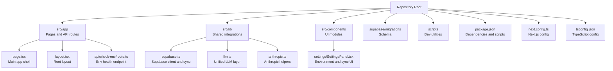
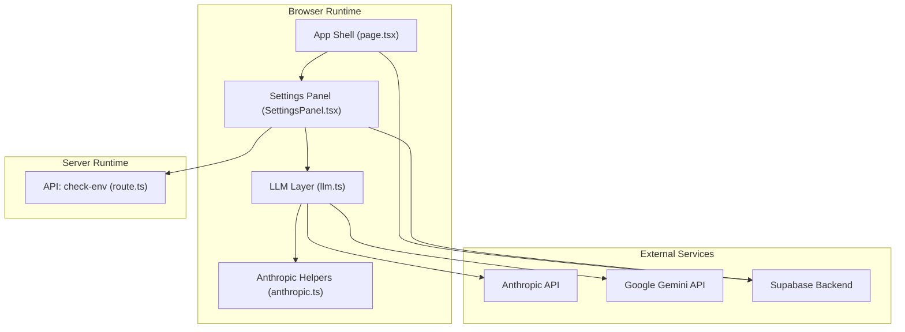
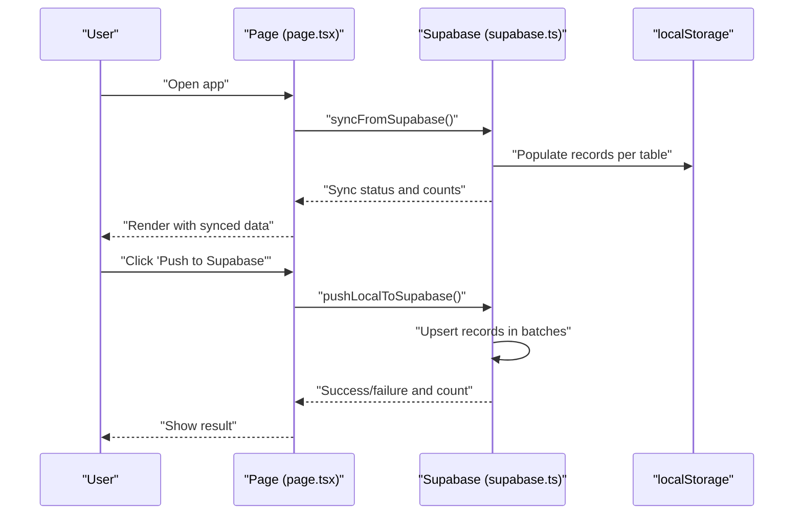
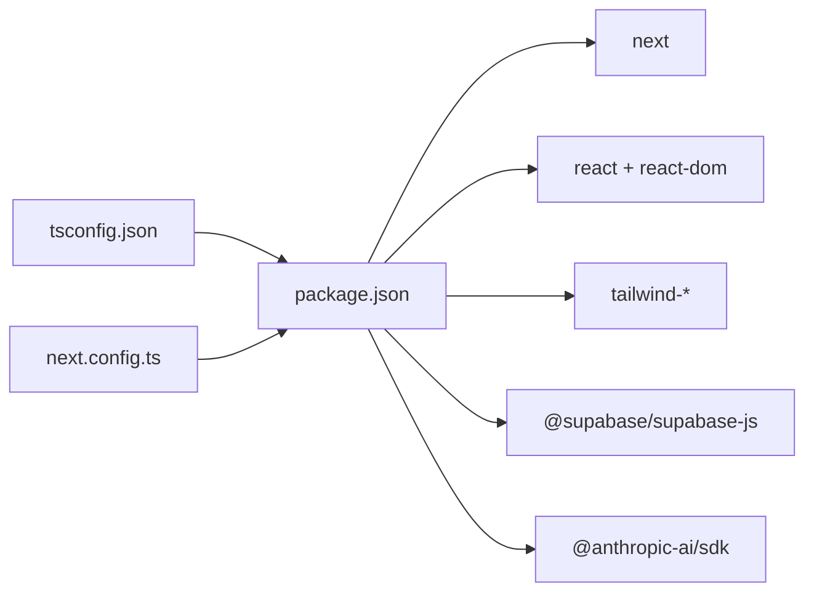

# Getting Started

<cite>
**Referenced Files in This Document**
- [README.md](file://README.md)
- [package.json](file://package.json)
- [next.config.ts](file://next.config.ts)
- [tsconfig.json](file://tsconfig.json)
- [src/app/page.tsx](file://src/app/page.tsx)
- [src/app/layout.tsx](file://src/app/layout.tsx)
- [src/app/api/check-env/route.ts](file://src/app/api/check-env/route.ts)
- [src/lib/supabase.ts](file://src/lib/supabase.ts)
- [src/lib/llm.ts](file://src/lib/llm.ts)
- [src/lib/anthropic.ts](file://src/lib/anthropic.ts)
- [src/components/settings/SettingsPanel.tsx](file://src/components/settings/SettingsPanel.tsx)
- [supabase/migrations/20250228_add_support_tables.sql](file://supabase/migrations/20250228_add_support_tables.sql)
- [scripts/test-link-check.sh](file://scripts/test-link-check.sh)
</cite>

## Table of Contents
1. [Introduction](#introduction)
2. [Project Structure](#project-structure)
3. [Core Components](#core-components)
4. [Architecture Overview](#architecture-overview)
5. [Detailed Component Analysis](#detailed-component-analysis)
6. [Dependency Analysis](#dependency-analysis)
7. [Performance Considerations](#performance-considerations)
8. [Troubleshooting Guide](#troubleshooting-guide)
9. [Conclusion](#conclusion)
10. [Appendices](#appendices)

## Introduction
This guide helps you install and run Core Brim Tech OS locally, configure environment variables for AI providers and Supabase, and verify your setup. The project is a Next.js application with TypeScript and Tailwind CSS. It integrates:
- AI providers (Anthropic Claude and Google Gemini) for language model features
- Supabase for persistence and cross-device synchronization

You will clone the repository, install dependencies, configure environment variables, start the development server, and verify that AI and database integrations are working.

## Project Structure
At a high level, the project consists of:
- Application pages and routing under src/app
- Shared libraries for Supabase and LLM integrations under src/lib
- UI components under src/components
- Supabase schema migrations under supabase/migrations
- Scripts for testing under scripts

**Diagram sources**
- [src/app/page.tsx](file://src/app/page.tsx#L1-L253)
- [src/app/layout.tsx](file://src/app/layout.tsx#L1-L22)
- [src/app/api/check-env/route.ts](file://src/app/api/check-env/route.ts#L1-L13)
- [src/lib/supabase.ts](file://src/lib/supabase.ts#L1-L292)
- [src/lib/llm.ts](file://src/lib/llm.ts#L1-L135)
- [src/lib/anthropic.ts](file://src/lib/anthropic.ts#L1-L32)
- [src/components/settings/SettingsPanel.tsx](file://src/components/settings/SettingsPanel.tsx#L1-L389)
- [supabase/migrations/20250228_add_support_tables.sql](file://supabase/migrations/20250228_add_support_tables.sql#L1-L46)
- [package.json](file://package.json#L1-L36)
- [next.config.ts](file://next.config.ts#L1-L8)
- [tsconfig.json](file://tsconfig.json#L1-L35)

**Section sources**
- [README.md](file://README.md#L1-L37)
- [package.json](file://package.json#L1-L36)
- [next.config.ts](file://next.config.ts#L1-L8)
- [tsconfig.json](file://tsconfig.json#L1-L35)

## Core Components
- Supabase integration: Provides a client, table definitions, and a write-through sync mechanism between localStorage and Supabase.
- LLM layer: Unified provider selection for Claude and Google (Gemini), with storage of keys in localStorage and preference handling.
- Environment health check: Exposes a simple API to detect if an Anthropic key is configured.
- Settings panel: UI to configure environment variables, paste API keys, select a preferred provider, and manage Supabase sync.

Key responsibilities:
- Supabase client initialization and configuration detection
- Sync engine to pull/push data between localStorage and Supabase
- Provider-agnostic LLM completion with timeouts and error handling
- Developer-friendly environment configuration and status display

**Section sources**
- [src/lib/supabase.ts](file://src/lib/supabase.ts#L1-L292)
- [src/lib/llm.ts](file://src/lib/llm.ts#L1-L135)
- [src/app/api/check-env/route.ts](file://src/app/api/check-env/route.ts#L1-L13)
- [src/components/settings/SettingsPanel.tsx](file://src/components/settings/SettingsPanel.tsx#L1-L389)

## Architecture Overview
The runtime architecture ties together the UI shell, environment configuration, AI providers, and Supabase persistence.

**Diagram sources**
- [src/app/page.tsx](file://src/app/page.tsx#L1-L253)
- [src/components/settings/SettingsPanel.tsx](file://src/components/settings/SettingsPanel.tsx#L1-L389)
- [src/lib/llm.ts](file://src/lib/llm.ts#L1-L135)
- [src/lib/anthropic.ts](file://src/lib/anthropic.ts#L1-L32)
- [src/app/api/check-env/route.ts](file://src/app/api/check-env/route.ts#L1-L13)
- [src/lib/supabase.ts](file://src/lib/supabase.ts#L1-L292)

## Detailed Component Analysis

### Prerequisites and Setup
- Node.js: The project uses modern JavaScript/TypeScript features and Next.js. Ensure you have a compatible Node.js version installed. The repository does not specify a minimum Node version; use a recent LTS version recommended by the Node.js project.
- Package managers: The project supports npm, yarn, pnpm, and bun. Choose one you prefer.
- Git: Clone the repository using git.

Verification steps:
- Confirm you can run the development server with your chosen package manager.

**Section sources**
- [README.md](file://README.md#L3-L17)
- [package.json](file://package.json#L5-L10)

### Installation Steps
1. Clone the repository and navigate into the project directory.
2. Install dependencies using your preferred package manager:
   - npm: npm install
   - yarn: yarn install
   - pnpm: pnpm install
   - bun: bun install
3. Create a local environment file:
   - Copy the template shown in the Settings panel instructions to .env.local in the project root.
   - Add Supabase project URL and anonymous key (NEXT_PUBLIC_SUPABASE_URL, NEXT_PUBLIC_SUPABASE_ANON_KEY).
   - Add Anthropic API key (ANTHROPIC_API_KEY) if you plan to use Claude.
4. Restart the development server after editing .env.local.

Port and access:
- The development server runs on http://localhost:3000 by default. Open this URL in your browser.

Verification:
- The Settings panel displays current environment status and indicates whether Supabase and Anthropic are configured.
- The API endpoint /api/check-env returns whether an Anthropic key is configured.

**Section sources**
- [README.md](file://README.md#L5-L17)
- [src/components/settings/SettingsPanel.tsx](file://src/components/settings/SettingsPanel.tsx#L158-L196)
- [src/app/api/check-env/route.ts](file://src/app/api/check-env/route.ts#L1-L13)

### Environment Variables Reference
- Supabase
  - NEXT_PUBLIC_SUPABASE_URL: Supabase project URL
  - NEXT_PUBLIC_SUPABASE_ANON_KEY: Supabase anonymous key
- AI Providers
  - ANTHROPIC_API_KEY: Anthropic Claude API key (optional if using Google)
  - Preferred provider: Selected in the Settings panel; keys are stored in browser localStorage for quick testing

Notes:
- Only NEXT_PUBLIC_ prefixed variables are available client-side. Sensitive keys like ANTHROPIC_API_KEY are not exposed to the client.
- The Settings panel also allows pasting keys directly in the browser (stored in localStorage) for quick local testing.

**Section sources**
- [src/lib/supabase.ts](file://src/lib/supabase.ts#L14-L26)
- [src/lib/llm.ts](file://src/lib/llm.ts#L6-L33)
- [src/components/settings/SettingsPanel.tsx](file://src/components/settings/SettingsPanel.tsx#L166-L176)

### Supabase Setup and Schema
- Create a Supabase project at supabase.com.
- Apply the provided schema using the SQL Editor:
  - Path: supabase/migrations/20250228_add_support_tables.sql
  - Paste and run the SQL script to create support tables.
- Copy the Project URL and Anonymous Key from Supabase → Project → Settings → API.
- Add them to .env.local and restart the dev server.
- Use the Settings panel to push local data to Supabase (one-time migration) and pull from Supabase on new devices.

**Section sources**
- [src/lib/supabase.ts](file://src/lib/supabase.ts#L1-L292)
- [supabase/migrations/20250228_add_support_tables.sql](file://supabase/migrations/20250228_add_support_tables.sql#L1-L46)
- [src/components/settings/SettingsPanel.tsx](file://src/components/settings/SettingsPanel.tsx#L295-L305)

### Development Server Startup
- Start the development server with your chosen package manager:
  - npm run dev
  - yarn dev
  - pnpm dev
  - bun dev
- Open http://localhost:3000 in your browser.
- The app initializes and attempts to sync with Supabase on load.

**Section sources**
- [README.md](file://README.md#L5-L17)
- [src/app/page.tsx](file://src/app/page.tsx#L133-L160)

### AI Provider Configuration
- Preferred provider selection:
  - Choose between Claude (Anthropic) and Google (Gemini) in the Settings panel.
- Keys:
  - Option 1: Store ANTHROPIC_API_KEY in .env.local (recommended for production).
  - Option 2: Paste the key in the Settings panel (stored in localStorage for convenience).
- Usage:
  - Skills and Cost Optimizer use the preferred provider.
  - Some features (e.g., research, hackathon builder/scout) require Claude.

Timeouts and errors:
- Requests include a 120-second timeout.
- Errors are surfaced with user-friendly messages.

**Section sources**
- [src/lib/llm.ts](file://src/lib/llm.ts#L1-L135)
- [src/lib/anthropic.ts](file://src/lib/anthropic.ts#L1-L32)
- [src/components/settings/SettingsPanel.tsx](file://src/components/settings/SettingsPanel.tsx#L200-L267)

### Sync Engine Workflow
The app uses a write-through caching pattern:
- Every save writes to localStorage immediately and to Supabase persistently.
- On app load, data is pulled from Supabase and merged into localStorage.
- The Settings panel exposes explicit push/pull actions for migration and cross-device sync.

**Diagram sources**
- [src/app/page.tsx](file://src/app/page.tsx#L147-L160)
- [src/lib/supabase.ts](file://src/lib/supabase.ts#L209-L291)

**Section sources**
- [src/lib/supabase.ts](file://src/lib/supabase.ts#L155-L291)
- [src/app/page.tsx](file://src/app/page.tsx#L147-L160)

## Dependency Analysis
- Next.js runtime and build system
- React and React DOM
- UI primitives and styling (Tailwind CSS, radix-ui, lucide-react)
- Supabase client for database operations
- Anthropic SDK for Claude integration
- TypeScript configuration for strict type checking

**Diagram sources**
- [package.json](file://package.json#L11-L34)
- [tsconfig.json](file://tsconfig.json#L1-L35)
- [next.config.ts](file://next.config.ts#L1-L8)

**Section sources**
- [package.json](file://package.json#L1-L36)
- [tsconfig.json](file://tsconfig.json#L1-L35)
- [next.config.ts](file://next.config.ts#L1-L8)

## Performance Considerations
- The LLM layer enforces a 120-second timeout to avoid hanging requests during long operations.
- Supabase sync batches upserts to reduce network overhead.
- The UI uses a write-through cache to keep the interface responsive while ensuring persistence.

[No sources needed since this section provides general guidance]

## Troubleshooting Guide
Common issues and resolutions:
- Supabase not configured
  - Symptom: Offline mode indicated in the UI; sync fails.
  - Resolution: Add NEXT_PUBLIC_SUPABASE_URL and NEXT_PUBLIC_SUPABASE_ANON_KEY to .env.local and restart the dev server.
- Anthropic key missing
  - Symptom: API checks fail; some features unavailable.
  - Resolution: Add ANTHROPIC_API_KEY to .env.local or paste a key in the Settings panel.
- Port conflicts
  - Symptom: Dev server fails to start on default port.
  - Resolution: Stop the conflicting process or change the port in your Next.js configuration.
- CORS or network errors
  - Symptom: API calls fail due to network restrictions.
  - Resolution: Verify your network and proxy settings; test external connectivity to the AI providers.
- Testing links
  - Use the provided script to validate link checking endpoints: scripts/test-link-check.sh.

Verification checklist:
- Open http://localhost:3000 and confirm the UI loads.
- In Settings, verify Supabase and Anthropic statuses.
- Attempt a sync operation (pull/push) to ensure connectivity.

**Section sources**
- [src/components/settings/SettingsPanel.tsx](file://src/components/settings/SettingsPanel.tsx#L295-L305)
- [src/app/api/check-env/route.ts](file://src/app/api/check-env/route.ts#L1-L13)
- [scripts/test-link-check.sh](file://scripts/test-link-check.sh#L1-L11)

## Conclusion
You now have the essentials to install Core Brim Tech OS, configure environment variables for Supabase and AI providers, start the development server, and verify your setup. Use the Settings panel to manage keys and sync data, and consult the troubleshooting section if you encounter issues.

[No sources needed since this section summarizes without analyzing specific files]

## Appendices

### Appendix A: Environment Variable Template
- Supabase
  - NEXT_PUBLIC_SUPABASE_URL=https://xxxx.supabase.co
  - NEXT_PUBLIC_SUPABASE_ANON_KEY=eyJ...
- Anthropic
  - ANTHROPIC_API_KEY=sk-ant-...

After editing .env.local, restart the dev server.

**Section sources**
- [src/components/settings/SettingsPanel.tsx](file://src/components/settings/SettingsPanel.tsx#L166-L176)

### Appendix B: Supabase Schema Migration
- Apply the SQL script located at supabase/migrations/20250228_add_support_tables.sql in the Supabase SQL Editor.
- This creates tables for wins, knowledge base, SOPs, notifications, templates, and scheduler.

**Section sources**
- [supabase/migrations/20250228_add_support_tables.sql](file://supabase/migrations/20250228_add_support_tables.sql#L1-L46)