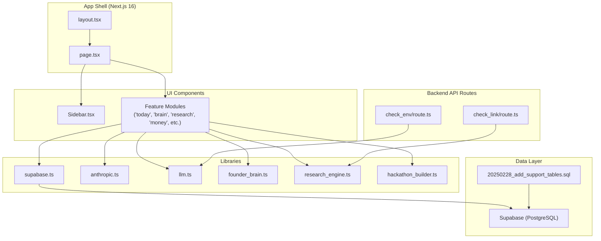
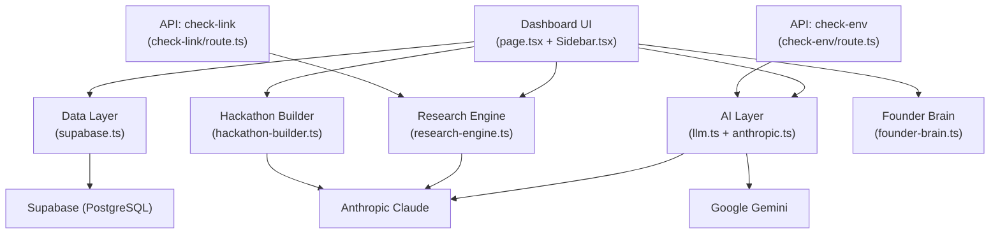
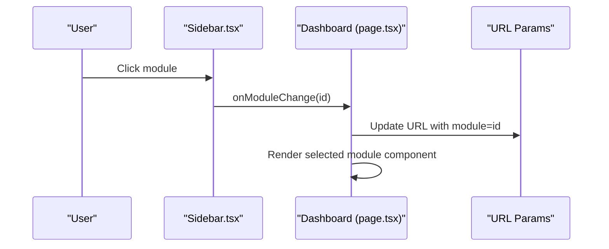
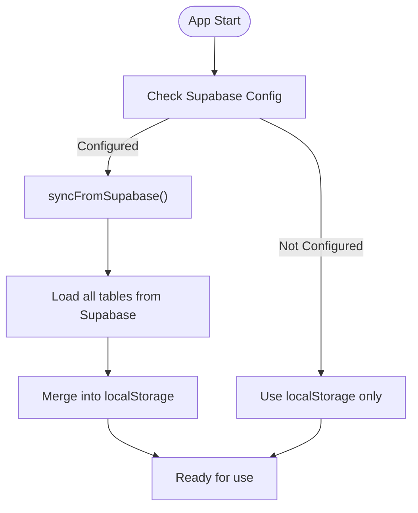
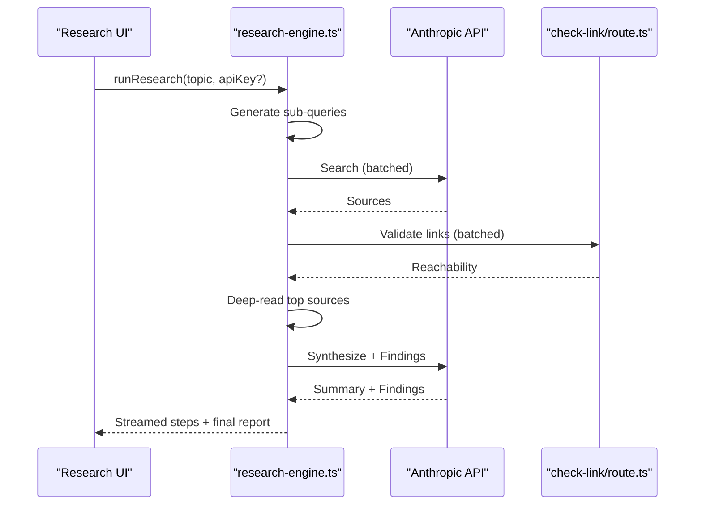
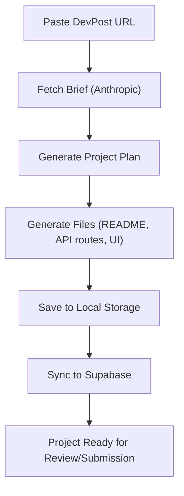
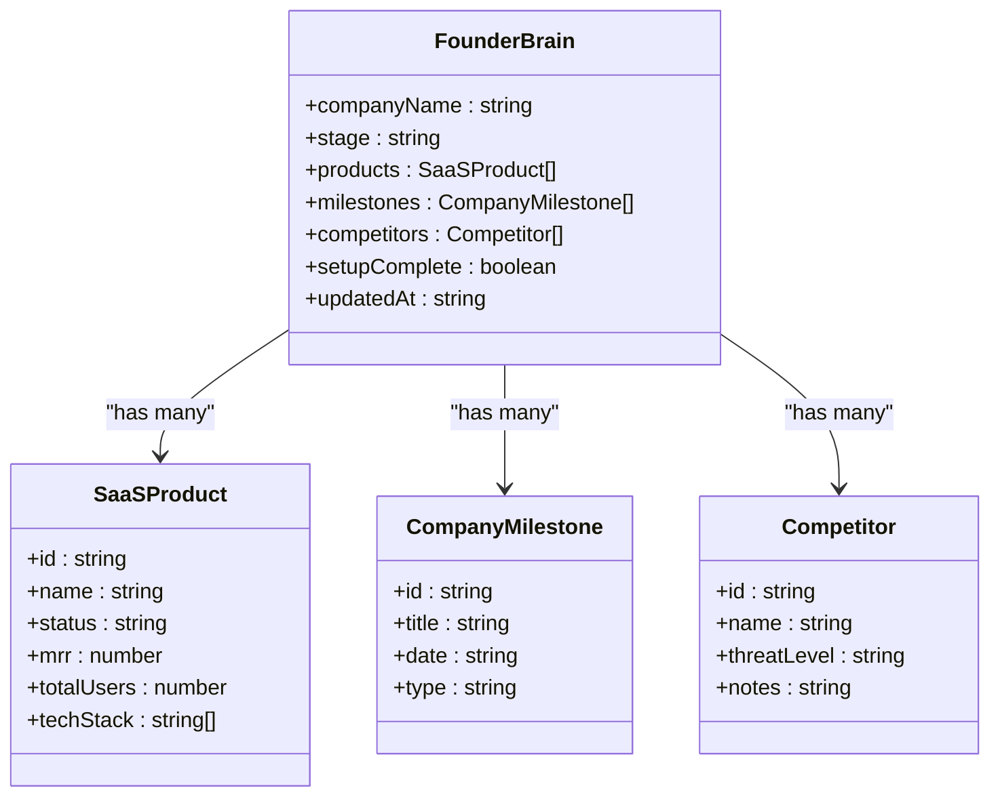
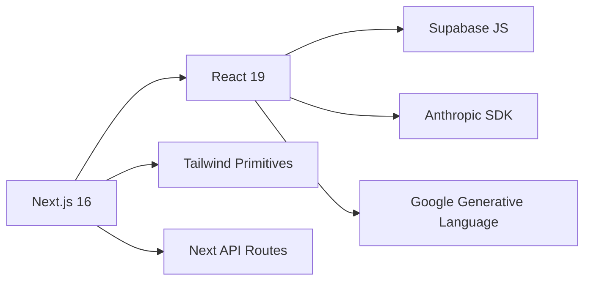

# Project Overview

<cite>
**Referenced Files in This Document**
- [README.md](file://README.md)
- [package.json](file://package.json)
- [layout.tsx](file://src/app/layout.tsx)
- [page.tsx](file://src/app/page.tsx)
- [Sidebar.tsx](file://src/components/Sidebar.tsx)
- [supabase.ts](file://src/lib/supabase.ts)
- [anthropic.ts](file://src/lib/anthropic.ts)
- [llm.ts](file://src/lib/llm.ts)
- [route.ts](file://src/app/api/check-env/route.ts)
- [route.ts](file://src/app/api/check-link/route.ts)
- [20250228_add_support_tables.sql](file://supabase/migrations/20250228_add_support_tables.sql)
- [founder-brain.ts](file://src/lib/founder-brain.ts)
- [research-engine.ts](file://src/lib/research-engine.ts)
- [hackathon-builder.ts](file://src/lib/hackathon-builder.ts)
</cite>

## Table of Contents
1. [Introduction](#introduction)
2. [Project Structure](#project-structure)
3. [Core Components](#core-components)
4. [Architecture Overview](#architecture-overview)
5. [Detailed Component Analysis](#detailed-component-analysis)
6. [Dependency Analysis](#dependency-analysis)
7. [Performance Considerations](#performance-considerations)
8. [Troubleshooting Guide](#troubleshooting-guide)
9. [Conclusion](#conclusion)

## Introduction
Core Brim Tech OS is an internal operating system designed to streamline company operations through intelligent automation and real-time collaboration. It provides a unified dashboard that integrates business intelligence, operational tools, and AI-powered automation into a cohesive platform. The system is optimized for technology companies to manage day-to-day workflows, research insights, project planning, financial tracking, and autonomous operations while maintaining a dark-mode, performance-focused UI.

Key value propositions:
- Unified dashboard for cross-functional workflows
- AI-powered automation powered by Claude and optional Google providers
- Persistent, synchronized data layer for seamless device continuity
- Intelligent research engine for deep market and competitive insights
- Autonomous project builder for hackathons and rapid prototyping
- Operational modules for goals, skills, money, and reporting

Target audience:
- Founders and executives seeking a centralized command center
- Product and engineering teams needing integrated research, planning, and execution tools
- Operations teams requiring AI-assisted automation and cost optimization

## Project Structure
The project follows a Next.js 16 App Router structure with a clear separation of concerns:
- Application shell and routing live under src/app
- UI components are modular under src/components organized by functional domains
- Libraries encapsulate shared logic for data persistence, AI integrations, and domain-specific features under src/lib
- Supabase migrations define the data schema for support modules



**Diagram sources**
- [layout.tsx](file://src/app/layout.tsx#L1-L22)
- [page.tsx](file://src/app/page.tsx#L1-L253)
- [Sidebar.tsx](file://src/components/Sidebar.tsx#L1-L170)
- [supabase.ts](file://src/lib/supabase.ts#L1-L292)
- [anthropic.ts](file://src/lib/anthropic.ts#L1-L32)
- [llm.ts](file://src/lib/llm.ts#L1-L135)
- [route.ts](file://src/app/api/check-env/route.ts#L1-L13)
- [route.ts](file://src/app/api/check-link/route.ts#L1-L43)
- [20250228_add_support_tables.sql](file://supabase/migrations/20250228_add_support_tables.sql#L1-L46)

**Section sources**
- [README.md](file://README.md#L1-L37)
- [package.json](file://package.json#L1-L36)
- [layout.tsx](file://src/app/layout.tsx#L1-L22)
- [page.tsx](file://src/app/page.tsx#L1-L253)
- [Sidebar.tsx](file://src/components/Sidebar.tsx#L1-L170)
- [supabase.ts](file://src/lib/supabase.ts#L1-L292)
- [anthropic.ts](file://src/lib/anthropic.ts#L1-L32)
- [llm.ts](file://src/lib/llm.ts#L1-L135)
- [route.ts](file://src/app/api/check-env/route.ts#L1-L13)
- [route.ts](file://src/app/api/check-link/route.ts#L1-L43)
- [20250228_add_support_tables.sql](file://supabase/migrations/20250228_add_support_tables.sql#L1-L46)

## Core Components
- Unified Dashboard: The root page composes a sidebar navigation and a content area that renders the active module. It manages URL state, synchronization status, and toast notifications.
- Data Persistence Layer: A write-through caching strategy persists data to localStorage and synchronizes with Supabase for reliability and offline readiness.
- AI Integration Layer: A unified LLM layer supports Claude and Google (Gemini) with configurable providers and timeouts.
- Intelligence Modules: Research engine, competitor intelligence, and founder brain provide structured knowledge and synthesis.
- Operational Modules: Goals & OKRs, skills, money (revenue, grants, invoices), reports, and scheduler enable day-to-day operations.
- API Routes: Environment checks and link validation routes support safe external operations.

**Section sources**
- [page.tsx](file://src/app/page.tsx#L1-L253)
- [Sidebar.tsx](file://src/components/Sidebar.tsx#L1-L170)
- [supabase.ts](file://src/lib/supabase.ts#L1-L292)
- [llm.ts](file://src/lib/llm.ts#L1-L135)
- [research-engine.ts](file://src/lib/research-engine.ts#L1-L519)
- [founder-brain.ts](file://src/lib/founder-brain.ts#L1-L213)
- [route.ts](file://src/app/api/check-env/route.ts#L1-L13)
- [route.ts](file://src/app/api/check-link/route.ts#L1-L43)

## Architecture Overview
The system architecture centers on a client-rendered Next.js 16 application with a dark UI theme. The frontend communicates with Supabase for persistence and with Anthropic (and optionally Google) for AI operations. API routes provide environment checks and link validation to maintain robustness and avoid CORS issues.



**Diagram sources**
- [page.tsx](file://src/app/page.tsx#L1-L253)
- [Sidebar.tsx](file://src/components/Sidebar.tsx#L1-L170)
- [supabase.ts](file://src/lib/supabase.ts#L1-L292)
- [llm.ts](file://src/lib/llm.ts#L1-L135)
- [anthropic.ts](file://src/lib/anthropic.ts#L1-L32)
- [research-engine.ts](file://src/lib/research-engine.ts#L1-L519)
- [hackathon-builder.ts](file://src/lib/hackathon-builder.ts#L1-L663)
- [founder-brain.ts](file://src/lib/founder-brain.ts#L1-L213)
- [route.ts](file://src/app/api/check-env/route.ts#L1-L13)
- [route.ts](file://src/app/api/check-link/route.ts#L1-L43)

## Detailed Component Analysis

### Unified Dashboard and Navigation
The dashboard orchestrates module selection, URL synchronization, and status indicators. It renders the active module and displays a sync status bar indicating last sync time, ongoing sync, or errors.



**Diagram sources**
- [page.tsx](file://src/app/page.tsx#L126-L210)
- [Sidebar.tsx](file://src/components/Sidebar.tsx#L106-L170)

**Section sources**
- [page.tsx](file://src/app/page.tsx#L1-L253)
- [Sidebar.tsx](file://src/components/Sidebar.tsx#L1-L170)

### Data Persistence and Synchronization
The data layer provides a write-through caching strategy: data is stored in localStorage for immediate responsiveness and synchronized with Supabase for persistence and multi-device continuity. It exposes CRUD-like operations and a sync engine that pulls all tables on startup and pushes local data to the cloud when migrating.



**Diagram sources**
- [supabase.ts](file://src/lib/supabase.ts#L209-L246)

**Section sources**
- [supabase.ts](file://src/lib/supabase.ts#L1-L292)
- [20250228_add_support_tables.sql](file://supabase/migrations/20250228_add_support_tables.sql#L1-L46)

### AI Integration Layer
The AI layer abstracts provider selection and requests. It supports Claude and Google (Gemini) with timeouts and error handling. It resolves the active provider based on user preferences and stored keys, ensuring robust fallback behavior.

```mermaid
classDiagram
class LLM {
+getStoredAnthropicKey() string?
+getStoredGoogleKey() string?
+getPreferredProvider() AIProvider
+setPreferredProvider(provider) void
+getActiveProvider() {provider, apiKey}?
+complete(opts) Promise~string~
}
class AnthropicHelpers {
+fetchWithTimeout(url, options, timeoutMs) Promise~Response~
+getAnthropicError(res, data) string
}
LLM --> AnthropicHelpers : "uses"
```

**Diagram sources**
- [llm.ts](file://src/lib/llm.ts#L1-L135)
- [anthropic.ts](file://src/lib/anthropic.ts#L1-L32)

**Section sources**
- [llm.ts](file://src/lib/llm.ts#L1-L135)
- [anthropic.ts](file://src/lib/anthropic.ts#L1-L32)

### Research Engine
The research engine performs a multi-step process: generating sub-queries, crawling sources, validating links, deep-reading top results, gap-filling, cross-referencing, and synthesizing findings. It supports both mock data for development and real API calls to Anthropic when configured.



**Diagram sources**
- [research-engine.ts](file://src/lib/research-engine.ts#L206-L394)
- [route.ts](file://src/app/api/check-link/route.ts#L1-L43)

**Section sources**
- [research-engine.ts](file://src/lib/research-engine.ts#L1-L519)
- [route.ts](file://src/app/api/check-link/route.ts#L1-L43)

### Hackathon Builder Agent
The hackathon builder agent automates project creation from a hackathon brief. It reads the brief, generates a winning plan aligned with founder context, builds the project files, and saves them to storage and cloud.



**Diagram sources**
- [hackathon-builder.ts](file://src/lib/hackathon-builder.ts#L509-L592)

**Section sources**
- [hackathon-builder.ts](file://src/lib/hackathon-builder.ts#L1-L663)

### Founder Brain
The founder brain maintains a persistent knowledge base about the company, products, milestones, and competitors. It integrates with the data layer for cloud sync while providing convenient summaries and metrics for other modules.



**Diagram sources**
- [founder-brain.ts](file://src/lib/founder-brain.ts#L67-L86)

**Section sources**
- [founder-brain.ts](file://src/lib/founder-brain.ts#L1-L213)

## Dependency Analysis
The project relies on a focused set of technologies:
- Frontend: Next.js 16, React 19, Tailwind-based UI primitives
- Backend: Next.js API routes for environment and link checks
- Data: Supabase (PostgreSQL) with JSONB fields for flexible schemas
- AI: Anthropic Claude SDK and optional Google Gemini
- Utilities: shadcn/ui primitives and Lucide icons



**Diagram sources**
- [package.json](file://package.json#L11-L22)
- [layout.tsx](file://src/app/layout.tsx#L1-L22)

**Section sources**
- [package.json](file://package.json#L1-L36)
- [layout.tsx](file://src/app/layout.tsx#L1-L22)

## Performance Considerations
- Client-side rendering with streaming UI updates ensures responsive interactions.
- Write-through caching minimizes latency by serving from localStorage while background syncs persist data.
- Batched upserts and controlled concurrency in research reduce API overhead.
- Timeout-based request handling prevents hanging operations and improves UX.
- Dark theme and minimal reflows contribute to smooth scrolling and reduced repaints.

## Troubleshooting Guide
Common issues and resolutions:
- Supabase not configured: The dashboard indicates offline mode when environment variables are missing or placeholder values are detected. Configure NEXT_PUBLIC_SUPABASE_URL and NEXT_PUBLIC_SUPABASE_ANON_KEY.
- Sync failures: The sync status bar shows errors and offers a retry action. Verify credentials and connectivity.
- AI API key missing: The environment check route reports whether Anthropic is configured. Add a valid API key in settings and ensure the preferred provider is set.
- Link validation failures: The link checker route validates URLs with timeouts and HEAD/GET fallbacks. Slow or unreachable links may appear inactive.

**Section sources**
- [page.tsx](file://src/app/page.tsx#L41-L62)
- [route.ts](file://src/app/api/check-env/route.ts#L1-L13)
- [route.ts](file://src/app/api/check-link/route.ts#L1-L43)
- [supabase.ts](file://src/lib/supabase.ts#L23-L26)

## Conclusion
Core Brim Tech OS delivers a powerful, AI-enhanced operating system tailored for technology companies. Its unified dashboard, robust data layer, and AI-driven modules enable intelligent automation, real-time collaboration, and streamlined operations. By combining Next.js 16, Supabase, and Anthropic Claude with thoughtful architecture and performance practices, the platform provides a scalable foundation for internal productivity and innovation.