# User Interface Components

<cite>
**Referenced Files in This Document**
- [button.tsx](file://src/components/ui/button.tsx)
- [input.tsx](file://src/components/ui/input.tsx)
- [card.tsx](file://src/components/ui/card.tsx)
- [badge.tsx](file://src/components/ui/badge.tsx)
- [textarea.tsx](file://src/components/ui/textarea.tsx)
- [scroll-area.tsx](file://src/components/ui/scroll-area.tsx)
- [separator.tsx](file://src/components/ui/separator.tsx)
- [utils.ts](file://src/lib/utils.ts)
- [layout.tsx](file://src/app/layout.tsx)
- [globals.css](file://src/app/globals.css)
- [components.json](file://components.json)
- [package.json](file://package.json)
- [postcss.config.mjs](file://postcss.config.mjs)
- [Sidebar.tsx](file://src/components/Sidebar.tsx)
</cite>

## Table of Contents
1. [Introduction](#introduction)
2. [Project Structure](#project-structure)
3. [Core Components](#core-components)
4. [Architecture Overview](#architecture-overview)
5. [Detailed Component Analysis](#detailed-component-analysis)
6. [Dependency Analysis](#dependency-analysis)
7. [Performance Considerations](#performance-considerations)
8. [Accessibility Features](#accessibility-features)
9. [Dark/Light Theme Support](#darklight-theme-support)
10. [Cross-Browser Compatibility](#cross-browser-compatibility)
11. [Navigation System](#navigation-system)
12. [Component Composition Patterns](#component-composition-patterns)
13. [Custom Styling Approaches](#custom-styling-approaches)
14. [Integration Guidelines](#integration-guidelines)
15. [Troubleshooting Guide](#troubleshooting-guide)
16. [Conclusion](#conclusion)

## Introduction
This document describes the shared UI component library and styling architecture for Core Brim Tech OS. It covers the Button, Input, Card, Badge, and Textarea components, along with supporting primitives like ScrollArea and Separator. It also explains the Tailwind CSS configuration, theme system, navigation patterns, accessibility features, dark mode behavior, and guidance for extending the UI system.

## Project Structure
The UI components live under src/components/ui and are built with Tailwind CSS v4, class-variance-authority for variants, radix-ui for accessible primitives, and shadcn-style configuration via components.json. Global styles and dark mode are applied at the root layout.

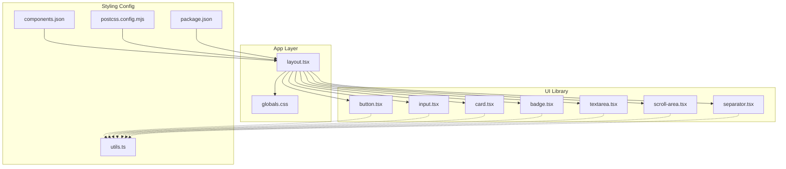

**Diagram sources**
- [layout.tsx](file://src/app/layout.tsx#L1-L22)
- [globals.css](file://src/app/globals.css#L1-L59)
- [button.tsx](file://src/components/ui/button.tsx#L1-L65)
- [input.tsx](file://src/components/ui/input.tsx#L1-L22)
- [card.tsx](file://src/components/ui/card.tsx#L1-L93)
- [badge.tsx](file://src/components/ui/badge.tsx#L1-L49)
- [textarea.tsx](file://src/components/ui/textarea.tsx#L1-L19)
- [scroll-area.tsx](file://src/components/ui/scroll-area.tsx#L1-L59)
- [separator.tsx](file://src/components/ui/separator.tsx#L1-L29)
- [components.json](file://components.json#L1-L24)
- [postcss.config.mjs](file://postcss.config.mjs#L1-L8)
- [package.json](file://package.json#L1-L36)
- [utils.ts](file://src/lib/utils.ts#L1-L7)

**Section sources**
- [layout.tsx](file://src/app/layout.tsx#L1-L22)
- [globals.css](file://src/app/globals.css#L1-L59)
- [components.json](file://components.json#L1-L24)
- [postcss.config.mjs](file://postcss.config.mjs#L1-L8)
- [package.json](file://package.json#L1-L36)
- [utils.ts](file://src/lib/utils.ts#L1-L7)

## Core Components
This section documents the primary UI components and their props, variants, and usage patterns.

- Button
  - Purpose: Action trigger with multiple variants and sizes.
  - Variants: default, destructive, outline, secondary, ghost, link.
  - Sizes: default, xs, sm, lg, icon, icon-xs, icon-sm, icon-lg.
  - Props: className, variant, size, asChild, plus native button attributes.
  - Accessibility: Focus-visible ring and aria-invalid states included in variant classes.
  - Composition: Uses Slot when asChild is true to render as a child element.

- Input
  - Purpose: Single-line text input with consistent focus and invalid states.
  - Props: className, type, plus native input attributes.
  - Accessibility: Focus-visible ring and aria-invalid states included.

- Card
  - Purpose: Content container with header, title, description, action, content, and footer slots.
  - Subcomponents: Card, CardHeader, CardTitle, CardDescription, CardAction, CardContent, CardFooter.
  - Props: className for each subcomponent; supports grid layout in CardHeader for action alignment.

- Badge
  - Purpose: Label or indicator with variants.
  - Variants: default, secondary, destructive, outline, ghost, link.
  - Props: className, variant, asChild, plus native span attributes.
  - Accessibility: Focus-visible ring and aria-invalid states included in variant classes.

- Textarea
  - Purpose: Multi-line text input with consistent focus and invalid states.
  - Props: className, plus native textarea attributes.
  - Accessibility: Focus-visible ring and aria-invalid states included.

Usage patterns:
- Prefer variant and size props on Button and Badge for consistent styling.
- Use Card subcomponents to compose structured content areas.
- Apply aria-invalid on form controls to reflect validation states.
- Use asChild on Button and Badge to render semantic wrappers around icons or links.

**Section sources**
- [button.tsx](file://src/components/ui/button.tsx#L1-L65)
- [input.tsx](file://src/components/ui/input.tsx#L1-L22)
- [card.tsx](file://src/components/ui/card.tsx#L1-L93)
- [badge.tsx](file://src/components/ui/badge.tsx#L1-L49)
- [textarea.tsx](file://src/components/ui/textarea.tsx#L1-L19)

## Architecture Overview
The UI system relies on:
- Tailwind CSS v4 for utility-first styling.
- class-variance-authority for variant-driven component classes.
- radix-ui primitives for accessible UI behaviors.
- A centralized cn() helper for merging Tailwind classes safely.
- Shadcn-style configuration via components.json for consistent aliases and theme base color.

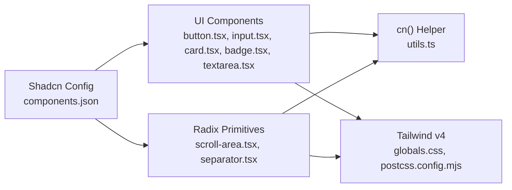

**Diagram sources**
- [button.tsx](file://src/components/ui/button.tsx#L1-L65)
- [input.tsx](file://src/components/ui/input.tsx#L1-L22)
- [card.tsx](file://src/components/ui/card.tsx#L1-L93)
- [badge.tsx](file://src/components/ui/badge.tsx#L1-L49)
- [textarea.tsx](file://src/components/ui/textarea.tsx#L1-L19)
- [scroll-area.tsx](file://src/components/ui/scroll-area.tsx#L1-L59)
- [separator.tsx](file://src/components/ui/separator.tsx#L1-L29)
- [utils.ts](file://src/lib/utils.ts#L1-L7)
- [globals.css](file://src/app/globals.css#L1-L59)
- [postcss.config.mjs](file://postcss.config.mjs#L1-L8)
- [components.json](file://components.json#L1-L24)

## Detailed Component Analysis

### Button Component
Button uses class-variance-authority to define variants and sizes, and supports an asChild rendering mode via radix-ui Slot. Focus-visible rings and aria-invalid states are embedded in variant classes for consistent UX.

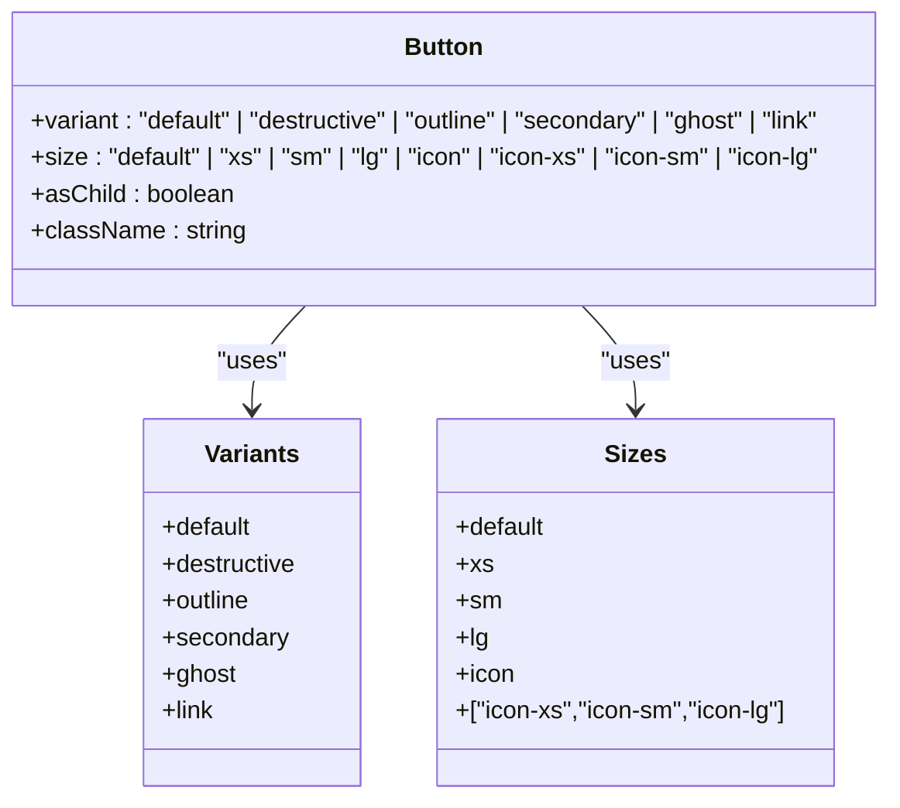

**Diagram sources**
- [button.tsx](file://src/components/ui/button.tsx#L7-L39)

**Section sources**
- [button.tsx](file://src/components/ui/button.tsx#L1-L65)

### Input Component
Input applies focus-visible and aria-invalid states consistently and integrates with the theme’s neutral palette.

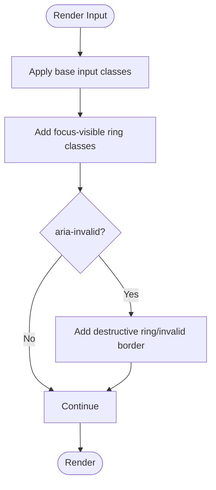

**Diagram sources**
- [input.tsx](file://src/components/ui/input.tsx#L5-L19)

**Section sources**
- [input.tsx](file://src/components/ui/input.tsx#L1-L22)

### Card Component Family
Card composes multiple subcomponents for structured content presentation, with special layout behavior in CardHeader for action alignment.

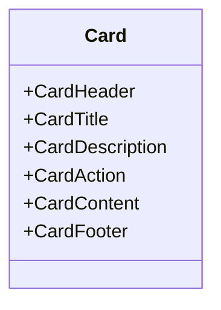

**Diagram sources**
- [card.tsx](file://src/components/ui/card.tsx#L5-L92)

**Section sources**
- [card.tsx](file://src/components/ui/card.tsx#L1-L93)

### Badge Component
Badge supports variants similar to Button and integrates focus-visible and aria-invalid states.

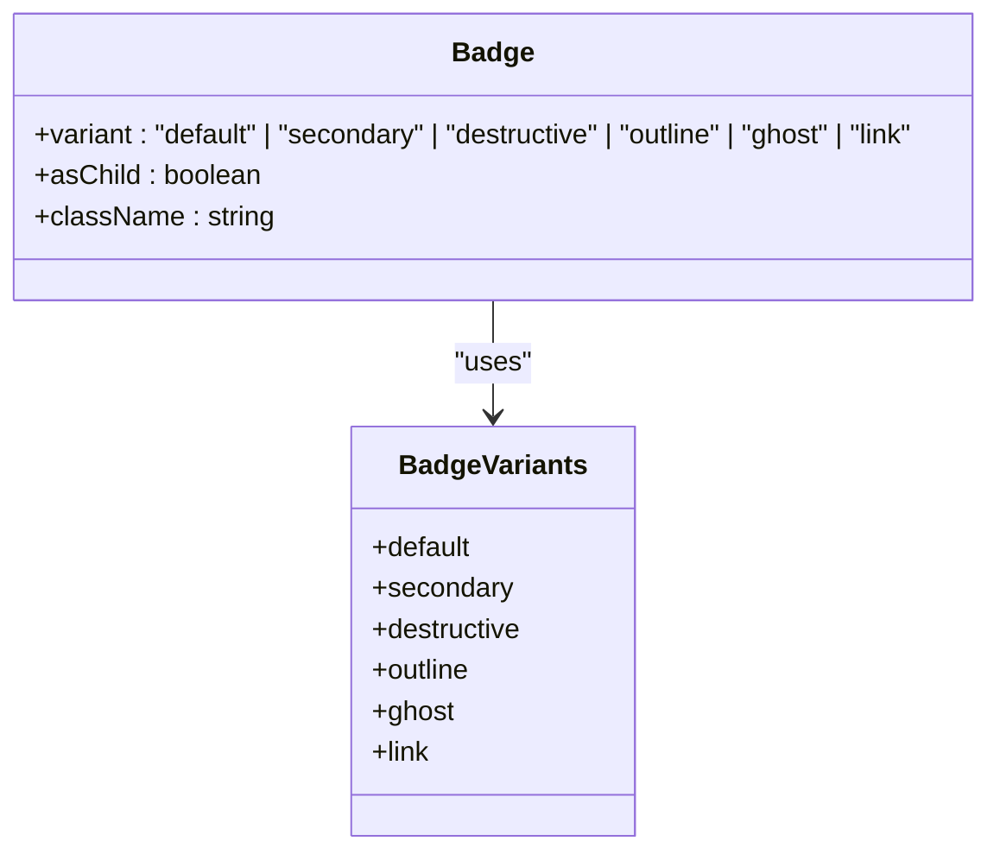

**Diagram sources**
- [badge.tsx](file://src/components/ui/badge.tsx#L7-L27)

**Section sources**
- [badge.tsx](file://src/components/ui/badge.tsx#L1-L49)

### Textarea Component
Textarea mirrors Input’s focus-visible and aria-invalid patterns for multi-line text input.

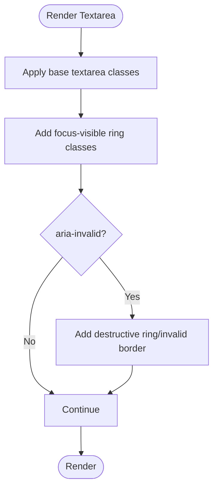

**Diagram sources**
- [textarea.tsx](file://src/components/ui/textarea.tsx#L5-L16)

**Section sources**
- [textarea.tsx](file://src/components/ui/textarea.tsx#L1-L19)

### ScrollArea Primitive
ScrollArea wraps radix-ui ScrollArea with accessible scrollbar and viewport styling.

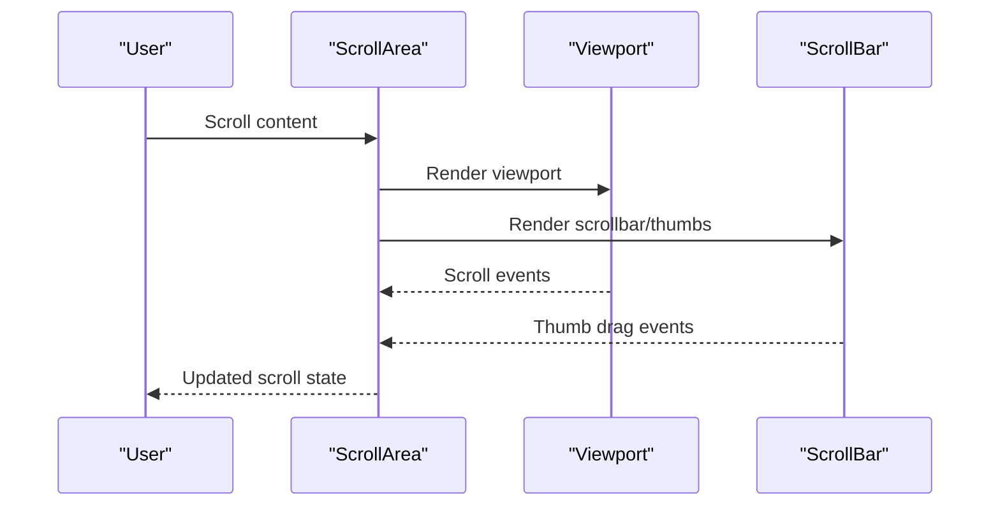

**Diagram sources**
- [scroll-area.tsx](file://src/components/ui/scroll-area.tsx#L8-L56)

**Section sources**
- [scroll-area.tsx](file://src/components/ui/scroll-area.tsx#L1-L59)

### Separator Primitive
Separator renders a thin divider with horizontal or vertical orientation.

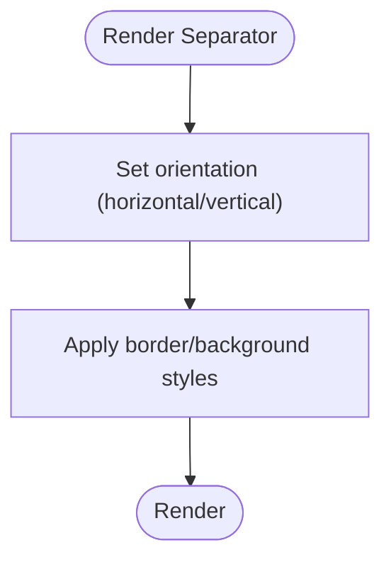

**Diagram sources**
- [separator.tsx](file://src/components/ui/separator.tsx#L8-L26)

**Section sources**
- [separator.tsx](file://src/components/ui/separator.tsx#L1-L29)

## Dependency Analysis
The UI components depend on shared utilities and styling configuration.

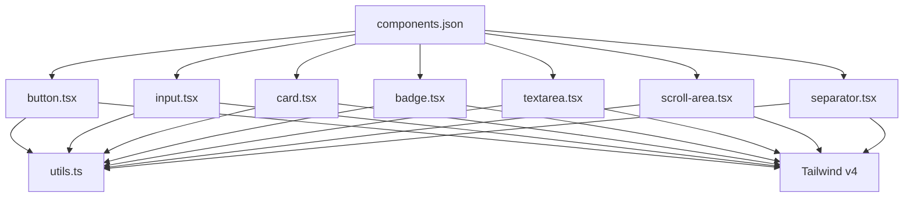

**Diagram sources**
- [button.tsx](file://src/components/ui/button.tsx#L1-L65)
- [input.tsx](file://src/components/ui/input.tsx#L1-L22)
- [card.tsx](file://src/components/ui/card.tsx#L1-L93)
- [badge.tsx](file://src/components/ui/badge.tsx#L1-L49)
- [textarea.tsx](file://src/components/ui/textarea.tsx#L1-L19)
- [scroll-area.tsx](file://src/components/ui/scroll-area.tsx#L1-L59)
- [separator.tsx](file://src/components/ui/separator.tsx#L1-L29)
- [utils.ts](file://src/lib/utils.ts#L1-L7)
- [components.json](file://components.json#L1-L24)

**Section sources**
- [utils.ts](file://src/lib/utils.ts#L1-L7)
- [components.json](file://components.json#L1-L24)

## Performance Considerations
- Prefer variant props over ad-hoc class overrides to keep the class set minimal.
- Use the cn() helper to avoid redundant or conflicting Tailwind classes.
- Limit heavy utilities in base layer; keep global styles scoped to reduce cascade cost.
- For long lists, pair ScrollArea with virtualization libraries to minimize DOM nodes.

## Accessibility Features
- Focus management: All interactive components include focus-visible rings and outline resets.
- Semantic roles: Button supports asChild to wrap links or icons while preserving semantics.
- Validation states: aria-invalid is integrated into variants to communicate invalid states.
- Radix primitives: ScrollArea and Separator are keyboard accessible and screen-reader friendly.

## Dark/Light Theme Support
- The app sets a dark class on the html element, enabling dark-mode variants automatically.
- Theme tokens are resolved via Tailwind theme() in globals.css.
- Base colors configured as neutral with cssVariables enabled in components.json.

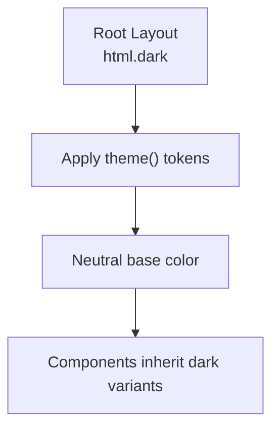

**Diagram sources**
- [layout.tsx](file://src/app/layout.tsx#L15-L16)
- [globals.css](file://src/app/globals.css#L3-L12)
- [components.json](file://components.json#L6-L12)

**Section sources**
- [layout.tsx](file://src/app/layout.tsx#L1-L22)
- [globals.css](file://src/app/globals.css#L1-L59)
- [components.json](file://components.json#L1-L24)

## Cross-Browser Compatibility
- Tailwind v4 and PostCSS configuration enable modern CSS features with safe fallbacks.
- WebKit-specific scrollbars are customized in globals.css for consistent appearance.
- No explicit polyfills are present; rely on Next.js runtime defaults and Tailwind’s utility coverage.

**Section sources**
- [postcss.config.mjs](file://postcss.config.mjs#L1-L8)
- [globals.css](file://src/app/globals.css#L14-L30)
- [package.json](file://package.json#L31-L31)

## Navigation System
The navigation is primarily handled by a Sidebar component located at src/components/Sidebar.tsx. It integrates with the app’s routing and provides responsive behavior. The layout.tsx sets the html dark class and applies global fonts and background.

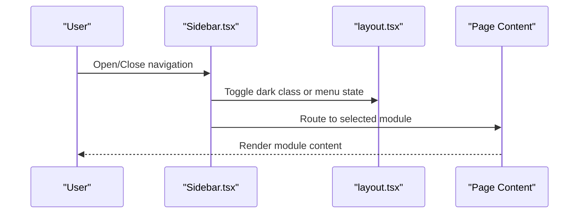

**Diagram sources**
- [Sidebar.tsx](file://src/components/Sidebar.tsx)
- [layout.tsx](file://src/app/layout.tsx#L9-L21)

**Section sources**
- [Sidebar.tsx](file://src/components/Sidebar.tsx)
- [layout.tsx](file://src/app/layout.tsx#L1-L22)

## Component Composition Patterns
- Variant-first design: Use variant and size props to achieve consistent styles across components.
- asChild pattern: Wrap buttons and badges around icons or links without changing semantics.
- Slot-based rendering: Enables composition with semantic HTML elements.
- Card subcomponents: Build structured layouts with CardHeader, CardAction, and CardContent.

## Custom Styling Approaces
- Extend via className prop while leveraging cn() to merge safely.
- Use theme() tokens in globals.css for brand-consistent colors.
- Add layer-specific utilities in globals.css for reusable helpers.
- Keep overrides minimal; prefer extending variants in component definitions.

## Integration Guidelines
- Install dependencies: Ensure class-variance-authority, radix-ui, tailwind-merge, and lucide-react are present.
- Configure aliases: Use components.json aliases to maintain consistent imports.
- Add new components: Place them under src/components/ui and export variants/helpers.
- Test accessibility: Verify focus-visible states and aria-invalid usage.
- Maintain dark mode: Ensure new components use theme-aware tokens and focus rings.

**Section sources**
- [package.json](file://package.json#L11-L22)
- [components.json](file://components.json#L15-L21)
- [utils.ts](file://src/lib/utils.ts#L1-L7)

## Troubleshooting Guide
- Conflicting classes: Use the cn() helper to merge classes and avoid duplicates.
- Focus ring not visible: Ensure focus-visible ring classes are preserved in variants.
- Dark mode not applying: Confirm html.dark is present and theme() tokens resolve in CSS.
- Scrollbar styling inconsistencies: Verify globals.css custom scrollbar rules and Tailwind base layer.

**Section sources**
- [utils.ts](file://src/lib/utils.ts#L1-L7)
- [layout.tsx](file://src/app/layout.tsx#L15-L16)
- [globals.css](file://src/app/globals.css#L14-L30)

## Conclusion
Core Brim Tech OS provides a cohesive UI system centered on Tailwind CSS v4, class-variance-authority variants, and radix-ui primitives. The Button, Input, Card, Badge, and Textarea components follow consistent patterns for accessibility, dark mode, and extensibility. The Sidebar integrates with the layout to deliver a responsive navigation experience. By adhering to the composition patterns and configuration described here, teams can reliably extend the UI system with new components.