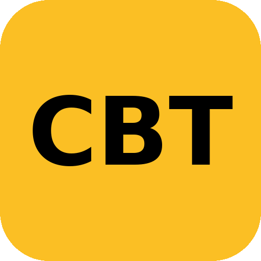
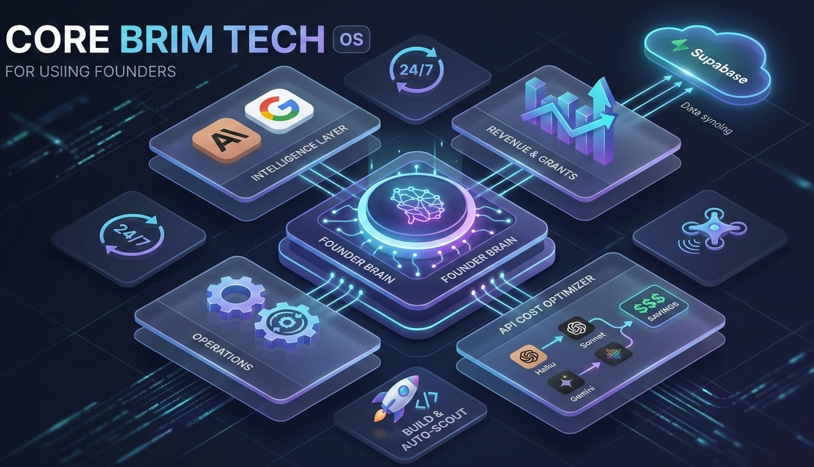

<div align="center">



# CoreBrimTech OS

### The operating system for startup founders — with an AI co-founder built in.

Research your market, build, track your money, and grow — in one dark, fast dashboard.
Now available as a **native desktop app** for macOS, Windows, and Linux.

<p>
  
  
  
  
  
  
</p>

[Download](#-download) · [Features](#-features) · [Quick start](#-quick-start) · [Desktop app](#-desktop-app) · [Architecture](#-architecture) · [Roadmap](#-roadmap)

</div>

---

## ✨ Why CoreBrimTech OS

Most founder tools are a graveyard of empty dashboards. CoreBrimTech OS is different on two counts:

- **It has a brain.** A built-in **AI co-founder** that knows your runway, deals, goals, and energy — answers questions, and *proactively* taps you on the shoulder when something needs attention (short runway, stale pipeline, slipping goals).
- **It runs where you work.** A real **native desktop app** (Tauri) with a tray icon, a global hotkey, and native notifications — so your co-founder can reach you even when the window is closed.

> **No mock data, ever.** Every module shows your real data or a clean empty state — nothing is faked or pre-seeded.

---

## 🧠 The AI Co-Founder

A persistent assistant docked in the corner of every screen.

| | |
|---|---|
| **Ask anything** | "How's my runway?", "What should I focus on this week?" — grounded in your actual numbers across all modules. |
| **Proactive nudges** | Watches for high-signal events (runway ≤ 4 months, empty pipeline while burning, goals at risk) and surfaces a one-click action. |
| **Native notifications** | On desktop, it pings you with OS notifications from the tray — even with the window closed. |
| **Bring your own key** | Your Anthropic (Claude) or Google (Gemini) key, stored locally. On desktop, calls go straight to the provider — no middleman. |

---

## 🚀 Features

**37 integrated modules**, organized by what a founder actually does:

| Area | Modules |
|---|---|
| 🔭 **Intelligence** | Founder Brain · Competitor Intel Engine · Market Gap Scanner · Deep Research Engine · Idea Intelligence |
| 🛠️ **Build** | Hackathon Builder Agent · Hackathon Auto-Scout |
| 🎯 **Operate** | Today · Command Center · Goals & OKRs · Session Brain · Meeting Prep · Decision Journal · Focus Mode · Energy Tracker |
| 💰 **Money** | Burn Rate Tracker · Deal Pipeline · Revenue Agent · Grant Tracker · Invoice Generator · Proposal Generator |
| 🤖 **Autonomous** | Skill Engine · Auto-Outreach · Away Mode · Scheduler |
| 📊 **Report** | Weekly Review · Weekly Founder Report · Investor View · Portfolio & Wins |
| ⚙️ **System** | Knowledge Base · SOPs & Playbooks · Notification Center · Email Templates · Data Export · API Cost Optimizer · Settings |

### Highlights

- **API Cost Optimizer** — smart model routing (Haiku/Sonnet/Opus/Gemini), aggressive caching, batching, and budget guardrails to keep AI spend low.
- **Auto-intelligence onboarding** — type your company name and the OS researches your market (competitors + gaps) in the background before you click anything.
- **Cloud sync** — local-first (instant) with optional Supabase write-through for cross-device persistence.
- **Responsive + native** — works as a web app and a desktop app from the same codebase.

---

## 📦 Download

Native installers are published on the [**Releases**](../../releases) page.

| Platform | File |
|---|---|
| 🍎 **macOS** | `.dmg` (Apple Silicon + Intel universal) |
| 🪟 **Windows** | `.msi` / `.exe` |
| 🐧 **Linux** | `.AppImage` / `.deb` |

> Builds are currently **unsigned** — your OS may warn on first launch (macOS: right-click → Open; Windows: "More info" → "Run anyway"). Code-signing is on the [roadmap](#-roadmap).

Prefer to run from source? See [Quick start](#-quick-start).

---

## ⚡ Quick start

```bash
git clone https://github.com/mkk2026/corebrimtech-os.git
cd corebrimtech-os
npm install
npm run dev          # → http://localhost:3000
```

On first run, complete onboarding and add your AI key in **Settings**. Optionally configure cloud sync in `.env.local`:

```bash
# Optional — enables Supabase cross-device sync
NEXT_PUBLIC_SUPABASE_URL=your_supabase_url
NEXT_PUBLIC_SUPABASE_ANON_KEY=your_supabase_anon_key

# Optional — server-side AI proxy for the web build
ANTHROPIC_API_KEY=your_claude_key
GOOGLE_API_KEY=your_gemini_key
```

---

## 🖥️ Desktop app

The desktop build wraps the app in a native window via **Tauri** (Rust). It uses a static export and a
native AI bridge instead of server API routes, so your API key calls the provider directly.

```bash
# one-time: install Tauri's prerequisites — see DESKTOP.md
cargo tauri dev      # run the desktop app in development
cargo tauri build    # build installers into src-tauri/target/release/bundle/
```

Full prerequisites, the N|Solid/Node troubleshooting note, and the release flow live in **[DESKTOP.md](DESKTOP.md)**.

**Cutting a release** (cross-platform installers via GitHub Actions):

```bash
git tag v0.1.0 && git push origin v0.1.0
```

---

## 🏗️ Architecture



Everything orbits the **Founder Brain** — a central, local-first knowledge store that feeds context to
every AI module (and to the co-founder). The same codebase serves two targets:

```
                         ┌──────────────────────────┐
                         │       Founder Brain        │  ← your company context
                         └────────────┬──────────────┘
                                      │
        ┌───────────────┬─────────────┼──────────────┬───────────────┐
        ▼               ▼             ▼               ▼               ▼
   Intelligence       Money       Co-Founder       Operate         Reports
   (research,       (burn, deals, (chat +          (goals,        (reviews,
    competitors)     revenue)      proactive)       sessions)      investor)
        └───────────────┴─────────────┬──────────────┴───────────────┘
                                      ▼
                        AI transport seam  (lib/ai-transport)
                          ┌───────────┴────────────┐
                    web → /api/ai proxy      desktop → native Rust bridge
                                      ▼
                          Claude · Gemini   +   Supabase (sync)
```

---

## 🧰 Tech stack

- **Framework** — Next.js 16 (App Router) · React 19 · TypeScript
- **UI** — Tailwind CSS 4 · shadcn/ui · lucide icons
- **Desktop** — Tauri 2 (Rust) — tray, notifications, global hotkey, native HTTP bridge
- **AI** — Anthropic Claude · Google Gemini (BYO key)
- **Data** — local-first (`localStorage`) with Supabase (PostgreSQL) write-through sync
- **Testing** — Vitest · React Testing Library (80%+ coverage on new code)

---

## 🧪 Development

```bash
npm run dev            # web dev server
npm run build          # web production build
npm run build:desktop  # static export for the desktop bundle
npm run test           # run the test suite
npm run test:coverage  # tests with coverage
npm run lint           # ESLint
cargo tauri dev        # desktop app (see DESKTOP.md)
```

### Project structure

```
src/
├── app/              # Next.js App Router (page.tsx routes 37 modules)
│   └── api/          # AI proxy + checks (web only; bypassed on desktop)
├── components/       # feature modules (brain, money, cofounder, onboarding, …)
└── lib/              # business logic
    ├── cofounder/    # context aggregator, chat engine, signal engine, nudges
    ├── ai-transport  # web proxy ↔ native bridge seam
    ├── founder-brain # central company data
    └── …
src-tauri/            # Rust desktop shell (AI bridge, tray, notifications)
```

---

## 🗺️ Roadmap

- [x] AI co-founder — reactive chat + proactive signal nudges
- [x] Native desktop app (macOS / Windows / Linux) with tray + notifications
- [x] Cross-platform release CI
- [ ] Code-signing & notarization (trusted installs)
- [ ] Auto-update (Tauri updater)
- [ ] Team / multi-founder sync

See [TODOS.md](TODOS.md) for the detailed backlog.

---

## 🤝 Contributing

This is an early-stage product. Issues and ideas are welcome via the issue tracker.
Development standards: tests-first, no mock data, conventional commits.

## 📄 License

Proprietary — © Core Brim Tech. All rights reserved.

<div align="center">
<sub>Built in Freetown 🇸🇱 for founders who move fast.</sub>
</div>
